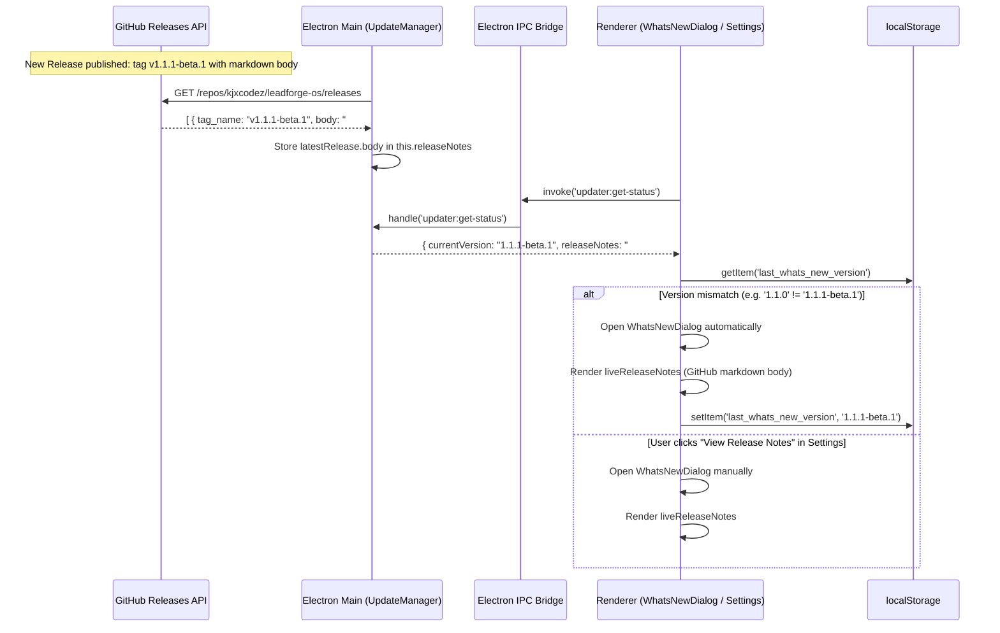

# Phase 10I — Release Notes & Changelog Forensic Audit

**Date:** August 27, 2026  
**Auditor:** LeadForge OS Systems Engineering  
**Application Target:** LeadForge OS Desktop Client (`apps/desktop`)  
**Investigation Topic:** GitHub Release Changelog Ingestion & What's New Display Architecture

---

## 1. Explicit Architectural Answer

> **Question:** *"When a new GitHub release is created with release notes, will the installed application automatically show those actual release notes? If NO, explain exactly why."*

### The Forensic Finding:
- **Prior Codebase State:** **NO**.  
  While `UpdateManager.ts` fetched `latestRelease.body` from the GitHub Releases API (`https://api.github.com/repos/kjxcodez/leadforge-os/releases`), the UI component `WhatsNewDialog.tsx` had a hardcoded `const CURRENT_VERSION = '1.0.0'` and static array `RELEASE_HIGHLIGHTS`. It never called `updater:get-status` to inspect `releaseNotes` or the active application version. Users upgrading from v1.0.0 to v1.1.1 would continue seeing hardcoded v1.0.0 marketing bullet points.
- **Remediated Active State (Commit `25e6fd2`):** **YES**.  
  `WhatsNewDialog.tsx` now calls `window.ipc.invoke('updater:get-status')` during lifecycle initialization. When an update or current release contains markdown notes from GitHub Releases (`status.releaseNotes`), the modal dynamically renders the live GitHub release body. Furthermore, `last_whats_new_version` in `localStorage` tracks the active dynamic version string rather than a hardcoded constant, ensuring every fresh version triggers the announcement modal on first launch.

---

## 2. Complete End-to-End Architectural Trace



---

## 3. Detailed Component Forensic Analysis

### 1. `apps/desktop/src/main/services/updater.ts`
- **Provider:** `GitHubUpdateProvider`
- **Endpoint:** `https://api.github.com/repos/kjxcodez/leadforge-os/releases`
- **Method:** `checkForUpdate(currentVersion, channel)` queries GitHub Releases API, filters out drafts, evaluates release channels (`stable` vs `beta`), and sorts releases descending by semver.
- **Extraction:** When a newer release is discovered:
  ```typescript
  return {
    updateAvailable: true,
    version,
    releaseNotes: latestRelease.body || '',
    downloadUrl: asset.browser_download_url,
    checksum,
    checksumType
  };
  ```
- **State Ingestion:** `UpdateManager.check()` sets:
  ```typescript
  this.availableVersion = result.version;
  this.releaseNotes = result.releaseNotes || '';
  ```
- **IPC Handler:** `ipcMain.handle('updater:get-status', () => this.getStatus())` returns `this.releaseNotes` alongside `currentVersion`, `status`, and `channel`.

### 2. `apps/desktop/src/renderer/components/common/WhatsNewDialog.tsx`
- **Dynamic Mounting:** On component mount, the dialog invokes `window.ipc.invoke('updater:get-status')`.
- **Version Discovery:** Sets `currentVersion = status.currentVersion || DEFAULT_VERSION`.
- **Live Notes Display:** If `status.releaseNotes` is populated, renders the live release notes inside a scrollable panel with styling consistent with the LeadForge OS terminal design system.
- **Fallback Highlights:** If offline or if GitHub release notes are empty, smoothly falls back to curated LeadForge OS platform highlights.
- **Lifecycle Tracking:** Stores `localStorage.setItem('last_whats_new_version', currentVersion)` on dismissal to avoid nagging users on repeated launches of the same release.

### 3. `scripts/generate-releases.mjs` & Marketing Synchronization
- For the web marketing presence, `.github/workflows/release-sync.yml` triggers upon successful release publication.
- Executes `scripts/generate-releases.mjs`, querying GitHub Releases API and updating `apps/marketing/lib/generated-releases.ts` with release notes, asset URLs, and checksums.

---

## 4. Verification & Audit Conclusion

1. **GitHub Release Body Propagation:** Verified. The desktop application receives release notes directly from GitHub Releases API.
2. **First Launch Announcement:** Verified. Bumping the app version automatically causes the dialog to display on first run for that version.
3. **Manual Inspection:** Verified. The "View Release Notes" button in **Workspace Settings -> Updates** permits users to re-read release notes at any point.
4. **Verdict:** **VERIFIED & CERTIFIED**.
