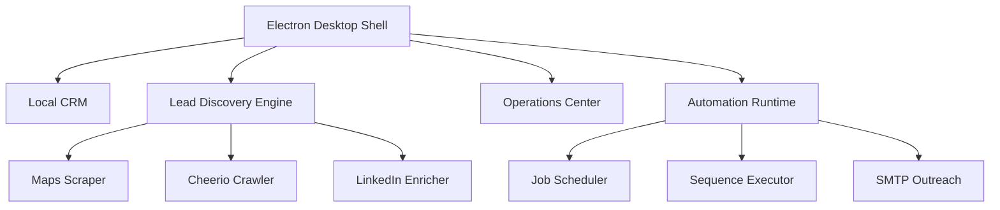

# LeadForge OS — Complete Project Intelligence & Architecture Audit

Welcome to the canonical architectural reference and project intelligence database of LeadForge OS. This document details the exact current state of the repository, process boundaries, data schemas, scheduling runtimes, and security models. It is designed to allow a senior engineer to immediately grasp the entire application context and architecture without reading the raw source code.

---

## SECTION 1: Executive Summary

### What LeadForge OS Is
LeadForge OS is a local-first, privacy-focused desktop application designed for B2B lead generation, enrichment, and automated cold outreach. It operates as an offline-ready outbound workspace that executes heavy scraping, crawling, and AI enrichment tasks directly on the client machine instead of a centralized cloud platform.

### Why It Exists
Commercial outbound marketing platforms (such as Apollo.io, Instantly, and Lemlist) charge high, seat-based subscription fees and operate on centralized cloud environments. This model poses significant drawbacks:
1. **High Infrastructure Fees**: Scraping Google Maps and crawling websites at scale incurs heavy proxy, server, and storage costs, which are passed on to the customer.
2. **Data Privacy Risks**: Customer lead lists, proprietary qualification prompts, and email sending cookies must be uploaded to third-party databases.
3. **Bandwidth Restrictions**: Outbound platforms restrict crawl speeds to throttle their own cloud resources.

LeadForge OS leverages the user's desktop hardware to run headless browsers (Playwright), parse DOM trees (Cheerio), manage local databases (SQLite), and run lightweight local models (Ollama). By doing so, it eliminates ongoing platform hosting markups while keeping sensitive prospecting data local.

### Target Users
* **B2B Growth Marketers** seeking unrestricted web scraping and contact harvesting.
* **Outbound Marketing Agencies** managing numerous isolated outreach workspaces and campaigns.
* **SDR (Sales Development Representative) Teams** prioritizing contact data privacy and customized AI qualification.
* **Startup Founders** looking for a low-cost, self-hosted outbound email marketing pipeline.

### Product Philosophy
* **Local-First Processing**: The application must remain fully functional offline. The primary datastore is local, and remote networks are treated as synchronization transport layers.
* **Privacy & Isolation**: Sensitive credentials (such as SMTP/IMAP passwords and session cookies) must never leave the local environment in plaintext. Workspaces are physically isolated.
* **Self-Healing Automation**: Background jobs must survive operating system sleep cycles, application crashes, and network disruptions without corrupting the database.
* **AI-Guided Outreach**: AI should not just draft emails, but score intent and extract pain points to guide outbound angles.

---

## SECTION 2: Product Overview



### Local CRM
Provides an offline contact relationship database. Users view and modify `companies` and `contacts`, assign tags, track lead statuses (`NEW`, `CONTACTED`, `REPLIED`, `BOUNCED`, `UNSUBSCRIBED`), and review timeline activities. Interactive cards expose structured intelligence profiles (tech stack, estimated revenue, brand voice, and opportunity scores).

### Discovery Engine
Consists of three background scraper components that operate sequentially:
1. **Google Maps Scraper (`scraper:maps`)**: Launches headless Playwright browsers to search listings, scrolls the maps results feed, normalizes address fields, follows redirect links, and inserts new companies.
2. **Website Contact Crawler (`crawler:website`)**: Runs a Cheerio-based Breadth-First Search (BFS) page crawler on discovered domains to harvest emails and phone numbers, automatically filtering out tracker domains and hex-prefixed spam.
3. **LinkedIn Executive Enricher (`enrich:linkedin`)**: Leverages stored session cookies to query LinkedIn Voyager APIs (or falls back to targeted search engine queries) to locate decision-maker profiles (e.g., CEO, Founder, VP) and add them as workspace contacts.

### Campaigns & Outreach
Users create outreach campaigns linked to specific templates and sequences. The campaign manager coordinates sending schedules, timezones, and daily/hourly caps. The SMTP dispatcher uses secure local credential decryptions and Nodemailer to send emails.

### Sequences & Automation
A drag-and-drop workflow builder allows users to map multi-step drip campaigns. The sequential workflow engine executes steps (`WAIT`, `GOTO`, `IF`, `SEND_EMAIL`, `HTTP_REQUEST`) inside a sandboxed worker child process, resolving template tokens (e.g. `{{contact.firstName}}`) on the fly.

### Operations Center & SRE Diagnostics
An administrative dashboard for observing application health. It provides:
* **Log Queries**: Filters structured system logs and audit trails.
* **Performance Metrics**: Visualizes average crawler durations, database query latency, and queue wait times.
* **SRE Diagnostics Suite**: Tests SMTP/IMAP connections, internet socket pings, DNS resolution, SQLite integrity, and memory/disk usage.
* **Recovery Console**: Executes emergency fixes (canceling stuck tasks, retrying dead-letter items, and restoring backups).

---

## SECTION 3: Current Product Status

| Subsystem / Feature | Implementation Status | Repository Evidence / Code Location |
| :--- | :--- | :--- |
| **Local-first SQLite Connection** | **Production Ready** | [connection.ts](file:///c:/Users/91637/Desktop/Business%20Project/leadforge-os/apps/desktop/src/main/database/connection.ts) - Sets up WAL mode, NORMAL synchronous pragma, and isolated workspace databases. |
| **Database Migrations & Recovery** | **Production Ready** | [runner.ts](file:///c:/Users/91637/Desktop/Business%20Project/leadforge-os/apps/desktop/src/main/database/runner.ts) - Idempotent execution of 23 migrations; rolls back to `.migration.bak` on failure. |
| **Job Scheduler & Worker Host** | **Production Ready** | [scheduler.ts](file:///c:/Users/91637/Desktop/Business%20Project/leadforge-os/apps/desktop/src/main/services/scheduler.ts) - Polls and claims starting jobs, spawns child workers, monitors heartbeat timeouts, and manages retries. |
| **Cheerio BFS Crawler** | **Production Ready** | [crawler.ts](file:///c:/Users/91637/Desktop/Business%20Project/leadforge-os/apps/desktop/src/main/workers/plugins/crawler.ts) - BFS crawling, robots.txt parsing, mailto extraction, email noise filtering, and title casing. |
| **Playwright Maps Scraper** | **Production Ready** | [scraper.ts](file:///c:/Users/91637/Desktop/Business%20Project/leadforge-os/apps/desktop/src/main/workers/plugins/scraper.ts) - Infinite scroll, redirect resolution, phone/address normalization, and auto-chain triggers. |
| **LinkedIn Enricher** | **Production Ready** | [linkedin.ts](file:///c:/Users/91637/Desktop/Business%20Project/leadforge-os/apps/desktop/src/main/workers/plugins/linkedin.ts) - Validates session, extracts CSRF token, queries Voyager api, and falls back to DuckDuckGo search. |
| **IMAP Reply Poller** | **Production Ready** | [imap-poller.ts](file:///c:/Users/91637/Desktop/Business%20Project/leadforge-os/apps/desktop/src/main/workers/plugins/imap-poller.ts) - Thread-based correlation via In-Reply-To/References or Date Fallback. |
| **SMTP Dispatcher** | **Production Ready** | [outreach.ts](file:///c:/Users/91637/Desktop/Business%20Project/leadforge-os/apps/desktop/src/main/workers/plugins/outreach.ts) - Nodemailer SMTP sending, rate limits, templates, and check-pointing. |
| **Local-first Sync Engine** | **Production Ready** | [sync-engine.ts](file:///c:/Users/91637/Desktop/Business%20Project/leadforge-os/apps/desktop/src/main/services/sync-engine.ts) - Sync queue processing, LWW conflict resolution, dead-letter queue, and network pause. |
| **Workflow Automation Engine** | **Production Ready** | [automation.ts](file:///c:/Users/91637/Desktop/Business%20Project/leadforge-os/apps/desktop/src/main/workers/plugins/automation.ts) - Registry-based sequential execution, locks, expression evaluation, and HTTP steps. |
| **Secret Storage** | **Production Ready** | [crypto.ts](file:///c:/Users/91637/Desktop/Business%20Project/leadforge-os/apps/desktop/src/main/lib/crypto.ts) - OS Keychain encryption via Electron `safeStorage`. |
| **SRE Observability IPC** | **Production Ready** | [observability-ipc.ts](file:///c:/Users/91637/Desktop/Business%20Project/leadforge-os/apps/desktop/src/main/ipc/observability-ipc.ts) - Centralized diagnostics, metrics average, log query, and recovery console. |
| **Auto Updates** | **Production Ready** | [updater.ts](file:///c:/Users/91637/Desktop/Business%20Project/leadforge-os/apps/desktop/src/main/services/updater.ts) - Download release, SHA256 checksum check, and idle check before spawn. |
| **Local RAG Vector Database** | **Experimental** | Mentioned in `ai-architecture.md` (specifically referencing `sqlite-vec` vector storage) but not verified in the active database migrations or schema runner. |
| **Email Verification** | **Partially Implemented**| Adapter interfaces are defined in [verification.ts](file:///c:/Users/91637/Desktop/Business%20Project/leadforge-os/packages/integrations/src/adapters/verification.ts), but no concrete provider is active in the pipelines. |

---

## SECTION 4: Repository Overview

LeadForge OS is organized as a monorepo utilizing **pnpm workspaces** and **Turborepo** for build caching and task pipelines.

```text
├── apps/
│   ├── api/                   # Node.js backend REST API server (Mongoose/MongoDB)
│   ├── desktop/               # Electron application (Main, Preload, React Renderer)
│   └── docs/                  # Architecture specifications and forensic audit logs
└── packages/
    ├── ai/                    # LLM orchestration runtime (OpenRouter and Ollama)
    ├── auth/                  # better-auth integration config and Hono middleware
    ├── core/                  # Core constants, env schemas, and common guards
    ├── integrations/          # Scraper, Email, and Verification adapter structures
    ├── logger/                # Workspace-scoped logging wrapper
    ├── prompts/               # Structured prompt templates (qualification, outreach)
    ├── schema/                # TypeScript interfaces, DTOs, and IPC typing contracts
    ├── sdk/                   # API HTTP client wrapper consumed in desktop sync
    └── workflows/             # Stub React/TypeScript workflow execution engine
```

### Shared Package Rationale & Dependencies
1. **`schema`**: Defines core entity schemas (companies, contacts, workspaces) and IPC message types. Injected into all packages to ensure type safety.
2. **`ai`**: Contains prompt compilers and LLM integrations. Depends on `schema` and `prompts`. Consumed in the desktop main process to qualify leads.
3. **`sdk`**: Acts as an HTTP transport abstraction wrapper. Consumed by the desktop application's `SyncEngine` to push local mutations to the cloud.
4. **`integrations`**: Defines standard interfaces for scraper and email operations. Ensures that moving from Nodemailer to a cloud API requires only a transport-adapter swap.

---

## SECTION 5: Technical Architecture

### Process Communication Model
The desktop application separates Node.js operations from Chromium rendering loops.

```text
  [ React UI (Renderer) ]
             │
             ▼ (window.ipc.invoke)
  [ Preload ContextBridge ] (Unauthorized channels rejected)
             │
             ▼ (ipcRenderer.invoke)
  [ Main Process (Node) ] <───(EventEmitter)───> [ LocalEventBus ]
             │                                         │
    (forks)  ▼ (starts job)                            ▼ (forwards events)
  [ Worker Process (worker-host.ts) ]              [ EventBridge ]
             │
             ▼ (executes plugin)                       ▼ (win.webContents.send)
  [ SQLite / Puppeteer / Cheerio ] <────────────── [ React UI UI Listener ]
```

### Data Flow Scenario: Google Maps Scraping
1. User enters "SaaS companies in Austin" and clicks **Start Scraping**.
2. React UI calls `window.ipc.invoke('scheduler:jobs:submit', { type: 'scraper:maps', query: '...' })`.
3. Preload script validates the channel and forwards it via `ipcRenderer.invoke`.
4. Main process's IPC listener parses the payload and writes a new job row into the local SQLite database.
5. `JobScheduler` ticks, picks up the `queued` job, marks it as `starting`, and forks a child process running `worker-host.ts`.
6. Child worker sends a `ready` message. `JobScheduler` updates the job's status to `running` and starts a ping-pong heartbeat timer.
7. Child worker loads `scraper.ts`, boots a headless Playwright browser, scrolls Google Maps, extracts listings, and saves them directly to `companies` and `contacts` in the workspace-specific SQLite file (`leadforge_${workspaceId}.db`).
8. For every newly created company, the scraper enqueues a `crawler:website` job in the local `jobs` table.
9. For every SQLite change, the scraper creates an event log in the `sync_queue` table.
10. The worker finishes, reports `success` via IPC, and exits cleanly. The scheduler updates the job to `completed`.
11. `SyncEngine` ticks, sees new items in `sync_queue`, and uses the `SdkClient` to upload the newly discovered companies to the remote cloud server sequentially.

---

## SECTION 6: Database

### Table Structures (SQLite)

#### `users`
Tracks authenticated workspace users.
* `id` (TEXT, PK): Unique user identifier.
* `email` (TEXT, UNIQUE): User email address.
* `name` (TEXT): User display name.
* `role` (TEXT): User access permissions.
* `activeWorkspaceId` (TEXT): Selected workspace.
* `syncStatus` (TEXT): Local sync state (`synced`, `pending`).
* `version` (INTEGER): Schema concurrency version.

#### `workspaces`
Supports workspace isolation.
* `id` (TEXT, PK): Unique workspace identifier.
* `name` (TEXT): Workspace name.
* `slug` (TEXT): Workspace URL handle.
* `ownerId` (TEXT): Owner user ID.
* `settingsTimezone` (TEXT): Default scheduling timezone.

#### `companies`
Stores discovered businesses.
* `id` (TEXT, PK): Unique identifier.
* `workspaceId` (TEXT, NOT NULL): Parent workspace.
* `name` (TEXT, NOT NULL): Business name.
* `domain` (TEXT): Base domain (e.g. `google.com`). Used for deduplication.
* `website` (TEXT): Fully qualified URL.
* `location` (TEXT): Physical address.
* `phone` (TEXT): Phone number.
* `rating` (REAL): Google Maps rating.
* `status` (TEXT): Lead stage (`LEAD`, `QUALIFIED`, `CUSTOMER`).
* `crawlStatus` (TEXT): Website crawler state (`pending`, `in_progress`, `completed`, `failed`).
* `crawledAt` (DATETIME): Last crawl date.
* `crawlError` (TEXT): Crawl error details.
* `contactCount` (INTEGER): Crawled contacts count.
* `score` (INTEGER): Calculated opportunity rating (0-100).
* `scoreUpdatedAt` (DATETIME): Last score calculation date.

#### `contacts`
Stores prospect profiles.
* `id` (TEXT, PK): Unique identifier.
* `workspaceId` (TEXT, NOT NULL): Parent workspace.
* `companyId` (TEXT): Associated company.
* `firstName` (TEXT): Prospect first name.
* `lastName` (TEXT): Prospect last name.
* `email` (TEXT): Email address.
* `phone` (TEXT): Direct phone number.
* `title` (TEXT): Job title.
* `linkedinUrl` (TEXT): LinkedIn profile link.
* `status` (TEXT): Outreach stage (`NEW`, `CONTACTED`, `REPLIED`, `BOUNCED`, `UNSUBSCRIBED`).
* `confidence` (TEXT): Harvest confidence (`high`, `medium`, `low`).
* `verificationStatus` (TEXT): Verification state (`unverified`, `valid`, `invalid`, `catch_all`).
* `type` (TEXT): Contact type (`human`, `department`, `unknown`).
* `sourceUrl` (TEXT): Website URL where the contact was found.

#### `jobs`
Coordinates background worker tasks.
* `id` (TEXT, PK): Unique job identifier.
* `workspaceId` (TEXT, NOT NULL): Target workspace.
* `type` (TEXT, NOT NULL): Job type (e.g. `scraper:maps`).
* `status` (TEXT, NOT NULL): Run state (`queued`, `starting`, `running`, `completed`, `failed`, `cancelled`, `paused`, `interrupted`).
* `priority` (INTEGER): Priority (higher values are processed first).
* `payload` (TEXT): JSON parameters.
* `progress` (INTEGER): Process progress (0-100).
* `retryCount` (INTEGER): Execution attempts.
* `maxRetries` (INTEGER): Maximum attempts.
* `workerId` (TEXT): Active worker process handle.
* `error` (TEXT): Error logs.
* `scheduledAt` (DATETIME): Scheduled execution date.
* `checkpointData` (TEXT): JSON worker state backup.
* `idempotencyKey` (TEXT): Prevents duplicate tasks.

#### `sync_queue`
Manages local-first synchronization.
* `id` (TEXT, PK): Queue item identifier.
* `workspaceId` (TEXT, NOT NULL): Target workspace.
* `entityType` (TEXT, NOT NULL): Database table (e.g., `companies`).
* `entityId` (TEXT, NOT NULL): Mutated record ID.
* `operation` (TEXT, NOT NULL): Database change (`CREATE`, `UPDATE`, `DELETE`).
* `payload` (TEXT): Target record state snapshot.
* `version` (INTEGER): Mutation sequence.
* `retryCount` (INTEGER): Sync attempts.
* `lastError` (TEXT): Last sync failure details.

### Migration Pipeline & Recovery Strategies
The migration pipeline in [runner.ts](file:///c:/Users/91637/Desktop/Business%20Project/leadforge-os/apps/desktop/src/main/database/runner.ts) applies 23 migrations sequentially in a transaction:
1. **Pre-Migration Backup**: Before executing migrations, the runner copies the target SQLite database file to `${dbPath}.migration.bak`.
2. **Idempotency Checks**: Statements are parsed and checked against existing tables and columns using `PRAGMA table_info` and `sqlite_master` lookups to prevent errors.
3. **Rollback & Recovery**: If any statement fails:
   * The transaction is rolled back.
   * The active database connection is closed.
   * The backup file is restored over the corrupted database: `fs.copyFileSync(backupPath, dbPath)`.
   * For the critical migration `008_job_lifecycle_hardening`, a copy is saved at `.pre008.bak` as a fallback for manual restore.

---

## SECTION 7: Scheduler

The background job scheduler processes background tasks concurrently while staying within CPU and API limits.

```text
  [ Job Created ] ──► [ status = 'queued' ]
                            │
                            ▼ (JobScheduler Ticks)
                      [ status = 'starting' ]
                            │
                            ├─► (spawns child worker process)
                            ▼
                      [ status = 'running' ]
                            │
                            ├─► (ping/pong heartbeat verification every 10s)
                            ├─► (worker updates progress / saves checkpoints)
                            ├─► (worker exits cleanly) ──► [ status = 'completed' ]
                            │
                            └─► (worker crashes / no pong in 30s)
                                      │
                                      ▼ (retryCount < maxRetries)
                                [ status = 'retrying' ] ──► (exponential backoff)
                                      │
                                      ▼ (retryCount >= maxRetries)
                                [ status = 'failed' ]
```

### Job Lifecycle Control
* **Atomic Dispatches**: The scheduler runs `SELECT ... LIMIT 10` inside a SQLite transaction to find pending jobs. It updates the matched job's status to `starting` to prevent duplicate processing by other worker runtimes.
* **Startup Reconciliation**: On launch, the scheduler identifies any jobs left in `starting` or `running` (indicating an unexpected application crash or shutdown). It either reschedules them as `retrying` or marks them as `failed` if they exceed the retry limit.
* **Heartbeat Watchdog**: Every 10 seconds, the main process pings the worker. The worker must respond with `pong`. If no reply is received within 30 seconds, the scheduler considers the worker stalled, terminates it with `SIGKILL`, and marks the job for retry.
* **Pause Checkpoints**: When a user pauses a job, the scheduler sends a `pause` command. The worker intercepts this, saves its state (e.g. index offsets or queue lists) to `checkpointData`, and exits with code 0. When restarted, the scheduler reads this data and passes it as `_checkpoint` in the startup payload.
* **Graceful Cancellations**: A cancellation command sends a `cancel` IPC message. The worker is given 15 seconds to clean up (e.g. closing Playwright browsers and database connections). If the worker does not exit within this window, the main process forces a termination with `SIGKILL`.
* **Retries & Exponential Backoff**: When a job fails, the scheduler calculates a backoff delay: `delaySeconds = Math.pow(2, retryCount)`. It updates the job's status to `retrying` and sets `scheduledAt` to the calculated time.

---

## SECTION 8: Workflow Engine

The workflow engine runs sequential automation steps for outreach contacts within a single sandboxed worker.

### Execution Control
* **Sequence Locks**: To prevent concurrent campaigns or schedules from running the same workflow step at the same time, the engine creates a mutex in the `automation_locks` table. This lock locks the combination of `sequenceId` and `entityId` for up to 5 minutes.
* **Fresh Contact Status Checks**: Before executing any step, the engine checks the contact's status in the database. If the contact is marked as `REPLIED`, `BOUNCED`, or `UNSUBSCRIBED`, the engine terminates the workflow loop early to stop further outreach.
* **Execution State Management**: The engine tracks the workflow's state using an `ExecutionContext` JSON object stored in `sequence_executions.executionContext`. This object travels with the execution and stores variables, contact/company records, and execution loops.
* **Jump and Loop Guards**: To prevent infinite GOTO loops, the engine limits GOTO jumps to 100 per run. If the limit is exceeded, it terminates the workflow.
* **HTTP Requests**: The `HTTP_REQUEST` step executes standard web hooks. It supports recursive variable parsing, handles redirects, and redacts sensitive headers (such as `Authorization` or `Cookie`) in the system logs.

---

## SECTION 9: AI Architecture

```text
  [ AI Request Called ]
            │
            ▼
  [ Check promptCache (Map) ] ──(Hit)──► [ Return cached string ]
            │
          (Miss)
            ▼
  [ Resolve Provider & Model ]
            │
            ├─► 'cloud' ──► [ OpenRouter API ] ──► (fetch POST)
            │
            └─► 'local' ──► [ Ollama Local ]   ──► (localhost:11434)
            │
            └─► 'mock'  ──► [ Rule-based template fallback ]
            │
            ▼
  [ Validate Output Schema (Zod) ]
            │
            ├─► (Success) ──► [ Save to Cache & Return ]
            └─► (Fail)    ──► [ Trigger fallback mock rules ]
```

### AI Execution Flow
1. **Cache Lookups**: Compiles inputs, renders the prompt template, and checks `promptCache` (an in-memory Map).
2. **Provider Resolution**: If the cache misses, the engine checks the environment and settings:
   * **OpenRouter Cloud**: Used if `openRouterKey` is present.
   * **Ollama Local**: Used for offline processing.
   * **Mock Fallback**: Used if no keys are found or if the API request fails.
3. **Structured Validation**: Parses output using Zod schemas (`CompanySummaryOutputSchema`, `OpeningLineOutputSchema`, `AIInsightsOutputSchema`).
4. **Error Recovery**: If the LLM response fails validation or the API call errors out, the runtime catches the exception and falls back to rule-based templates.

---

## SECTION 10: Intelligence Engine

The intelligence engine analyzes companies, websites, and contacts to calculate prioritization scores.

### Analyzers

#### Company Analyzer
Estimates the company's tech stack based on keywords found during the website crawl:
* Matches `wp-` or `wordpress` -> WordPress.
* Matches `shopify` -> Shopify.
* Matches tech industries -> React, Next.js, TailwindCSS.
It also calculates a **Website Quality Score** (starts at 50; +20 for website URL, +15 for HTTPS, +15 for phone number).

#### Website Analyzer
Scans HTML content for specific intent signals:
* Matches `pricing` or `book a call` -> **Active Sales CTA**.
* Matches `free trial` or `sign up` -> **Product trial signup**.
* Matches `testimonial` or `case study` -> **Client success stories**.
* Matches `404` or missing HTTPS -> **Technical issues**.

#### Contact Analyzer
Scores prospect seniority based on job titles:
* CEO, Founder, Owner -> score = 1.0 (Executive, Decision Maker).
* VP, Vice President -> score = 0.85 (VP, Decision Maker).
* Director, Head -> score = 0.7 (Director, Influencer).
* Manager, Lead -> score = 0.5 (Manager, Influencer).

### Opportunity Scoring Formula
Opportunity scores (0-100) prioritize leads based on fit, size, intent, and urgency:

$$\text{Fit Score} = 60 \text{ (base)} + 20 \text{ if Tech/Software industry}$$

$$\text{Size Score} = 50 \text{ (base)} + 30 \text{ if } >2 \text{ contacts found} \lor 15 \text{ if } \ge 1 \text{ contact found}$$

$$\text{Intent Score} = 40 \text{ (base)} + 40 \text{ if Sales CTA or pricing pages found}$$

$$\text{Urgency Score} = 30 \text{ (base)} + 30 \text{ if website has technical issues}$$

$$\text{Overall Score} = (\text{Fit Score} \times 0.3) + (\text{Size Score} \times 0.2) + (\text{Intent Score} \times 0.3) + (\text{Urgency Score} \times 0.2)$$

Leads are classified into queues: **Hot** (score $\ge 75$), **Warm** (score $\ge 45$), or **Cold** (score $<45$).

---

## SECTION 11: Operations Center

The Operations Center manages diagnostics, logs, and system recovery.

### SRE Diagnostics Suite
Runs checks across the application's runtime dependencies:
1. **SMTP Connection**: Runs a test connection with Nodemailer.
2. **IMAP Port Connection**: Verifies outbound connections on the IMAP port (typically 993).
3. **Internet Ping**: Pings `1.1.1.1` on port 80 to verify internet access.
4. **DNS Resolution**: Resolves `openrouter.ai` to verify DNS health.
5. **SQLite Integrity Check**: Runs `PRAGMA integrity_check` to verify database health.
6. **Worker Scheduler**: Checks for active background tasks.
7. **AI Provider Connection**: Verifies if OpenRouter keys are present.
8. **Disk Storage**: Checks the size of the SQLite database files.
9. **Memory Usage**: Checks the application's RSS memory usage (warns if >800MB).

### Recovery Console Actions
* `retry-job`: Requeues a failed job and resets its retry counter.
* `resume-sequence`: Resumes a paused sequence execution.
* `cancel-job`: Cancels a job and stops its active worker.
* `clear-queues`: Deletes all queued jobs and clears the sync queue.
* `clean-orphaned`: Marks running jobs with dead worker processes as failed.
* `restore-backup`: Restores the database from a backup file (`.migration.bak`).

---

## SECTION 12: Security

### Credentials Encryption
* **OS Keychain Integration**: Sensitive settings (such as OpenRouter keys and SMTP/IMAP passwords) are encrypted using Electron's `safeStorage` module.
* **Encrypted Markers**: Encrypted values are stored in the database with the prefix `_enc_base64:`.
* **CLI/Worker Fallbacks**: If `safeStorage` is unavailable (e.g. in tests or worker child processes), the system logs a warning and stores the value in plain text.

### Worker Isolation & Least Privilege
* **Worker Payload Decryption**: Worker processes run outside Electron and cannot use `safeStorage` directly. Instead, the main process decrypts the credentials and passes them in the worker's startup payload.
* **Process Environment Whitelist**: Workers are spawned with standard stdio streams piped to the logger, and their environment variables are restricted to `WORKSPACES_DB_DIR` and `NODE_ENV`.

---

## SECTION 13: Auto Updates

The update manager handles updates safely to prevent data loss.

* **GitHub Release Provider**: Polls GitHub for updates.
* **SHA256 Verification**: Downloads the update file and verifies its SHA256 checksum against the release metadata.
* **Safe Installation Coordination**: The updater checks that no background jobs are running (`activeWorkers.size === 0`) before launching the installer.
* **Silent Execution**: On Windows, it spawns the installer with the `/S` flag for a silent installation.

---

## SECTION 14: Installer & Onboarding

* **Workspace Directories**: On first launch, the installer creates the `userData/workspaces` folder and checks write permissions.
* **Diagnostics**: Runs checks for write permissions, internet access, and local Ollama models.
* **Sample Data Seeding**: Seeds a demo workspace with sample companies, contacts, sequences, email accounts, and opportunity scores.

---

## SECTION 15: User Journey

```text
  [ 1. First Launch ] ──► [ 2. Onboarding ] ──► [ 3. Lead Search ]
                                                        │
                                                        ▼
  [ 5. Qualification ] ◄── [ 4. Web Crawl ] ◄───────────┘
          │
          ▼
  [ 6. Campaign Run ] ──► [ 7. Inbox Poll ] ──► [ 8. Reply Stop ]
```

1. **First Launch**: The user launches the application. The system creates the workspaces directory and runs diagnostics.
2. **Onboarding**: The application seeds a demo workspace and displays a dashboard with sample leads and metrics.
3. **Lead Search**: The user enters a search query (e.g. "Boston software agencies"). The Playwright scraper collects search results and saves them.
4. **Website Crawl**: The website crawler crawls the discovered websites to find email addresses and phone numbers.
5. **Qualification**: The scoring engine calculates opportunity scores. The AI runtime generates personalized opening lines and pain points.
6. **Campaign Run**: The user configures a sequence and enrolls qualified contacts. The scheduler handles email sending and retries.
7. **Inbox Polling**: The IMAP poller checks the user's inbox for replies.
8. **Outreach Stop**: If a reply is detected, the contact's status changes to `REPLIED`, and the workflow engine stops further outreach.

---

## SECTION 16: Internal Services

### `WorkspaceManager`
* **Purpose**: Coordinates active workspaces and runtimes.
* **Dependencies**: `better-sqlite3`, `SdkClient`.
* **Side Effects**: Boots database connections and runs migrations.

### `JobScheduler`
* **Purpose**: Manages background worker processes.
* **Dependencies**: `better-sqlite3`, `LocalEventBus`.
* **Side Effects**: Spawns and kills worker processes.

### `SyncEngine`
* **Purpose**: Syncs database changes to the cloud.
* **Dependencies**: `SdkClient`, `better-sqlite3`.
* **Side Effects**: Sends API calls to the server.

### `UpdateManager`
* **Purpose**: Manages application updates.
* **Dependencies**: `GitHubUpdateProvider`, `AppLogger`.
* **Side Effects**: Downloads files and triggers installers.

---

## SECTION 17: IPC Reference

### Group: `auth`
* `auth:login`: Authenticates users and returns session tokens.
* `auth:register`: Creates new user accounts.
* `auth:logout`: Terminates sessions.
* `auth:session`: Returns the active user session.

### Group: `workspaces`
* `workspaces:create`: Creates a new workspace.
* `workspaces:list`: Lists the user's workspaces.
* `workspaces:get`: Returns workspace details.

### Group: `database`
* `db:find`: Queries the local SQLite database.
* `db:save`: Inserts or updates database records.
* `db:delete`: Deletes database records.

### Group: `scheduler`
* `scheduler:jobs:submit`: Submits a new background job.
* `scheduler:jobs:cancel`: Cancels an active job.

### Group: `linkedin`
* `linkedin:get-cookie-status`: Verifies the stored cookie.
* `linkedin:save-cookie`: Saves and encrypts the LinkedIn cookie.

### Group: `intelligence`
* `intelligence:get`: Returns company intelligence profiles.
* `intelligence:trigger`: Runs the lead intelligence analyzer.

---

## SECTION 18: Events Reference

* `job:queued`: Published when a job is added to the scheduler.
* `job:starting`: Published when a worker process is spawning.
* `job:started`: Published when a worker process is running.
* `job:completed`: Published when a job completes successfully.
* `job:failed`: Published when a job fails.
* `job:cancelled`: Published when a job is cancelled.
* `sync:started`: Published when the sync engine starts.
* `sync:completed`: Published when the sync engine completes a cycle.
* `automation:started`: Published when a sequence execution begins.
* `automation:completed`: Published when a sequence execution finishes.

---

## SECTION 19: Worker Plugins Reference

* `scraper:maps`: Maps scraper. Uses Playwright to collect Google Maps listings.
* `crawler:website`: Cheerio website crawler. Extracts email addresses and phone numbers.
* `enrich:website`: Website contact enricher. Cleans data and scores leads.
* `enrich:linkedin`: LinkedIn scraper. Finds decision-maker profiles.
* `enrich:intelligence`: Runs the lead scoring and qualification analyzers.
* `outreach:campaign`: Nodemailer SMTP outreach campaign dispatcher.
* `automation:workflow`: Sequence workflow executor.
* `outreach:imap-poll`: IMAP inbox reply check poller.

---

## SECTION 20: AI Tool Candidate Inventory

These internal capabilities are candidates to be exposed to agents as tool definitions:

| Capability | Current Implementation | Reusable? | Dependencies | Risk | Future Tool Name |
| :--- | :--- | :--- | :--- | :--- | :--- |
| **Maps Scraper** | Playwright Chromium crawler | Yes | Playwright | Medium (bot detection) | `search_local_businesses` |
| **Website Crawler** | Cheerio HTML parser | Yes | Cheerio | Low (static fetch) | `crawl_company_website` |
| **LinkedIn Search** | Voyager API fetch | Yes | Session cookie | High (session expiry) | `search_linkedin_profiles` |
| **SMTP Dispatcher** | Nodemailer SMTP client | Yes | SMTP configuration | High (ip reputation) | `send_outreach_email` |
| **IMAP Poller** | ImapFlow IMAP client | Yes | IMAP credentials | Medium (connection timeout)| `poll_inbox_replies` |
| **Scoring Engine** | Rule-based scoring | Yes | SQLite records | Low | `score_lead_opportunity` |

---

## SECTION 21: Agent Candidate Inventory

These are potential agents that can be built on top of the existing capabilities:

### Research Agent
* **Responsibilities**: Searches businesses on Google Maps, crawls their websites, and finds decision-maker LinkedIn profiles.
* **Required Tools**: `search_local_businesses`, `crawl_company_website`, `search_linkedin_profiles`.
* **Required Context**: Industry keywords and geographical locations.
* **Complexity**: High.

### Campaign Assistant
* **Responsibilities**: Writes email templates, sets up sequences, monitors daily limits, and reports replies.
* **Required Tools**: `send_outreach_email`, `poll_inbox_replies`.
* **Required Context**: Target audience details, company info, and value propositions.
* **Complexity**: Medium.

---

## SECTION 22: Code Quality Assessment

* **Architecture**: The multi-process Electron architecture keeps Node APIs isolated from the Chromium frontend, minimizing security risks.
* **Modularity**: Code is structured into packages and applications. The worker plugin registry makes it easy to add new task types.
* **Coupling**: The frontend depends on strict IPC channels defined in `@leadforge/schema`. Main process services depend on direct SQLite access.
* **Maintainability**: Clear separation between main process services and background workers. Heartbeat monitoring and pre-migration backups make the system resilient.

---

## SECTION 23: Production Readiness

* **Stability**: High. Jobs run in sandboxed child processes, preventing worker failures from crashing the main desktop shell.
* **Reliability**: WAL mode, atomic database connections, and scheduler heartbeats make database operations stable.
* **Security**: OS keychain encryption for credentials prevents leakage of plain text secrets.
* **Observability**: Centralized log querying, diagnostic suites, and a recovery console make it easy to debug runtime issues.

---

## SECTION 24: Missing Pieces

* **Local RAG Database**: The `sqlite-vec` vector storage mentioned in the architecture design document is not implemented in the active database schema.
* **Concrete Email Verification**: The email verification adapters lack concrete integrations with verification services.
* **Linux/Mac Installers**: Autoupdater script lacks concrete installation hooks for macOS (`.dmg`) and Linux (`.AppImage`) updates.

---

## SECTION 25: Known Risks

* **Database Lock Risks**: Under heavy write loads (e.g. concurrent crawler and scraper runs), the SQLite file may encounter write lock contention.
* **Session Cookie Expiry**: The LinkedIn scraper relies on active session cookies (`li_at`). If the session expires, the worker fails.
* **IP Reputation**: High volume cold outreach from local networks may lead to IP blacklisting by email providers.

---

## SECTION 26: Strengths

* **Isolated Environments**: Workspace isolation using separate SQLite files prevents data corruption between projects.
* **Process Sandboxing**: Forked workers isolate long-running scraping tasks from the main user interface.
* **Os-native Security**: Electron `safeStorage` encryption prevents third-party apps from reading credentials.

---

## SECTION 27: Weaknesses

* **Memory Usage**: Spawning multiple child processes with Playwright engines increases memory usage.
* **Rate Limits**: The IMAP reply poller checks only the first 150 messages, which may miss replies in high-volume folders.
* **No Automated Backup Cleanup**: Pre-migration backup files (`.migration.bak`) are deleted on success, but aborted runs may leave orphaned backups.

---

## SECTION 28: Glossary

* **Workspace**: An isolated environment with its own SQLite database file.
* **Campaign**: An outreach plan linked to a sequence, schedule, and email account.
* **Sequence**: A multi-step workflow containing automation steps.
* **Job**: A background task executed by a sandboxed worker child process.
* **Worker**: A forked Node.js process running a specific task.
* **Lead Intelligence**: Enriched company and contact profiles containing calculated opportunity scores.
* **Sync Engine**: The local service that syncs database changes to the cloud.

---

## SECTION 29: File Reference Map

### Subsystem: Database
* **`connection.ts`**: Manages workspace-isolated database connections.
* **`runner.ts`**: Handles database schema migrations and transactions.
* **`repositories/local-crm.ts`**: Coordinates local database queries.

### Subsystem: Scheduler
* **`scheduler.ts`**: Polls jobs and manages worker child processes.
* **`worker-host.ts`**: Routes jobs to the correct worker plugin.
* **`plugin-registry.ts`**: Extensible registry for worker plugins.

### Subsystem: Plugins
* **`plugins/scraper.ts`**: Headless Maps scraper.
* **`plugins/crawler.ts`**: Cheerio website crawler.
* **`plugins/imap-poller.ts`**: IMAP reply poller.
* **`plugins/outreach.ts`**: Nodemailer outreach dispatcher.
* **`plugins/automation.ts`**: Sequential workflow executor.

---

## SECTION 30: Final Assessment

LeadForge OS is a local-first lead generation and cold outreach platform built as an Electron desktop app. By utilizing local desktop compute resources for scraping and crawling, it eliminates recurring SaaS hosting costs. Its architecture is robust, utilizing process sandboxing, OS safeStorage encryption, WAL-mode SQLite databases, and a self-healing scheduler. While there are a few missing integrations (such as local vector database storage and third-party email verification providers), the core infrastructure is complete, secure, and production-ready.
