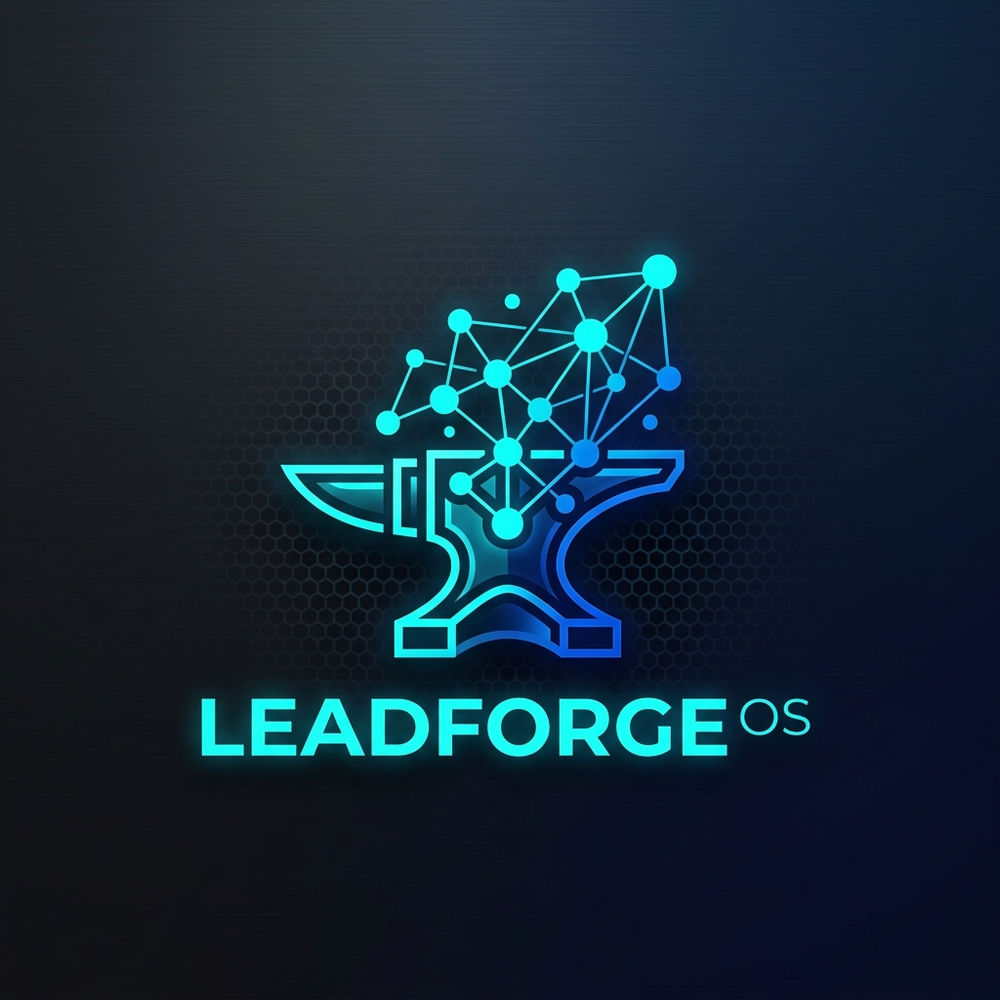
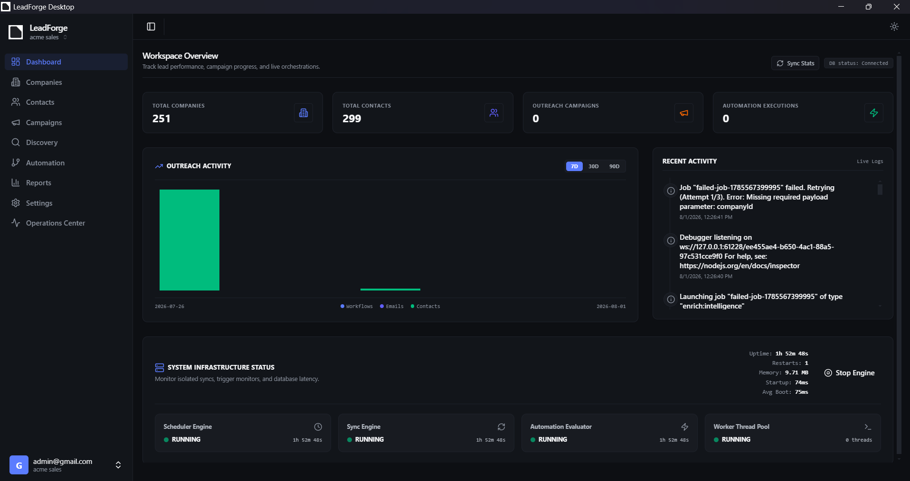
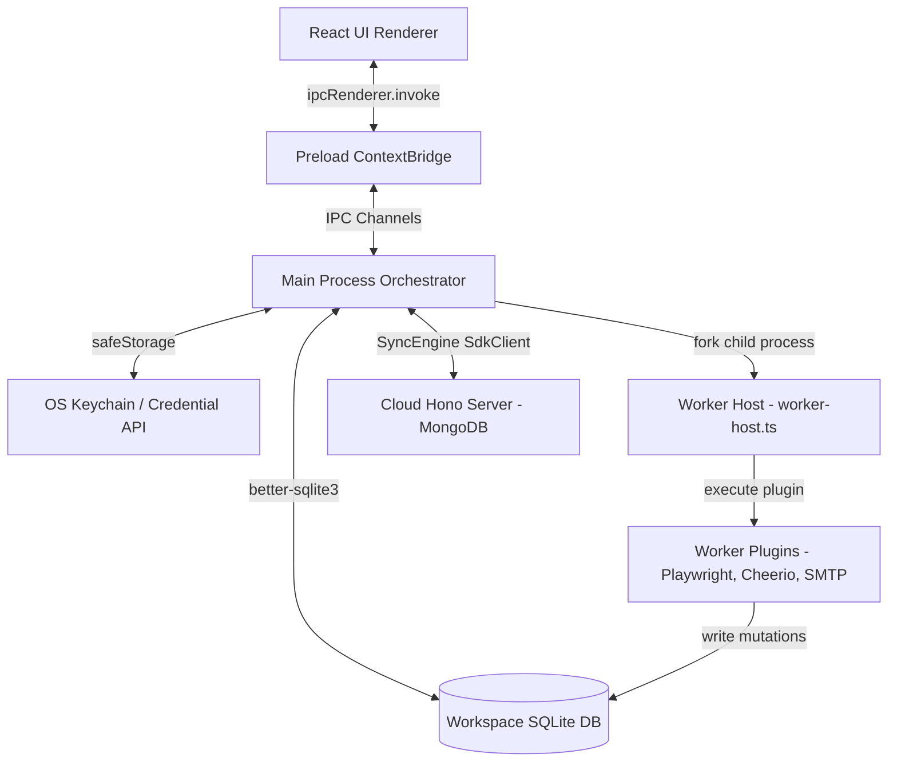

<div align="center">
  

# LeadForge OS

### _Local-First, Privacy-Focused Outbound Workspace & AI Lead Qualification Engine_

[](#)
[](#)
[](#)
[](#)
[](#)
[](#)
[](#)
[](#)
</div>

---

## 🚀 Hero Section & Product Cockpit

LeadForge OS is a desktop application designed for B2B lead generation, website crawling, contact enrichment, and automated cold email campaigns. Instead of relying on expensive seat-based cloud platforms that charge high infrastructure markups and upload your database to third parties, LeadForge OS executes scrapers, headless browsers, data-mining operations, and local LLMs **directly on your local hardware**.

<div align="center">
  
</div>

---

## 🎯 Why LeadForge OS Exists

Commercial outbound platforms (e.g. Apollo, Lemlist, Instantly) operate on centralized cloud environments. This model introduces three major drawbacks:

1. **High Infrastructure markups**: Web crawling and scraping Google Maps at scale consumes heavy proxy and bandwidth resources, leading to expensive subscription tiers.
2. **Data Privacy Risks**: Uploading customer lists, prospect profiles, and private SMTP/IMAP credentials to third-party databases exposes your sales pipeline to security leaks.
3. **Crawl & Send Throttling**: Centralized platforms limit crawling rates and email check frequencies to manage their own cloud costs.

**LeadForge OS solves this** by executing high-concurrency scraping (via Playwright), crawler parsers (via Cheerio), local databases (via SQLite WAL-mode), local LLM inference (via Ollama), and local OS-native credentials encryption (via safeStorage) directly on the client machine. Networks are treated as synchronization transport layers rather than the primary application hosts.

---

## ✨ Key Features

- **Google Maps Scraper (`scraper:maps`)**: Runs headless Playwright browsers, performs infinite scrolls on business listings, resolves domain redirects, and extracts addresses.
- **Website Crawler (`crawler:website`)**: Runs BFS Cheerio crawlers on discovered domains, parsing emails, phone numbers, and identifying tracking/spam traps.
- **LinkedIn Voyager Enricher (`enrich:linkedin`)**: Leverages active session cookies to query LinkedIn APIs and locate matching CEO, Founder, or VP decision-maker profiles.
- **Sequence Drip Engine (`automation:workflow`)**: Maps multi-step sequences (`IF`, `WAIT`, `SEND_EMAIL`, `HTTP_REQUEST`) executing inside a sandboxed worker child process.
- **IMAP Reply Poller (`outreach:imap-poll`)**: Scans inbox replies, correlating conversations via `In-Reply-To`/`References` headers to automatically pause outbound campaigns.
- **SRE Cockpit & Diagnostics**: Measures database latency, pings network sockets, checks SMTP/IMAP ports, runs SQLite integrity checks, and queries system logs.
- **OS Keychain safeStorage**: Encrypts sensitive keys, tokens, and passwords in the database using OS-level credential managers (Electron `safeStorage`).

---

## 🛠️ Technology Stack

- **Desktop Shell**: [Electron](https://www.electronjs.org/) (Main process Node, Preload context bridge, Renderer Chromium)
- **UI Framework**: [React 19](https://react.dev/), [Vite](https://vite.dev/), [TailwindCSS 4](https://tailwindcss.com/)
- **Monorepo Orchestrator**: [Turborepo](https://turbo.build/) & [pnpm Workspaces](https://pnpm.io/workspaces)
- **Primary Datastore**: [SQLite](https://www.sqlite.org/) (WAL mode, workspace physical isolation)
- **Cloud Backend API**: [Hono Server](https://hono.dev/) on Node, [MongoDB](https://www.mongodb.com/) via Mongoose
- **AI Orchestration**: [OpenRouter API](https://openrouter.ai/) (Cloud) & [Ollama](https://ollama.com/) (Local Llama/Gemini)
- **Automation / Scraping**: [Playwright](https://playwright.dev/) & [Cheerio](https://cheerio.js.org/)
- **Email Sending**: [Nodemailer](https://nodemailer.com/) (SMTP client) & [ImapFlow](https://imapflow.org/) (IMAP client)

---

## 🏗️ Architecture Overview

LeadForge OS separates intensive automation workflows and scrapers from the React user interface. Long-running scrapers or workflows are spawned as isolated Node.js child processes to prevent blocking the UI thread or crashing the desktop application.



For a detailed breakdown of process lifecycles, data flows, and schemas, view the [System Architecture Guide](file:///c:/Users/91637/Desktop/Business%20Project/leadforge-os/docs/architecture/README.md).

---

## 📦 Project Structure

```text
├── apps/
│   ├── api/                   # Node.js Hono REST API server (Mongoose/MongoDB)
│   ├── desktop/               # Electron application (Main, Preload, React Renderer)
│   └── web/                   # (Planned) Next.js cloud portal
├── packages/
│   ├── agent-core/            # LLM orchestrator (agents, tools, memory, tracing)
│   ├── agent-runtime/         # Dynamic agent session runtime & tool executors
│   ├── ai/                    # Prompt compilers & LLM providers (Ollama / OpenRouter)
│   ├── auth/                  # better-auth configurations & Middlewares
│   ├── core/                  # Shared constants, validations, and environment schemas
│   ├── logger/                # Workspace-scoped rotating files logger
│   ├── schema/                # TypeScript Interfaces, IPC contracts, and DTOs
│   ├── sdk/                   # HTTP Client Wrapper for sync communication
│   └── workflow-engine/       # Sequential drip execution runners
└── docs/                      # Repository Documentation System
```

---

## ⚙️ Workspace Setup & Installation

### Prerequisites

- **Node.js**: `v18.0.0` or higher
- **pnpm**: `v8.0.0` or higher
- **Git**: Installed and configured
- **Ollama** (Optional): For running local qualification models offline

### Installation

1. Clone the repository:

   ```bash
   git clone https://github.com/kjxcodez/leadforge-os.git
   cd leadforge-os
   ```

2. Install dependencies:

   ```bash
   pnpm install
   ```

3. Build all workspace packages:
   ```bash
   pnpm build
   ```

---

## 💻 Development Workflow

To start development runtimes for both the Hono API server and the Electron application:

```bash
# Run all apps in development mode (API & Desktop UI)
pnpm dev

# Run only the Hono REST API server
pnpm dev --filter=api

# Run only the Electron Desktop application
pnpm dev --filter=@leadforge/desktop
```

### Key CLI Commands

- `pnpm build`: Compiles all packages and application bundles.
- `pnpm check-types`: Compiles TypeScript with `--noEmit` across all workspace targets.
- `pnpm lint`: Lints the monorepo codebase using ESLint.
- `pnpm test`: Executes unit and integration test suites.
- `pnpm test:ai`: Validates AI connections and LLM providers.
- `pnpm doctor`: Runs the 11-step SRE local diagnostic tool.
- `pnpm release:check`: Validates the 10-step release gates before bundling.

---

## 📚 Documentation Directory

Explore the sub-guides for deep-dive technical and operational details:

- **[Getting Started / Setup](file:///c:/Users/91637/Desktop/Business%20Project/leadforge-os/docs/getting-started/README.md)**: Node configurations, workspace creation, and Electron Builder packaging.
- **[System Architecture](file:///c:/Users/91637/Desktop/Business%20Project/leadforge-os/docs/architecture/README.md)**: Process boundaries, event buses, SQLite schemas, and AI prompts caching.
- **[Development Guides](file:///c:/Users/91637/Desktop/Business%20Project/leadforge-os/docs/development/README.md)**: Code guidelines for adding tools, workers, repositories, or IPC channels.
- **[Testing & QA](file:///c:/Users/91637/Desktop/Business%20Project/leadforge-os/docs/testing/README.md)**: Automated tests, mock setups, SRE diagnostics, and CI checklists.
- **[Release & Packaging](file:///c:/Users/91637/Desktop/Business%20Project/leadforge-os/docs/release/README.md)**: Electron-Builder settings, release gates, version changesets, and update manager hooks.
- **[Security Policy](file:///c:/Users/91637/Desktop/Business%20Project/leadforge-os/docs/security/README.md)**: safeStorage decryption rules, masking logs, and privacy boundaries.
- **[Troubleshooting Guides](file:///c:/Users/91637/Desktop/Business%20Project/leadforge-os/docs/troubleshooting/README.md)**: Mismatched sqlite builds, DLL failures, task timeouts, and backups.
- **[Architectural Decision Records (ADRs)](file:///c:/Users/91637/Desktop/Business%20Project/leadforge-os/docs/adr/README.md)**: Historical index of system design decisions (001-013).
- **[Historical Archive](file:///c:/Users/91637/Desktop/Business%20Project/leadforge-os/docs/archive/README.md)**: Archived forensic audits, old specs, and sprint planning logs.

---

## 🗺️ Roadmap

See the detailed **[ROADMAP.md](file:///c:/Users/91637/Desktop/Business%20Project/leadforge-os/ROADMAP.md)** file for a full schedule of completed milestones and upcoming implementations.

---

## 🤝 Contributing

We welcome contributions from the community! Please read the **[CONTRIBUTING.md](file:///c:/Users/91637/Desktop/Business%20Project/leadforge-os/CONTRIBUTING.md)** file for coding standards, pull request policies, and git branching styles.

---

## 📄 License

LeadForge OS is licensed under the [MIT License](LICENSE).

---

## 💖 Acknowledgements

- **Turborepo & pnpm**: For making monorepo dependency tracking effortless.
- **Electron Toolkit**: For simplifying Main-to-Renderer IPC bindings.
- **Nodemailer / ImapFlow**: For providing stable offline email integrations.
