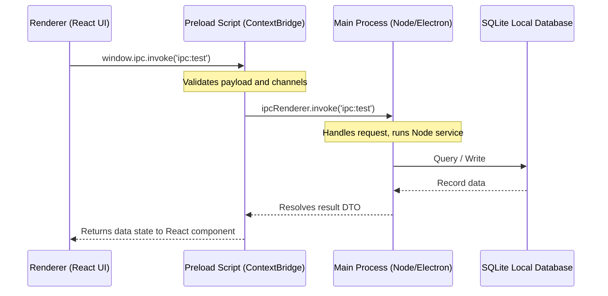

# 1. Repository Architecture & Technology Stack Overview

## Monorepo Strategy & Philosophy

LeadForge OS is built using a **Monorepo Strategy** powered by **pnpm workspaces** and **Turborepo**. The key goal is to maintain a unified workspace containing multiple logical packages and applications, ensuring a single source of truth for dependencies, type definitions, and configurations.

### Rationale for Core Stack Selection:

1. **Turborepo**: 
   - *Why*: Turborepo operates as the orchestrator for building, linting, and testing tasks. It uses local caching (`.turbo`) to skip execution for unchanged code, which is critical for reducing CI/CD execution time.
   - *Advantages*: Significant speedups in monorepo compilation pipelines; declarative task definition (`turbo.json`) makes build ordering predictable.
   - *Disadvantages*: Requires learning a task syntax; misconfigured caching keys can lead to stale build assets in local development.
   - *Long-term implications*: Scales cleanly up to 100+ packages without linearly increasing execution times.

2. **pnpm workspaces**:
   - *Why*: Fast dependency resolution and a content-addressable storage store that avoids duplicating identical dependencies across projects.
   - *Advantages*: Hard links prevent the "phantom dependencies" common in npm or yarn workspaces; faster installations.
   - *Disadvantages*: Simlinked layouts can sometimes cause compatibility issues with legacy node tools.
   - *Long-term implications*: Keeps disk space minimal and enables modular package boundaries.

3. **Electron**:
   - *Why*: Offers desktop-native integration (system tray control, local SQLite databases, child process spawning for scrapers, hardware access) while using standard web development tooling.
   - *Advantages*: Bypasses hosting costs for scraping operations by executing them directly on client machines; runs completely offline.
   - *Disadvantages*: Increased memory consumption and installer bundle sizes.
   - *Long-term implications*: Decoupled backend boundaries (Internal API) make migrating to a cloud client in the future a minor transport layer update.

4. **React**:
   - *Why*: Component modularity matches the high-density dashboard layouts required for lead acquisition screens.
   - *Advantages*: Wide developer pool; excellent virtualized tables support.
   - *Disadvantages*: React rendering cycles can block UI threads if state updates are unoptimized.
   - *Long-term implications*: Easily reusable layout elements for future web applications.

5. **TypeScript**:
   - *Why*: Type safety is essential when passing data boundaries between the Main, Preload, and Renderer processes.
   - *Advantages*: Early compile-time catching of mismatched contracts.
   - *Disadvantages*: Additional build time overhead.

---

## Inter-Process Communication (IPC) Flow

The Electron app boundaries communicate through a strictly defined hierarchy. Web-facing code in the Renderer cannot execute Node APIs; it must pass through a validated Preload script boundary.

