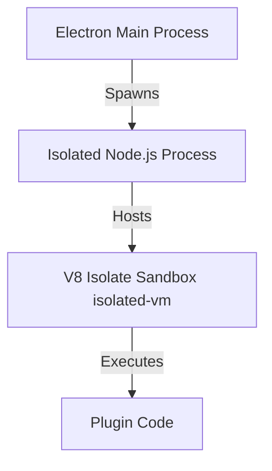

# 11. Plugin Architecture

To support community expansion in Horizon 3, LeadForge OS implements a secure runtime plugin framework.

---

## 1. Distribution & Manifest Contracts

1. **Runtime Loading**: Plugins live outside the repository and are downloaded/installed dynamically to keep core build files lightweight.
2. **Cryptographic Signatures**: Unsigned third-party plugins must be blocked by the Electron client. Plugins must contain code signatures verified by the app's public key.
3. **Semantic Manifests**: Plugins must include a manifest (`manifest.json`) specifying dependencies, target API scopes, and compatible client version ranges.

---

## 2. Sandboxing & Runtime Isolation

Third-party plugin code represents untrusted execution. LeadForge isolates this using V8 Isolate engines:

- **No OS / Filesystem Access**: The sandbox blocks calls to `require`, `fs`, `path`, or `process`.
- **Restricted Bridge API**: Plugins interact with LeadForge via a limited proxy object. All operations (e.g. read contact, dispatch notification) are validated and rate-limited.
