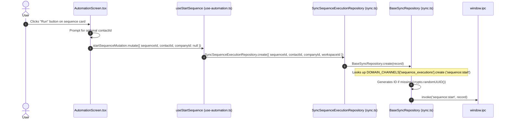
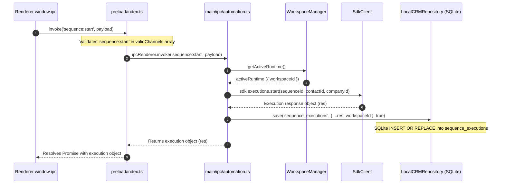
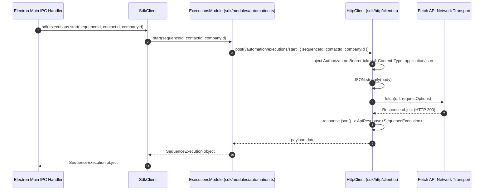
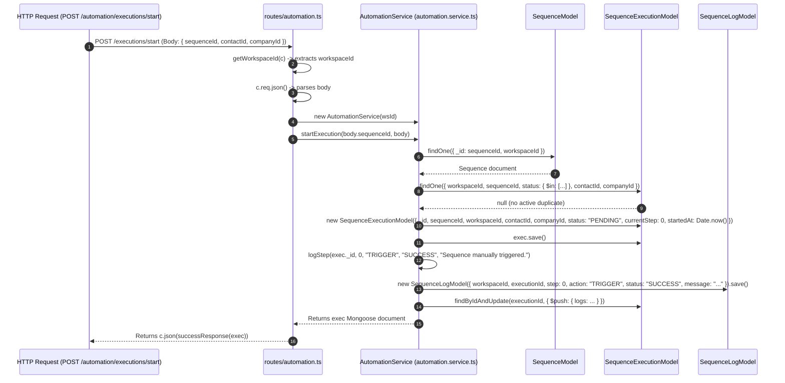

# Forensic Audit: Task 1.1.1 — Runtime Call Graphs

This document presents the detailed architectural call graphs for the manual automation execution path, decomposed into distinct sub-graphs for each architectural layer.

---

## 1. End-to-End Overview Call Graph

```mermaid
flowchart TD
    subgraph RENDERER["1. Renderer Process (React UI)"]
        UI["AutomationScreen.tsx\n(handleManualTrigger)"] --> HOOK["use-automation.ts\n(useStartSequence hook)"]
        HOOK --> REPO["sync.ts\n(SyncSequenceExecutionRepository.create)"]
        REPO --> BRIDGE["window.ipc.invoke('sequence:start')"]
    end

    subgraph PRELOAD["2. Preload Guard"]
        BRIDGE --> PRELOAD_SCRIPT["preload/index.ts\n(ipcRenderer.invoke)"]
    end

    subgraph MAIN["3. Desktop Main Process"]
        PRELOAD_SCRIPT --> IPC_HANDLER["main/ipc/automation.ts\n('sequence:start' handler)"]
        IPC_HANDLER --> WS_MGR["workspace-manager.ts\n(getActiveRuntime)"]
        IPC_HANDLER --> SDK_EXEC["@leadforge/sdk\n(sdk.executions.start)"]
        IPC_HANDLER -.-> LOCAL_CACHE["local-crm.ts\n(LocalCRMRepository.save to SQLite)"]
    end

    subgraph SDK["4. Shared SDK"]
        SDK_EXEC --> SDK_MOD["modules/automation.ts\n(ExecutionsModule.start)"]
        SDK_MOD --> SDK_HTTP["http/client.ts\n(HttpClient.post)"]
    end

    subgraph HTTP["5. Network Transport"]
        SDK_HTTP -->|HTTP POST /automation/executions/start| API_ENDPOINT
    end

    subgraph API["6. API Backend Server"]
        API_ENDPOINT["routes/automation.ts\n(POST /executions/start)"] --> API_SVC["automation.service.ts\n(AutomationService.startExecution)"]
        API_SVC --> MODEL_SEQ["sequence.model.ts\n(SequenceModel.findOne)"]
        API_SVC --> MODEL_EXEC["sequence-execution.model.ts\n(new SequenceExecutionModel)"]
        API_SVC --> API_LOG["automation.service.ts\n(logStep)"]
        API_LOG --> MODEL_LOG["sequence-log.model.ts\n(new SequenceLogModel)"]
    end

    subgraph MONGO["7. Central Database"]
        MODEL_EXEC -->|exec.save()| MONGO_EXEC[("MongoDB Collection\nsequence_executions")]
        MODEL_LOG -->|log.save()| MONGO_LOG[("MongoDB Collection\nsequence_logs")]
    end
```

---

## 2. Renderer Layer Call Graph



---

## 3. IPC & Main Process Call Graph



---

## 4. SDK Layer Call Graph



---

## 5. API Server Layer Call Graph



---

## 6. Database Persistence Call Graph

```mermaid
flowchart LR
    subgraph API_SVC["AutomationService.startExecution()"]
        STEP1["1. Instantiates new SequenceExecutionModel"]
        STEP2["2. Instantiates new SequenceLogModel"]
        STEP3["3. Updates SequenceExecutionModel logs array"]
    end

    subgraph MONGO["MongoDB Database Engine"]
        COLL_EXEC[("sequence_executions\nCollection")]
        COLL_LOG[("sequence_logs\nCollection")]
    end

    subgraph SQLITE["Desktop Local SQLite Engine"]
        TABLE_EXEC[("sequence_executions\nSQLite Table")]
    end

    STEP1 -->|exec.save()| COLL_EXEC
    STEP2 -->|log.save()| COLL_LOG
    STEP3 -->|findByIdAndUpdate $push| COLL_EXEC
    
    API_SVC -.->|Response returned to Desktop Main Process| MAIN_SAVE["LocalCRMRepository.save()"]
    MAIN_SAVE -->|INSERT OR REPLACE| TABLE_EXEC
```
