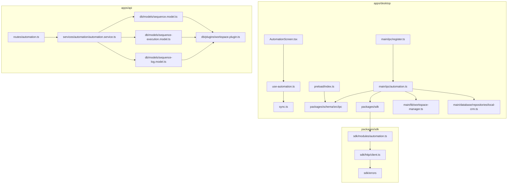

# Forensic Audit: Task 1.1.2 — Dependency & Coupling Matrices

This document provides the formal dependency, coupling, runtime graph, compile-time graph, and criticality matrices for all files participating in the manual automation execution path.

---

## 1. File Dependency Matrix

| File | Direct Dependencies (Depends On) | Dependent Components (Depended On By) | Runtime Required? | Optional? |
| :--- | :--- | :--- | :--- | :--- |
| `AutomationScreen.tsx` | `use-automation.ts`, `useWorkspace.ts`, React Query, Lucide icons, Sonner | `App.tsx` | YES | NO |
| `use-automation.ts` | `sync.ts` (`SyncSequenceExecutionRepository`), `useWorkspace.ts`, React Query | `AutomationScreen.tsx` | YES | NO |
| `sync.ts` | `window.ipc`, `remote.ts` | `use-automation.ts` | YES | NO |
| `preload/index.ts` | `ipcRenderer` (Electron), `@leadforge/schema` | `window.ipc` consumers in Renderer | YES | NO |
| `schema/src/ipc/index.ts` | Zod, `@leadforge/schema` types | `preload/index.ts`, `main/ipc/automation.ts` | NO (Compile-time only) | YES (Type safety) |
| `main/ipc/register.ts` | `main/ipc/automation.ts`, `SdkClient` | `main/index.ts` | YES | NO |
| `main/ipc/automation.ts` | `helper.ts`, `SdkClient`, `WorkspaceManager`, `LocalCRMRepository` | `main/ipc/register.ts` | YES | NO |
| `main/ipc/helper.ts` | `ipcMain` (Electron) | `main/ipc/automation.ts` | YES | NO |
| `workspace-manager.ts` | SQLite connection helpers | `main/ipc/automation.ts` | YES | NO |
| `local-crm.ts` | `getDatabase` (SQLite wrapper) | `main/ipc/automation.ts` | YES | NO |
| `sdk/client/index.ts` | `HttpClient`, `ExecutionsModule` | `main/ipc/automation.ts`, `main/ipc/register.ts` | YES | NO |
| `sdk/modules/automation.ts` | `HttpClient`, `@leadforge/schema` | `sdk/client/index.ts` | YES | NO |
| `sdk/http/client.ts` | native `fetch`, `SdkError`, `@leadforge/schema` | `sdk/modules/automation.ts` | YES | NO |
| `routes/automation.ts` | `OpenAPIHono`, `AutomationService`, utils, errors | API master router (`routes/index.ts`) | YES | NO |
| `automation.service.ts` | `SequenceModel`, `SequenceExecutionModel`, `SequenceLogModel` | `routes/automation.ts` | YES | NO |
| `sequence.model.ts` | `mongoose`, `workspacePlugin` | `automation.service.ts` | YES | NO |
| `sequence-execution.model.ts` | `mongoose`, `workspacePlugin` | `automation.service.ts` | YES | NO |
| `sequence-log.model.ts` | `mongoose`, `workspacePlugin` | `automation.service.ts` | YES | NO |
| `workspace.plugin.ts` | `mongoose` | `sequence.model.ts`, `sequence-execution.model.ts`, `sequence-log.model.ts` | YES | NO |

---

## 2. Coupling Matrix

| File | Incoming Coupling (Fan-In) | Outgoing Coupling (Fan-Out) | Total Coupling | Coupling Rating | Coupling Justification |
| :--- | :--- | :--- | :--- | :--- | :--- |
| `AutomationScreen.tsx` | 1 (`App.tsx`) | 5 (React, Query, `use-automation`, `useWorkspace`, UI components) | 6 | **MEDIUM** | Standard UI screen composition. |
| `use-automation.ts` | 1 (`AutomationScreen`) | 3 (React Query, `useWorkspace`, `sync.ts`) | 4 | **LOW** | Clean custom hook wrapper. |
| `sync.ts` | 1 (`use-automation`) | 2 (`window.ipc`, `remote.ts`) | 3 | **LOW** | Repository abstraction mapping tables to channels. |
| `preload/index.ts` | N (Renderer window) | 2 (`ipcRenderer`, `@leadforge/schema`) | HIGH (Global) | **HIGH** | Global security bridge shared across all IPC calls. |
| `schema/src/ipc/index.ts` | 2 (`preload`, `automation.ts`) | 1 (`@leadforge/schema`) | 3 | **LOW** | Pure compile-time type mapping. |
| `main/ipc/register.ts` | 1 (`main/index.ts`) | 2 (`automation.ts`, `SdkClient`) | 3 | **LOW** | Central registrar bootstrap module. |
| `main/ipc/automation.ts` | 1 (`register.ts`) | 4 (`helper`, `SdkClient`, `WorkspaceManager`, `LocalCRMRepository`) | 5 | **HIGH** | Tightly couples IPC dispatching to remote SDK HTTP calls AND local SQLite disk writes. |
| `main/ipc/helper.ts` | 1 (`automation.ts`) | 1 (`ipcMain`) | 2 | **LOW** | Isolated IPC registration helper. |
| `workspace-manager.ts` | 1 (`automation.ts`) | 1 (SQLite DB) | 2 | **LOW** | Isolated runtime context provider. |
| `local-crm.ts` | 1 (`automation.ts`) | 1 (SQLite connection) | 2 | **LOW** | Isolated SQLite query execution repository. |
| `sdk/client/index.ts` | 2 (`register.ts`, `automation.ts`) | 2 (`HttpClient`, `ExecutionsModule`) | 4 | **LOW** | SDK client facade pattern. |
| `sdk/modules/automation.ts` | 1 (`sdk/client`) | 2 (`HttpClient`, `@leadforge/schema`) | 3 | **LOW** | SDK module mapping paths to endpoints. |
| `sdk/http/client.ts` | 1 (`sdk/modules`) | 2 (`fetch`, `SdkError`) | 3 | **LOW** | Standard HTTP fetch client. |
| `routes/automation.ts` | 1 (`routes/index.ts`) | 4 (`OpenAPIHono`, `AutomationService`, utils, errors) | 5 | **MEDIUM** | API route handler delegating to service. |
| `automation.service.ts` | 1 (`routes/automation.ts`) | 4 (`SequenceModel`, `SequenceExecutionModel`, `SequenceLogModel`, `@leadforge/schema`) | 5 | **HIGH** | Tightly couples business validation to multi-collection MongoDB operations and dual-logging. |
| `sequence.model.ts` | 1 (`automation.service.ts`) | 2 (`mongoose`, `workspacePlugin`) | 3 | **LOW** | Standard Mongoose model. |
| `sequence-execution.model.ts` | 1 (`automation.service.ts`) | 2 (`mongoose`, `workspacePlugin`) | 3 | **LOW** | Standard Mongoose model. |
| `sequence-log.model.ts` | 1 (`automation.service.ts`) | 2 (`mongoose`, `workspacePlugin`) | 3 | **LOW** | Standard Mongoose model. |
| `workspace.plugin.ts` | 3 (Mongoose models) | 1 (`mongoose`) | 4 | **MEDIUM** | Cross-cutting Mongoose plugin applied to all models. |

---

## 3. Runtime Dependency Graph

```mermaid
flowchart LR
    subgraph RENDERER_PROCESS["Chromium Renderer Process"]
        R1["AutomationScreen.tsx"] --> R2["use-automation.ts"]
        R2 --> R3["sync.ts"]
        R3 --> R4["window.ipc"]
    end

    subgraph PRELOAD_GUARD["Electron Preload ContextBridge"]
        R4 --> P1["preload/index.ts"]
    end

    subgraph MAIN_PROCESS["Node.js Main Process"]
        P1 --> M1["main/ipc/automation.ts"]
        M1 --> M2["workspace-manager.ts"]
        M1 --> M3["local-crm.ts (SQLite Write)"]
        M1 --> M4["packages/sdk Client"]
    end

    subgraph SDK_LIB["SDK Package"]
        M4 --> S1["sdk/modules/automation.ts"]
        S1 --> S2["sdk/http/client.ts"]
    end

    subgraph NETWORK["HTTP Network Transport"]
        S2 -->|POST /automation/executions/start| API_ROUTER
    end

    subgraph API_PROCESS["API Backend Process"]
        API_ROUTER["routes/automation.ts"] --> API_SVC["automation.service.ts"]
        API_SVC --> DB1["sequence.model.ts"]
        API_SVC --> DB2["sequence-execution.model.ts"]
        API_SVC --> DB3["sequence-log.model.ts"]
        DB1 --> PLUG["workspace.plugin.ts"]
        DB2 --> PLUG
        DB3 --> PLUG
    end

    subgraph DATABASES["Persistence Engine"]
        DB2 -->|Mongoose save()| MONGO[("MongoDB")]
        DB3 -->|Mongoose save()| MONGO
        M3 -->|better-sqlite3 run()| SQLITE[("SQLite")]
    end
```

---

## 4. Compile-Time Dependency Graph



---

## 5. Criticality Matrix

| File | Criticality | Operational Justification | Failure Impact |
| :--- | :--- | :--- | :--- |
| `AutomationScreen.tsx` | **Critical** | Single UI trigger screen for manual sequence execution. | User cannot click "Run" button or initiate sequence executions manually. |
| `use-automation.ts` | **Critical** | Single React Query hook wrapper for execution creation. | Mutation call fails; UI feedback toasts broken. |
| `sync.ts` | **Critical** | Single client repository mapping entity tables to IPC channels. | Execution request cannot reach Electron IPC. |
| `preload/index.ts` | **Critical** | Electron IPC channel whitelist guard and context bridge. | `'sequence:start'` IPC call rejected as unauthorized. |
| `schema/src/ipc/index.ts` | **Medium** | Shared IPC channel contract interfaces. | TypeScript compilation errors if types mismatch. |
| `main/ipc/register.ts` | **Critical** | Main process IPC handler registrar. | `'sequence:start'` handler never registered on `ipcMain`. |
| `main/ipc/automation.ts` | **Critical** | Main process handler executing SDK call and local SQLite save. | Execution never reaches API server; local SQLite cache never written. |
| `main/ipc/helper.ts` | **Medium** | Prevents duplicate IPC handler registration during HMR. | Desktop process crashes during dev hot reloading. |
| `workspace-manager.ts` | **Critical** | Supplies active workspace runtime and database handle. | Main process handler throws `No active workspace runtime`. |
| `local-crm.ts` | **High** | Writes local SQLite execution cache row. | Desktop offline cache out of sync; UI execution list fails local fallback. |
| `sdk/client/index.ts` | **Critical** | Main SDK client facade instance. | Main process cannot access SDK modules. |
| `sdk/modules/automation.ts` | **Critical** | SDK module formatting endpoint path for start execution. | API endpoint URL cannot be resolved. |
| `sdk/http/client.ts` | **Critical** | Native `fetch` HTTP client executing network request to API server. | HTTP request fails; payload never sent over wire. |
| `routes/automation.ts` | **Critical** | API server HTTP route handling `POST /executions/start`. | HTTP request returns 404 Not Found or 500 Error. |
| `automation.service.ts` | **Critical** | API domain service creating `SequenceExecution` document in MongoDB. | MongoDB execution record never created; manual execution fails. |
| `sequence.model.ts` | **Critical** | Mongoose model verifying sequence template existence. | Sequence validation fails; service throws `Sequence not found`. |
| `sequence-execution.model.ts` | **Critical** | Mongoose model for `sequence_executions` collection. | MongoDB document save fails; execution state lost. |
| `sequence-log.model.ts` | **High** | Mongoose model for `sequence_logs` collection. | Audit trail logs lost. |
| `workspace.plugin.ts` | **Critical** | Enforces multi-tenant workspace isolation across MongoDB models. | Mongoose queries fail schema validation or leak cross-tenant data. |
