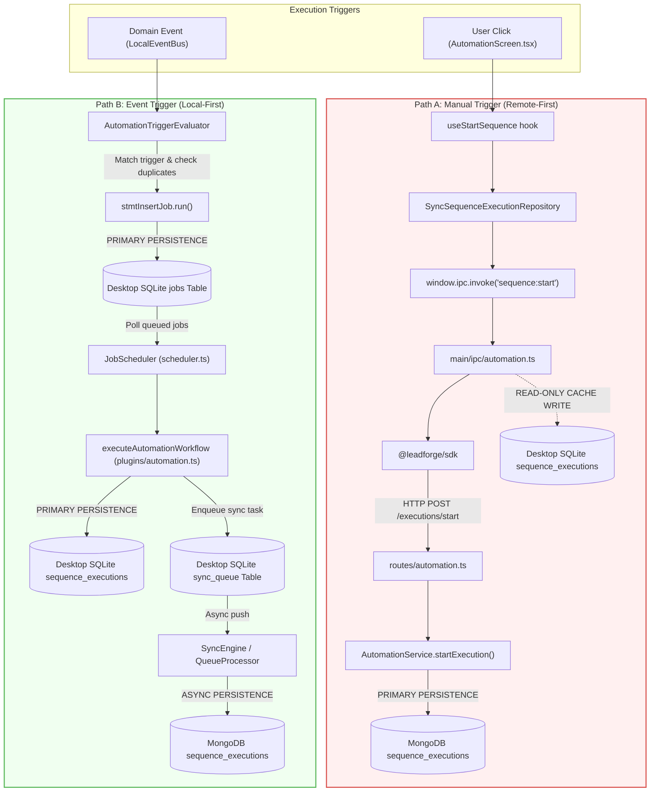
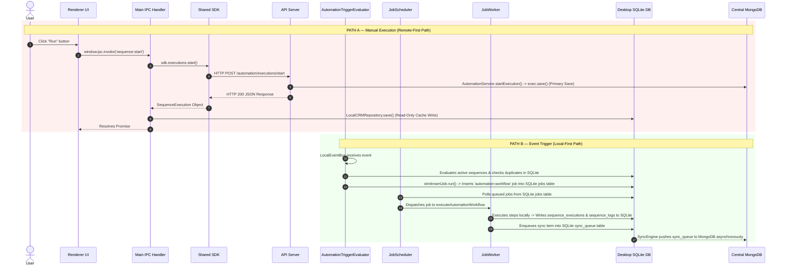

# Forensic Audit: Task 1.1.4 — Comparison & Divergence Matrices

This document provides formal side-by-side comparative matrices and Mermaid diagrams for Path A (Manual Execution Path) vs. Path B (Event Trigger Execution Path).

---

## 1. Responsibility Comparison Matrix

| Architectural Responsibility | Path A Owner (Manual Path) | Path B Owner (Event Path) | Same Owner? | Source Evidence |
| :--- | :--- | :--- | :--- | :--- |
| **Execution Triggering** | Renderer UI (`AutomationScreen.tsx`) | `LocalEventBus` (`eventBus.publish`) | NO | `AutomationScreen.tsx:L219` vs `automation-trigger.ts:L182` |
| **Trigger Matching** | None (Direct UI prompt) | `AutomationTriggerEvaluator` | NO | `automation-trigger.ts:L238` |
| **Duplicate Prevention** | API `AutomationService` (MongoDB check) | `AutomationTriggerEvaluator` (SQLite jobs & exec check) | NO | `automation.service.ts:L82` vs `automation-trigger.ts:L307` |
| **Job Queueing** | **None (Bypassed)** | SQLite `jobs` table (`stmtInsertJob.run`) | NO | `main/ipc/automation.ts:L66` vs `automation-trigger.ts:L347` |
| **Job Scheduling** | **None (Bypassed)** | Desktop `JobScheduler` (`scheduler.ts`) | NO | `main/ipc/automation.ts:L66` vs `scheduler.ts:L175` |
| **Worker Dispatch** | **None (Bypassed)** | `JobWorker` / `worker-host.ts` | NO | `main/ipc/automation.ts:L66` vs `worker-host.ts:L53` |
| **Step Execution** | Remote API Server (`apps/api`) | Desktop Worker (`executeAutomationWorkflow`) | NO | `routes/automation.ts:L78` vs `plugins/automation.ts:L823` |
| **Primary Persistence** | Remote MongoDB Engine | Desktop SQLite Database | NO | `automation.service.ts:L106` vs `plugins/automation.ts` |
| **Secondary Caching / Sync** | Local SQLite (`skipQueue = true`) | Background `SyncEngine` (`sync_queue`) | NO | `main/ipc/automation.ts:L67` vs `sync.ts:L121` |
| **Execution Progress Logging** | MongoDB `sequence_logs` & `$push` | Local SQLite `sequence_logs` table | NO | `automation.service.ts:L145` vs `plugins/automation.ts` |

---

## 2. Ownership Comparison Matrix

| Ownership Aspect | Path A Owner (Manual Path) | Path B Owner (Event Path) | Divergence Summary |
| :--- | :--- | :--- | :--- |
| **Lifecycle Owner** | Remote API Server (`apps/api`) | Desktop Main Process (`WorkspaceRuntime`) | Path A delegates lifecycle to remote API; Path B keeps lifecycle in desktop. |
| **Execution ID Owner** | `sync.ts` / Mongoose Schema | `AutomationTriggerEvaluator` (`randomUUID()`) | Path A generates ID in client repo or API; Path B generates ID in Main evaluator. |
| **Job State Owner** | **None (No Job Created)** | SQLite `jobs` Table & `JobScheduler` | Path A has no job state; Path B owns `queued` -> `running` job state transitions. |
| **Execution State Owner** | Central MongoDB (`sequence_executions`) | Desktop SQLite (`sequence_executions`) | Path A stores state in MongoDB; Path B stores state in local SQLite file. |
| **Log Storage Owner** | Central MongoDB (`sequence_logs`) | Desktop SQLite (`sequence_logs`) | Path A logs to MongoDB; Path B logs to SQLite. |
| **Synchronization Owner** | Synchronous API return -> SQLite cache write | Asynchronous `SyncEngine` / `QueueProcessor` | Path A uses direct return write; Path B uses queue sync. |

---

## 3. Input Comparison Matrix

| Input Attribute | Path A (Manual Path) | Path B (Event Path) | Divergence Description |
| :--- | :--- | :--- | :--- |
| **Input Source** | UI string prompt (`prompt()`) | `AppEvent` payload on `LocalEventBus` | Path A is manual prompt text; Path B is structured event payload object. |
| **`sequenceId` Origin** | Selected UI sequence card | Matched sequence from SQLite query | Path A selected manually; Path B matched automatically via trigger type. |
| **`contactId` / `entityId` Origin** | Optional prompt input or empty string | `event.payload.entityId` from event | Path A is manual user string; Path B is CRM event entity ID. |
| **`companyId` Origin** | Explicitly `null` | `event.payload.entityId` (if `entityType === 'company'`) | Path A is always `null`; Path B dynamically resolved from event. |
| **`workspaceId` Origin** | Active UI & Main workspace context | `event.workspaceId` from `AppEvent` | Both resolve active workspace ID. |

---

## 4. Output Comparison Matrix

| Output Artifact | Path A (Manual Path) | Path B (Event Path) | Divergence Description |
| :--- | :--- | :--- | :--- |
| **Primary Execution Record** | MongoDB Document (`sequence_executions`) | SQLite Row (`sequence_executions`) | Primary storage engine is inverted. |
| **Job Queue Record** | **None** | SQLite Row (`jobs` table) | Path A creates no job row; Path B creates queued job row. |
| **Log Records** | MongoDB Document & embedded array | SQLite Row (`sequence_logs` table) | Path A logs to MongoDB; Path B logs to SQLite. |
| **Sync Queue Record** | **None** (`skipQueue = true`) | SQLite Row (`sync_queue` table) | Path A skips sync queue; Path B uses sync queue. |
| **Return to Caller** | Resolved IPC Promise (`SequenceExecution`) | Published `automation:triggered` event | Path A returns object across IPC; Path B emits event on bus. |

---

## 5. Persistence Comparison Matrix

| Persistence Target | Path A Operation | Path B Operation | Same Operation? | Evidence |
| :--- | :--- | :--- | :--- | :--- |
| **SQLite `jobs` Table** | **No Operation** | `INSERT INTO jobs (id, workspaceId, type, status, ...)` | NO | `automation-trigger.ts:L347` |
| **SQLite `sequence_executions`** | `INSERT OR REPLACE` (Read cache after SDK return) | `INSERT INTO sequence_executions` (Primary write in worker) | NO | `automation.ts:L67` vs `plugins/automation.ts` |
| **SQLite `sequence_logs`** | **No Operation** | `INSERT INTO sequence_logs` (Step log in worker) | NO | `automation.ts` (None) vs `plugins/automation.ts` |
| **SQLite `sync_queue`** | **No Operation** (`skipQueue = true`) | `INSERT INTO sync_queue` (Background sync task) | NO | `automation.ts:L67` vs `sync.ts` |
| **MongoDB `sequence_executions`**| `new SequenceExecutionModel(...).save()` (Primary write) | Asynchronous insert via `SyncEngine` / `QueueProcessor` | NO | `automation.service.ts:L106` vs `SyncEngine` |
| **MongoDB `sequence_logs`** | `new SequenceLogModel(...).save()` & `$push` (Primary write)| Asynchronous insert via `SyncEngine` / `QueueProcessor` | NO | `automation.service.ts:L145` vs `SyncEngine` |

---

## 6. Rule Verification Matrix

| Rule ID | Architectural Rule | Path A Status | Path B Status | Source Evidence |
| :--- | :--- | :--- | :--- | :--- |
| **RULE-1** | Desktop owns execution | ❌ **VIOLATED** | ✅ **COMPLIANT** | Path A: `automation.ts:L66` delegates to `sdk.executions.start()`. Path B: `plugins/automation.ts:L823` executes worker locally. |
| **RULE-2** | Everything executes locally | ❌ **VIOLATED** | ✅ **COMPLIANT** | Path A: Executed on API server (`apps/api`). Path B: Executed in desktop worker plugin. |
| **RULE-3** | SQLite is source of truth | ❌ **VIOLATED** | ✅ **COMPLIANT** | Path A: MongoDB written first; SQLite written secondarily as cache. Path B: SQLite written first; MongoDB synced secondarily. |
| **RULE-4** | API is passive | ❌ **VIOLATED** | ✅ **COMPLIANT** | Path A: API handles HTTP POST, creates execution, logs step. Path B: API receives passive background sync updates. |
| **RULE-5** | Everything syncs through SyncEngine | ❌ **VIOLATED** | ✅ **COMPLIANT** | Path A: Uses `skipQueue = true`, bypassing `sync_queue`. Path B: Writes to `sync_queue`. |
| **RULE-6** | Business logic belongs in Desktop | ❌ **VIOLATED** | ✅ **COMPLIANT** | Path A: Execution business logic runs in API `AutomationService`. Path B: Runs in desktop `AutomationTriggerEvaluator` & worker. |
| **RULE-7** | Renderer never talks directly to MongoDB | ✅ **COMPLIANT** | ✅ **COMPLIANT** | Both paths route through Main process / IPC / API abstractions. |

---

## 7. Comparative Sequence Diagrams

### Diagram 1: Merged Comparative Call Graph

### Diagram 2: Responsibility Transfer Comparison

