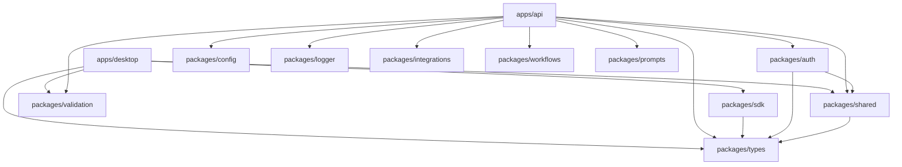
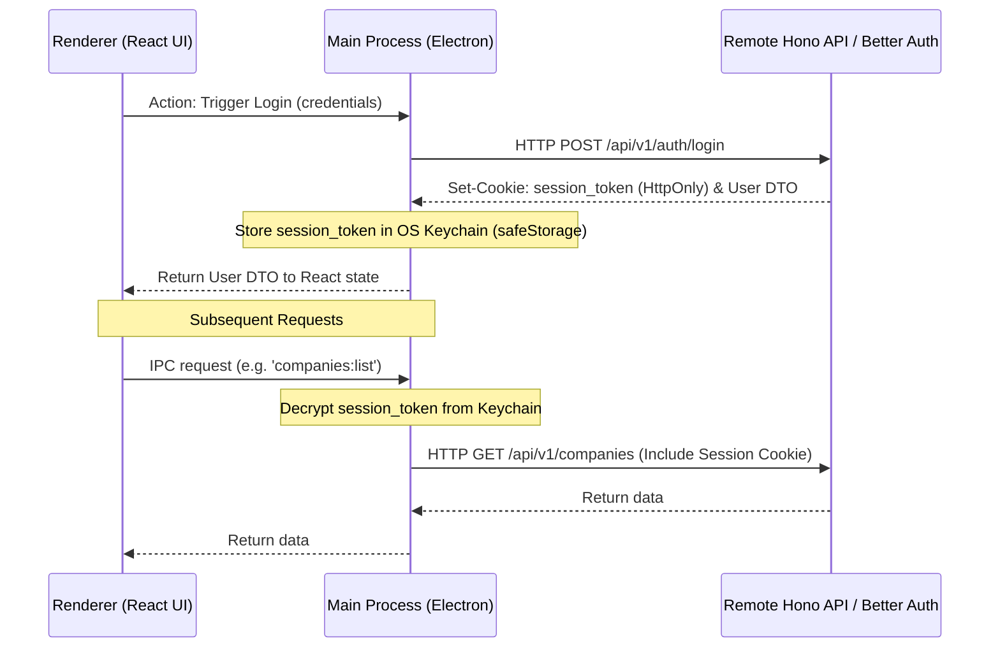
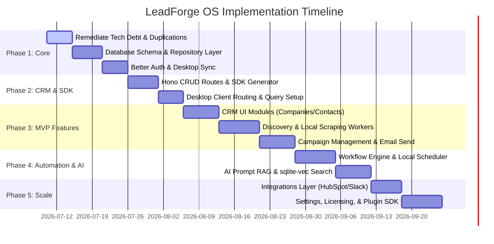

# Executive Audit Summary: LeadForge OS


This document provides a high-level forensic audit and architecture readiness assessment of **LeadForge OS** at the transition point between foundation setup and MVP development.


---


## 1. Overall Assessment & System Maturity


LeadForge OS is structured as a **Turborepo Monorepo** using **pnpm workspaces** and **TypeScript**. 


Historically, the project was envisioned as a standalone Electron desktop monolith (as described in the outdated `apps/docs/arch/repository-structure.md` blueprint). However, the repository has recently been scaffolded with several shared packages and application shells. 


Our audit shows that while the workspace skeleton is in place, the application is in an **Early Scaffold / Pre-MVP Maturity State**. Core mechanisms—such as authentication, database connections, and IPC boundaries—are currently scaffolded with hardcoded mock data, placeholders, or duplicates.


### Monorepo Maturity Scorecard


| Architectural Layer | Development Stage | Production Readiness | Primary Concerns |

| :--- | :---: | :---: | :--- |

| **Monorepo Architecture** | Structured | **65%** | Stale configurations, missing workspace build boundaries, circular potential. |

| **Electron Desktop Application** | Scaffolded | **40%** | Main process is an inlined monolith; navigation is simulated via state; Shadcn components are missing. |

| **Hono API Server** | Skeleton | **30%** | Empty routers; mock authentication endpoint; zero database models, repositories, or services. |

| **Better Auth Integration** | Mocked | **10%** | Raw library config is defined in a package but bypassed in the API server by a dummy placeholder. |

| **Shared Packages** | Skeleton | **50%** | High coupling between `types` and `validation`; duplicate pagination and formatting logic in `apps/api`. |

| **State Management** | Non-existent | **0%** | No global client state; no TanStack Query configuration; local React states. |


---


## 2. Key Strengths & Assets


1. **Modern Monorepo Tooling**: The use of Turborepo and pnpm workspaces provides a solid foundation for local caching and parallelizing task compilation.

2. **Clear Pre-built UI Themes**: The TailwindCSS v4 theme definition in `globals.css` is high quality, featuring a comprehensive set of dark mode variables and semantic color tokens.

3. **OpenAPI Schema Foundations**: The use of `@hono/zod-openapi` in the API server provides automated Scalar and Swagger UI documentation directly from runtime schemas.

4. **Typed IPC Bridge**: The preload script uses a strict allowlist of channels and links with `IpcChannelMap` to prevent arbitrary Node execution inside Chromium.

5. **Decoupled Business Engines**: Packages like `@leadforge/workflows` and `@leadforge/prompts` are logically isolated and designed with clean interfaces.


---


## 3. Structural Weaknesses & Violations


> [!WARNING]

> **Architectural Debt & Duplications**

> 

> * **Bypassed Auth Infrastructure**: The `@leadforge/auth` package wrapping Better Auth is fully bypass-scaffolded. The API server has a mock `/login` route returning fake tokens and uses a mock Hono auth middleware.

> * **Logic Duplication**: The `apps/api` server re-implements `getPaginationParams` and `buildPaginatedMeta` instead of reusing helper methods in `@leadforge/shared`. It also spins up its own Pino logger instance instead of calling `createLogger` in `@leadforge/logger`.

> * **Electron Main Monolith**: `apps/desktop/src/main/index.ts` holds all IPC channel handlers, Zod schemas, and bootstrapping logic. Subfolders like `ipc/`, `services/`, and `windows/` are completely empty.

> * **Simulated Routing**: The desktop app uses a local state-based `switch (activeTab)` switcher instead of `react-router-dom` (which is installed but not used). This limits deep linking and breaks state persistence.

> * **Stale Blueprints**: The developer docs in `apps/docs/arch` state that `packages/` is empty, indicating they are outdated and do not align with the current scaffolded state.


---


## 4. Overall Risk Level & Production Readiness


> [!CAUTION]

> **Current Risk Level: HIGH (Not Production Ready)**

> 

> **Why**: Continuing MVP feature development on this foundation will result in high refactoring costs. Developing CRM features before establishing the local database repository layers, state management, and real authentication will lock mock logic into UI components.

> 

> **Recommendation**: Do NOT proceed directly to feature development. First, execute the remediation tasks listed in [task.md](file:///C:/Users/91637/.gemini/antigravity-ide/brain/ffc77c10-cd87-4e0d-ab9b-b31d9a3d2c73/task.md) to stabilize the core monorepo foundation.


# Monorepo & Architectural Audit


This document reviews the overall structural integrity of the LeadForge OS monorepo, detailing the build pipeline, workspaces, package boundaries, and future scalability constraints.


---


## 1. Monorepo Architecture Overview


LeadForge OS is organized as a multi-package repository using **pnpm workspaces** and **Turborepo**.


```text

leadforge-os/

├── apps/

│   ├── api/             # Hono REST API server (Mongoose & better-auth skeleton)

│   ├── desktop/         # Electron desktop app (React 19, tailwindcss v4)

│   ├── docs/            # Outdated markdown architecture guides

│   ├── web/             # [EMPTY] Placeholder for web landing page/dashboard

│   └── worker/          # [EMPTY] Placeholder for local scraping workers

├── packages/

│   ├── auth/            # Better Auth MongoDB client wrapper

│   ├── config/          # Environment parser (loadAndValidateEnv) & CORS configs

│   ├── integrations/    # Email, Scraper, and Verification adapter stubs

│   ├── logger/          # Pino logger utility factory

│   ├── prompts/         # AI Prompt templates and registry

│   ├── sdk/             # Client SDK for Hono API communication

│   ├── shared/          # Workspace constants, date helpers, pagination utilities

│   ├── types/           # TypeScript interfaces, DTO contracts, IPC interface definitions

│   ├── validation/      # Zod validation schemas for forms, DTOs, and entities

│   └── workflows/       # Sequential workflow engine & step executors

```


---


## 2. Dependency Directions & Workspace References


Our audit of the individual `package.json` configurations shows that workspace references (`workspace:*`) are correctly specified. However, the permitted compilation boundaries are poorly enforced. 


### Current Dependency Graph (Actual)





---


## 3. Critical Architecture Violations


### 3.1 Bypassed Package Boundaries (Logic Duplication)

A package boundary violation occurs when an application implements business logic that should be consumed from a shared package. We have identified two high-priority violations:

* **Logger Violation**: `apps/api` instantiates standard `pino` directly under `apps/api/src/config/logger.ts` instead of importing `createLogger` or `logger` from `@leadforge/logger`.

* **Shared Logic Violation**: `apps/api` duplicates pagination extraction and formatting functions under `apps/api/src/utils/helpers.ts` which are already defined in `@leadforge/shared/src/pagination/utils.ts`.


### 3.2 Coupling of Validation & Types

Currently, `packages/types` defines static TypeScript interfaces (e.g. `LoginDto`) and `packages/validation` defines corresponding Zod schemas (e.g. `loginDtoSchema`).

* **The Problem**: Zod schemas are written completely from scratch and are not bound to the types. If a developer edits a schema under `validation`, the compile-time types under `types` will not update automatically.

* **Why it matters**: Mismatches between frontend validation and backend schema boundaries will fail silently at runtime, resulting in database errors or desktop app crashes.

* **Solution**: Change `packages/types` to export inferred types directly from `packages/validation` schemas using Zod's `z.infer<T>`, or use `z.Schema<T>` inside the validation package to strictly type-check Zod schemas against interfaces.


### 3.3 Outdated/Stale Documentation

The architecture manuals in `apps/docs/arch/` (specifically `repository-structure.md` and `packages-architecture.md`) explicitly state that `packages/` is completely empty.

* **Impact**: New developers onboarding onto the project will be confused by conflicting guidelines, leading to incorrect packages being created or duplicate logic being placed in the apps.


---


## 4. Build Pipeline & Tooling


### 4.1 Turbo Config (`turbo.json`)

The current `turbo.json` is basic:

* **The Problem**: It lacks explicit caching rules for outputs of `check-types`.

* **Why it matters**: Running `pnpm check-types` on large codebases is slow. Without Turborepo caching type-checking tasks, developers will experience long build times during local commits.

* **Solution**: Expand the `turbo.json` config to include `check-types` output configurations.


### 4.2 TypeScript Project References

The project lacks **TypeScript Project References** (`composite: true` links between `tsconfig.json` files).

* **The Problem**: Changes to a package like `packages/validation` are not immediately compile-checked inside `apps/desktop` or `apps/api` unless a full build is triggered.

* **Why it matters**: TypeScript autocomplete and editor diagnostics will fail to update across package lines, slowing down the development feedback loop.

* **Solution**: Restructure child package `tsconfig.json` configurations to declare dependencies using path references.


---


## 5. Scalability Assessment (100+ Devs, 500k+ LOC)


The monorepo structure is capable of supporting this scale, provided the following improvements are made:


1. **Git Codeowners Mapping**: Establish a `.github/CODEOWNERS` registry to assign ownership of core workspace layers (e.g., platforms, workers, desktop main vs. renderer).

2. **Strict Sideways Import Barriers**: Implement ESLint boundary constraints (like `eslint-plugin-import` or custom dependency rules) to block sideways imports (e.g., preventing `@leadforge/workflows` from importing from `@leadforge/integrations`).

3. **Mocking Boundaries for Unit Testing**: As packages expand, unit tests must run inside clean Node environments. Introduce a Vitest workspace runner that mocks Electron and database APIs, preventing tests from blocking.


# Dependency & Ownership Audit


This document examines the dependency declarations, package boundaries, and logic duplications across the LeadForge OS monorepo.


---


## 1. Package Ownership & Metadata


The workspace consists of 5 apps (under `apps/`) and 10 shared packages (under `packages/`).


| Package / App | Version | Key Dependencies | Primary Owner | Target Environment |

| :--- | :--- | :--- | :--- | :--- |

| `apps/desktop` | `0.0.1` | React 19, tailwindcss v4, react-router-dom, `@leadforge/sdk`, `@leadforge/validation` | Frontend Team | Electron (Chromium/Node) |

| `apps/api` | `1.0.0` | Hono, Mongoose, Better Auth, `@leadforge/auth`, `@leadforge/config`, `@leadforge/logger` | Backend Team | Node.js Server |

| `@leadforge/auth` | `0.0.1` | better-auth, `@leadforge/types`, `@leadforge/shared` | Security & IAM | Node.js (Server only) |

| `@leadforge/sdk` | `0.0.1` | `@leadforge/types` | Platform Infra | Universal (Browser/Node) |

| `@leadforge/shared` | `0.0.1` | `@leadforge/types`, zod, lodash | Platform Infra | Universal |

| `@leadforge/logger` | `0.0.1` | pino, pino-pretty | Platform Infra | Universal |

| `@leadforge/config` | `0.0.1` | zod, dotenv | Platform Infra | Node.js |

| `@leadforge/types` | `0.0.1` | None | Platform Infra | TypeScript (Build-only) |

| `@leadforge/validation` | `0.0.1` | zod | Platform Infra | Universal |

| `@leadforge/prompts` | `0.0.1` | None | AI & Agents | Universal |

| `@leadforge/workflows` | `0.0.1` | `@leadforge/types` | Workflows Team | Node.js / Electron Main |

| `@leadforge/integrations`| `0.0.1` | None | Integrations Team | Node.js / Electron Main |


---


## 2. Identified Logic Duplications & Violations


We have identified several critical duplication issues that violate the dry (Don't Repeat Yourself) principle and breach package isolation boundaries:


### 2.1 API Logger Duplication (P0)

* **Violation**: `apps/api/src/config/logger.ts` instantiates a standalone Pino logger from scratch and configures its development environment transport using `pino-pretty`.

* **Problem**: The workspace already provides `@leadforge/logger`, which contains a robust `createLogger` factory handling both Node.js (with `pino-pretty`) and browser logging contexts.

* **Why it matters**: Any updates to formatting or central log exporters will need to be written twice, increasing the risk of log configuration drift.

* **Remediation**: Delete `apps/api/src/config/logger.ts`. Update `apps/api/src/config/index.ts` to import and export the configured logger directly from `@leadforge/logger`.


### 2.2 API Pagination & Helpers Duplication (P1)

* **Violation**: `apps/api/src/utils/helpers.ts` implements pagination utilities:

  - `getPaginationParams(page, limit)`

  - `buildPaginatedMeta(totalCount, page, limit)`

* **Problem**: `@leadforge/shared` already implements these same functions in `packages/shared/src/pagination/utils.ts`.

* **Why it matters**: Standard client pagination behavior will diverge between the API server and the local desktop database queries.

* **Remediation**: Remove these functions from `apps/api/src/utils/helpers.ts` and update references to import them from `@leadforge/shared`.


### 2.3 Better Auth Logic Re-creation (P0)

* **Violation**: `@leadforge/auth` exposes a helper `createBetterAuth` to spin up a unified Better Auth instance. However, `apps/api` does not use the auth middleware from `@leadforge/auth` (`createAuthMiddleware`). Instead, it defines a mock Hono auth middleware locally in `apps/api/src/middleware/auth.ts` that relies on hardcoded headers:

  ```typescript

  if (!authHeader) {

    throw new UnauthorizedError("Authentication credentials are required.");

  }

  c.set("user", { id: "scaffold-user-id", email: "user@leadforge.os", role: "admin" });

  ```

* **Problem**: The authentication logic is completely bypassed. Developers building features will write logic against a simulated user that does not match the session structure of Better Auth.

* **Why it matters**: Integrating actual Better Auth sessions later will require a complete rewrite of all route handlers.

* **Remediation**: Configure `apps/api` to use `createAuthMiddleware` from `@leadforge/auth`, passing the actual Better Auth instance.


### 2.4 Zod Schema & TypeScript Interface Duplication (P2)

* **Violation**: `packages/types/src/dto/auth.dto.ts` defines manual interfaces (e.g. `LoginDto`), while `packages/validation/src/dto/auth.ts` defines manual Zod schemas (e.g. `loginDtoSchema`).

* **Problem**: There is no type linkage. A developer can modify `loginDtoSchema` (e.g., adding a new field) without typescript flagging that `LoginDto` is now out of sync.

* **Why it matters**: Mismatched types will compile successfully but throw validation errors at runtime.

* **Remediation**: Infer interfaces directly in `packages/types` from `packages/validation` schemas using Zod inference:

  ```typescript

  import { loginDtoSchema } from '@leadforge/validation';

  export type LoginDto = z.infer<typeof loginDtoSchema>;

  ```


---


## 3. Dependency Cleanups & Removals


1. **Delete `apps/api` Local Logger**: Replace with `@leadforge/logger`.

2. **Consolidate Validation/Types**: Remove manual DTO interfaces and replace with inferred types from Zod schemas.

3. **Align API Middleware**: Replace the mock `authMiddleware` inside the Hono API server with the session-verifying middleware from `@leadforge/auth`.


# Electron Desktop Architecture Audit (`apps/desktop`)


This document presents a deep forensic audit of the Electron desktop wrapper, evaluating process isolation, IPC handling, routing, lifecycle, and security controls.


---


## 1. Process Separation & Folder Layout


The desktop application is built with `electron-vite`, separating code into `main`, `preload`, and `renderer` processes.


### Current File Structure Audit

```text

apps/desktop/src/

├── main/

│   ├── ipc/           # [EMPTY] Recommended folder for channel handlers

│   ├── lib/           # [EMPTY]

│   ├── services/      # [EMPTY]

│   ├── windows/       # [EMPTY]

│   └── index.ts       # MONOLITH: Hosts all bootstrapping, window config, and IPC logic

├── preload/

│   └── index.ts       # Secure contextBridge API definition

├── renderer/

│   ├── app/           # App shell (App.tsx and main.tsx)

│   ├── components/    # Atomic UI (ui/button.tsx and auth/login-form.tsx)

│   └── screens/       # Tab views (DashboardScreen.tsx, CompaniesScreen.tsx, etc.)

└── shared/

    ├── styles/        #globals.css

    └── utils/         # cn.ts

```


> [!WARNING]

> **Main Process Monolith Design**

> 

> The subdirectories inside `src/main/` (`ipc/`, `lib/`, `services/`, `windows/`) are completely empty. Every single main-process event (app startup, window configurations, IPC registrations, Zod validation parses) is inlined into a single file: `src/main/index.ts`.

> 

> **Impact**: This file will quickly become unmaintainable as we add SQLite database schemas, tray icons, auto-updaters, local logging, and worker spawns.


---


## 2. Preload & IPC Layer Security


The communication bridge between React and the Node runtime is handled securely via `contextBridge` in `src/preload/index.ts`.


### Preload Implementation Audit

* **Allowed Channels**: The preload script uses a hardcoded whitelist of channels:

  `['companies:list', 'companies:create', 'system:status']`

* **Type Safety**: It successfully binds types from `@leadforge/types` (specifically `IpcChannelMap`) to enforce inputs and outputs at compile time.

* **IPC Vulnerabilities**: `contextIsolation` and `sandbox` mode are enabled, preventing the renderer from accessing Node APIs.

* **Shortcoming**: Adding any new IPC channel requires manual edits in two separate places: the whitelist inside `src/preload/index.ts` and the `IpcChannelMap` definition inside `packages/types/src/ipc/channels.ts`.


---


## 3. Window Lifecycle & OS Optimizations


### 3.1 Window Boot Process

* **Traffic Light Styles**: The main window is configured with titleBarStyle: `'default'` and `frame: true`.

* **State**: The window does not remember its previous bounds (x, y, width, height) on restart, resetting to `1200x800` every time the application boots.

* **Mac Support**: Close buttons do not hide the window on macOS, which violates Apple human interface guidelines (it quits the app instead).


### 3.2 Secure API Storage

* **Keychain Encryption**: The desktop application currently does not implement a secure storage mechanism for credentials.

* **Why it matters**: Third-party API keys (OpenRouter, Apify, Hunter) and user sessions are stored in raw JSON files on the client's hard drive. If a client's device is compromised, these keys can be stolen.

* **Remediation**: Use Electron's native `safeStorage` API to encrypt all sensitive keys at rest using the operating system's native keychain (Keychain Access on macOS, DPAPI on Windows, and libsecret on Linux).


---


## 4. Renderer Routing & State Shortcomings


### 4.1 Component-Based Tab Switching

* **Routing**: The application uses a local React state switcher (`activeTab` state in `App.tsx` containing a switch-case renderer) instead of a client router.

* **Problem**: There are no URL routes, history tracking, or navigation context.

* **Why it matters**: 

  - Users cannot deep-link to a specific record (e.g. going directly to a company profile page).

  - Refreshing the window or restarting the app resets the user back to the default Dashboard screen.

  - Back/Forward navigation buttons on mice and keyboards do not work.

* **Remediation**: Integrate `react-router-dom` (which is already declared in `package.json` but completely unused) to manage application navigation.


### 4.2 Localized UI State

* **State Management**: Data fetching (like fetching companies inside `CompaniesScreen.tsx`) is handled via local `useEffect` statements.

* **Why it matters**: 

  - Navigating away from a tab and back triggers duplicate database fetches.

  - Changes made in one screen do not propagate to other screens until a manual refresh is triggered.

* **Remediation**: Set up a global `@tanstack/react-query` provider to handle caching, background synchronization, and automatic query invalidation.


# API Server Forensic Audit (`apps/api`)


This document audits the backend API architecture, evaluating directory structure, database integration, middlewares, and compliance with REST API best practices.


---


## 1. Stack Selection & Routing Architecture


The API server is built on **Hono** with `@hono/node-server`, using `@hono/zod-openapi` to automatically generate documentation.


### 1.1 Folder Structure Layout

```text

apps/api/src/

├── config/            # Environment configurations (env.ts, auth.ts, logger.ts)

├── constants/         # API constants (e.g. prefix paths)

├── db/                # Mongoose database connection manager

├── dto/               # [EMPTY] Placeholder for data transfer objects

├── errors/            # Custom application error classes (ApiError)

├── middleware/        # Hono global middlewares (auth, validation, logger)

├── openapi/           # OpenAPI documentation schemas

├── repositories/      # [EMPTY] Placeholder for data access layers

├── routes/            # Route controllers (health, auth, business placeholders)

├── services/          # [EMPTY] Placeholder for business domain services

├── types/             # [EMPTY]

├── utils/             # API response and pagination helpers

└── validators/        # [EMPTY]

```


### 1.2 Route Definition Audit

The API routes are mounted under `src/routes/index.ts`:

* `/health`, `/version`, `/` -> health and system routes

* `/auth` -> credential authentication (login endpoint placeholder)

* `/companies`, `/contacts`, `/campaigns`, `/outreach` -> business endpoints


> [!WARNING]

> **Complete Mocking of Business Routers**

> 

> The business routers (`/companies`, `/contacts`, `/campaigns`, `/outreach`) exported from `src/routes/business.ts` are completely empty. They do not register any routes or contain any controllers.

> 

> **Impact**: The backend is currently a skeleton. None of the CRUD capabilities described in the product design exist on the server.


---


## 2. Clean Architecture Shortcomings


The backend architecture is missing standard Clean Architecture layers:


1. **No Mongoose Models**: The database manager (`src/db/mongoose.ts`) connects to MongoDB, but there are no Mongoose schema definitions (e.g., Company, Contact, Campaign, User).

2. **No Repository Layer**: `src/repositories/index.ts` is an empty file. There are no data access objects to isolate database query operations from route handlers.

3. **No Service Layer**: `src/services/index.ts` is an empty file. There are no domain services to orchestrate business logic.

4. **Scaffolded Auth Endpoint**: The `/auth/login` endpoint is a mock controller returning a fake session user payload:

   ```typescript

   successResponse({

     id: "auth-session-user-id",

     email: "admin@leadforge.os",

     role: "admin",

   })

   ```

   It does not perform database verification or set a session cookie.


---


## 3. Database Connection Resilience


* **Mongoose Bootstrapping**: Connected inside `src/app.ts` via `db.connect()`.

* **Resilience Plan**: The `DatabaseManager` handles connection errors and retries up to 5 times (every 2 seconds) before exiting the process.

* **Graceful Shutdown**: The server registers listeners for `SIGINT` and `SIGTERM` process events, ensuring that the HTTP listener is closed and the MongoDB connection is disconnected cleanly before exiting.


---


## 4. Security & Middleware Audit


1. **Strict CORS Configurations**: Global CORS settings are configured via `src/config/index.ts` and successfully injected in `src/app.ts`. It allows credentials and exposes critical headers like `x-request-id`.

2. **Custom Security Headers**: The application injects headers (`X-Frame-Options: DENY`, `X-Content-Type-Options: nosniff`, and `Strict-Transport-Security` in production) to mitigate basic web exploits.

3. **Pino Logger Middleware**: The server appends a unique request ID to each incoming request (`requestIdMiddleware`), logging the duration and status code of all HTTP requests.

4. **Input Sanitization**: Reusable validation middleware is scaffolded in `src/middleware/validation.ts`, using Zod parsing. It supports extracting payloads from the JSON body, query strings, and path parameters.

5. **OpenAPI Integration**: OpenAPI specifications are automatically registered using `@hono/zod-openapi` and exposed via an interactive Scalar reference dashboard (`/reference`) and standard Swagger panel (`/swagger`).


# Shared Packages Architecture Audit


This document audits the internal design, responsibility boundaries, and cohesion of the ten shared packages under the `packages/` directory.


---


## 1. Deep Dive: Package-by-Package Analysis


### 1.1 `@leadforge/auth`

* **Purpose**: Houses the Better Auth instance builder and shared Hono middleware.

* **Cohesion**: High. It centralizes credential provider settings, MongoDB connections, and session check helper methods.

* **Coupling**: Low. It depends on `@leadforge/types` and `@leadforge/shared`.

* **Shortcoming**: The `createAuthMiddleware` checks sessions using standard Node request headers (`c.req.raw.headers`), which is correct, but the endpoint routing is bypassed in the API server.


### 1.2 `@leadforge/sdk`

* **Purpose**: Automatically generates a typed HTTP API client for frontend screens.

* **Cohesion**: High. Isolates fetch requests, request retry logic, and API endpoints.

* **Coupling**: Low. Depends only on `@leadforge/types`.

* **Shortcoming**: Needs WebSocket/SSE support for real-time campaign updates. Currently, it only supports HTTP requests.


### 1.3 `@leadforge/shared`

* **Purpose**: Global constants, helpers, and response formatting utilities.

* **Cohesion**: Medium. Houses a mixture of helpers (date formatting, ID string generators) and pagination logic.

* **Coupling**: Low.

* **Shortcoming**: Contains duplicate pagination logic that is also implemented inside the API server.


### 1.4 `@leadforge/logger`

* **Purpose**: Exports a Pino logger instance configured for both Node and browser runtimes.

* **Cohesion**: High.

* **Coupling**: Zero.

* **Shortcoming**: Currently bypassed in `apps/api`.


### 1.5 `@leadforge/config`

* **Purpose**: Validates environmental parameters using Zod schemas during boot.

* **Cohesion**: High.

* **Coupling**: Low. Depends on `zod` and `dotenv`.

* **Shortcoming**: Focuses solely on server environments, lacking client configuration validation.


### 1.6 `@leadforge/types`

* **Purpose**: Compile-time TypeScript interfaces and API payload types.

* **Cohesion**: High.

* **Coupling**: Zero.

* **Shortcoming**: Does not infer types from Zod schemas, creating duplication and maintaining out-of-sync type definitions.


### 1.7 `@leadforge/validation`

* **Purpose**: Zod validation schemas for forms, entities, and DTOs.

* **Cohesion**: High.

* **Coupling**: Zero.

* **Shortcoming**: Does not share validation errors with types.


### 1.8 `@leadforge/prompts`

* **Purpose**: AI prompt templates and prompt registry.

* **Cohesion**: High.

* **Coupling**: Zero.

* **Shortcoming**: Prompt templates are hardcoded as static JavaScript objects (`packages/prompts/src/templates/`). They should be stored as versioned YAML/JSON files.


### 1.9 `@leadforge/workflows`

* **Purpose**: Sequential workflow execution engine.

* **Cohesion**: High.

* **Coupling**: Low. Depends on `@leadforge/types`.

* **Shortcoming**: Basic sequential execution loop only. Lacks branch logic, conditional variables, error retries, and parallel execution paths.


### 1.10 `@leadforge/integrations`

* **Purpose**: Provider adapters for third-party scraping and notifications.

* **Cohesion**: High.

* **Coupling**: Zero.

* **Shortcoming**: Contains only stub/mock implementations (`StubEmailAdapter`, `StubScraperAdapter`).


---


## 2. Recommended Package Restructuring


To optimize workspace compile times and reduce the size of the dependency graph, we recommend the following mergers and splits:


```mermaid

graph TD

    subgraph Current Packages

        A[@leadforge/types]

        B[@leadforge/validation]

        C[@leadforge/shared]

        D[@leadforge/config]

        E[@leadforge/prompts]

    end


    subgraph Recommended Packages

        AB[@leadforge/schema]

        CD[@leadforge/core]

        E2[@leadforge/ai]

    end


    A -->|Merge| AB

    B -->|Merge| AB

    

    C -->|Merge| CD

    D -->|Merge| CD


    E -->|Rename/Expand| E2

```


### Recommendation 1: Merge `types` and `validation` into `@leadforge/schema` (Priority: High)

* **Problem**: Storing TypeScript interfaces in `types` and Zod schemas in `validation` leads to duplicate definitions that can easily fall out of sync.

* **Solution**: Merge these into a single `@leadforge/schema` package. Define the Zod schemas and export inferred TypeScript types from them:

  ```typescript

  export const companySchema = z.object({ ... });

  export type Company = z.infer<typeof companySchema>;

  ```


### Recommendation 2: Merge `config` and `shared` into `@leadforge/core` (Priority: Medium)

* **Problem**: Having separate packages for simple environment checks (`config`) and simple utility methods (`shared`) increases monorepo build overhead.

* **Solution**: Consolidate these into a unified `@leadforge/core` library.


### Recommendation 3: Rename `prompts` to `@leadforge/ai` (Priority: Low)

* **Problem**: Prompt templates represent only a portion of the planned AI system. We also need local vector search wrappers (`sqlite-vec`) and LLM gateway clients.

* **Solution**: Rename the package to `@leadforge/ai` and house prompts, vector databases, and OpenRouter client integrations within it.


# Authentication Readiness Audit


This document audits the authentication system, detailing session persistence, desktop token storage, API endpoint configurations, and offline behaviors.


---


## 1. Better Auth Integration Status


Better Auth configuration is defined in `@leadforge/auth/src/config/better-auth.ts`.


* **Database Adapter**: Configured to use the **MongoDB** provider:

  ```typescript

  database: {

    db: options.mongodbUri,

    provider: 'mongodb',

  }

  ```

* **Authentication Providers**: Only supports standard `credentials` (email/password) via a custom `authorizeHook` callback.

* **Session Configuration**: Session length is set to 7 days, updating every 24 hours:

  ```typescript

  session: {

    expiresIn: 60 * 60 * 24 * 7, // 7 days

    updateAge: 60 * 60 * 24, // 1 day

  }

  ```

* **Hono Middleware**: `@leadforge/auth/src/middleware/hono.ts` exposes `createAuthMiddleware` to check session headers:

  ```typescript

  const session = await authInstance.api.getSession({

    headers: c.req.raw.headers,

  });

  ```


---


## 2. API Server Gaps & Mocks


> [!WARNING]

> **Authentication Mocks and Bypasses**

> 

> Although `@leadforge/auth` is imported into `apps/api`, the authentication logic is bypassed:

> 

> * **Mock Route**: The login controller (`apps/api/src/routes/auth/index.ts`) returns a mock user instead of calling Better Auth's `login` methods.

> * **No Session Validation**: Hono route endpoints under `/auth` (like `/auth/signup` or `/auth/logout`) do not exist.

> * **Mock Middleware**: The Hono API uses a mock `authMiddleware` that checks for a generic `Authorization` header and assigns a simulated admin user to the context.


---


## 3. Desktop Authentication & Session Lifecycle


The current desktop app has no connection to the authentication system.


### 3.1 Session Persistence & Storage

* **Desktop Token Storage**: There is no logic to store session cookies or bearer tokens locally.

* **State**: If the application restarts, the session is lost.

* **Keychain Encryption**: API tokens are not stored securely, creating a risk of credential theft on the client machine.

* **Remediation**: Use Electron's native `safeStorage` API to encrypt session tokens in the operating system's keychain.


### 3.2 Desktop IPC Session Synchronization

Because the desktop app consists of a Main process and a Renderer process, session state must be synchronized between both environments:





---


## 4. Protected Routes & Offline Behaviors


### 4.1 React Protected Route Shell

* **Current State**: The React app renders screens conditionally using an `activeTab` string. There is no route protection or redirect loop to prevent unauthenticated access.

* **Remediation**: Wrap screens with a `ProtectedRoute` component that checks the session status from TanStack Query and redirects to a `LoginScreen` if unauthorized.


### 4.2 Offline Behaviors & Local Syncs

* **Offline Access**: If the user loses internet connection, the Hono API connection fails immediately, causing the desktop app to crash or show infinite load states.

* **Remediation**: The local SQLite database should act as a cache. If the Hono API is offline, the desktop app should read from the local database and queue writes locally, syncing them when the connection is restored.


---


## 5. Security Checklist: Better Auth Launch Readiness


- [ ] **Better Auth Endpoint Integration**: Replace mock routes in `apps/api` with Better Auth route handlers.

- [ ] **Configure Security Headers**: Verify that CSRF protection and SameSite cookie headers are enabled.

- [ ] **Desktop safeStorage Handler**: Implement IPC methods to store, retrieve, and delete session tokens in the OS keychain.

- [ ] **Token Expiration Redirects**: Add a global HTTP interceptor in `@leadforge/sdk` to detect `401 Unauthorized` responses and redirect the user to the login screen.

- [ ] **Workspace Selection**: Implement workspace route parameters to ensure users can choose a tenant workspace after authenticating.


# Renderer UI & State Architecture Review


This document outlines the UI architecture and state management recommendations for the React application inside the Electron desktop client.


---


## 1. State Management Blueprint


Currently, there is no global client state or structured data caching. Screens fetch data inside local `useEffect` blocks.


```text

┌────────────────────────────────────────────────────────┐

│                      React UI                          │

└───────────┬───────────────────────────────┬────────────┘

            │                               │

            ▼                               ▼

  ┌───────────────────┐           ┌───────────────────┐

  │  TanStack Query   │           │   Zustand Store   │

  │  (Server State)   │           │ (Local UI State)  │

  └─────────┬─────────┘           └─────────┬─────────┘

            │                               │

            ▼                               ▼

  - Cached Companies              - Sidebar Collapsed

  - Contacts list                 - Active theme

  - Campaign metrics              - Selected workspace

  - Background Syncs              - Open dialog states

```


### 1.1 TanStack Query (Server State)

* **What belongs here**: All asynchronous data fetched from the Hono API server (or local SQLite queries).

* **Caching Strategy**: Set a default stale time of 5 minutes (`staleTime: 5 * 60 * 1000`) to avoid duplicate network fetches during tab switching.

* **Offline Synchronization**: Integrate `@tanstack/query-persist-client-plugin` with a local storage provider to cache data locally. This allows the application to load immediately when offline, serving read-only data from the cache.


### 1.2 Zustand (Global UI State)

* **What belongs here**: Synchronous, global UI states:

  - Sidebar state (collapsed/expanded)

  - Selected workspace ID

  - Keyboard shortcut configurations

* **Why not Context?**: Context updates cause all children to re-render, whereas Zustand allows components to select specific states, preventing unnecessary re-renders.


### 1.3 React Context (Theme & Auth Providers)

* **What belongs here**: Core framework integrations:

  - **ThemeProvider**: Coordinates dark/light modes and toggles the `.dark` class on the HTML element.

  - **AuthProvider**: Exposes current user details, loading indicators during boot, and `login`/`logout` triggers.


---


## 2. Component Organization & Layouts


To support scaling the codebase, the frontend should follow a modular, domain-driven structure instead of coupling layouts inside `App.tsx`:


```text

apps/desktop/src/renderer/

├── app/

│   ├── routes.tsx            # react-router-dom route paths

│   └── main.tsx              # React bootstrap entry

├── layouts/

│   ├── auth-layout.tsx       # Centered panel with animated background

│   ├── shell-layout.tsx      # Sidebar, header, and main content panel

│   └── settings-layout.tsx   # Sidebar navigation within settings panel

├── providers/

│   ├── query-provider.tsx    # TanStack Query client setup

│   ├── theme-provider.tsx    # Dark/light mode state hook

│   └── auth-provider.tsx     # Better Auth user session context

├── features/

│   ├── crm/                  # Isolated CRM feature (companies & contacts)

│   ├── campaigns/            # Email and outreach modules

│   └── workflows/            # Workflow builders and execution logs

└── components/

    ├── ui/                   # Atomic Shadcn components (Button, Input, Dialog)

    └── common/               # Shared components (EmptyState, ErrorBoundary)

```


---


## 3. UI Foundations: Forms, Tables, & Dialogs


### 3.1 Standardizing Forms

* **Current State**: `login-form.tsx` uses custom HTML inputs with manual classes:

  ```html

  <input className="w-full rounded-md border border-neutral-900 bg-neutral-950 px-3 py-1.5 text-xs text-neutral-100 placeholder-neutral-600 transition-colors focus:border-neutral-700 focus:outline-none focus:ring-1 focus:ring-neutral-700 disabled:opacity-50" />

  ```

* **Why it matters**: Inconsistent styling, duplicate code, and manual validation handling across screens.

* **Remediation**: Use `react-hook-form` paired with `@hookform/resolvers/zod` and Shadcn UI inputs (`<Form>`, `<FormControl>`, `<FormField>`, `<Input>`).


### 3.2 Table System (TanStack Table)

* **Standard**: CRM layouts (like listing companies or contacts) require virtualized, searchable tables.

* **Implementation**: Implement a reusable `DataTable` component using `@tanstack/react-table` that includes:

  - Column sorting and hiding

  - Server-side pagination and search

  - Virtualized rendering to handle thousands of rows without UI lag


### 3.3 Dialogs, Drawers, & Empty States

* **Accessibility**: Use `@base-ui/react` and Radix primitives (which power Shadcn UI) to ensure all interactive elements have correct ARIA attributes and full keyboard navigation support.

* **Consistent Feedback**: Define global placeholders:

  - `<EmptyState title="No leads found" actionText="Create lead" />`

  - `<LoadingState />` (using skeletal layout cards)

  - `<ErrorBoundary />` (custom wrapper to intercept rendering crashes and show a fallback reload button)


# Technical Debt & Architecture Remediation Register


This document registers and categorizes the technical debt present in the LeadForge OS monorepo. It serves as an engineering guide for remediation before MVP feature development begins.


---


## 1. Priority 0 (P0): Critical Foundation Blockers


These items present severe security risks, block authentication, or lead to immediate logic drift.


### 1.1 Inlined Electron Main Process Monolith

* **Problem**: `apps/desktop/src/main/index.ts` contains all IPC routes, Zod validation logic, and window configurations. Subfolders like `ipc/`, `services/`, and `windows/` are completely empty.

* **Why it matters**: It will become unmaintainable as local databases, auto-updaters, system trays, and scraping workers are added.

* **Recommended Solution**: Extract window creation to `src/main/windows/main.window.ts`, IPC listeners to `src/main/ipc/`, and helper processes to `src/main/services/`.

* **Estimated Effort**: 2 days

* **Expected Impact**: Cleaner file structure, isolated event contexts, and faster onboarding.


### 1.2 Bypassed Better Auth and Mock Sessions

* **Problem**: The Hono API server uses a simulated auth middleware (`apps/api/src/middleware/auth.ts`) and mock `/auth/login` controllers, bypassing `@leadforge/auth`.

* **Why it matters**: Writing business features against simulated sessions forces a major rewrite when actual sessions are integrated.

* **Recommended Solution**: Integrate `@leadforge/auth` into `apps/api` and use its `createAuthMiddleware` to verify requests.

* **Estimated Effort**: 3 days

* **Expected Impact**: Secure authentication endpoints, verified session logic, and production-ready security layers.


### 1.3 Unsecured Client Storage

* **Problem**: The desktop client does not encrypt stored user data or API keys at rest.

* **Why it matters**: Sensitive keys (like OpenRouter or Apify API keys) are stored in plain text files on user machines, creating a security risk.

* **Recommended Solution**: Use Electron's native `safeStorage` API to encrypt all sensitive keys at rest using the operating system's native keychain.

* **Estimated Effort**: 2 days

* **Expected Impact**: Secure key storage and mitigation of data theft risks.


---


## 2. Priority 1 (P1): Structural & Integration Debt


These items duplicate logic or degrade development velocity.


### 2.1 API Logger & Pagination Duplication

* **Problem**: `apps/api` duplicates Pino logging setup and pagination helpers, bypassing `@leadforge/logger` and `@leadforge/shared`.

* **Why it matters**: Any changes to log formatting or pagination logic must be written in multiple places, increasing maintenance overhead.

* **Recommended Solution**: Remove local helpers and import utilities directly from `@leadforge/logger` and `@leadforge/shared`.

* **Estimated Effort**: 1 day

* **Expected Impact**: Consistent log structures, unified pagination parameters, and zero duplicate code.


### 2.2 Lack of Global Client Caching & Client Routing

* **Problem**: The desktop client uses a local `switch (activeTab)` switcher in `App.tsx` and fetches data inside local `useEffect` blocks.

* **Why it matters**: Navigating away from a tab and back triggers duplicate database fetches. Resetting the app returns the user to the default Dashboard screen, and mouse back/forward buttons do not work.

* **Recommended Solution**: Set up a global `@tanstack/react-query` provider and use `react-router-dom` to manage application routing.

* **Estimated Effort**: 3 days

* **Expected Impact**: Cached queries, instant screen transitions, deep linking support, and full browser history capabilities.


---


## 3. Priority 2 (P2): Maintainability & Types Safety Debt


These items reduce developer feedback loop efficiency.


### 3.1 Unlinked DTO Types and Zod Schemas

* **Problem**: TypeScript interfaces in `packages/types/src/dto/` and Zod schemas in `packages/validation/src/dto/` are written separately, with no compile-time linkage.

* **Why it matters**: Changing a validation schema does not automatically update the typescript interface, increasing the risk of runtime validation errors.

* **Recommended Solution**: Merge `types` and `validation` into a single `@leadforge/schema` package and export inferred TypeScript types from Zod schemas using `z.infer`.

* **Estimated Effort**: 2 days

* **Expected Impact**: Single source of truth for schemas, immediate compile errors on mismatched fields, and cleaner code.


### 3.2 Missing TypeScript Project References

* **Problem**: Workspace tsconfig configurations do not use project references (`composite: true`).

* **Why it matters**: Changes in one package do not trigger compiler updates in importing apps, slowing down local development diagnostics.

* **Recommended Solution**: Update child package `tsconfig.json` configurations to declare dependencies using path references.

* **Estimated Effort**: 1 day

* **Expected Impact**: Instant autocomplete updates across packages and faster compilation.


---


## 4. Priority 3 (P3): Future Scale & Performance Debt


These items become relevant as the team and codebase scale.


### 4.1 In-memory Workflow Engine

* **Problem**: The workflow engine runs sequentially in memory inside a single thread loop.

* **Why it matters**: If the user closes the app mid-run, task execution states are lost. CPU-heavy scrapers will block the UI thread.

* **Recommended Solution**: Implement database-backed task queues in SQLite and run scrapers in isolated child processes.

* **Estimated Effort**: 5 days

* **Expected Impact**: Crash recovery, background job execution, and smooth UI performance.


### 4.2 Static Prompts Registry

* **Problem**: AI prompt templates are hardcoded as static JavaScript objects.

* **Why it matters**: Updating prompts requires redeploying the code.

* **Recommended Solution**: Store prompt templates in a central directory as versioned YAML/JSON files, loading them dynamically at runtime.

* **Estimated Effort**: 2 days

* **Expected Impact**: Hot-swappable prompts and version tracking.


# Product Implementation Roadmap


This document outlines the phased development roadmap to transition LeadForge OS from its current scaffolding stage to a production-ready MVP, minimizing refactoring at every stage.


---


## Roadmap Overview





---


## Phase Details


### Phase 1: Foundation Remediation (Current Focus)

* **Goal**: Resolve compile-time violations, consolidate duplicate logic, and implement actual authentication.

* **Tasks**:

  1. Consolidate type declarations and Zod validation schemas into `@leadforge/schema`.

  2. Clean up log configurations and pagination helpers in `apps/api`.

  3. Integrate Better Auth into the API server and replace mock endpoints.

  4. Implement Electron `safeStorage` keychain encryption for desktop tokens.

* **Why first?**: Prevents writing database queries or UI components against mock sessions.


### Phase 2: CRM Engine & Core Storage

* **Goal**: Define MongoDB models, repository data layers, and API CRUD endpoints.

* **Tasks**:

  1. Define database schemas for `User`, `Workspace`, `Company`, `Contact`, and `Campaign`.

  2. Implement repository layers in `apps/api/src/repositories/` to isolate database operations.

  3. Generate Hono CRUD route endpoints.

  4. Expand `@leadforge/sdk` modules to call these endpoints.

* **Why now?**: Ensures that frontend UI screens can connect directly to real, database-backed API services.


### Phase 3: Client Shell & CRM UI (MVP Phase 1)

* **Goal**: Build client routing and UI screens for managing companies and contacts.

* **Tasks**:

  1. Integrate `react-router-dom` in `apps/desktop` to replace state-based tab switching.

  2. Set up global TanStack Query caching and local store states (Zustand).

  3. Install Shadcn UI component primitives and build layout grids.

  4. Implement virtualized tables and form wizards for CRM screens.

* **Why now?**: Establishes the core CRM workspace interface, allowing users to import, filter, and view leads.


### Phase 4: Discovery & Background Workers (MVP Phase 2)

* **Goal**: Enable web scraping and background outreach automation.

* **Tasks**:

  1. Implement `apps/worker` background runner, polling task queues from the database.

  2. Move Playwright scraping routines out of the main desktop process into child processes.

  3. Build outreach campaigns and integrate SMTP email send capabilities.

* **Why now?**: Offloads heavy tasks to background workers, preventing UI lag and ensuring a smooth user experience.


### Phase 5: AI Orchestration & Plugins (Scale Phase)

* **Goal**: Add vector searches, n8n integrations, and third-party plugin boundaries.

* **Tasks**:

  1. Set up `sqlite-vec` in the main process to handle local vector search and embedding indexing.

  2. Load prompt templates from versioned YAML files and query models via OpenRouter.

  3. Add HubSpot, Salesforce, and Slack integration connectors.

  4. Implement signed plugin verification and execution isolation using V8 Sandboxes.

* **Why last?**: These advanced automation features rely on stable CRM database schemas, user session boundaries, and worker queues.


# Master Implementation Checklist


This checklist tracks all remaining engineering tasks to remediate technical debt, establish core libraries, and implement MVP capabilities in LeadForge OS.


---


## Phase 1: Foundation Remediation & Consolidation


- [ ] **1.1 Workspace Architecture Cleanup**

  - [ ] Merge `packages/types` and `packages/validation` into a single `@leadforge/schema` package.

  - [ ] Configure Zod schemas to infer TypeScript interfaces using `z.infer<typeof schema>`.

  - [ ] Merge `packages/config` and `packages/shared` into a unified `@leadforge/core` library.

  - [ ] Update import references across `apps/api` and `apps/desktop` to point to new package locations.

  - [ ] Configure TypeScript Project References (`composite: true` and `tsconfig.json` references) for all packages to speed up local type checking.


- [ ] **1.2 Clean Up API Duplications**

  - [ ] Remove the local Pino configuration file `apps/api/src/config/logger.ts` and update the server to import from `@leadforge/logger`.

  - [ ] Remove duplicate pagination helpers from `apps/api/src/utils/helpers.ts` and update routes to import from `@leadforge/shared`.

  - [ ] Expand the global `turbo.json` configuration to cache the outputs of `check-types` and `lint` tasks.


- [ ] **1.3 Establish Real Better Auth Integration**

  - [ ] Configure the Better Auth MongoDB adapter inside `apps/api` using variables from `@leadforge/config`.

  - [ ] Remove mock `/auth/login` responses and implement actual credentials signup, login, and logout endpoints.

  - [ ] Replace the mock `authMiddleware` inside `apps/api` with the session-verifying middleware from `@leadforge/auth`.

  - [ ] Verify CORS configurations to ensure cookie-based credentials transfer securely between Electron and the server.


- [ ] **1.4 Implement Secure Desktop Storage**

  - [ ] Set up Electron `safeStorage` helpers in `apps/desktop/src/main/services/secure-storage.service.ts` to encrypt and decrypt sensitive strings.

  - [ ] Create an IPC bridge to securely store, retrieve, and delete session tokens using the native OS keychain.


---


## Phase 2: CRM Core & Database Schema


- [ ] **2.1 Define Database Models**

  - [ ] Create Mongoose schemas under `apps/api/src/db/models/`:

    - [ ] `User` (email, hash, role, activeWorkspaceId)

    - [ ] `Workspace` (name, ownerId, members)

    - [ ] `Company` (name, domain, industry, size, location, status, workspaceId)

    - [ ] `Contact` (firstName, lastName, email, phone, title, companyId, workspaceId)

    - [ ] `Campaign` (name, status, emailTemplateId, steps, workspaceId)


- [ ] **2.2 Implement Data Access Layer**

  - [ ] Create generic base repository classes in `apps/api/src/repositories/base.repository.ts`.

  - [ ] Define domain-specific repositories (e.g. `CompanyRepository`, `ContactRepository`) implementing query and write methods.

  - [ ] Build transactional helper methods to ensure atomic writes during multi-collection updates.


- [ ] **2.3 Build REST CRUD Endpoints**

  - [ ] Implement Hono routes with strict Zod validation for:

    - [ ] `/api/v1/companies` (list, create, update, delete)

    - [ ] `/api/v1/contacts` (list, create, update, delete)

    - [ ] `/api/v1/campaigns` (list, create, update, delete)

  - [ ] Verify that all route controllers enforce tenant isolation, checking the `x-workspace-id` header against user permissions.


- [ ] **2.4 Client SDK Generation**

  - [ ] Update `@leadforge/sdk` modules to map directly to new REST API routes, ensuring all requests are typed and catch validation exceptions.


---


## Phase 3: Desktop UI Shell & CRM Modules


- [ ] **3.1 Integrate Client Routing**

  - [ ] Replace local tab switching in `apps/desktop/src/renderer/app/App.tsx` with a React Router configuration (`react-router-dom`).

  - [ ] Configure protected route wrappers that redirect unauthenticated users to `/login`.

  - [ ] Support browser history tracking and deep linking to specific screens.


- [ ] **3.2 Setup Global State and Caching**

  - [ ] Configure the `@tanstack/react-query` Provider in `apps/desktop` to cache API responses.

  - [ ] Set up global Zustand stores in `apps/desktop/src/renderer/hooks/use-ui-store.ts` to manage UI elements (e.g. sidebar collapse states).

  - [ ] Configure query caching persistence to keep lead details accessible when offline.


- [ ] **3.3 Desktop Layouts & Design System**

  - [ ] Install remaining Shadcn UI components (Inputs, Dialogs, Tables, Form fields) under `src/renderer/components/ui/`.

  - [ ] Standardize the app layouts:

    - [ ] `AuthLayout` (centered form panels with animated backgrounds)

    - [ ] `ShellLayout` (sidebar, header, content area)

    - [ ] `SettingsLayout` (vertical tabs within settings screens)


- [ ] **3.4 Implement CRM UI Screens**

  - [ ] Build the `CompaniesScreen` featuring a sortable, paginated data table, a search bar, and a sidebar for editing details.

  - [ ] Build the `ContactsScreen` to list contacts, showing associated company links and outreach history.


---


## Phase 4: Discovery, Workers, & Campaigns


- [ ] **4.1 Scraper Process Isolation**

  - [ ] Create the core entry point for `apps/worker` to poll queues.

  - [ ] Configure Electron's main process to spawn scraper workers as isolated child processes, keeping heavy scraping tasks off the main thread.

  - [ ] Implement IPC listeners to report scraping progress back to the React UI.


- [ ] **4.2 Email Campaign Integrations**

  - [ ] Set up SMTP/IMAP adapters in `@leadforge/integrations` to connect with user email accounts.

  - [ ] Build email send loops that process queue records sequentially, tracking sent messages and reply events in the database.


---


## Phase 5: AI Orchestration & Plugin SDK


- [ ] **5.1 AI Agent & local Vector Storage**

  - [ ] Integrate the `sqlite-vec` library extension inside the main process database.

  - [ ] Set up local vector indexing pipelines to store embeddings of scraped company pages.

  - [ ] Implement an OpenRouter client inside `@leadforge/ai` to qualify leads based on RAG context.


- [ ] **5.2 Plugin Sandboxing**

  - [ ] Design a sandboxed execution wrapper using V8 isolates to run third-party plugins securely.

  - [ ] Create a plugin manifest parser to verify signatures and restrict access to the local filesystem.
