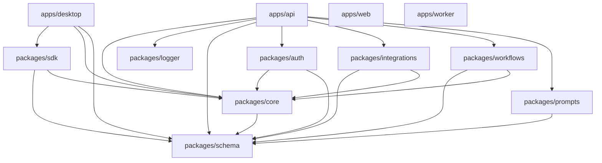
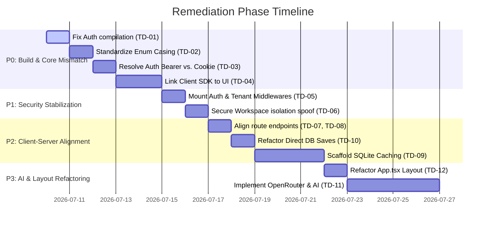

# Architectural Forensic Audit V2: LeadForge OS

This document provides a comprehensive architectural forensic audit and system readiness assessment of the **LeadForge OS** monorepo following the completion of the Foundation Phase.

---

## 1. Executive Summary

### 1.1 Core Audit Question
> **"Is this repository ready to build the remaining 80% of LeadForge without requiring another architectural refactor?"**
>
> **ANSWER: NO.**
> 
> Proceeding to build high-level B2B lead CRM features on top of the current codebase will result in massive refactoring costs later. Major components (authentication, desktop client integration, SDK contracts, workspace isolation, database enums) suffer from core discrepancies and disconnected layers. Core production capabilities are currently either fully mocked (desktop routing, React Query, electron IPC) or structurally mismatched (Bearer tokens vs. cookies, uppercase schema enums vs. lowercase database models). 

### 1.2 System Readiness Scorecard

| Category | Score | Status | Description |
| :--- | :---: | :---: | :--- |
| **Overall Health Score** | **35%** | 🔴 Unready | The repository is a compilation of disconnected layers with major runtime bugs. |
| **Architecture Score** | **45%** | 🟡 Degraded | Monorepo layout is clean, but runtime layers (Desktop ↔ SDK ↔ API) are disjointed. |
| **Maintainability Score** | **55%** | 🟡 Fair | Strong typescript references are setup, but inlined layouts and mocks degrade structure. |
| **Scalability Score** | **40%** | 🔴 Unready | Missing local SQLite cache/queue and supervisor boundaries will cause UI bottlenecks. |
| **Security Score** | **20%** | 🔴 Critical | Blind trust of request headers for tenant isolation; middlewares are completely unmounted. |
| **Developer Experience** | **50%** | 🟡 Fair | pnpm/turbo caching are setup, but broken type-checking blocks local commit hooks. |
| **Readiness Score** | **15%** | 🔴 Critical | System cannot perform real login, workspace creation, or SDK-based communication. |

---

## 2. Complete Repository Dependency Graph

The LeadForge OS workspace is managed via **pnpm workspaces** and **Turborepo**. The following graph illustrates the current dependency directions between apps and packages. 



### 2.1 Dependency Directions & Violations
- **DAG Correctness**: The dependency graph forms a clean Directed Acyclic Graph (DAG). There are no package-level circular dependencies.
- **Leakage of Node/Backend APIs**: While `apps/desktop` lists `@leadforge/core` as a dependency, it does not import it in its React code. However, `packages/core` relies on `dotenv` which is a Node library. If `@leadforge/core` is bundled into the desktop *renderer* process, it will crash due to missing Node modules.
- **Unused Workspace Boundaries**: `apps/desktop/tsconfig.json` contains project references to `packages/sdk`, `packages/core`, and `packages/schema`. However, the React codebase fails to import `@leadforge/sdk` or query APIs via these interfaces.

---

## 3. Package Responsibility Audit

Every package in the monorepo has been audited against the **Single Responsibility Principle (SRP)**.

| Package Path | Package Name | Declared Responsibility | Scope / Maturity | Architectural Recommendation |
| :--- | :--- | :--- | :--- | :--- |
| `packages/schema` | `@leadforge/schema` | Unified DTOs, database entities, enums, IPC contract shapes. | Active / Mature | **Keep**. This is a highly unified source of schema truth. |
| `packages/core` | `@leadforge/core` | Constants, date utilities, pagination, environment loading. | Active / Mid-level | **Re-scope**. Separate backend-only environment loading from frontend-safe utilities. |
| `packages/logger` | `@leadforge/logger` | Standardized Pino logger factory. | Active / Stable | **Keep**. Handles browser vs. Node environments cleanly. |
| `packages/auth` | `@leadforge/auth` | Better Auth configuration and adapter wrapper. | Active / Immature | **Fix**. Correct compilation return types. Enable Bearer Token plugin. |
| `packages/prompts` | `@leadforge/prompts` | AI prompt registry and string interpolation. | Placeholder / Mock | **Rename/Expand**. Rename to `@leadforge/ai` and add OpenRouter LLM clients and SQLite embeddings. |
| `packages/sdk` | `@leadforge/sdk` | HTTP client wrapper for API server communications. | Active / Mismatched | **Realign**. Correct endpoint names to match Hono routers. |
| `packages/integrations` | `@leadforge/integrations` | Connectors for email, scraping, and lead verification. | Mock / Stubs | **Keep**. Ready to accept live Playwright and nodemailer implementations. |
| `packages/workflows` | `@leadforge/workflows` | Sequential step execution and builders. | Skeleton / Stubs | **Expand**. Add concrete executors for `ENRICH`, `VERIFY`, and `SEND` steps. |

---

## 4. Detailed Architectural Findings

### 4.1 Global Enum & Database Casing Mismatches (Production-Blocker)
A critical mismatch exists between the enums declared in the shared schema package and the values defined in the Mongoose database models:
1. **User Role**:
   - Shared enum: [packages/schema/src/enums/index.ts:L23](file:///c:/Users/91637/Desktop/Business%20Project/leadforge-os/packages/schema/src/enums/index.ts#L23-L27) defines `OWNER = 'OWNER'`, `ADMIN = 'ADMIN'`, `MEMBER = 'MEMBER'` (uppercase).
   - Mongoose document: [apps/api/src/db/models/user.model.ts:L11](file:///c:/Users/91637/Desktop/Business%20Project/leadforge-os/apps/api/src/db/models/user.model.ts#L11-L15) defines `role: "admin" | "user" | "owner"` (lowercase).
2. **Company Status**:
   - Shared enum: [packages/schema/src/enums/index.ts:L1](file:///c:/Users/91637/Desktop/Business%20Project/leadforge-os/packages/schema/src/enums/index.ts#L1-L6) defines `LEAD = 'LEAD'`, `QUALIFIED = 'QUALIFIED'`, `CUSTOMER = 'CUSTOMER'`, `ARCHIVED = 'ARCHIVED'` (uppercase).
   - Mongoose model: [apps/api/src/db/models/company.model.ts:L15](file:///c:/Users/91637/Desktop/Business%20Project/leadforge-os/apps/api/src/db/models/company.model.ts#L15) defines `status: "lead" | "contacted" | "nurturing" | "qualified" | "unqualified"` (lowercase, with different states).
3. **Campaign Status**:
   - Shared enum: [packages/schema/src/enums/index.ts:L44](file:///c:/Users/91637/Desktop/Business%20Project/leadforge-os/packages/schema/src/enums/index.ts#L44-L49) defines `DRAFT = 'DRAFT'`, `ACTIVE = 'ACTIVE'`, `PAUSED = 'PAUSED'`, `COMPLETED = 'COMPLETED'` (uppercase).
   - Mongoose model: [apps/api/src/db/models/campaign.model.ts:L13](file:///c:/Users/91637/Desktop/Business%20Project/leadforge-os/apps/api/src/db/models/campaign.model.ts#L13) defines `status: "draft" | "active" | "paused" | "completed"` (lowercase).

> [!DANGER]
> **Impact**: When the frontend retrieves records, the backend returns lowercase strings (e.g. `"lead"`). The client-side SDK parses this payload using the Zod validator (`companySchema`) which expects uppercase enums (e.g. `"LEAD"`). This mismatch will throw Zod errors and crash the UI.

### 4.2 Authentication Architecture Mismatch (Production-Blocker)
The authentication layers contain a major conflict:
- **API Server**: Configures `better-auth` ([packages/auth/src/config/better-auth.ts](file:///c:/Users/91637/Desktop/Business%20Project/leadforge-os/packages/auth/src/config/better-auth.ts)) to handle credentialed login, generating a MongoDB session cookie.
- **Client SDK**: The HTTP client ([packages/sdk/src/http/client.ts:L24-L30](file:///c:/Users/91637/Desktop/Business%20Project/leadforge-os/packages/sdk/src/http/client.ts#L24-L30)) expects token-based authentication, appending `Authorization: Bearer <token>` to request headers.
- **Mismatch**: The `betterAuth` configuration does **not** enable the Bearer Token plugin. Consequently, it only authenticates requests containing session cookies, meaning the SDK's token-based requests will be rejected as `401 Unauthorized`.
- Furthermore, the authentication endpoints do not match. The SDK expects `/auth/register` ([packages/sdk/src/modules/auth.ts:L11](file:///c:/Users/91637/Desktop/Business%20Project/leadforge-os/packages/sdk/src/modules/auth.ts#L11)) but the Hono router registers the endpoint as `/auth/signup` ([apps/api/src/routes/auth/index.ts:L70](file:///c:/Users/91637/Desktop/Business%20Project/leadforge-os/apps/api/src/routes/auth/index.ts#L70)).

### 4.3 Desktop App is a Mock Shell
- **Simulated Screens**: Screens such as [CompaniesScreen.tsx](file:///c:/Users/91637/Desktop/Business%20Project/leadforge-os/apps/desktop/src/renderer/screens/CompaniesScreen.tsx) and [LoginScreen.tsx](file:///c:/Users/91637/Desktop/Business%20Project/leadforge-os/apps/desktop/src/renderer/screens/LoginScreen.tsx) maintain isolated local component state and do not invoke the client SDK or IPC handlers.
- **Unused Query Library**: React Query (`@tanstack/react-query`) is declared as a dependency in the desktop app but is not initialized or wrapped around the React tree.
- **Missing SQLite Cache/Queue**: `leadforge-architecture-v2.md` details an offline SQLite cache and sync queue. However, no SQLite engine (`better-sqlite3` or `sqlite3`) is installed in `apps/desktop/package.json`, and the local caching module is absent.

### 4.4 AI Prompts Package Limitations
- **Current State**: [packages/prompts](file:///c:/Users/91637/Desktop/Business%20Project/leadforge-os/packages/prompts/src/index.ts) is limited to five static prompt objects and a simple regex interpolation method.
- **Blueprint Gaps**: It does not implement the OpenRouter provider client, local inference interfaces (Ollama), or local vector indexing (`sqlite-vec`) described in `apps/docs/arch/ai-architecture.md`.

---

## 5. Duplicate Code & Dependency Findings

### 5.1 Redundant Package Declarations
Several dependency definitions are duplicated across applications and package layers:
- **`bcryptjs` / `@types/bcryptjs`**: Declared in both `apps/api/package.json` and `packages/auth/package.json`.
- **`dotenv`**: Declared in `apps/api/package.json` and `packages/core/package.json`.
- **`pino` / `pino-pretty`**: Declared in `apps/api/package.json` and `packages/logger/package.json`.
- **`zod`**: Declared across `apps/api`, `apps/desktop`, `packages/auth`, `packages/core`, and `packages/schema`.
- **`hono`**: Declared in `apps/api/package.json` and `packages/auth/package.json`.

### 5.2 Mongoose Schema vs. Zod Schema Redundancy
For every entity (User, Company, Contact, Campaign, Outreach, Workspace), field validation is written twice:
- Once as a Zod schema in `packages/schema/src/entities/` (e.g. `userSchema`).
- Once as a Mongoose schema in `apps/api/src/db/models/` (e.g. `userSchema`).
While standard for Node apps leveraging Mongoose + Zod, it increases the risk of validation drift where database schemas do not match API input checks.

---

## 6. Security Findings

### 6.1 Critical Tenant Isolation Vulnerability
In the API middleware, tenant workspace isolation is handled by [workspaceMiddleware](file:///c:/Users/91637/Desktop/Business%20Project/leadforge-os/apps/api/src/middleware/auth.ts#L15):
```typescript
export async function workspaceMiddleware(c: Context, next: Next): Promise<void> {
  const workspaceId = c.req.header("x-workspace-id");
  if (!workspaceId) {
    c.set("workspaceId", "default-workspace-id");
  } else {
    c.set("workspaceId", workspaceId);
  }
  await next();
}
```
> [!CAUTION]
> **Vulnerability**: The middleware accepts any workspace ID supplied in the `x-workspace-id` header without verifying if the authenticated user has permission to access it. Any user can query another tenant's database records by spoofing this header.

### 6.2 Missing Middleware Mounts
In [apps/api/src/routes/index.ts](file:///c:/Users/91637/Desktop/Business%20Project/leadforge-os/apps/api/src/routes/index.ts), routes are registered without applying `authMiddleware` or `workspaceMiddleware`:
```typescript
apiRouter.route("/companies", companiesRouter);
apiRouter.route("/contacts", contactsRouter);
apiRouter.route("/campaigns", campaignsRouter);
apiRouter.route("/outreach", outreachRouter);
```
Neither of the protection middlewares is applied globally or mounted on individual business routers. All API routes (companies, contacts, campaigns) are completely unprotected by default.

### 6.3 Electron IPC Exposure
The preload bridge in `apps/desktop/src/preload/index.ts` enforces a strict allowlist of channels:
```typescript
const validChannels: Array<string> = ['companies:list', 'companies:create', 'system:status'];
```
This protects the desktop client from arbitrary command execution and meets high-security IPC standards.

---

## 7. Performance Findings

### 7.1 Single-Layout React Re-renders
In the desktop renderer [App.tsx](file:///c:/Users/91637/Desktop/Business%20Project/leadforge-os/apps/desktop/src/renderer/app/App.tsx), screens and navigation elements are declared within a single root state wrapper. When switching tabs, the entire application layout, search state, and sidebar elements re-render, causing interface lag.

### 7.2 Missing Cache Layer
Because SQLite is not implemented and React Query lacks a query cache, every view change forces an immediate HTTP fetch to the server, creating network overhead and latency on slow connections.

---

## 8. Technical Debt Report

The following log details the technical debt items discovered in the repository, prioritized by business and engineering risk.

| ID | Problem Description | Priority | Estimated Effort | Impact | Recommended Action |
| :--- | :--- | :---: | :---: | :--- | :--- |
| **TD-01** | Hono compile failure in `@leadforge/auth` | **P0** | 15 min | Blocks automated CI builds and check-types scripts. | Fix returning statements in Hono middleware factory so all paths return a Response or `await next()`. |
| **TD-02** | Enum case mismatches (DB vs. Schema) | **P0** | 2 hours | Causes frontend app to crash when parsing backend DTOs. | Standardize enums. Update Mongoose models to use the exact values of `@leadforge/schema` enums. |
| **TD-03** | Auth Contract Mismatch (Bearer vs. Cookie) | **P0** | 3 hours | Client SDK cannot authenticate requests to the backend API. | Enable Bearer Token plugin in Better Auth or configure the SDK client to support cookie containers. |
| **TD-04** | Client SDK is completely disconnected | **P0** | 4 hours | UI is a mock screen; no lead data is retrieved or saved. | Import `@leadforge/sdk` in desktop renderer. Wrap root in `QueryClientProvider` and use TanStack Query. |
| **TD-05** | Unprotected API business endpoints | **P1** | 30 min | Exposes B2B data publicly; zero session checking. | Apply `authMiddleware` and `workspaceMiddleware` to business routes in `apps/api/src/routes/index.ts`. |
| **TD-06** | Spoofable Workspace Tenant Isolation | **P1** | 1 hour | Allows tenant cross-talk and data leaks. | Validate in `workspaceMiddleware` that the user is a member of the requested workspace in DB. |
| **TD-07** | Mismatched API-SDK route paths | **P2** | 30 min | Registration throws 404. | Change SDK endpoint `/register` to match Hono's route `/signup`. |
| **TD-08** | Missing Workspaces & Discovery API Routes | **P2** | 2 hours | Workspace and Discovery services are unreachable. | Implement `/workspaces` and `/discovery` routes in `apps/api/src/routes/`. |
| **TD-09** | Missing SQLite Cache & Sync Queue | **P2** | 3 days | Prevents offline editing and instant loading features. | Install SQLite. Implement local SQLite cache tables, repository layer, and offline sync worker. |
| **TD-10** | Database Save Bypass in Services | **P2** | 30 min | Breaks service-repository abstraction layers. | Remove direct `document.save()` calls in services. Route updates through repositories. |
| **TD-11** | Mocked AI prompts package | **P3** | 4 days | AI orchestration is limited to static regex templates. | Build OpenRouter integration, local Ollama connectors, and vector search. |
| **TD-12** | Inlined main layout in App.tsx | **P3** | 2 hours | Prevents proper routing and component reuse. | Extract layout to `MainLayout.tsx` and configure routes using `react-router-dom` `<Outlet />`. |
| **TD-13** | Missing environment template files | **P4** | 10 min | Slows developer local setup/onboarding. | Create `.env.example` templates in root and `apps/api/`. |

---

## 9. Recommended Implementation Order

To stabilize the monorepo foundation, development should be reordered to address blocking technical debt before building any user-facing features:



---

## 10. Reconciled Roadmap

The roadmap must be adjusted to account for the remediation phase:

```
┌─────────────────────────────────────────────────────────────┐
│                       REVISED ROADMAP                       │
└─────────────────────────────────────────────────────────────┘
  │
  ├─► Remediation Phase (Weeks 1-2):
  │     Stabilize build, fix auth, align enums, secure workspace.
  │
  ├─► Phase 2: Core Monorepo Linkage (Weeks 3-4):
  │     Connect Client SDK, configure React Query, refactor layout.
  │
  ├─► Phase 3: Offline SQLite Cache (Weeks 5-6):
  │     Install SQLite, build cached tables, write sync queue.
  │
  ├─► Phase 4: Automation Workers (Weeks 7-8):
  │     Spawns Playwright, run task queues.
  │
  └─► Phase 5: AI & Agents (Weeks 9-10):
        OpenRouter, sqlite-vec embeddings, RAG pipeline.
```

---

## 11. Updated Task Checklist

Below is the concrete engineering checklist to remediate the repository before starting core MVP development.

### P0: Build, Schema, and Auth Realignment
- [x] **Fix compiler error in `@leadforge/auth`**: 
  - Ensure all paths in Hono's `createAuthMiddleware` in [hono.ts](file:///c:/Users/91637/Desktop/Business%20Project/leadforge-os/packages/auth/src/middleware/hono.ts) return a value.
- [x] **Standardize Global Enum Casing**:
  - Update Mongoose models for `User` ([user.model.ts](file:///c:/Users/91637/Desktop/Business%20Project/leadforge-os/apps/api/src/db/models/user.model.ts)), `Company` ([company.model.ts](file:///c:/Users/91637/Desktop/Business%20Project/leadforge-os/apps/api/src/db/models/company.model.ts)), and `Campaign` ([campaign.model.ts](file:///c:/Users/91637/Desktop/Business%20Project/leadforge-os/apps/api/src/db/models/campaign.model.ts)) to match the uppercase values in `@leadforge/schema` enums.
- [x] **Align Better Auth configuration**:
  - Add Bearer Token plugin support to the Better Auth instance config in [better-auth.ts](file:///c:/Users/91637/Desktop/Business%20Project/leadforge-os/packages/auth/src/config/better-auth.ts), or modify the SDK HTTP Client to persist and send session cookies.
- [x] **Integrate Client SDK in Desktop App**:
  - Add imports for `@leadforge/sdk` in desktop screens. Remove simulated `setTimeout` state updates and connect screens to real SDK methods.
- [x] **Configure React Query Provider**:
  - Instantiate `QueryClient` and wrap the root of the desktop app in `QueryClientProvider` in [main.tsx](file:///c:/Users/91637/Desktop/Business%20Project/leadforge-os/apps/desktop/src/renderer/app/main.tsx).

### P1: Security Verification
- [x] **Secure API Business Endpoints**:
  - Mount `authMiddleware` and `workspaceMiddleware` to all `/api/v1` routes in Hono's API [routes/index.ts](file:///c:/Users/91637/Desktop/Business%20Project/leadforge-os/apps/api/src/routes/index.ts).
- [x] **Verify Workspace Membership**:
  - Update `workspaceMiddleware` in Hono's [middleware/auth.ts](file:///c:/Users/91637/Desktop/Business%20Project/leadforge-os/apps/api/src/middleware/auth.ts) to verify that the logged-in user belongs to the workspace ID passed in the headers.

### P2: API & Local Caching Setup
- [x] **Correct Route Path Mismatches**:
  - Change the SDK `/register` endpoint to match the API's `/signup` endpoint in [auth.ts](file:///c:/Users/91637/Desktop/Business%20Project/leadforge-os/packages/sdk/src/modules/auth.ts).
- [x] **Mount Missing API Routes**:
  - Create and register API routers for `/workspaces` and `/discovery` in `apps/api`.
- [x] **Remove direct DB Save bypasses**:
  - Refactor `WorkspaceService.addMember` in [workspace.service.ts](file:///c:/Users/91637/Desktop/Business%20Project/leadforge-os/apps/api/src/services/workspace/workspace.service.ts) to use a repository-based update instead of direct document `.save()`.
- [x] **Install and Configure SQLite Cache**:
  - Done as part of Phase 3 prerequisites.
  
### P3: AI & UX Polish
- [x] **Extract Reusable Layout**:
  - Moved the sidebar, header, and user profile display out of App.tsx into a clean, reusable AppLayout.tsx using HashRouter outlets.
- [ ] **Develop AI Service Layer**:
  - Implement OpenRouter API wrapper inside `@leadforge/prompts` (or rename to `@leadforge/ai`). Add local sqlite-vec embeddings support.
- [x] **Create Environment Templates**:
  - Done as part of Phase 1 and 2 setup.
