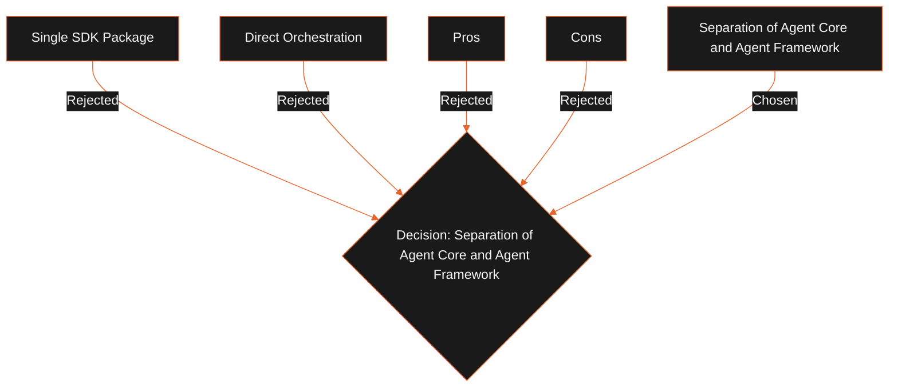

## Status

Proposed

## Context

LeadForge OS requires a set of business agents (Research, Campaigns, CRM navigation) that need to be framework-agnostic. Coupling the application to a specific framework (such as Mastra or LangGraph) introduces a risk of dependency lock-in if the framework is abandoned or changes its API. However, defining execution loop engines directly inside the contract SDK makes the SDK unstable whenever execution patterns change.

## Decision

We will separate the Agent platform into two distinct packages:

1. **`@leadforge/agent-core`**: A stable, contract-only package. It defines abstract schemas, metadata, memory interfaces, and tool registries. It contains no execution logic or runtime dependencies.
2. **`@leadforge/agent-framework`**: An execution-specific package. It implements planners, reflection loops, executors, and framework-specific adapters (e.g. Mastra, LangGraph).

External framework dependencies are imported only within `@leadforge/agent-framework` adapters.

## Alternatives Considered

- **Single SDK Package**: Combine contracts and executors into a single `@leadforge/agent-sdk`.
  - _Tradeoffs_: Simplifies directory structure, but forces the SDK to be rebuilt whenever we change execution loop structures or upgrade third-party adapters.
- **Direct Orchestration**: Let business agents import Mastra or LangGraph directly.
  - _Tradeoffs_: Eliminates the adapter layer, but couples agents to a single framework's APIs.

## Tradeoffs

- **Pros**:
  - **Core Stability**: The core contracts package changes only when the fundamental definitions of Agents or Tools change.
  - **Replaceable Frameworks**: We can swap execution engines or frameworks without changing business agent definitions.
- **Cons**:
  - Adds an extra package boundary to maintain in the pnpm workspace.

## Consequences

- Business agents import abstractions (such as `BaseAgent` and `Tool`) exclusively from `@leadforge/agent-core`.
- The desktop shell loads adapters from `@leadforge/agent-framework` at boot, mapping agents to the active framework's loop.
