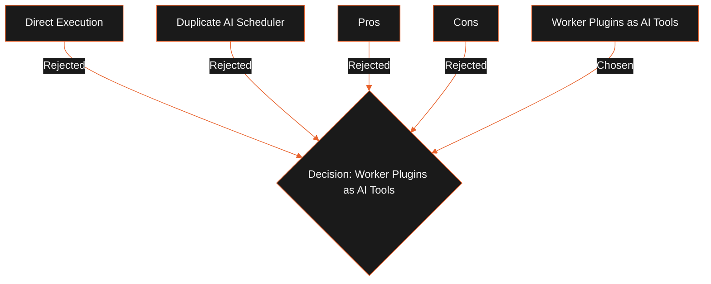

## Status

Proposed

## Context

LeadForge OS has a robust background execution engine. Spawning heavy Puppeteer or Cheerio tasks directly inside the agent's main thread would block the main process, saturate the CPU, and bypass scheduling constraints. We need a way to expose these tasks to the AI agent as tools while keeping them isolated.

## Decision

We will wrap the existing worker plugins (such as Maps Scraper, Crawler, LinkedIn Enricher, and SMTP outreach) as AI Tools:

1. **Asynchronous Dispatch**: The tool's `execute` method submits a job to the `JobScheduler`.
2. **Result Polling**: The tool polls the database or listens to the scheduler's completion events.
3. **Execution Isolation**: The actual work runs in a sandboxed child process, keeping the agent process light.

No duplicate scheduling, heartbeat, retry, or recovery code will be written.

## Alternatives Considered

- **Direct Execution**: Run Playwright and Cheerio directly within the agent's thread.
  - _Tradeoffs_: Simplifies execution flow, but blocks the main Electron UI, increases memory usage, and bypasses concurrency limits.
- **Duplicate AI Scheduler**: Create a separate scheduler specifically for AI agent tasks.
  - _Tradeoffs_: Unnecessary complexity and increases the risk of database write locks.

## Tradeoffs

- **Pros**:
  - **Process Stability**: Sandboxing heavy tasks protects the main desktop shell.
  - **Feature Reuse**: Leverages heartbeats, retries, checkpointing, and recovery out of the box.
  - **Queue Limits**: Agent-driven tasks respect workspace CPU limits.
- **Cons**:
  - Adds small database polling latency to tool executions.

## Consequences

- The Agent Platform does not spawn child processes directly. It interacts only with the `JobScheduler`.
- Heavy worker tasks must return unified JSON result payloads to be consumed by the agent.
