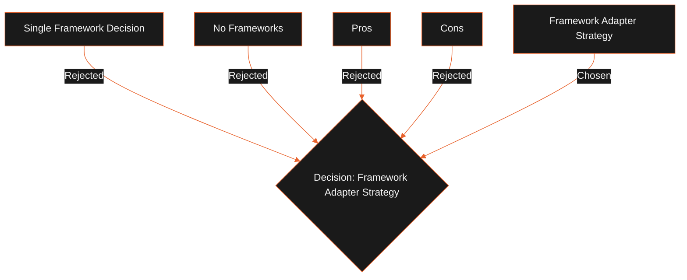

## Status

Proposed

## Context

The Javascript agent ecosystem is changing rapidly. Frameworks like Mastra, LangGraph, and OpenAI Agents SDK are evolving fast. Bypassing them entirely means we have to write planning and orchestration logic from scratch. Coupling directly to one framework means we inherit its security issues, performance limitations, and potential deprecation.

## Decision

We will implement a Framework Adapter Layer in `@leadforge/agent-sdk`:

1. **Abstract Definitions**: Business agents and tools are defined using standard interfaces.
2. **Framework Translation**: The adapter wraps these definitions in the target framework's format (e.g. converting `Tool` to Mastra's tool schema).
3. **Capability Mapping**: The adapter exposes a capabilities matrix (`supportsMCP`, `supportsPlanning`, etc.).
4. **Fallback Handling**: If a framework lacks native support for a capability (such as offline checkpointing), the adapter must implement a local fallback.

External frameworks are treated as replaceable implementation details.

## Alternatives Considered

- **Single Framework Decision**: Build all agents directly on LangGraph.
  - _Tradeoffs_: Hard to swap to lighter runtimes (like Mastra or Hermes) if execution requirements change.
- **No Frameworks**: Write all planning, state management, and memory code from scratch.
  - _Tradeoffs_: Eliminates external dependencies, but increases development and maintenance cost.

## Tradeoffs

- **Pros**:
  - **Replaceability**: We can migrate to new agent frameworks with zero changes to business agents.
  - **Unified Interfaces**: The application interacts with a single, consistent agent API.
- **Cons**:
  - Adds translation mapping code for each supported framework.

## Consequences

- External frameworks (Mastra, LangGraph) are imported _only_ inside their respective adapter files.
- Changing the orchestration framework is a configuration change in settings.
