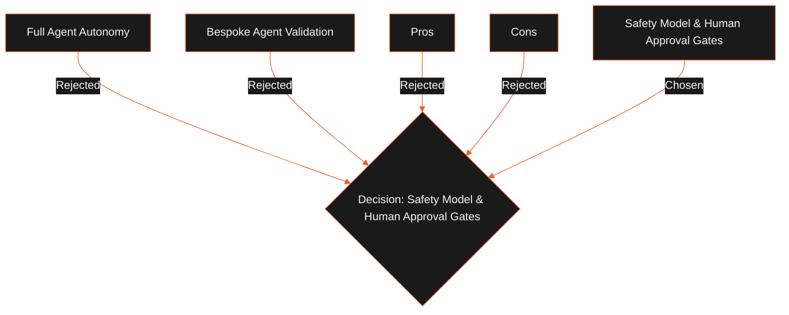

## Status

Proposed

## Context

Outbound campaigns involve high-risk actions (sending emails, scraping directories, automating browser sessions). Giving an AI agent full autonomy to execute these actions could lead to IP blacklisting, cookie invalidation, or spam compliance issues. We need a safety model that enforces human approval gates and permission checks without degrading the user experience.

## Decision

We will implement a role-based tool permission model and manual approval gates:

1. **Risk Classification**: Tools are classified as Low Risk (read-only), Medium Risk (CRM updates), or High Risk (email sending, LinkedIn actions, workflow changes).
2. **Approval Gates**: High-risk tools write an approval request to the local `approvals` database table and pause the running scheduler job.
3. **IPC Notifications**: The scheduler sends an IPC event (`agent:approval:required`) to the desktop renderer, prompting the user to approve the action.
4. **Resumed Execution**: The scheduler resumes execution only after the user approves the action.

Safety gates are enforced at the platform level.

## Alternatives Considered

- **Full Agent Autonomy**: Let the agent run with zero human gates.
  - _Tradeoffs_: Maximizes execution speed, but increases the risk of spam policy violations, IP blocks, or corrupted database states.
- **Bespoke Agent Validation**: Let each agent implement its own safety checks.
  - _Tradeoffs_: High risk of agents bypassing checks due to prompt injection or coding errors.

## Tradeoffs

- **Pros**:
  - **User Control**: Users can review drafts and emails before dispatch.
  - **Security**: Enforcing gates at the platform level prevents agents from bypassing checks.
- **Cons**:
  - Adds database state and IPC messaging overhead to high-risk tool runs.

## Consequences

- High-risk tools cannot run in a headless environment without user intervention.
- The local database remains the single source of truth for agent approvals.
