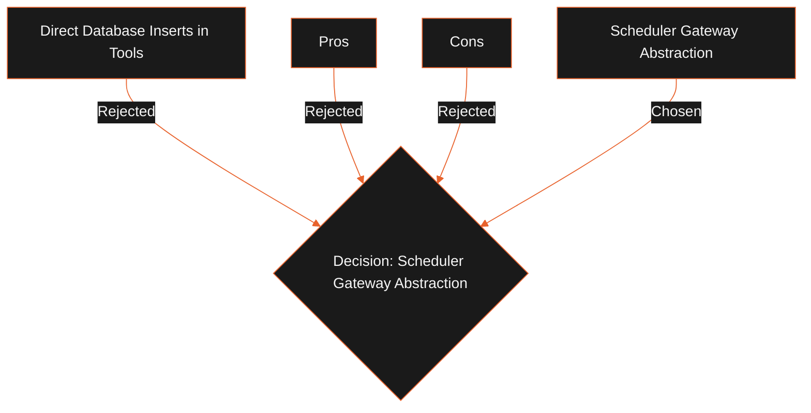

## Status

Proposed

## Context

In the initial foundation design, `SchedulerToolAdapter` wrote directly to the SQLite `jobs` table to submit tasks to the worker pipeline. This introduces a tight coupling between individual tool implementations and the physical SQLite schema of the jobs queue. If the database schema changes, or if we change the scheduler execution backbone, every tool adapter must be rewritten.

## Decision

We will replace direct tool database inserts with a new application service called the `SchedulerGateway` (or `JobSubmissionService`). Tools must call this service to submit background worker tasks. The gateway handles parameter validation, database writes, and EventBus listener subscriptions.

Tools are strictly forbidden from writing SQL commands or querying the `jobs` table directly.

## Alternatives Considered

- **Direct Database Inserts in Tools**: Simple to implement, but creates massive technical debt and couples packages to a specific database technology.

## Tradeoffs

- **Pros**:
  - **Loose Coupling**: Decouples the Agent Platform from SQLite queue details.
  - **Unified Validation**: Validates payloads at the gateway boundary.
  - **Single Source of Truth**: Consolidates queue operations in a single class.
- **Cons**:
  - Adds an additional abstraction layer between the tool execution call and the scheduler.

## Consequences

- We implement `SchedulerGateway` in the desktop main process.
- Tool classes receive this gateway in their constructor and dispatch tasks through it.
