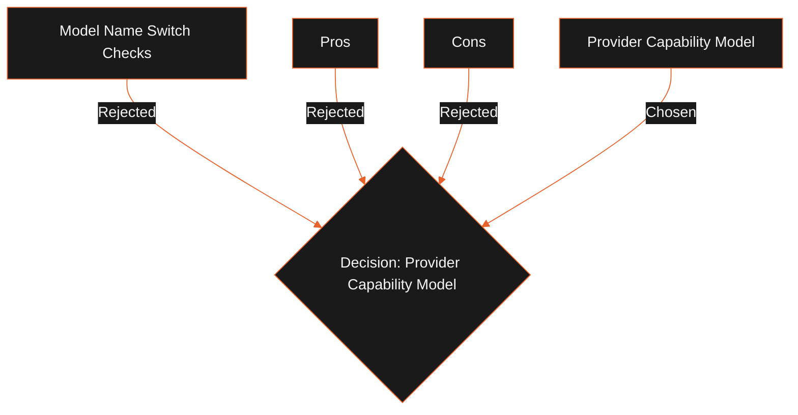

## Status

Proposed

## Context

LeadForge routes requests across local models (Ollama) and cloud APIs (OpenRouter, OpenAI, Anthropic, Gemini). Hardcoding assumptions about which provider supports vision, streaming, context caching, tool calling, or structured JSON outputs leads to messy conditionals and breaks when models are updated.

## Decision

We will implement a `ProviderCapabilities` model schema. The AI Runtime resolves capabilities dynamically from the active provider configuration at startup.

All routing decisions, prompt decorators, fallback parameters, and tool bindings evaluate these capability flags rather than checking hardcoded provider or model name strings.

## Alternatives Considered

- **Model Name Switch Checks**: Checking string names (e.g. `model === 'gpt-4o'`).
  - _Tradeoffs_: Hard to maintain, requires code updates when new models are released.

## Tradeoffs

- **Pros**:
  - **Scalable Fallbacks**: Graceful fallback routing to local models when cloud keys fail.
  - **Clean Core**: Business logic queries feature flags, keeping provider wrappers decoupled.
- **Cons**:
  - Requires maintaining a capability matrix for local models.

## Consequences

- We define the `ProviderCapabilities` schema in `@leadforge/agent-core`.
- AI Runtime resolves these capabilities at startup.
