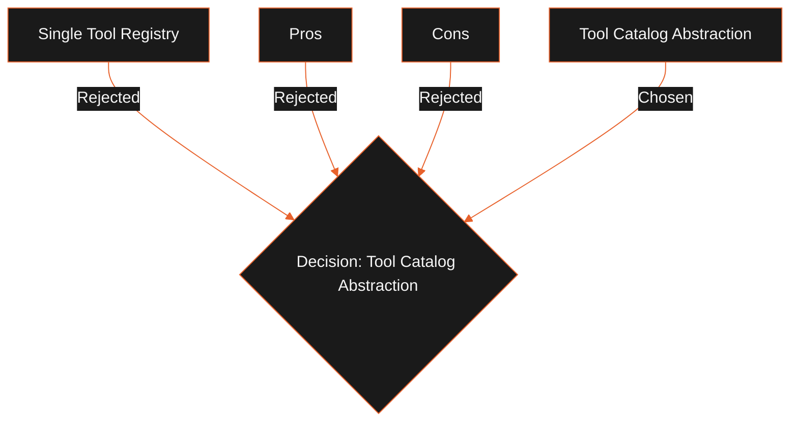

## Status

Proposed

## Context

Agents and planning loops need to reason about available tools (identities, capabilities, risk levels, and descriptions) to construct execution plans. However, loading the concrete tool execution classes (`ToolRegistry`) requires initializing database connections, scheduler bridges, and other infrastructure, which is expensive and often impossible in web or serverless contexts.

## Decision

We decouple tool discovery from tool execution:

1. **`ToolCatalog`**: Exposes static discovery metadata for all available capabilities. Planners and agents query the catalog to build plans. The catalog is a metadata-only manifest with zero dependencies.
2. **`ToolRegistry`**: Exposes concrete tool instances. Resolves catalog identities to execution callbacks at runtime.

Planners interact exclusively with `ToolCatalog` metadata.

## Alternatives Considered

- **Single Tool Registry**: Combining metadata and execution.
  - _Tradeoffs_: Forces the import of local main process files or drivers into the planning environment, breaking web and serverless planning boundaries.

## Tradeoffs

- **Pros**:
  - **Zero Dependency Planning**: Planning engines can run on web browsers or cloud functions.
  - **Lazy Resolution**: Concrete tools are initialized only when selected.
- **Cons**:
  - Requires maintaining a catalog manifest matching runtime registry names.

## Consequences

- We define `ToolCatalog` interfaces in `@leadforge/agent-core`.
