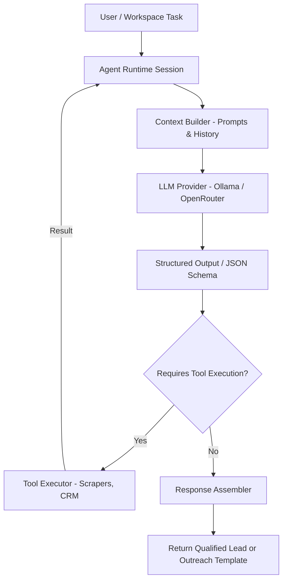

# AI Agents & Runtimes

This document covers the AI agent system, the runtime execution flow, and specific built-in agent personalities in LeadForge OS.

---

## 🤖 Agent Architecture

Agents represent high-level reasoning loops that orchestrate tools to accomplish structured goals. The agent framework is split between `@leadforge/agent-core` (definitions, tracing, memory) and `@leadforge/agent-runtime` (sessions, execution, context builders).

### 1. Context Builder (`context-builder.ts`)
Assembles variables, active companies profiles, and raw crawl outputs into prompt templates. It ensures context windows are managed efficiently by truncating long raw website HTML trees.

### 2. Tool Executor (`tool-executor.ts`)
Converts tool calls returned by the LLM into concrete background jobs or database mutations.

### 3. Response Assembler (`response-assembler.ts`)
Parses and validates the final agent outputs against Zod schemas, returning a normalized payload to the calling process.

---

## 🔍 Built-In Agents

LeadForge OS ships with two specialized pre-configured agents:

### 1. Research Agent (`research-agent.ts`)
- **Objective**: Discover, verify, and qualify business listings.
- **System Prompt**: Enforces finding decision makers, analyzing target website quality, and scoring fits.
- **Available Tools**:
  - `search_local_businesses` (Playwright Maps Scraper)
  - `crawl_company_website` (Cheerio BFS Crawler)
  - `search_linkedin_profiles` (Voyager LinkedIn API)
- **Output Schema**: Returns structured company details, seniority profiles, and contact verification targets.

### 2. Campaign Assistant
- **Objective**: Automate personalized email outreach.
- **System Prompt**: Enforces context-aware template writing based on company value propositions and opportunity scoring.
- **Available Tools**:
  - `send_outreach_email` (SMTP Nodemailer client)
  - `poll_inbox_replies` (IMAP reply tracking engine)
- **Output Schema**: Compiles dynamic email subject and body variables, mapping follow-up steps.
