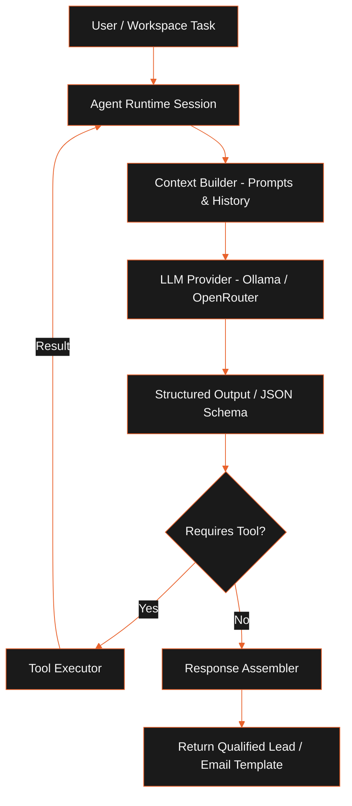

The AI agent runtime manages structured LLM reasoning loops. It dynamically coordinates local and cloud providers with system tools to qualify prospects, research companies, and orchestrate cold email workflows.

## Agent Architecture

The diagram below outlines the reasoning cycle and tool dispatch path of an active agent session:

### Context Builder

The context builder (`context-builder.ts`) compiles prompts by merging user templates, company profiles, and scrapers' raw text. It limits context window overflow by truncating long web-page inputs and HTML trees before tokens are sent to the provider.

### Tool Executor

The tool executor (`tool-executor.ts`) maps LLM-requested tool parameters into execution commands, triggering system crawlers or updating database rows.

### Response Assembler

The response assembler (`response-assembler.ts`) parses the output payload of the LLM against target Zod validation schemas. This ensures the UI receives valid data formats.

## Built-In Agents

LeadForge OS provides two specialized agent implementations:

### Research Agent

- **Objective**: Discover and qualify local business prospects.
- **System Prompt**: Enforces search criteria, evaluates company website indicators, and calculates opportunity scores.
- **Integrated Tools**: `search_local_businesses`, `crawl_company_website`, and `search_linkedin_profiles`.
- **Output Schema**: Returns structured company profiles, key personnel titles, and contact targets.

### Campaign Assistant

- **Objective**: Compose and schedule email sequences.
- **System Prompt**: Generates outreach templates customized with company insights and value propositions.
- **Integrated Tools**: `send_outreach_email` and `poll_inbox_replies`.
- **Output Schema**: Returns dynamic outreach draft templates and campaign scheduling timelines.

## Constraints and Trade-Offs

- **No Autonomous Loops**: Agents do not run without supervision. Every execution requires scheduler dispatch to prevent runaway token costs.
- **Resource Dependency**: Running local models (like Llama via Ollama) requires sufficient GPU memory (VRAM). Low VRAM configurations degrade crawler performance.

## Related

- [System Architecture](../architecture/system-overview.mdx)
- [Workflow Engine](../workflows/workflow-engine.mdx)
- [Setup & Installation](../getting-started/installation.mdx)
