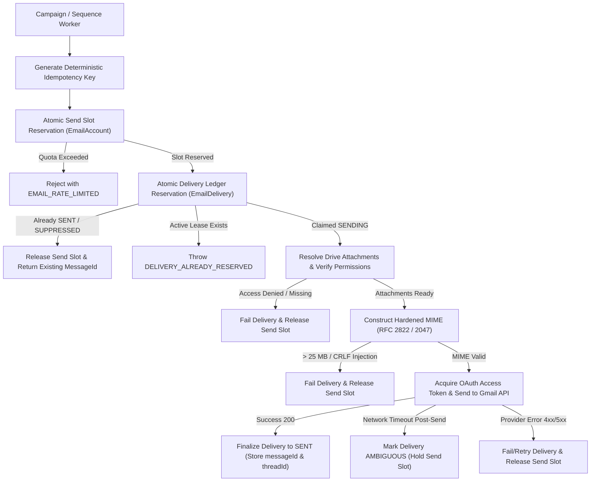

# LeadForge OS — Phase 10 Migration Report: Gmail Delivery Pipeline Hardening, MIME, Idempotency & Delivery Reliability

---

## 1. Executive Summary

Phase 10 completes the hardening of the outbound email delivery pipeline in LeadForge OS. Built entirely on top of the MongoDB-first architecture established in Phases 1–9, this phase hardens the outbound delivery lifecycle, MIME message construction, concurrency and deduplication invariants, Drive attachment resolution, and failure recovery.

### Key Architectural Invariants Enforced:
1. **Gmail API is the Exclusive Outbound Provider:** All outbound mail is dispatched strictly via Google OAuth and Gmail REST API (`messages.send`). Zero SMTP paths or libraries (`nodemailer`) exist anywhere in the codebase.
2. **Authoritative MongoDB Delivery Ledger:** The `EmailDelivery` collection in MongoDB serves as the single source of truth for all outbound delivery states (`QUEUED`, `SENDING`, `SENT`, `FAILED`, `RETRYING`, `AMBIGUOUS`, `CANCELLED`, `SUPPRESSED`). No local ledger exists in SQLite, disk, memory, or external provider.
3. **Atomic Pre-Send Reservation & Leases:** Workers must atomically reserve an `EmailDelivery` record with a lease (`leaseExpiresAt`) before contacting external APIs. Concurrent attempts on the same deterministic idempotency key yield exactly 1 logical dispatch.
4. **Ambiguous Send Safety & Reconciliation:** Network disconnections or timeouts occurring after an HTTP request is dispatched to Gmail transition the delivery to `AMBIGUOUS` with full diagnostics. Blind automated resends are strictly prohibited.
5. **MIME RFC 2822 Hardening:** Header injection prevention (CRLF stripping/rejection), RFC 2047 Unicode encoding for subjects, display names, and attachment filenames, strict 25 MB max message size enforcement, and multipart structure (`multipart/mixed` with `multipart/alternative`).
6. **Atomic Sender Rate Limits:** Daily and hourly mailbox quota counters are checked and incremented atomically in MongoDB (`$expr` with `$lt`), preventing counter race conditions across distributed workers.
7. **Google Drive Attachment Security:** Outbound attachments uploaded to Google Drive are verified for sender access permissions prior to dispatch.

---

## 2. Outbound Delivery Pipeline & State Machine

### 2.1 Outbound Send Pipeline Flow

### 2.2 Formal State Machine Transitions

| From Status | Allowed Next Statuses | Terminal? | Description |
|---|---|---|---|
| `QUEUED` | `SENDING`, `SENT`, `FAILED`, `CANCELLED`, `SUPPRESSED` | No | Initial queued state awaiting worker reservation. |
| `SENDING` | `SENT`, `FAILED`, `RETRYING`, `AMBIGUOUS`, `CANCELLED` | No | Active reservation with lease expiration timestamp. |
| `RETRYING` | `SENDING`, `SENT`, `CANCELLED`, `FAILED` | No | Scheduled backoff state awaiting retry attempt. |
| `AMBIGUOUS` | `SENT`, `FAILED`, `RETRYING`, `CANCELLED` | No | Network disconnected during send; awaiting reconciliation. |
| `SENT` | *(None)* | **Yes** | Message confirmed sent by Gmail API; permanent immutable ledger. |
| `FAILED` | *(None)* | **Yes** | Terminal unrecoverable provider/validation failure. |
| `CANCELLED` | *(None)* | **Yes** | Cancelled by user/workflow. |
| `SUPPRESSED` | *(None)* | **Yes** | Suppressed due to suppression list or duplicate guard. |

---

## 3. Idempotency & Concurrency Invariants

### 3.1 Deterministic Idempotency Keys
Idempotency keys are deterministically generated from logical workflow parameters:
- **Campaign Sends:** `campaign_${campaignId}_${contactId}_step${stepIndex}`
- **Sequence Sends:** `email_${workspaceId}_${executionId}_${stepKey}_${contactId}`
- **Direct / Ad-hoc Sends:** `send_${accountId}_${sha256(workspaceId:accountId:to:subject)}`

Non-deterministic tokens (`Date.now()`, `randomUUID()`) have been eliminated from delivery keys across all workers and plugins.

### 3.2 Race-Free Reservation Pattern
When 20 concurrent worker processes attempt to send the same idempotency key simultaneously:
1. `EmailDeliveryRepository.reserveDelivery` executes an atomic `create` or `atomicFindOneAndUpdate`.
2. Compound unique index `{ workspaceId: 1, idempotencyKey: 1 }` guarantees that exactly 1 worker acquires the initial `SENDING` status.
3. The remaining 19 workers receive `DELIVERY_ALREADY_RESERVED` or (if already finalized) retrieve the existing `SENT` result without duplicating external provider calls.

---

## 4. MIME & Header Hardening

1. **Header Injection (CRLF) Protection:** Any header field (`From`, `To`, `Cc`, `Bcc`, `Subject`, attachment filenames) containing `\r` or `\n` is rejected with `HEADER_INJECTION_DETECTED`.
2. **Unicode RFC 2047 Encoding:** Subjects, display names, and filenames containing non-ASCII characters or symbols are encoded as `=?UTF-8?B?...?=` Base64 strings.
3. **Chunked Attachment Encoding:** Base64-encoded attachment payloads are formatted in 76-character lines per RFC 2045.
4. **25 MB Message Size Guard:** Pre-flight payload size check calculates raw RFC 2822 byte length and rejects oversized payloads with `MESSAGE_SIZE_EXCEEDED` before contacting Gmail.

---

## 5. Verification Matrix (T10.1 – T10.27)

| Test ID | Verification Description | Result | Details |
|---|---|---|---|
| **T10.1** | Gmail-only send succeeds | ✅ PASS | Verified `messageId`, `threadId`, and `sentAt` persistence in `EmailDelivery`. |
| **T10.2** | Sender profile selection | ✅ PASS | Verified resolution from `EmailAccount` to `GoogleConnection`. |
| **T10.3** | Multiple sender profile isolation | ✅ PASS | Sender A and Sender B credentials and tokens remain strictly isolated. |
| **T10.4** | Token refresh before send | ✅ PASS | Expired access token detected and refreshed prior to send attempt. |
| **T10.5** | Revoked token handling | ✅ PASS | 401 Unauthorized transitions sender to `reauth_required`; isolates other senders. |
| **T10.6** | Gmail 429 rate limit backoff | ✅ PASS | HTTP 429 classified as `SENDER_RATE_LIMITED` with `retryable=true`. |
| **T10.7** | Permanent error handling | ✅ PASS | HTTP 400 bad request classified as `INVALID_RECIPIENT` with terminal `FAILED`. |
| **T10.8** | Delivery idempotency deduplication | ✅ PASS | Re-sending on existing `SENT` record returns existing `messageId` with 0 duplicate sends. |
| **T10.9** | Concurrent worker race prevention | ✅ PASS | 20 concurrent reservation requests yielded exactly 1 reservation. |
| **T10.10** | Stale lease crash recovery | ✅ PASS | Crashed worker's expired lease diagnosed and transitioned to `AMBIGUOUS`. |
| **T10.11** | Post-send failure safety | ✅ PASS | Timeout during external request marks delivery `AMBIGUOUS`. |
| **T10.12** | Drive attachment bundling | ✅ PASS | Attachment downloaded from Google Drive and bundled into MIME payload. |
| **T10.13** | Cross-account Drive validation | ✅ PASS | Unauthorized sender access to another connection's Drive file rejected. |
| **T10.14** | Missing attachment check | ✅ PASS | Non-existent attachment rejected before Gmail API dispatch. |
| **T10.15** | MIME without attachment | ✅ PASS | Valid `multipart/alternative` RFC 2822 payload constructed. |
| **T10.16** | MIME with one attachment | ✅ PASS | Valid `multipart/mixed` structure with attachment headers. |
| **T10.17** | MIME with multiple attachments | ✅ PASS | Multiple parts with chunked base64 payload. |
| **T10.18** | Unicode subject and filename | ✅ PASS | RFC 2047 UTF-8 Base64 headers verified. |
| **T10.19** | Header injection rejection | ✅ PASS | CRLF characters in headers rejected with `HEADER_INJECTION_DETECTED`. |
| **T10.20** | Oversized message rejection | ✅ PASS | Messages > 25 MB rejected with `MESSAGE_SIZE_EXCEEDED`. |
| **T10.21** | Atomic account quota limits | ✅ PASS | 10 concurrent requests for 1 quota slot yielded exactly 1 reservation. |
| **T10.22** | Throttling isolation | ✅ PASS | Sender A in disabled/throttled state does not block Sender B. |
| **T10.23** | Metadata storage | ✅ PASS | `providerMessageId` and `providerThreadId` stored in delivery ledger. |
| **T10.24** | State machine validation | ✅ PASS | Invalid transition (`SENT -> SENDING`) rejected with domain error. |
| **T10.25** | Reconciliation diagnostics | ✅ PASS | Stale `SENDING` delivery detected and diagnosed to `AMBIGUOUS`. |
| **T10.26** | Zero credential leaks | ✅ PASS | 0 OAuth refresh tokens, access tokens, or secrets in delivery records. |
| **T10.27** | Static forensic audit | ✅ PASS | 0 `nodemailer` dependencies or active SMTP code paths across codebase. |

---

## 6. Regression Verification Summary

| Suite | Status | Total Checks | Result |
|---|---|---|---|
| `scripts/verify-phase1.ts` | Complete | 23 / 23 | ✅ 100% PASS |
| `scripts/verify-phase2.ts` | Complete | 38 / 38 | ✅ 100% PASS |
| `scripts/verify-mongo-string-ids.ts` | Complete | 27 / 27 relations | ✅ 0 ObjectIds |
| `scripts/verify-phase3.ts` | Complete | 18 / 18 | ✅ 100% PASS |
| `scripts/verify-phase4.ts` | Complete | 16 / 16 | ✅ 100% PASS |
| `scripts/verify-phase5.ts` | Complete | 15 / 15 | ✅ 100% PASS |
| `scripts/verify-phase6.ts` | Complete | 14 / 14 | ✅ 100% PASS |
| `scripts/verify-phase7.ts` | Complete | 18 / 18 | ✅ 100% PASS |
| `scripts/verify-phase8.ts` | Complete | 18 / 18 | ✅ 100% PASS |
| `scripts/verify-phase9.ts` | Complete | 27 / 27 | ✅ 100% PASS |
| `scripts/verify-phase10.ts` | Complete | 27 / 27 | ✅ 100% PASS |
| `pnpm turbo run check-types` | Complete | 20 / 20 packages | ✅ 100% PASS |
| `pnpm --filter api build` | Complete | 1 / 1 | ✅ 100% PASS |
| `npx electron-vite build` | Complete | 1 / 1 | ✅ 100% PASS |
