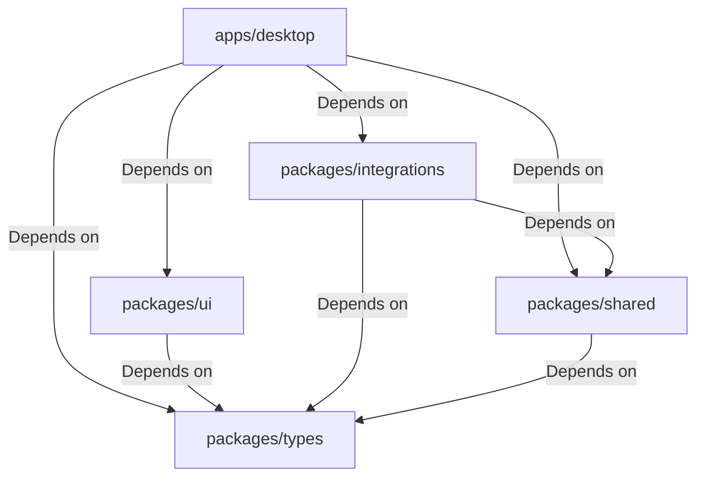

# 8. Package Dependency Graph

This document details the permitted compile-time import directions between layers and packages in LeadForge OS.

---

## 1. Permitted Dependency Matrix

To prevent circular imports and compilation locks in the monorepo, packages are restricted to a strict one-way downward dependency model:

---

## 2. Forbidden Import Directions

- **No Upward Imports**: A package in `packages/` must never import from an application in `apps/` (e.g. `packages/shared` importing from `apps/desktop`).
- **No Sideways UI Imports**: Underlying core packages (like `shared`, `types`, `integrations`) must never import from `packages/ui` or depend on React modules.
- **Strict Circular References Checking**: Disallow circular imports (A -> B -> A). Turborepo pipeline compilation will error out if a cycle is present in the dependency tree.
