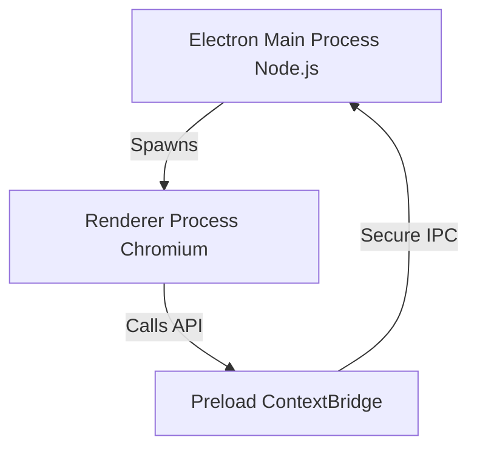

# 5. Desktop Application Audit (apps/desktop)

## 1. Electron Multi-Process Architecture

`apps/desktop` is organized into three runtime zones: **Main**, **Preload**, and **Renderer**, with shared assets in **Shared**. This separation is the core of Electron's security model.

### 1.1 `src/main` (Main Process)

- **Role**: Launches the native app context, manages the window lifecycle, intercepts IPC, and manages OS integrations.
- **Why**: Operating system APIs (like filesystem access, child process spawning) require direct system privileges and must run inside a Node runtime, isolated from web page loops.
- **Ownership**: Native resources (tray, windows, local database, updater).

### 1.2 `src/preload` (Preload Bridge)

- **Role**: Securely hooks functions onto the global browser context before rendering pages.
- **Why**: Exposing raw Node modules directly to a web page represents a critical security risk. Preload exposes safe, allow-listed IPC calls without giving the Renderer access to standard Node APIs.
- **Ownership**: Inter-Process Communication (IPC) contracts.

### 1.3 `src/renderer` (Renderer Process)

- **Role**: Webpage frontend interface.
- **Why**: Isolates UI code. Even if a third-party script crashes, it won't crash the desktop shell.
- **Ownership**: Presentation views, components, routing states, styles.

---

## 2. IPC & Security Boundaries

1. **Context Isolation**: Configured as `contextIsolation: true` in `BrowserWindow` creation, isolating Javascript execution contexts.
2. **Sandbox Mode**: Enforces `sandbox: true`, stripping the renderer of Node capabilities.
3. **No Dynamic Invokes**: IPC channels must be strict string literals (e.g. `ipc:test`). Never implement generic, dynamic call executors (like `ipc:runNodeCode`) which completely bypass security gates.
