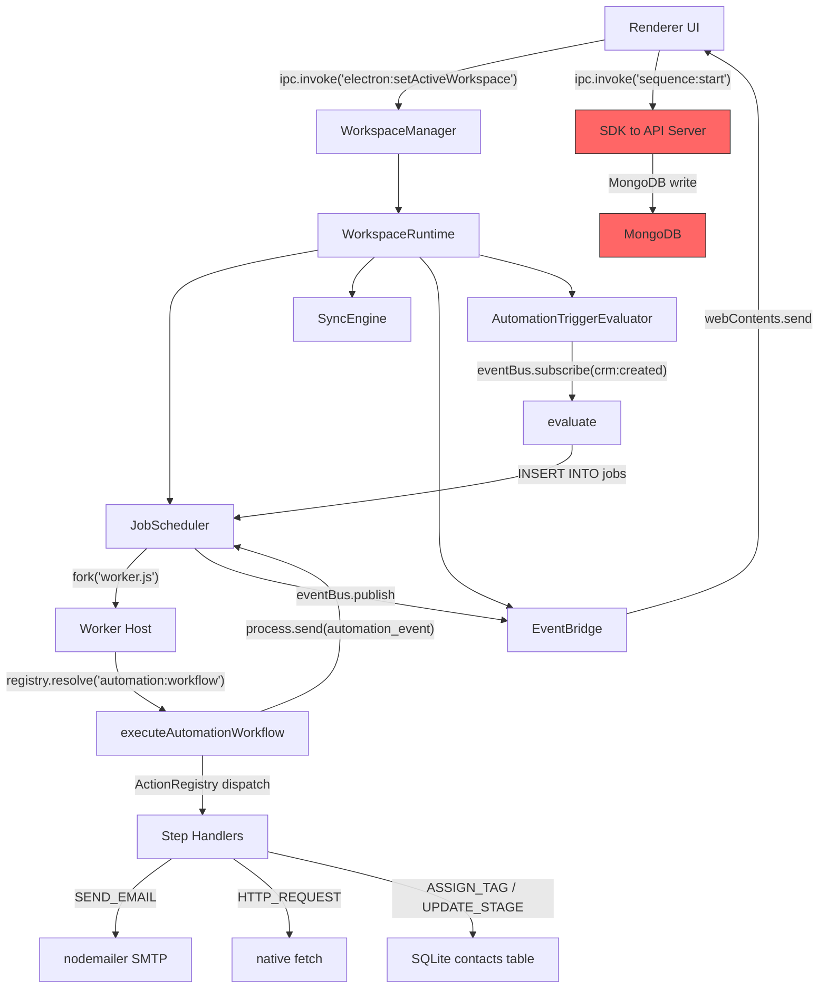

# Forensic Audit V2 — Automation Runtime (Source Code Evidence Only)

> Every statement in this document is derived from direct inspection of source code.
> No verification scripts, walkthroughs, task checklists, or prior audit documents were used as evidence.
> If evidence could not be found, it is stated explicitly.

---

## 1. Monorepo Structure

| App/Package | Path               | Role                                     |
| ----------- | ------------------ | ---------------------------------------- |
| Desktop     | `apps/desktop/`    | Electron main process, renderer, workers |
| API         | `apps/api/`        | Express REST server (MongoDB-backed)     |
| Worker      | `apps/worker/`     | Not audited (not relevant to automation) |
| Schema      | `packages/schema/` | Shared TypeScript types                  |
| SDK         | `packages/sdk/`    | API client for remote calls              |

**Source**: monorepo root

---

## 2. Electron Main Process Entry Point

**File**: [index.ts](file:///c:/Users/91637/Desktop/Business%20Project/leadforge-os/apps/desktop/src/main/index.ts)

### Boot sequence (lines 148-236):

1. `createSplashWindow()` — native splash
2. `loadSession()` — restore auth token from disk
3. `runMigrations()` — apply global SQLite migrations
4. `registerAllIpc(sdk, ...)` — register all IPC handlers
5. `createWindow()` — create BrowserWindow

### Critical observations:

- **No scheduler or workspace-runtime is started from the entry point.**
- The runtime is started lazily when the renderer calls `electron:setActiveWorkspace`.
- `runMigrations()` at line 177 is called on the global database. Workspace-scoped migrations run inside `WorkspaceRuntime.start()`.

---

## 3. IPC Registration

**File**: [register.ts](file:///c:/Users/91637/Desktop/Business%20Project/leadforge-os/apps/desktop/src/main/ipc/register.ts)

Calls (lines 36-44):

```
registerDatabaseIpc()
registerAuthIpc(...)
registerWorkspaceIpc(...)
registerCrmIpc()
registerElectronIpc(...)
registerOutreachIpc(...)
registerAutomationIpc(...)
registerSchedulerIpc()
registerDashboardIpc()
```

All IPC handlers are registered once at startup. The handler implementations resolve the active workspace runtime via `WorkspaceManager.getActiveRuntime()`.

---

## 4. Workspace Runtime Bootstrap

### 4.1 WorkspaceManager

**File**: [workspace-manager.ts](file:///c:/Users/91637/Desktop/Business%20Project/leadforge-os/apps/desktop/src/main/lib/workspace-manager.ts)

- Singleton class exported as `WorkspaceManager`.
- `setActiveWorkspace(workspaceId)` (line 31): Stops previous runtime, creates new `WorkspaceRuntime`, calls `runtime.start()`.
- `getActiveRuntime()` (line 80): Returns the single active runtime or null.

### 4.2 Trigger: Renderer to Main

**File**: [electron.ts](file:///c:/Users/91637/Desktop/Business%20Project/leadforge-os/apps/desktop/src/main/ipc/electron.ts#L18-L27)

IPC channel `electron:setActiveWorkspace` calls `WorkspaceManager.setActiveWorkspace(workspaceId)`.

**Renderer has access** via preload whitelist: [preload/index.ts](file:///c:/Users/91637/Desktop/Business%20Project/leadforge-os/apps/desktop/src/preload/index.ts#L43) — `'electron:setActiveWorkspace'` is in `validChannels`.

### 4.3 WorkspaceRuntime.start()

**File**: [workspace-runtime.ts](file:///c:/Users/91637/Desktop/Business%20Project/leadforge-os/apps/desktop/src/main/lib/workspace-runtime.ts#L63-L140)

Startup sequence:

1. `runMigrations(this.sqliteDb)` — workspace-scoped schema (line 96)
2. `this.recoverInterruptedJobs()` — crash recovery (line 104)
3. `this.scheduler.start()` — start job polling (line 109)
4. `this.syncEngine.start()` — start sync engine (line 115)
5. `this.eventBridge.start()` — start event forwarding to renderer (line 119)
6. `this.triggerEvaluator.start()` — start automation trigger listener (line 124)

**Constructor** (line 47): Instantiates `JobScheduler`, `SyncEngine`, `EventBridge`, `AutomationTriggerEvaluator` — all scoped to one workspace.

---

## 5. Job Scheduler

**File**: [scheduler.ts](file:///c:/Users/91637/Desktop/Business%20Project/leadforge-os/apps/desktop/src/main/services/scheduler.ts)

### 5.1 Polling loop

`start()` (line 60): Sets `setInterval(tick, 1000)` — polls every 1 second.

### 5.2 tick() — Two-Phase Dispatch (lines 104-207)

**Phase 1 — Job dispatch** (lines 106-154):

- Checks `activeWorkers.size < config.globalMaxConcurrency`
- Queries SQLite: `SELECT * FROM jobs WHERE status IN ('queued', 'retrying') AND (scheduledAt IS NULL OR scheduledAt <= datetime('now'))`
- Orders by `priority DESC, createdAt ASC`, LIMIT 10
- Per-type concurrency limits checked via `typeActiveCount`
- Atomically claims job: `UPDATE jobs SET status = 'starting'`
- Calls `this.runJob(job)`

**Phase 2 — WAIT timer resumption** (lines 159-207):

- Queries: `SELECT FROM sequence_executions WHERE status = 'waiting' AND nextExecutionAt <= datetime('now')`
- Checks no existing active job exists for that execution
- Inserts new `automation:workflow` job with `{ executionId, resumeFrom: currentStep }`
- Publishes `automation:queued` event

### 5.3 runJob() — Worker Fork (lines 273-514)

1. Updates job status to `'starting'`
2. Forks worker: `fork(join(__dirname, 'worker.js'), [], { env: { WORKSPACES_DB_DIR }, stdio: ['ignore', 'pipe', 'pipe', 'ipc'] })`
3. Pipes stdout/stderr to AppLogger
4. Increments `typeActiveCount[job.type]`
5. Registers IPC message handler (switch on `msg.type`):
   - `ready` → UPDATE status to `'running'`, start heartbeat watchdog
   - `pong` → reset watchdog timer
   - `progress` → UPDATE progress in SQLite
   - `checkpoint` → UPDATE checkpointData in SQLite
   - `paused` → UPDATE status to `'paused'`, clear heartbeat
   - `cancelled` → UPDATE status to `'cancelled'`, clear hard-kill timeout
   - `success` → `handleJobSuccess()`
   - `error` → `handleJobFailure()`
   - `automation_event` → forward to EventBus
6. Exit handler: on worker crash, calls `handleJobFailure()` if status is still running/starting
7. Sends `{ command: 'start', jobId, workspaceId, type, payload }` — with `_checkpoint` injected if available

### 5.4 handleJobFailure() — Retry Logic (lines 540-683)

**For `automation:workflow` jobs** (line 550-655):

- Extracts `executionId` from job payload
- If `nextRetry <= maxRetries`: Sets execution to `'waiting'`, schedules exponential backoff, logs RETRY
- If exceeded: Sets execution to `'failed'`, releases lock, logs ERROR permanently
- Publishes `automation:failed` and `automation:waiting` events

**For non-automation jobs** (lines 656-676):

- If retryable: Sets job to `'retrying'` with `scheduledAt` delay
- If exceeded: Sets job to `'failed'` permanently

### 5.5 Cancel/Pause (lines 698-773)

- `cancelJob()`: Sends `{ command: 'cancel' }` via IPC, sets 15s hard-kill fallback
- `pauseJob()`: Sends `{ command: 'pause' }` via IPC

---

## 6. Worker Host (Child Process Entry Point)

**File**: [worker-host.ts](file:///c:/Users/91637/Desktop/Business%20Project/leadforge-os/apps/desktop/src/main/workers/worker-host.ts)

**Build entry**: [electron.vite.config.js](file:///c:/Users/91637/Desktop/Business%20Project/leadforge-os/apps/desktop/electron.vite.config.js#L12) — compiled as `worker.js`.

### 6.1 Plugin Registry (lines 48-54)

```ts
const registry = new WorkerPluginRegistry();
registry.register('scraper:maps', scrapeMaps);
registry.register('crawler:website', crawlWebsite);
registry.register('enrich:website', enrichWebsite);
registry.register('outreach:campaign', dispatchOutreach);
registry.register('automation:workflow', executeAutomationWorkflow);
registry.register('mock:test', mockTest);
```

`executeAutomationWorkflow` is imported from [automation.ts](file:///c:/Users/91637/Desktop/Business%20Project/leadforge-os/apps/desktop/src/main/workers/plugins/automation.ts#L823).

### 6.2 Ready Handshake (line 77)

`process.send?.({ type: 'ready' })` — sent immediately on fork, before `start` command arrives.

### 6.3 Message Router (lines 86-133)

Single `process.on('message')` handler:

- `start` → `handleStart(msg)` (async)
- `cancel` → sets `isCancelledState = true`
- `pause` → sets `isPausedState = true`
- `resume` → sets `isPausedState = false`
- `ping` → responds with `{ type: 'pong' }`

### 6.4 handleStart() — Job Execution (lines 151-248)

1. Opens workspace SQLite via path: `join(WORKSPACES_DB_DIR, leadforge_{workspaceId}.db)`
2. Constructs `JobContext` with: `updateProgress`, `emitLog`, `isCancelled`, `isPaused`, `saveCheckpoint`, `getCheckpoint`
3. Resolves plugin: `registry.resolve(type)` — returns plugin function or null
4. Calls `pluginFn(context)` — this is where `executeAutomationWorkflow` runs
5. Exit paths:
   - Success → sends `{ type: 'success' }`, exits 0
   - Paused → sends `{ type: 'paused', checkpoint }`, exits 0
   - Cancelled → sends `{ type: 'cancelled' }`, exits 0
   - Error → sends `{ type: 'error' }`, exits 1

---

## 7. Automation Workflow Plugin

**File**: [automation.ts](file:///c:/Users/91637/Desktop/Business%20Project/leadforge-os/apps/desktop/src/main/workers/plugins/automation.ts) (2727 lines)

### 7.1 Type System (lines 1-73)

| Type                        | Purpose                                                               |
| --------------------------- | --------------------------------------------------------------------- |
| `AutomationWorkflowPayload` | Input payload with sequenceId, entityId, entityType                   |
| `AutomationCheckpoint`      | Saved on pause/crash for resume                                       |
| `ExecutionContext`          | Mutable workflow state: variables, contact, company, runtime counters |
| `StepDefinition`            | `{ type: string, [key]: any }`                                        |
| `StepResult`                | `success` / `wait` / `goto` / `skip`                                  |

### 7.2 Variable Resolution (lines 83-234)

- `resolveTokenPath()` (line 93): Resolves dotted paths like `contact.email`, `variables.score`, `today`, `now`
- `resolveVariables()` (line 171): Replaces `{{token}}` in template strings
- `resolveVariablesRecursive()` (line 186): Recursively resolves strings, arrays, objects. **Handles secrets**: if `db && workspaceId && val.includes("{{secret.")`, queries `settings` table with keys `[trimmedKey, secret.trimmedKey, secrets.trimmedKey]`

### 7.3 Expression Engine (lines 236-642)

Full recursive-descent parser supporting:

- Operators: `==`, `!=`, `>`, `<`, `>=`, `<=`, `&&`, `||`, `!`
- Types: numbers, strings, templates `{{...}}`, booleans, null
- Functions: `contains()`, `startsWith()`, `endsWith()`, `exists()`, `empty()`
- Bare identifiers resolve from `ctx.variables`

### 7.4 Validation (lines 665-753)

`validateWorkflow(steps)`:

- Dispatches to `ActionRegistry[step.type].validate()` for per-step validation
- Checks duplicate LABEL names
- Checks duplicate `saveResponseAs` variables across HTTP_REQUEST steps
- Inspects config properties for malformed `{{secret.}}` references
- Detects recursive SET_VARIABLE self-references

### 7.5 Main Execution Loop (lines 823-1752)

**Entry** (line 823): `export async function executeAutomationWorkflow(ctx: JobContext): Promise<any>`

**Phase 1 — Payload resolution** (lines 838-882):

- Reads payload and checkpoint
- On resume: recovers sequenceId/entityId from `sequence_executions` table
- Distinguishes new run vs resume

**Phase 2 — Lock acquisition** (lines 898-923):

- Cleans expired locks: `DELETE FROM automation_locks WHERE expiresAt <= datetime('now')`
- Inserts lock: `INSERT INTO automation_locks (sequenceId, entityId, workspaceId, expiresAt)`
- On duplicate: returns `{ status: 'locked_duplicate' }` — no error thrown

**Phase 3 — Load sequence** (lines 953-997):

- Reads from `sequences` table, validates `status = 'active'`
- Parses `steps` JSON
- Runs `validateWorkflow(steps)` pre-flight
- Builds label map via `buildLabelMap(steps)`

**Phase 4 — ExecutionContext initialization** (lines 999-1134):

- New run: Creates execution context, inserts into `sequence_executions` table, logs INITIALIZED
- Resume: Loads context from `sequence_executions.executionContext` (authoritative), falls back to checkpoint, last resort rebuilds from entity data

**Phase 5 — Step execution loop** (lines 1194-1638):

```
while (currentStep < steps.length) {
  // Loop guard (100 iterations max per run)
  // Execution timeout (300s max)
  // Pause check
  // Cancellation check
  // Dispatch via ActionRegistry
  // Handle result: success/wait/goto/skip
}
```

**Step dispatch** (lines 1318-1362):

```ts
const registryAction = ActionRegistry[step.type];
dispatchResult = await registryAction.execute(
  db,
  entityId,
  workspaceId,
  sequenceId,
  step,
  ctx,
  execCtx,
  labelMap
);
```

Each step has a 60-second timeout via `Promise.race`.

**Result handling**:

- `success`: Advance `currentStep++`, persist to SQLite atomically, check completion
- `wait`: Set execution to `'waiting'`, compute `nextExecutionAt`, save checkpoint, **exit worker**
- `goto`: Jump to `targetIndex`, persist to SQLite
- `skip`: Advance by `skipCount`, check completion

**Error handling** (lines 1661-1746):

- Updates `sequence_executions` to `'failed'`, logs ERROR
- **Retry classification**: Calls `registryAction.supportsRetry(err)` — if permanent, sets `jobs.maxRetries = 0` to halt scheduler retries
- Releases automation lock
- Publishes `automation:failed` event

### 7.6 Step Handlers

| Handler                 | Lines     | Database Mutations                                                                                      |
| ----------------------- | --------- | ------------------------------------------------------------------------------------------------------- |
| `handleSendEmailStep`   | 1782-1932 | Reads contacts, templates, email_accounts, settings. Sends via nodemailer SMTP. No DB write on success. |
| `handleWaitStep`        | 1934-1947 | None (returns delay seconds)                                                                            |
| `handleAssignTagStep`   | 1949-2032 | Updates `contacts.tags` (JSON array), inserts `sync_queue` entry                                        |
| `handleUpdateStageStep` | 2034-2107 | Updates `contacts.status`, inserts `sync_queue` entry                                                   |
| `handleSetVariableStep` | 2109-2146 | None (mutates in-memory `execCtx.variables` only)                                                       |
| `handleIfStep`          | 2148-2202 | None (evaluates expression, returns goto/skip/success)                                                  |
| `handleLabelStep`       | 2204-2210 | None (sets `execCtx.runtime.currentLabel`)                                                              |
| `handleGotoStep`        | 2212-2242 | None (increments jumpCount, returns goto)                                                               |
| `handleSkipStep`        | 2244-2250 | None (returns skip count)                                                                               |
| `handleHttpRequestStep` | 2358-2471 | Writes response to `execCtx.variables[saveResponseAs]`                                                  |

### 7.7 ActionRegistry (lines 2492-2726)

**Interface** (lines 2475-2490):

```ts
interface AutomationAction {
  execute(
    db,
    entityId,
    workspaceId,
    sequenceId,
    step,
    ctx,
    execCtx,
    labelMap
  ): Promise<StepResult> | StepResult;
  validate(step, labelMap): string[];
  supportsRetry(err): boolean;
}
```

**Registered actions**:

| Key            | Handler                 | supportsRetry               |
| -------------- | ----------------------- | --------------------------- |
| `SEND_EMAIL`   | `handleSendEmailStep`   | `true` (always)             |
| `WAIT`         | `handleWaitStep`        | `false`                     |
| `ASSIGN_TAG`   | `handleAssignTagStep`   | `false`                     |
| `UPDATE_STAGE` | `handleUpdateStageStep` | `false`                     |
| `SET_VARIABLE` | `handleSetVariableStep` | `false`                     |
| `IF`           | `handleIfStep`          | `false`                     |
| `LABEL`        | `handleLabelStep`       | `false`                     |
| `GOTO`         | `handleGotoStep`        | `false`                     |
| `SKIP`         | `handleSkipStep`        | `false`                     |
| `HTTP_REQUEST` | `handleHttpRequestStep` | `isRetryableHttpError(err)` |

**Alias** (line 2726): `ActionRegistry.MOVE_PIPELINE_STAGE = ActionRegistry.UPDATE_STAGE`

### 7.8 HTTP_REQUEST Implementation (lines 2358-2471)

1. Resolves method, URL, timeout, headers, body via `resolveVariablesRecursive()` (secrets-aware)
2. Constructs `AbortController` with configurable timeout
3. Calls native `fetch()` with resolved parameters
4. Parses response: tries JSON, falls back to text
5. Saves to `execCtx.variables[saveResponseAs]` with `{ status, headers, body, duration }`
6. On HTTP >= 400: throws `HttpError(status, message, body)`
7. Logs use `redactHeaders()` — never logs unredacted secrets

### 7.9 Retry Classification (lines 2333-2356)

`isRetryableHttpError()` returns `true` for:

- `HttpError` with status 429 or 500-599
- `AbortError` or message containing "timeout"
- Error codes: `ENOTFOUND`, `ETIMEDOUT`, `ECONNREFUSED`, `ECONNRESET`, `EADDRINUSE`, `EPIPE`
- Message containing "fetch failed" or "network"

Returns `false` for: HTTP 400, 401, 403, 404, all other errors.

### 7.10 Log Redaction (lines 2265-2331)

`redactHeaders()`: Masks values for keys containing `authorization`, `cookie`, `api-key`, `apikey`, `secret`, `password`, `token`, `x-api-key`, `pass`, `sec`.

`redactBody()`: Recursively masks object properties matching the same sensitive keys. For strings, uses regex to mask `key=value` patterns.

---

## 8. Automation Trigger Evaluator

**File**: [automation-trigger.ts](file:///c:/Users/91637/Desktop/Business%20Project/leadforge-os/apps/desktop/src/main/services/automation-trigger.ts)

Lives in the main process (instantiated by `WorkspaceRuntime`). Subscribes to LocalEventBus events.

### 8.1 Event to Trigger Mapping (lines 30-79)

| EventBus Event                 | Trigger Type                 |
| ------------------------------ | ---------------------------- |
| `crm:created` + company entity | `COMPANY_CREATED`            |
| `crm:created` + contact entity | `CONTACT_CREATED`            |
| `crm:updated` + status change  | `PIPELINE_STAGE_CHANGED`     |
| `job:completed` + scraper type | `DISCOVERY_IMPORT_COMPLETED` |
| `job:completed` (other)        | `JOB_COMPLETED`              |
| `job:failed`                   | `JOB_FAILED`                 |

### 8.2 Evaluation Flow (lines 238-364)

1. Maps event to trigger type
2. Loads active sequences: `SELECT FROM sequences WHERE status = 'active'`
3. For each sequence: parses `trigger` JSON, checks if `triggerConfig.type === triggerType`
4. **Deduplication check 1**: Existing active `automation:workflow` job for same sequence+entity
5. **Deduplication check 2**: Existing running/waiting `sequence_execution` for same sequence+entity
6. Inserts new job: `INSERT INTO jobs (...) VALUES (..., 'automation:workflow', 'queued', priority=3, ...)`
7. Publishes `automation:triggered` event

---

## 9. Event Propagation Architecture

### 9.1 LocalEventBus

**File**: [event-bus.ts](file:///c:/Users/91637/Desktop/Business%20Project/leadforge-os/apps/desktop/src/main/lib/event-bus.ts)

- Node.js `EventEmitter` wrapper scoped to a workspace
- `publish(type, payload)`: Emits on type channel and wildcard `*`
- `subscribe(type, listener)`: Returns unsubscribe function

### 9.2 EventBridge (Main to Renderer)

**File**: [event-bridge.ts](file:///c:/Users/91637/Desktop/Business%20Project/leadforge-os/apps/desktop/src/main/lib/event-bridge.ts)

Forwards EventBus events to renderer via `BrowserWindow.webContents.send()`:

- Job events: `job:progress`, `job:completed`, `job:failed`, `job:starting`, `job:started`, `job:paused`, `job:cancelled`
- Automation events: `automation:queued`, `automation:started`, `automation:resumed`, `automation:paused`, `automation:waiting`, `automation:completed`, `automation:cancelled`, `automation:failed`, `automation:recovered`

### 9.3 Worker to Main Event Path

Worker process sends `{ type: 'automation_event', event, payload }` via `process.send()` ([automation.ts:77-81](file:///c:/Users/91637/Desktop/Business%20Project/leadforge-os/apps/desktop/src/main/workers/plugins/automation.ts#L77-L81)).

Scheduler handles it at [scheduler.ts:468-470](file:///c:/Users/91637/Desktop/Business%20Project/leadforge-os/apps/desktop/src/main/services/scheduler.ts#L468-L470):

```ts
case 'automation_event':
  this.eventBus.publish((msg as any).event, (msg as any).payload);
```

### 9.4 Renderer Access

**File**: [preload/index.ts](file:///c:/Users/91637/Desktop/Business%20Project/leadforge-os/apps/desktop/src/preload/index.ts#L146-L154)

All 9 automation event channels are whitelisted in the preload `on()` method, meaning the renderer can subscribe to real-time automation lifecycle events.

---

## 10. IPC Channel Routing — Automation Commands

### 10.1 Sequence CRUD (Desktop IPC to Local SQLite + Remote API)

**File**: [ipc/automation.ts](file:///c:/Users/91637/Desktop/Business%20Project/leadforge-os/apps/desktop/src/main/ipc/automation.ts)

| Channel           | Implementation                                              | Data Flow           |
| ----------------- | ----------------------------------------------------------- | ------------------- |
| `sequence:list`   | `sdk.sequences.list()` then `LocalCRMRepository.saveMany()` | API to SQLite cache |
| `sequence:get`    | `sdk.sequences.get(id)` then `LocalCRMRepository.save()`    | API to SQLite cache |
| `sequence:create` | `LocalCRMRepository.save()` (syncStatus=pending)            | SQLite only         |
| `sequence:update` | `LocalCRMRepository.save()` (syncStatus=pending)            | SQLite only         |
| `sequence:delete` | `LocalCRMRepository.softDelete()`                           | SQLite only         |

### 10.2 Execution Control (Desktop IPC to Remote API)

> [!WARNING]
> **Architectural defect identified**: `sequence:start` (line 66) calls `sdk.executions.start(sequenceId, contactId, companyId)` — this routes through the **remote API server**, not through the local scheduler. The API server's `AutomationService.startExecution()` creates a `sequence_execution` record in **MongoDB** with status `PENDING`, but **does not queue a local `automation:workflow` job in SQLite**.
>
> This means: **manually-triggered executions from the UI will not be picked up by the desktop scheduler.**
>
> Only event-driven executions (triggered by `AutomationTriggerEvaluator`) insert jobs into the local SQLite `jobs` table and are actually executed by the desktop worker.

| Channel          | Implementation             | Defect                                         |
| ---------------- | -------------------------- | ---------------------------------------------- |
| `sequence:start` | `sdk.executions.start()`   | Creates MongoDB record, never queues local job |
| `sequence:stop`  | `sdk.executions.stop()`    | Updates MongoDB, does not cancel local job     |
| `execution:list` | `sdk.executions.list()`    | Reads from API                                 |
| `execution:get`  | `sdk.executions.get()`     | Reads from API                                 |
| `execution:logs` | `sdk.executions.getLogs()` | Reads from API                                 |

### 10.3 Scheduler IPC

**File**: [ipc/scheduler.ts](file:///c:/Users/91637/Desktop/Business%20Project/leadforge-os/apps/desktop/src/main/ipc/scheduler.ts)

| Channel                 | Implementation                                                  |
| ----------------------- | --------------------------------------------------------------- |
| `scheduler:jobs:submit` | Direct SQLite INSERT into `jobs` table                          |
| `scheduler:jobs:list`   | Direct SQLite SELECT from `jobs` table                          |
| `scheduler:jobs:cancel` | Calls `activeRuntime.scheduler.cancelJob()` or direct DB update |
| `scheduler:jobs:pause`  | Calls `activeRuntime.scheduler.pauseJob()` or direct DB update  |
| `scheduler:jobs:resume` | Direct DB update: status `paused` to `queued`                   |

---

## 11. API Server Automation (Remote)

**File**: [automation.service.ts](file:///c:/Users/91637/Desktop/Business%20Project/leadforge-os/apps/api/src/services/automation/automation.service.ts)

- Pure MongoDB CRUD for sequences, executions, and logs
- `startExecution()` (line 73): Creates execution record in MongoDB with status `PENDING`
- **No workflow step execution logic** — purely CRUD
- **No interaction with SQLite**

**File**: [worker.ts](file:///c:/Users/91637/Desktop/Business%20Project/leadforge-os/apps/api/src/services/automation/worker.ts)

```ts
export const SequenceWorker = {
  start() {
    console.log("[SequenceWorker] Background automation runner is decommissioned (handled by desktop runtime).");
  },
  stop() { ... },
  async poll() { /* No-op */ }
};
```

**Confirmed**: The API-side automation worker is explicitly decommissioned. All workflow execution is intended to run on the desktop.

---

## 12. Database Schema Dependencies

Tables mutated by the automation runtime (evidenced from SQL statements in source):

| Table                 | Operations                                                        | Source Files                                                             |
| --------------------- | ----------------------------------------------------------------- | ------------------------------------------------------------------------ |
| `jobs`                | INSERT, UPDATE (status, progress, checkpoint, retry, maxRetries)  | scheduler.ts, automation-trigger.ts, workspace-runtime.ts, automation.ts |
| `sequence_executions` | INSERT, UPDATE (status, currentStep, executionContext, workerPid) | automation.ts, scheduler.ts, workspace-runtime.ts                        |
| `sequence_logs`       | INSERT                                                            | automation.ts, scheduler.ts, workspace-runtime.ts                        |
| `automation_locks`    | INSERT, DELETE, UPDATE (expiresAt)                                | automation.ts, scheduler.ts, workspace-runtime.ts                        |
| `sequences`           | SELECT                                                            | automation.ts, automation-trigger.ts                                     |
| `contacts`            | SELECT, UPDATE (tags, status)                                     | automation.ts                                                            |
| `companies`           | SELECT                                                            | automation.ts                                                            |
| `templates`           | SELECT                                                            | automation.ts                                                            |
| `email_accounts`      | SELECT                                                            | automation.ts                                                            |
| `settings`            | SELECT                                                            | automation.ts, scheduler.ts                                              |
| `sync_queue`          | INSERT                                                            | automation.ts                                                            |

---

## 13. Crash Recovery

**File**: [workspace-runtime.ts](file:///c:/Users/91637/Desktop/Business%20Project/leadforge-os/apps/desktop/src/main/lib/workspace-runtime.ts#L181-L386)

`recoverInterruptedJobs()` runs before scheduler starts:

1. **Job recovery** (lines 184-226): Finds jobs with status `running/starting/interrupted`. Transitions `running/starting` to `interrupted`. Re-queues recoverable types (includes `automation:workflow`).

2. **Execution recovery** (lines 228-341): Finds `sequence_executions` with status `running/queued`. Checks associated job status:
   - If job `failed` → mark execution `failed`, release lock
   - If job `cancelled` → mark execution `cancelled`, release lock
   - If job `completed` → mark execution `completed`, release lock
   - If job is in recoverable state → increment `recoveryCount`, publish `automation:recovered`
   - If orphaned (no job) → insert new queued `automation:workflow` job

3. **WAIT timer recovery** (lines 343-381): Finds `sequence_executions` with status `waiting` and overdue `nextExecutionAt`. Inserts new `automation:workflow` job if none exists.

---

## 14. Complete Call Graph

```
Renderer
  |-> ipc.invoke('electron:setActiveWorkspace', workspaceId)
      |-> WorkspaceManager.setActiveWorkspace(workspaceId)
          |-> WorkspaceRuntime.start()
              |-> runMigrations(db)
              |-> recoverInterruptedJobs()
              |-> JobScheduler.start() [setInterval(tick, 1000)]
              |   |-> tick()
              |       |-> [Phase 1] SELECT queued jobs -> runJob()
              |       |   |-> fork('worker.js')
              |       |       |-> worker-host.ts
              |       |           |-> process.send({ type: 'ready' })
              |       |           |-> handleStart()
              |       |               |-> registry.resolve('automation:workflow')
              |       |                   |-> executeAutomationWorkflow(ctx)
              |       |                       |-> Acquire automation_lock
              |       |                       |-> Load sequence from SQLite
              |       |                       |-> validateWorkflow(steps)
              |       |                       |-> Initialize/Resume ExecutionContext
              |       |                       |-> while(currentStep < steps.length)
              |       |                           |-> ActionRegistry[step.type].execute()
              |       |                               |-> SEND_EMAIL -> nodemailer
              |       |                               |-> WAIT -> return { status: 'wait' }
              |       |                               |-> ASSIGN_TAG -> UPDATE contacts
              |       |                               |-> UPDATE_STAGE -> UPDATE contacts
              |       |                               |-> SET_VARIABLE -> mutate execCtx
              |       |                               |-> IF -> evaluateExpression()
              |       |                               |-> GOTO -> jump to label
              |       |                               |-> SKIP -> advance by N
              |       |                               |-> HTTP_REQUEST -> fetch()
              |       |-> [Phase 2] Resume overdue WAIT executions
              |-> SyncEngine.start()
              |-> EventBridge.start()
              |   |-> eventBus.subscribe() -> BrowserWindow.webContents.send()
              |-> AutomationTriggerEvaluator.start()
                  |-> eventBus.subscribe('crm:created', 'crm:updated', ...)
                      |-> evaluate(event)
                          |-> INSERT INTO jobs (type='automation:workflow')
```

---

## 15. Findings

### 15.1 Confirmed Working

| Capability                       | Evidence                                                                      |
| -------------------------------- | ----------------------------------------------------------------------------- |
| Sequential execution loop        | `while(currentStep < steps.length)` at line 1194                              |
| Loop guard                       | `MAX_AUTOMATION_STEPS_PER_RUN = 100` at line 1191                             |
| Execution timeout                | `MAX_EXECUTION_DURATION_MS = 300_000` at line 827                             |
| Per-step timeout                 | `MAX_STEP_DURATION_MS = 60_000` at line 1326                                  |
| Concurrent execution lock        | `automation_locks` table with expiry                                          |
| Checkpoint persistence           | `ctx.saveCheckpoint()` called on WAIT and pause                               |
| ExecutionContext persistence     | Atomically written to `sequence_executions.executionContext` after every step |
| Jump count limit                 | `jumpCount > 100` throws at lines 2186, 2229                                  |
| WAIT timer resumption            | Phase 2 of `tick()` at lines 159-207                                          |
| Crash recovery                   | `recoverInterruptedJobs()` at startup                                         |
| Event-driven trigger             | `AutomationTriggerEvaluator` with deduplication                               |
| SMTP email sending               | Real nodemailer transport at lines 1904-1931                                  |
| Tag mutation + sync queue        | `handleAssignTagStep` at lines 1949-2032                                      |
| Stage mutation + sync queue      | `handleUpdateStageStep` at lines 2034-2107                                    |
| Variable set/increment/decrement | `handleSetVariableStep` at lines 2109-2146                                    |
| IF/GOTO/LABEL/SKIP branching     | Full implementations at lines 2148-2250                                       |
| HTTP_REQUEST with fetch          | Native fetch + AbortController at lines 2358-2471                             |
| Secret resolution                | `resolveVariablesRecursive` with settings table lookup at lines 196-213       |
| Log redaction                    | `redactHeaders()` and `redactBody()` at lines 2265-2331                       |
| Retry classification             | `isRetryableHttpError()` at lines 2333-2356, `supportsRetry` per action       |
| Permanent failure halts retries  | `maxRetries = 0` set at lines 1718-1724                                       |
| ActionRegistry pattern           | All 10 types + 1 alias registered at lines 2492-2726                          |
| Pre-execution validation         | `validateWorkflow()` called at line 988                                       |
| API worker decommissioned        | `SequenceWorker` is a no-op                                                   |
| Heartbeat watchdog               | 10s interval, 30s timeout at scheduler lines 28-35                            |
| Soft cancel/pause                | IPC-based at worker-host lines 101-112                                        |
| Per-type concurrency             | `typeActiveCount` checked in tick at scheduler lines 126-134                  |
| Renderer event forwarding        | EventBridge forwards 9 automation events at lines 89-118                      |

### 15.2 Architectural Defects

> [!CAUTION]
> **DEFECT-001: Manual execution trigger is broken.**
>
> `sequence:start` IPC handler (at [ipc/automation.ts:66](file:///c:/Users/91637/Desktop/Business%20Project/leadforge-os/apps/desktop/src/main/ipc/automation.ts#L66)) calls `sdk.executions.start()`, which writes to **MongoDB via the API server**. It does **not** insert a job into the local SQLite `jobs` table.
>
> The desktop `JobScheduler` only picks up jobs from local SQLite. Therefore, manually-triggered executions from the UI are never executed by the desktop worker.
>
> Only executions triggered by `AutomationTriggerEvaluator` (via EventBus events) are actually queued in SQLite and executed.

> [!WARNING]
> **DEFECT-002: `sequence:stop` does not cancel the local worker.**
>
> `sequence:stop` IPC handler ([ipc/automation.ts:71-77](file:///c:/Users/91637/Desktop/Business%20Project/leadforge-os/apps/desktop/src/main/ipc/automation.ts#L71-L77)) calls `sdk.executions.stop()`, which updates the MongoDB record. It does **not** call `scheduler.cancelJob()` or set the `isCancelled` flag on the running worker.
>
> A running automation workflow will continue executing even after the user "stops" it from the UI.

> [!WARNING]
> **DEFECT-003: Dual data store inconsistency.**
>
> The API server writes execution records to MongoDB. The desktop worker writes execution records to local SQLite. These are independent data stores with no reconciliation mechanism for execution state.
>
> `execution:list` and `execution:get` read from MongoDB (via SDK), meaning they will show stale `PENDING` records that were never executed, and will **not** show executions created locally by `AutomationTriggerEvaluator`.

> [!NOTE]
> **DEFECT-004: `SEND_EMAIL.supportsRetry` always returns `true`.**
>
> At [automation.ts:2518](file:///c:/Users/91637/Desktop/Business%20Project/leadforge-os/apps/desktop/src/main/workers/plugins/automation.ts#L2518), `supportsRetry: () => true` for SEND_EMAIL means that permanent SMTP errors (invalid recipient, authentication failure, etc.) will always be retried up to `maxRetries`, instead of being classified as permanent.

---

## 16. Runtime Reachability Summary



Red nodes indicate the broken path where manual trigger goes to API/MongoDB instead of local SQLite/scheduler.
