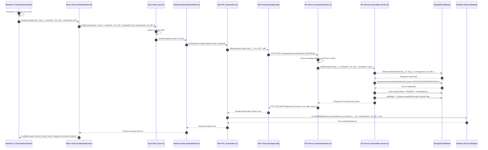

# Forensic Audit: Task 1.1.3 — Input & Output Flow Analysis

## Executive Summary

This document presents the forensic input/output flow analysis for the manual automation execution path (`sequence:start`) in LeadForge OS. It traces every input parameter, output return object, data transformation, and ownership handoff from the user click event in the Chromium Renderer down to MongoDB database persistence and back up to desktop SQLite caching and UI cache invalidation.

---

## Complete Input Audit

Every input field participating in the manual execution path is tracked across its lifecycle:

### 1. `sequenceId`

- **Field Name**: `sequenceId`
- **Type**: `string`
- **Owner**: Frontend UI (`AutomationScreen.tsx` sequence list row item).
- **Origin**: Passed from sequence card component (`seq.id`).
- **Created By**: Database / Sequence template builder.
- **Validated By**: `AutomationService.startExecution` (`SequenceModel.findOne({ _id: sequenceId, workspaceId })`).
- **Modified By**: Unmodified throughout pipeline.
- **Consumed By**: Renderer hook, BaseSyncRepository, main IPC handler, SDK module, HTTP client, API route, `AutomationService`, `SequenceExecutionModel`.
- **Destroyed By**: Garbage collected after completion.
- **Persistence Target**: `sequence_executions` (MongoDB & SQLite).

### 2. `contactId`

- **Field Name**: `contactId`
- **Type**: `string | null`
- **Owner**: Frontend UI user prompt.
- **Origin**: Browser native `prompt('Enter Contact ID to enroll (optional):')`.
- **Created By**: User text entry or empty fallback string `""`.
- **Validated By**: `AutomationService.startExecution` (Checks duplicate active execution for same `contactId`).
- **Modified By**: `use-automation.ts` passes optional value; `AutomationService` normalizes empty string / undefined to `null` (`payload.contactId || null`).
- **Consumed By**: Renderer UI -> Hook -> Repository -> IPC -> SDK -> API -> Service -> Mongoose Model.
- **Destroyed By**: In-memory reference destroyed after response; persisted in database.
- **Persistence Target**: `sequence_executions.contactId` (MongoDB & SQLite).

### 3. `companyId`

- **Field Name**: `companyId`
- **Type**: `string | null`
- **Owner**: Frontend UI trigger handler.
- **Origin**: Explicitly set to `null` in `handleManualTrigger` (`companyId: null`).
- **Created By**: `AutomationScreen.tsx:L221`.
- **Validated By**: None.
- **Modified By**: Unmodified (`null`).
- **Consumed By**: Renderer UI -> Hook -> Repository -> IPC -> SDK -> API -> Service -> Mongoose Model.
- **Destroyed By**: Garbage collected.
- **Persistence Target**: `sequence_executions.companyId` (MongoDB & SQLite).

### 4. `workspaceId`

- **Field Name**: `workspaceId`
- **Type**: `string`
- **Owner**: Active Workspace Context (`useWorkspace` hook in Renderer / `WorkspaceManager` in Main Process / Hono Context in API).
- **Origin**: Injected by context providers at each process layer.
- **Created By**: Workspace selection state store.
- **Validated By**:
  - `use-automation.ts` (checks `if (!workspaceId) return`).
  - `main/ipc/automation.ts` (checks `WorkspaceManager.getActiveRuntime()`).
  - `routes/automation.ts` (`getWorkspaceId(c)` throws `ForbiddenError` if missing).
  - `workspace.plugin.ts` (Mongoose schema validation on pre-save).
- **Modified By**: Unmodified string ID (e.g. `"ws_123"`).
- **Consumed By**: React Query key, IPC payload, SQLite query handle, Hono request context, Mongoose query filters.
- **Destroyed By**: Persisted in document schemas; active in context.
- **Persistence Target**: Scopes `sequence_executions` and `sequence_logs` records in MongoDB and SQLite.

### 5. `executionId` (`id` / `_id`)

- **Field Name**: `id` (Client / IPC / SDK) / `_id` (MongoDB)
- **Type**: `string`
- **Owner**: Client Repository (`sync.ts`) / MongoDB Model (`SequenceExecutionModel`).
- **Origin**: Generated client-side via `crypto.randomUUID()` in `sync.ts:L104` or server-side via `new mongoose.Types.ObjectId().toString()`.
- **Created By**: `BaseSyncRepository.create()` or `SequenceExecutionModel` default schema function.
- **Validated By**: Mongoose String ObjectId verification.
- **Modified By**: Mongoose maps `_id` to `id` in JSON serialization.
- **Consumed By**: `AutomationService.logStep`, IPC return response, SQLite cache key, React Query execution list.
- **Destroyed By**: Persisted permanently in databases.
- **Persistence Target**: Primary key (`id` in SQLite, `_id` in MongoDB).

### 6. `status`

- **Field Name**: `status`
- **Type**: `string`
- **Owner**: API Domain Service (`AutomationService.startExecution`).
- **Origin**: Set to `"PENDING"` (`ExecutionStatus.PENDING`) by `AutomationService.startExecution` on creation.
- **Created By**: `automation.service.ts:L100`.
- **Validated By**: `sequence-execution.model.ts` enum `["PENDING", "RUNNING", "WAITING", "COMPLETED", "FAILED", "CANCELLED"]`.
- **Modified By**: Set to `"PENDING"` on initial manual trigger creation.
- **Consumed By**: Service log step, returned execution object, SQLite cache row, Renderer status badge UI.
- **Destroyed By**: Persisted.
- **Persistence Target**: `sequence_executions.status` (MongoDB & SQLite).

### 7. `currentStep`

- **Field Name**: `currentStep`
- **Type**: `number`
- **Owner**: API Domain Service (`AutomationService.startExecution`).
- **Origin**: Set to `0` by `AutomationService.startExecution`.
- **Created By**: `automation.service.ts:L101`.
- **Validated By**: `sequence-execution.model.ts` default `0`.
- **Modified By**: Initialized to `0`.
- **Consumed By**: Log step recorder, execution table UI pointer (`Step #0`).
- **Destroyed By**: Persisted.
- **Persistence Target**: `sequence_executions.currentStep` (MongoDB & SQLite).

---

## Complete Output Audit

Every output object produced during the execution flow is tracked:

### 1. `SequenceExecution` MongoDB Document

- **Produced By**: `AutomationService.startExecution()` (`exec.save()`).
- **Owned By**: Central MongoDB Engine (`sequence_executions` collection).
- **Returned To**: `automationRouter.post('/executions/start')` router.
- **Cached By**: Desktop SQLite database (`sequence_executions` table) via `LocalCRMRepository.save()`.
- **Persisted By**: MongoDB primary database.
- **Consumed By**: Desktop Main process IPC handler -> SDK -> Renderer UI execution table.

### 2. `SequenceLog` MongoDB Document

- **Produced By**: `AutomationService.logStep()` (`log.save()`).
- **Owned By**: Central MongoDB Engine (`sequence_logs` collection).
- **Returned To**: `AutomationService` internal caller.
- **Cached By**: Pushed into `SequenceExecution.logs` array in MongoDB via `$push`.
- **Persisted By**: MongoDB database.
- **Consumed By**: Execution history logs timeline dialog (`execution:logs` IPC).

### 3. API HTTP JSON Response (`ApiResponse<SequenceExecution>`)

- **Produced By**: `routes/automation.ts` (`c.json(successResponse(exec))`).
- **Owned By**: Hono API Server HTTP Gateway.
- **Returned To**: `HttpClient` (SDK transport) over network interface.
- **Cached By**: Unwrapped by `HttpClient.request`.
- **Persisted By**: Temporary network buffer.
- **Consumed By**: `ExecutionsModule.start()` in SDK.

### 4. Desktop SQLite Cache Record

- **Produced By**: `LocalCRMRepository.save('sequence_executions', { ...res, workspaceId }, true)`.
- **Owned By**: Desktop SQLite Database file.
- **Returned To**: `main/ipc/automation.ts` handler.
- **Cached By**: SQLite disk file.
- **Persisted By**: Local SQLite database file on desktop filesystem.
- **Consumed By**: Desktop local fallback query handlers (`LocalCRMRepository.findMany`).

### 5. IPC Execution Response Object

- **Produced By**: `main/ipc/automation.ts` handler callback return statement (`return res`).
- **Owned By**: Electron IPC Channel Bridge.
- **Returned To**: `preload/index.ts` -> `window.ipc.invoke()` Promise.
- **Cached By**: Resolved Promise value in Renderer.
- **Persisted By**: None (in-memory object).
- **Consumed By**: `useStartSequence()` mutation `onSuccess` callback.

### 6. React Query Cache State

- **Produced By**: `useStartSequence()` mutation success trigger.
- **Owned By**: TanStack Query QueryClient instance in Renderer.
- **Returned To**: `AutomationScreen.tsx` UI subscriber.
- **Cached By**: In-memory React Query cache.
- **Persisted By**: None (re-fetched on invalidation).
- **Consumed By**: `AutomationScreen.tsx` executions monitor table.

---

## Data Ownership Chains

### End-to-End Payload Ownership Chain

```
[User Click Event]
  │ Format: Browser Mouse Event
  │ Owner: DOM Event System
  ▼
[UI Prompt Input]
  │ Format: string ("cnt_123" or "")
  │ Owner: AutomationScreen.tsx (handleManualTrigger)
  ▼
[Mutation Trigger Payload]
  │ Format: { sequenceId: string, contactId: string | null, companyId: null }
  │ Owner: useStartSequence hook (use-automation.ts)
  ▼
[Repository Input Object]
  │ Format: { sequenceId, contactId, companyId, workspaceId: string }
  │ Owner: BaseSyncRepository (sync.ts)
  ▼
[IPC Transport Record]
  │ Format: { sequenceId, contactId, companyId, workspaceId, id: string }
  │ Owner: window.ipc / preload bridge
  ▼
[Main Process IPC Payload]
  │ Format: { sequenceId, contactId, companyId }
  │ Owner: main/ipc/automation.ts
  ▼
[SDK Method Arguments]
  │ Format: start(sequenceId, contactId, companyId)
  │ Owner: ExecutionsModule (packages/sdk)
  ▼
[SDK HTTP Body]
  │ Format: JSON String '{"sequenceId":"...","contactId":"...","companyId":null}'
  │ Owner: HttpClient (packages/sdk)
  ▼
[HTTP Network Packet]
  │ Format: POST /automation/executions/start (Headers + JSON body)
  │ Owner: Network Interface Transport
  ▼
[API Request Body]
  │ Format: Deserialized JS Object { sequenceId, contactId, companyId }
  │ Owner: routes/automation.ts (Hono Context)
  ▼
[Service Payload]
  │ Format: startExecution(sequenceId, payload)
  │ Owner: AutomationService (apps/api)
  ▼
[Mongoose Document Model]
  │ Format: SequenceExecutionDocument ({ _id, sequenceId, workspaceId, contactId, companyId, status: "PENDING", currentStep: 0, startedAt, logs: [] })
  │ Owner: SequenceExecutionModel (apps/api)
  ▼
[Central Database Record]
  │ Format: BSON Document in 'sequence_executions' collection
  │ Owner: MongoDB Database Engine
  ▼
[API HTTP Response JSON]
  │ Format: { success: true, data: SequenceExecution }
  │ Owner: Hono OpenAPI Gateway
  ▼
[SDK Returned Object]
  │ Format: SequenceExecution TypeScript Object
  │ Owner: main/ipc/automation.ts
  ▼
[Desktop SQLite Cache Record]
  │ Format: Row in 'sequence_executions' SQLite table
  │ Owner: LocalCRMRepository (Desktop SQLite)
  ▼
[Renderer IPC Result]
  │ Format: Resolved Promise<SequenceExecution>
  │ Owner: useStartSequence mutation
  ▼
[React Query State]
  │ Format: Query Cache Entry ['sequence_executions', 'list', workspaceId]
  │ Owner: QueryClient (TanStack Query)
```

---

## Data Transformation Table

| Layer                 | Input Received                                      | Transformation Applied                                                                                                                                                     | Output Emitted                                                        | Ownership Transfer           |
| :-------------------- | :-------------------------------------------------- | :------------------------------------------------------------------------------------------------------------------------------------------------------------------------- | :-------------------------------------------------------------------- | :--------------------------- |
| **Renderer UI**       | Click on sequence card (`seq.id`)                   | Prompts user for `contactId` string                                                                                                                                        | `{ sequenceId, contactId, companyId: null }`                          | UI -> React Hook             |
| **Renderer Hook**     | `{ sequenceId, contactId, companyId }`              | Fetches `activeWorkspace.id` and appends `workspaceId`                                                                                                                     | `{ sequenceId, contactId, companyId, workspaceId }`                   | Hook -> Repository           |
| **Renderer Repo**     | `{ sequenceId, contactId, companyId, workspaceId }` | Attaches `id = crypto.randomUUID()` if missing                                                                                                                             | Record object passed to `window.ipc.invoke('sequence:start', record)` | Repository -> IPC Preload    |
| **Preload Bridge**    | Channel string `'sequence:start'`, record           | Validates channel against `validChannels` whitelist                                                                                                                        | Forwards to `ipcRenderer.invoke('sequence:start', record)`            | Preload -> Main Process IPC  |
| **Main Process IPC**  | IPC event, `{ sequenceId, contactId, companyId }`   | Obtains workspace runtime; calls SDK `executions.start()`                                                                                                                  | Receives `res` execution object from SDK                              | Main IPC -> SDK              |
| **SDK Module**        | `sequenceId`, `contactId`, `companyId`              | Encapsulates parameters into body object                                                                                                                                   | Passes `/automation/executions/start` & body to `HttpClient.post()`   | SDK Module -> HttpClient     |
| **SDK Transport**     | Path, body object                                   | Appends auth token header; stringifies body via `JSON.stringify`                                                                                                           | HTTP POST request packet sent via native `fetch()`                    | HttpClient -> HTTP Network   |
| **API Router**        | HTTP POST request packet                            | Extracts `workspaceId` from context; parses body JSON via `c.req.json()`                                                                                                   | Passes `sequenceId` and body to `AutomationService.startExecution()`  | Router -> Service            |
| **API Service**       | `sequenceId`, `payload`                             | 1. Checks sequence in MongoDB. 2. Checks active duplicates. 3. Instantiates `new SequenceExecutionModel({ status: "PENDING", currentStep: 0, ... })`. 4. Calls `logStep()` | Saves document via `exec.save()` and returns Mongoose document        | Service -> MongoDB Model     |
| **MongoDB Model**     | Mongoose document instance                          | Converts Mongoose document to BSON storage record                                                                                                                          | Writes document to `sequence_executions` MongoDB collection           | Model -> MongoDB Engine      |
| **API Router Return** | Mongoose document `exec`                            | Wraps object in `successResponse(exec)`                                                                                                                                    | Returns HTTP 200 JSON `{ success: true, data: exec }`                 | API Router -> SDK Transport  |
| **Main IPC Return**   | SDK returned `SequenceExecution`                    | Constructs `{ ...res, workspaceId }` and calls `LocalCRMRepository.save()`                                                                                                 | Writes SQLite row and returns `res` across IPC                        | Main IPC -> SQLite & Preload |
| **Renderer Return**   | IPC resolved Promise result                         | Invalidates TanStack Query key `['sequence_executions', 'list', workspaceId]`                                                                                              | Updates UI execution table with new execution row                     | Preload -> Renderer UI       |

---

## Input/Output Flow Diagram



---

## Confidence Assessment

| Analysis Area             | Audit Status | Source Code Reference                                                   | Confidence Level |
| :------------------------ | :----------- | :---------------------------------------------------------------------- | :--------------- |
| **Complete Input Audit**  | Verified     | `AutomationScreen.tsx`, `use-automation.ts`, `automation.service.ts`    | **HIGH**         |
| **Complete Output Audit** | Verified     | `automation.service.ts`, `routes/automation.ts`, `local-crm.ts`         | **HIGH**         |
| **Data Ownership Chains** | Verified     | Trace from UI prompt to MongoDB BSON record                             | **HIGH**         |
| **Transformation Table**  | Verified     | Code transformations in `sync.ts`, `client.ts`, `automation.service.ts` | **HIGH**         |
| **I/O Flow Diagram**      | Verified     | Mermaid sequence mapping exact function parameters and returns          | **HIGH**         |

**Overall Audit Confidence Level**: **HIGH**
