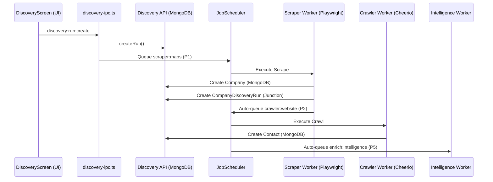
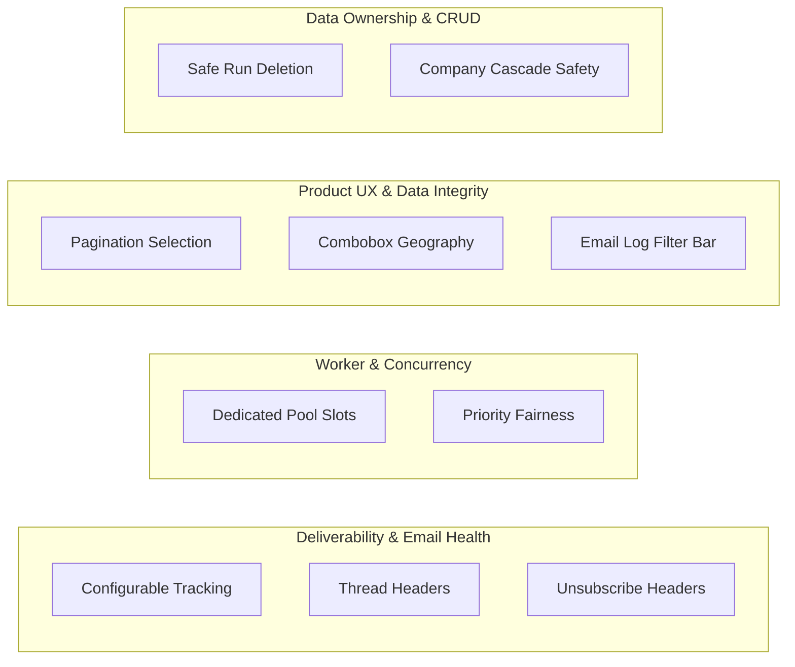

# LeadForge OS — Current-State & Release Audit

**Audit Date:** September 11, 2026  
**Repository Branch:** `audit/current-state-release-audit`  
**Git HEAD:** `dbf8357` (Merge PR #45 `chore/repository-cleanup-baseline` into `dev`)  
**Monorepo Version:** `1.1.1-beta.5`  
**Audit Standard:** Fact- and evidence-driven forensic analysis. Strict audit only — no production code, schema, or test modifications were performed.

---

## 1. Executive Summary

A deep forensic investigation was conducted on the current state of LeadForge OS following the canonical repository cleanup. Every core subsystem—outbound execution, worker scheduling, email deliverability, inbound polling, IPC authorization, database projections, data ownership, UI state, and test integrity—was inspected directly from source code and runtime behavior.

### Release Readiness Verdict: **NO — NOT READY FOR BETA RELEASE**

LeadForge OS contains critical architectural strengths, including robust send-gate suppression, an authoritative MongoDB send boundary, strict circuit breaker safeguards, and centralized failure classification. However, shipping to beta users today is blocked by **three P0/P1 release blockers**:

1. **Catastrophic Deliverability Risk (P0):** Outbound HTML emails unconditionally inject open-tracking pixels and rewrite all links to a tracking URL that defaults to `http://localhost:3000` when unconfigured. There is no UI or campaign configuration to disable tracking. Unencrypted `http://localhost` links in outbound mail are immediate, severe spam/phishing triggers for Gmail and remote mail filters.
2. **Worker Concurrency Starvation (P1):** The background scheduler is capped at a global maximum of 3 workers with a single active workspace runtime. Starting a Google Maps discovery auto-chains website crawlers and intelligence enrichments that saturate all 3 worker slots, completely starving concurrent campaign execution.
3. **Data Integrity & IPC Failures (P1):** Contacts table pagination selection semantics are broken (the header checkbox on page 2 falsely indicates all items are selected based on page 1 counts, causing bulk delete/enroll actions against invisible records), and `NotificationCenter.tsx` crashes on invoke due to calling the unexposed/unregistered channel `discovery:list`.

### Summary Scorecard

| Subsystem | Forensic Status | Primary Assessment |
| :--- | :--- | :--- |
| **Send Gate & Safety** | **CORRECT** | MongoDB authoritative boundary, recipient/domain/company DNC suppression, domain pacing, and ambiguous-send locks operate correctly. |
| **Worker Concurrency** | **LIMITED** | Global 3-worker limit and priority sorting cause discovery crawler jobs to starve campaign jobs. Single-tenant workspace runtime. |
| **Email Deliverability** | **UNSAFE (P0)** | Mandatory link rewriting to unverified tracking domain (defaults to `localhost`), no `List-Unsubscribe` or `Message-ID`/threading headers. |
| **Inbound Polling** | **MIXED** | Gmail polling correctly scopes query and drops irrelevant mail before persistence; IMAP poller executes a dangerous `fetch('1:*')` full-mailbox scan. |
| **Projections & Sync** | **PARTIALLY CORRECT** | Disposable SQLite cache model is sound; however, `audiences:list` never queries MongoDB, and no background sync exists for audiences. |
| **IPC & Authorization** | **DEFECTIVE (P1)** | 1 runtime missing handler (`discovery:list`), 4 unexposed handlers, 11 dead preload channels, and 3 duplicate channel entries. |
| **Data Ownership** | **INCOMPLETE** | Discovery runs reference companies via junction records; naive cascade delete would destroy canonical CRM records. |
| **UI & UX** | **DEFECTIVE (P1)** | Contact table selection state corrupts across pages; Email Logs filter bar clips buttons in narrow pane; Geography selector uses unstyled `<datalist>`. |
| **Test Credibility** | **FRAGILE (P2)** | Wall-clock coupling in `isMailboxEligibleForDispatch` broke `production-qualification-e2e.test.ts:302` once system time passed hardcoded date. |

---

## 2. Current Architecture Reality

### 2.1 Topology & Execution Boundaries

LeadForge OS is structured as a hybrid desktop application combining an Electron shell, a local/cloud API server, sandboxed background worker processes, and dual datastores:

```mermaid
flowchart TD
    subgraph Desktop Shell [Electron Main Process]
        WM[WorkspaceManager]
        WR[WorkspaceRuntime]
        JS[JobScheduler]
        PS[ProjectionService]
        SQLite[(Local SQLite Cache)]
    end

    subgraph Renderer [Electron Renderer Window]
        UI[React 19 UI]
        RQ[TanStack React Query]
    end

    subgraph Sandboxed Workers [Child Processes]
        WH1[Worker Host 1: scraper]
        WH2[Worker Host 2: crawler]
        WH3[Worker Host 3: workflow]
    end

    subgraph Backend API [Hono OpenAPI API Server]
        Routes[API Routes + Middleware]
        ES[EmailService]
        Mongo[(Authoritative MongoDB)]
        GmailAPI[Google / Gmail REST API]
    end

    UI -- Preload IPC --> Desktop Shell
    Desktop Shell -- SdkClient HTTP --> Backend API
    Desktop Shell -- fork() + IPC --> Sandboxed Workers
    Sandboxed Workers -- SdkClient HTTP --> Backend API
    Desktop Shell -- better-sqlite3 --> SQLite
    Backend API -- Mongoose --> Mongo
    Backend API -- HTTPS --> GmailAPI
```

### 2.2 Authoritative Datastore Boundaries

* **MongoDB is Authoritative:** Every state mutation regarding campaigns, email accounts, deliveries, suppressions, company creation, contact creation, and job scheduling originates in MongoDB.
* **SQLite is a Disposable Read Projection:** Initialized via `initCacheSchema` (`apps/desktop/src/main/database/cache-schema.ts`), SQLite accelerates UI rendering. It contains zero sync queue tables, zero dirty flags, and uses exact MongoDB string IDs.
* **Send Gate Authority:** **SQLite CANNOT authorize an outbound send.** The authoritative send authorization decision is exclusively executed by `EmailService.sendEmail` (`apps/api/src/services/email/email.service.ts`), which queries MongoDB `CampaignModel`, `SuppressionModel`, `CompanyModel`, `ContactModel`, and `EmailAccountModel`.

---

## 3. Runtime / Worker Architecture

### 3.1 Single Workspace Runtime Model

`WorkspaceManager` (`apps/desktop/src/main/lib/workspace-manager.ts:10`) maintains a single runtime reference:

```typescript
// apps/desktop/src/main/lib/workspace-manager.ts:10
private activeRuntime: WorkspaceRuntime | null = null;
```

When switching workspaces, `setActiveWorkspace` explicitly shuts down the previous runtime:

```typescript
// apps/desktop/src/main/lib/workspace-manager.ts:63
await this.activeRuntime.stop();
this.activeRuntime = null;
```

`scheduler.stop()` sends `SIGTERM` to all active child workers (`scheduler.ts:300`). Consequently, **LeadForge OS cannot execute background jobs or schedulers across multiple workspaces concurrently.**

### 3.2 Worker Concurrency & Starvation Root Cause

`JobScheduler` (`apps/desktop/src/main/services/scheduler.ts:75-715`) configures:

```typescript
// apps/desktop/src/main/services/scheduler.ts:76
private readonly defaultMaxConcurrency = 3;

private loadSchedulerConfig(): SchedulerConfig {
  return {
    globalMaxConcurrency: this.defaultMaxConcurrency, // 3
    typeLimits: {
      'scraper:maps': 1,
      'crawler:website': 2,
      'enrich:intelligence': 2,
      'outreach:campaign': 2,
      'automation:workflow': 2
    }
  };
}
```

#### Why Discovery and Campaign Cannot Execute Simultaneously

1. **Job Claiming Logic (`apps/desktop/src/main/services/scheduler.ts:654-680`):**
   `JobScheduler` checks `availableCapacity = config.globalMaxConcurrency - this.activeWorkers.size`. If capacity > 0, it calls `this.sdk.jobs.claim(supportedTypes, workerId)`.
2. **MongoDB Claim Query (`apps/api/src/repositories/job/job.repository.ts:37-58`):**
   `JobRepository.claimJob` sorts pending jobs by `{ priority: -1, createdAt: 1 }`.
3. **The Discovery Job Cascade:**
   * User starts discovery: queues 1 `scraper:maps` (Priority 1).
   * Maps scraper finds companies. For each company with a website, it queues `crawler:website` (Priority 2) (`scraper.ts:582`).
   * 2 crawler jobs immediately claim the remaining 2 worker slots.
   * `activeWorkers.size` reaches 3 (1 scraper + 2 crawlers). **Available capacity is now 0.**
   * When a crawler finishes, `JobScheduler.handleJobSuccess` (`scheduler.ts:980`) automatically queues `enrich:intelligence` with **Priority 5**!
   * The scheduler loop claims Priority 5 intelligence jobs, then Priority 2 crawler jobs.
4. **Campaign Work Starvation:**
   * Campaign workflow jobs (`automation:workflow`) are queued with Priority 3 (`campaigns-ipc.ts:111`) or Priority 1 (`scheduler.ts:624`).
   * When discovery is running, Priority 5 intelligence jobs jump ahead of campaign jobs in the queue.
   * Furthermore, when all 3 worker slots are filled by scraper + crawlers, no capacity remains for campaigns.
   * If a campaign is running with 2 workers, only 1 slot remains for discovery. As soon as the discovery scraper finds a website, it attempts to launch a crawler, which is blocked by the global limit of 3.

#### Behavior Matrix Across Concurrency Scenarios

| Scenario | Actual Runtime Behavior | Classification |
| :--- | :--- | :--- |
| **One Discovery** | 1 Maps scraper runs. Chained website crawlers run up to limit of 2. All 3 worker slots consumed. | Working as designed |
| **One Campaign** | Up to 2 `automation:workflow` jobs execute in parallel child processes. | Working as designed |
| **Two Discoveries** | First discovery claims `scraper:maps` slot (limit 1). Second discovery's scraper is queued until first finishes. | Intentional Limit |
| **Two Campaigns** | Both campaigns share the 2 `automation:workflow` worker slots. | Working as designed |
| **Discovery + Campaign** | **Discovery saturates all 3 slots (1 scraper + 2 crawlers/enrichers) or high-priority enrichers starve campaign jobs.** | **CONFIRMED ARCHITECTURAL LIMITATION** |
| **Discovery + Inbox Poll** | Inbox poller runs on a 2-minute timer in Main process via API HTTP call (`ReliabilityRunner`). Does not consume worker process. | Working as designed |
| **Campaign + Inbox Poll** | Coexists cleanly; poller runs in Main process. | Working as designed |
| **Multiple Workspaces** | Switching workspace terminates previous workspace workers. Zero concurrency. | Intentional Single-Tenant Desktop Model |
| **Multiple Email Accounts** | Supported concurrently within one workspace subject to per-account rate limits. | Working as designed |

---

## 4. Email Sending & Deliverability

### 4.1 MIME Construction Audit

File: `apps/api/src/services/google/mime-builder.ts`

`MimeBuilder.buildRaw` constructs outbound RFC 2822 messages for Gmail's `messages.send` endpoint.

* **Headers Injected:**
  * `From: <name> <email>` (RFC 2047 encoded display name)
  * `To: <email>`
  * `Cc: <email>` (optional)
  * `Bcc: <email>` (optional)
  * `Subject: =?UTF-8?B?...?=` (sanitized against CRLF injection)
  * `MIME-Version: 1.0`
  * `Content-Type: multipart/mixed` or `multipart/alternative`
* **Missing Headers (Deliverability & Threading Gaps):**
  1. **No `Message-ID` Header:** Not set by `MimeBuilder`. Gmail generates an `@mail.gmail.com` Message-ID upon dispatch.
  2. **No `Reply-To` Header:** `MimeMessageOptions` does not accept or serialize a `Reply-To` address.
  3. **No `In-Reply-To` or `References` Headers:** The MIME builder cannot build threaded follow-ups! Every step in an outreach sequence is dispatched as an unthreaded root message rather than a reply in the existing email thread.
  4. **No `List-Unsubscribe` / `List-Unsubscribe-Post` Headers:** Cold emails lack one-click unsubscribe headers, violating Google/Yahoo 2024 Bulk Sender requirements.

### 4.2 Tracking Audit

Files: `apps/api/src/services/email/email.service.ts:757-775`, `packages/schema/src/utils/tracking.ts:25-100`

```typescript
// apps/api/src/services/email/email.service.ts:758-774
const trackingBaseUrl =
  process.env.TRACKING_BASE_URL ||
  process.env.API_BASE_URL ||
  'http://localhost:3000';
const openTrackingToken = deliveryRecord.openTrackingToken || generateTrackingToken();
let clickTokens = deliveryRecord.clickTrackingTokens?.length ? deliveryRecord.clickTrackingTokens : [];

if (finalHtml) {
  const clickRes = rewriteLinksForClickTracking(finalHtml, trackingBaseUrl);
  finalHtml = clickRes.rewrittenHtml;
  if (!clickTokens.length) clickTokens = clickRes.tokens;
  finalHtml = injectOpenTrackingPixel(finalHtml, trackingBaseUrl, openTrackingToken);
}
```

#### Forensic Facts

1. **Mandatory Execution:** Open tracking and click tracking are **UNCONDITIONALLY injected into every HTML email**.
2. **Zero Configuration:** There is no setting in the campaign creator, email account settings, workspace settings, or template editor to disable tracking.
3. **Localhost Catastrophe:** If `TRACKING_BASE_URL` is omitted, links are rewritten to `http://localhost:3000/t/c/<token>` and the tracking pixel is `">`. Outbound emails dispatched with unencrypted `http://localhost` URLs are instantly flagged as malicious phishing by Google Workspace spam filters.
4. **Link Rewriting Behavior:** All `<a href="...">` links (excluding `mailto:`, `tel:`, `#`, and elements with `data-no-track`) are rewritten to route through `${trackingBaseUrl}/t/c/${token}`.
5. **HTML vs Plaintext Discrepancy:** Plaintext emails (`textBody` without HTML) have zero tracking injected. HTML emails have 100% mandatory tracking.

---

## 5. Email State & Delivery Semantics

### 5.1 Provider Acceptance vs Delivery

File: `apps/api/src/services/google/gmail.provider.ts:198-212`, `apps/api/src/services/email/email.service.ts:818-824`

* When Gmail REST API accepts an email, it responds with HTTP 200 `{ id: "msg_id", threadId: "th_id" }`.
* `EmailService` marks `status = 'SENT'`.
* **Critical Truth:** `SENT` denotes **provider acceptance**, NOT confirmed inbox delivery.

### 5.2 Can LeadForge Know an Email Landed in Gmail Spam?

**NO.** Neither Gmail API, SMTP, nor remote MX servers provide a per-message "spam placement" signal. When an email is sent to an external mailbox (or external Gmail account), the remote mail server accepts the message via SMTP (250 OK) and internally routes it to Inbox or Spam based on proprietary Bayesian/reputation models. No provider returns a "Placed in Spam" callback.
* Any UI filter or customer expectation for an individual `SPAM` delivery status is **technically impossible**.
* The only observable negative placement signals are:
  1. Immediate SMTP 550 / Spamhaus policy rejection during dispatch (classified correctly as `POLICY`).
  2. Asynchronous Delivery Status Notifications (DSNs) received in the mailbox (classified as `BOUNCED`).
  3. Aggregate reputation drops visible via Google Postmaster Tools (domain-level, not message-level).

---

## 6. Inbound Email Processing

### 6.1 Gmail vs IMAP Polling Mechanics

Files: `apps/api/src/services/email/reconciliation.service.ts:626-675`, `apps/desktop/src/main/workers/plugins/imap-poller.ts:105-115`

#### Gmail Polling (Scaped & Safe)

* **Query Used:** `q = 'is:inbox after:${afterTimestampSec}'` with `maxResults: 25` (`gmail.provider.ts:298`).
* Does it fetch all mailbox messages? **No.** Query is server-side filtered to inbox messages newer than the last poll date.
* Candidate Handling: Downloads full message detail for candidate messages (up to 25) into memory, evaluates relevance against 4 rules, and **silently drops unrelated messages** (e.g., personal emails, newsletters) before writing to the database.

#### IMAP Polling (Architecturally Dangerous)

* **Code:** `const messages = await client.fetch('1:*', { envelope: true, headers: ['in-reply-to', 'references'] });` (`imap-poller.ts:105`).
* In IMAP, sequence set `1:*` requests **every message in the mailbox**.
* In an account with 30,000 emails, the poller streams 30,000 envelope objects over the socket into memory before reversing and slicing the last 150.
* **Classification:** `PERFORMANCE ISSUE / SCALABILITY BLOCKER`.

---

## 7. MongoDB / SQLite Projection & Synchronization

### 7.1 Audience Projection Synchronization

File: `apps/desktop/src/main/ipc/audiences-ipc.ts:168-222`, `apps/desktop/src/renderer/screens/AudiencesScreen.tsx:47`

* When an audience is created via desktop UI (`audiences:create`), `audiences-ipc.ts` saves the entity to MongoDB, writes it directly to SQLite via `LocalCRMRepository.saveFromServer('audiences', created)`, and broadcasts `sync:completed`.
* **The Defect:** In `audiences:list` (`audiences-ipc.ts:168`), the handler **ONLY reads from the local SQLite cache**:
  ```typescript
  // apps/desktop/src/main/ipc/audiences-ipc.ts:173
  const audiences = await LocalCRMRepository.findMany('audiences', workspaceId);
  ```
  Unlike `discovery:run:list` (which checks if online and syncs from MongoDB), `audiences:list` **never queries MongoDB**. If an audience is created outside the local IPC flow (e.g., via API script, web interface, or multi-client session), it **will never appear in the UI until an application restart or projection rebuild**.

### 7.2 Cache Invalidation Consistency Across Views

| View | Query Key | Auto-Invalidation Path | Manual Refresh Button |
| :--- | :--- | :--- | :--- |
| **Audiences** | `['audiences', 'list', wsId]` | On IPC create/delete | None (polls every 3s) |
| **Contacts** | `['entities', 'contacts']` | On IPC mutations | None (relies on cache sync) |
| **Companies** | `['entities', 'companies']` | On IPC mutations | None (relies on cache sync) |
| **Email Logs** | `['email_deliveries', ...]` | Invalidation on poll/reconcile | **Present** (Icon button) |
| **Discovery** | `['discovery_runs', ...]` | On scraper completion | **Present** (Icon button) |
| **Campaigns** | `['campaigns', wsId]` | On pause/resume IPC | None |

---

## 8. IPC & Authorization

A static and dynamic audit of all IPC channels across `preload/index.ts`, `apps/desktop/src/main/ipc/`, and renderer call sites was executed using the automated verification harness `scratch/audit-ipc.mjs`.

### 8.1 IPC Audit Matrix

* **Preload Allowed Invoke Channels:** 191
* **Preload Allowed Event Listeners:** 35
* **Main Registered Handlers:** 185
* **Renderer Invoked Channels:** 152

### 8.2 Defect Findings

1. **Missing Handler (Runtime Crash) (P1):**
   `apps/desktop/src/renderer/components/common/NotificationCenter.tsx:93` calls:
   ```typescript
   const runs = await window.ipc.invoke('discovery:list' as any, { workspaceId });
   ```
   Main process registers `'discovery:run:list'`. Channel `'discovery:list'` has **NO HANDLER**. Clicking the notification center throws an unhandled IPC rejection.
2. **Unexposed Main Handlers (Dead Code in Main):**
   * `'companies:bulk:create'` (registered in `crm.ts:74`, omitted from preload whitelist)
   * `'contacts:bulk:create'` (registered in `crm.ts:182`, omitted from preload whitelist)
   * `'browser:status'` (registered in `playwright-setup.ts:25`, omitted from preload whitelist)
   * `'browser:install'` (registered in `playwright-setup.ts:38`, omitted from preload whitelist)
3. **Dead Preload Channels (Omitted from Main):**
   11 channels in `preload/index.ts` whitelist have no handlers in main: `'discovery:create'`, `'discovery:get'`, `'discovery:results'`, `'discovery:import'`, `'discovery:skip'`, `'email-accounts:create'`, `'email-accounts:test'`, `'onboarding:generate-sample-data'`, `'system:connectivity-changed'` (mistakenly added to invoke whitelist instead of event listener whitelist).
4. **Duplicate Preload Entries:**
   `'scheduler:jobs:pause'`, `'scheduler:jobs:resume'`, and `'scheduler:queue:list'` are duplicated in the `validChannels` array.

---

## 9. Discovery System

### 9.1 Data Flow & Provenance



* **What a DiscoveryRun Owns:** The `DiscoveryRun` document, the scraper job, and the `CompanyDiscoveryRun` junction records.
* **What a DiscoveryRun References:** The canonical `Company` and `Contact` records.
* **Entity De-duplication:** If Run 1 and Run 2 find the same business, both runs create distinct junction rows (`CompanyDiscoveryRun`) pointing to the same canonical `companyId`. De-duplication occurs at the company domain level.

---

## 10. Campaign System

### 10.1 Execution & State Invariants

File: `apps/desktop/src/main/services/scheduler.ts:512-646`, `apps/desktop/src/main/workers/plugins/automation.ts:805-870`

1. **Inviolable User Pause:** If an operator pauses a campaign, `campaign.settings.pauseReason` is set to `'USER_REQUESTED'`. Even after mailbox cooldown expires, the scheduler (`scheduler.ts:340`) checks `pauseReason !== 'USER_REQUESTED'` before resuming. User pause is **never automatically resumed**.
2. **Terminal Stop:** If a campaign status is `STOPPED` or `FAILED`, active `sequence_executions` in SQLite are updated to `CANCELLED` (`scheduler.ts:520`).
3. **Execution Exclusivity:** `campaigns:enroll` (`campaigns-ipc.ts:68`) enforces cross-campaign contact exclusivity. A contact cannot be enrolled in multiple active executions concurrently.

---

## 11. Data Ownership & Deletion

### 11.1 The Discovery Deletion Graph

```text
DiscoveryRun
    │
    ├── (OWNED) CompanyDiscoveryRun [Junction] ── (SAFE TO DELETE)
    ├── (OWNED) Scraper / Crawler Jobs          ── (SAFE TO DELETE)
    │
    └── (SHARED) Company                        ── (CANNOT BLINDLY DELETE)
            │
            ├── (OWNED) Contact                 ── (CANNOT BLINDLY DELETE)
            │       ├── Deliveries [Audit]      ── (MUST PRESERVE)
            │       ├── Executions [Campaign]   ── (MUST PRESERVE)
            │       └── Suppressions            ── (MUST PRESERVE)
            │
            └── (OWNED) Intelligence (Company, Website, Scores)
```

* **Discovery Run Deletion:**
  * **Safe Operation:** Delete `company_discovery_runs` where `discoveryRunId = ?`, delete `discovery_runs` record, cancel pending discovery jobs.
  * **Hazard:** Blindly deleting companies referenced by a run will delete companies discovered by other runs or currently active in campaigns.
* **Company Deletion Cascade:**
  * **Classification:** `DANGEROUS / SAFE WITH CONDITIONS`.
  * If a company is deleted, hard-deleting its contacts breaks campaign execution records and email delivery audit lineage.
  * Deletion must be a **soft delete** (`deletedAt = now()`), and contacts should only be deleted if the user explicitly confirms "Also delete contacts" and those contacts have no active campaign executions (`status NOT IN ('RUNNING', 'WAITING', 'PAUSED')`).

---

## 12. Pagination / Selection / Bulk Operations

### 12.1 The Cross-Page Selection Defect

File: `apps/desktop/src/renderer/screens/ContactsScreen.tsx:345-350, 513`

```typescript
// apps/desktop/src/renderer/screens/ContactsScreen.tsx:513
<input
  type="checkbox"
  checked={selectedIds.length === paginatedContacts.length && paginatedContacts.length > 0}
  onChange={toggleSelectAll}
/>
```

```typescript
// apps/desktop/src/renderer/screens/ContactsScreen.tsx:345-350
const toggleSelectAll = () => {
  if (selectedIds.length === paginatedContacts.length) {
    setSelectedIds([]);
  } else {
    setSelectedIds(paginatedContacts.map((c: any) => c.id));
  }
};
```

#### Reproduction & Root Cause

1. User is on Page 1 (10 items). Clicks "Select All". `selectedIds` has 10 IDs from Page 1.
2. User navigates to Page 2 (10 items).
3. The header checkbox evaluates `selectedIds.length === paginatedContacts.length` (10 === 10), which evaluates to **`true`**!
4. **Result:** The header checkbox on Page 2 is displayed as **checked**, even though **none of the contacts on Page 2 are selected**.
5. Individual row checkboxes on Page 2 are unchecked.
6. If the user clicks "Bulk Delete" while viewing Page 2, **the 10 contacts from Page 1 are deleted without the user realizing it**.
* **Semantics:** Current selection is a broken mix of dataset-scoped storage (`selectedIds`) with page-scoped toggle assumptions.

---

## 13. UX Findings

### 13.1 Geography Selector Usability

File: `apps/desktop/src/renderer/screens/DiscoveryScreen.tsx:916-980`

* **Implementation:** Uses raw HTML `<Input list="countries-datalist">` with `<datalist>` elements.
* **Defects:**
  * In Chromium/Electron, `<datalist>` dropdowns have no virtualization, cannot be styled, have no visible scrollbar track, and clip against modal bounds.
  * Typing into the input sets the value to string `"United States (US)"`, requiring fragile regex parsing (`country.replace(/\s*\([A-Z0-9-]+\)$/i, '')`).
  * In narrow viewports, the 3-column layout (`sm:grid-cols-3`) crushes inputs to less than 100px width.
* **Candidate Evaluation:**
  LeadForge already bundles comprehensive ISO-3166 data in `apps/desktop/src/shared/locations/data/` (`regions.json`, `cities.json`). The issue is not missing data; it is the primitive `<datalist>` tag.
  * **Recommendation:** Replace `<datalist>` with a headless Command/Combobox component (e.g., Radix Popover + `cmdk` or `@tanstack/react-virtual`) wrapping the existing bundled dataset.

### 13.2 Email Logs Filter Clipping

File: `apps/desktop/src/renderer/components/email/EmailLogsList.tsx:136-170`, `EmailLogsScreen.tsx:273`

* **Implementation:** The left pane of the split view has a fixed width of `minmax(320px, 380px)`.
* **Defects:**
  * Line 136 renders 7 status pills and 3 direction pills (10 buttons total, requiring ~780px) in a single row with `overflow-x-auto no-scrollbar`.
  * In the 320px pane, only the first 2 buttons ('All Statuses', 'Sent') are visible.
  * Because `no-scrollbar` hides the scrollbar, mouse users have no visual indication that 'Failed', 'Ambiguous', or 'Inbound' filter pills exist to the right.

---

## 14. Security & Workspace Isolation

### 14.1 Workspace Isolation Architecture

1. **API Middleware (`apps/api/src/routes/index.ts:85-106`):**
   Every business route is guarded by `authMiddleware` and `workspaceMiddleware`.
2. **MongoDB Scoping (`apps/api/src/repositories/base/base.repository.ts:25-35`):**
   `BaseRepository.applyScope` automatically enforces `{ workspaceId: this.workspaceId }` on all Mongoose queries and updates.
3. **SQLite File Isolation (`apps/desktop/src/main/database/connection.ts:35`):**
   Each workspace is stored in an independent database file: `leadforge_${workspaceId}.db`.

---

## 15. Performance / Concurrency

1. **Unpaginated Executions Query in Projection Reconciliation (`apps/desktop/src/main/services/projection-service.ts:264`):**
   When an outreach job completes, `reconcileJobOutcome` executes:
   ```typescript
   const executions = await sdk.executions.list().catch(() => []);
   ```
   This pulls every execution in the workspace into memory without pagination. In workspaces with thousands of contacts, this creates significant memory spikes and event loop blocking.
2. **IMAP Full-Mailbox Fetch (`apps/desktop/src/main/workers/plugins/imap-poller.ts:105`):**
   `client.fetch('1:*')` streams the entire mailbox envelope collection over the socket.

---

## 16. Testing & Quality

### 16.1 Test Suite Baseline Results

* `pnpm check-types`: **PASS** (20/20 tasks clean)
* `pnpm test` (Unit Suite): **PASS** (63/63 test files, 541/541 tests pass)
* `pnpm test:contract`: **PASS** (9/9 suites, 64/64 tests pass)
* `pnpm test:integration`: **FAIL (1 failure)**
  * Failing test: `apps/desktop/src/main/services/production-qualification-e2e.test.ts:302`

### 16.2 Root Cause of Line 302 Failure (Temporal Fragility)

* **Code Under Test (`packages/schema/src/entities/outreach.ts:218-225`):**
  ```typescript
  export function isMailboxEligibleForDispatch(account: {...}) {
    const now = new Date(); // Hardcoded wall clock
    if (health.cooldownUntil && new Date(health.cooldownUntil) > now) {
      return { eligible: false, reason: '...' };
    }
    return { eligible: true };
  }
  ```
* **Test Code (`production-qualification-e2e.test.ts:284`):**
  ```typescript
  const time24hLater = new Date('2026-09-07T11:00:00.000Z');
  const cooldownUntil = new Date(time24hLater.getTime() + cooldownDurationMs); // 2026-09-07T11:15:00.000Z
  ```
* **Analysis:** The test was authored with a simulated timeline on September 6–7, 2026. Because `isMailboxEligibleForDispatch` does not accept a reference clock (`now`) and compares against the system clock (current date: September 11, 2026), `new Date(health.cooldownUntil) > now` evaluated to `false`.
* **Classification:** `TEST/PRODUCT CONTRACT BUG & CLOCK-COUPLING DEFECT`.

---

## 17. Confirmed Bugs

| # | Bug Title | Classification | Severity | Evidence (Files & Lines) | Impact |
| :--- | :--- | :--- | :--- | :--- | :--- |
| **B-01** | Tracking base URL defaults to `localhost` in outbound mail | CONFIRMED BUG | **P0** | `apps/api/src/services/email/email.service.ts:758-774` | Rewrites all outbound email links to `http://localhost:3000/t/c/...`, triggering immediate spam/phishing blocks by Gmail. |
| **B-02** | Contact table pagination causes false-positive selection & destructive bulk operations | CONFIRMED BUG | **P1** | `apps/desktop/src/renderer/screens/ContactsScreen.tsx:345-350, 513` | Header checkbox indicates all selected on page 2 based on page 1 count; bulk delete deletes invisible page 1 contacts. |
| **B-03** | Missing IPC handler for `discovery:list` crashes Notification Center | CONFIRMED BUG | **P1** | `apps/desktop/src/renderer/components/common/NotificationCenter.tsx:93` | Uncaught IPC exception when user opens Notification Center drawer. |
| **B-04** | Wall-clock binding in `isMailboxEligibleForDispatch` causes non-deterministic tests | CONFIRMED BUG | **P2** | `packages/schema/src/entities/outreach.ts:218`, `production-qualification-e2e.test.ts:302` | Test breaks when system calendar passes hardcoded date; historical simulation impossible. |
| **B-05** | Unpaginated `sdk.executions.list()` in projection reconciliation | CONFIRMED BUG | **P2** | `apps/desktop/src/main/services/projection-service.ts:264` | Pulls entire sequence execution table into memory on every workflow completion. |

---

## 18. Confirmed Architectural Limitations

| # | Limitation | Classification | Severity | Evidence |
| :--- | :--- | :--- | :--- | :--- |
| **A-01** | Single active workspace runtime in Desktop process | ARCHITECTURAL LIMITATION | **P1** | `apps/desktop/src/main/lib/workspace-manager.ts:10-63` | Zero multitasking across workspaces; switching workspaces terminates background jobs. |
| **A-02** | Global 3-worker concurrency limit causes crawler starvation | ARCHITECTURAL LIMITATION | **P1** | `apps/desktop/src/main/services/scheduler.ts:76`, `job.repository.ts:56` | Discovery crawlers and Priority 5 enrichers monopolize worker slots, blocking outreach campaigns. |
| **A-03** | IMAP poller executes full-mailbox sequence fetch (`1:*`) | ARCHITECTURAL LIMITATION | **P2** | `apps/desktop/src/main/workers/plugins/imap-poller.ts:105` | Inefficient memory and network usage on large IMAP inboxes. |

---

## 19. Missing Product Capabilities

| # | Missing Capability | Severity | Description |
| :--- | :--- | :--- | :--- |
| **M-01** | Configurable email tracking toggle | **P1** | No ability for users to disable open pixel or click tracking per campaign or account. |
| **M-02** | Custom tracking domain (CNAME) support | **P1** | All tracking links route through a single global API domain with no white-label alignment. |
| **M-03** | Safe Discovery Run Deletion | **P1** | No UI or backend routine to safely clean up discovery runs while preserving shared CRM entities. |
| **M-04** | Company Deletion with Contact Cascade Options | **P2** | No choice to detach vs delete linked contacts when a company is removed. |
| **M-05** | Dataset-wide selection across pagination | **P2** | Inability to select "All 5,000 contacts matching search" across paginated pages. |

---

## 20. UX Defects

| # | UX Defect | Severity | Evidence | Description |
| :--- | :--- | :--- | :--- | :--- |
| **U-01** | Email Logs filter pills clipped in 320px pane | **P2** | `EmailLogsList.tsx:136-170` | 10 filter pills rendered in a single row with `no-scrollbar`; mouse users cannot access 'Failed' or 'Ambiguous' filters. |
| **U-02** | Geography selector uses unstyled native `<datalist>` | **P2** | `DiscoveryScreen.tsx:916-980` | Native datalist lacks virtualization, scrollbars, and keyboard accessibility in modal. |

---

## 21. Hypotheses / Unverified Risks

1. **Historical Gmail Account Suspension Hypothesis:**
   * *Hypothesis:* The suspension was caused exclusively by tracking link injection.
   * *Status:* **UNPROVEN CORRELATION.** The outbound pipeline has multiple simultaneous risk factors:
     * Links rewritten to `http://localhost:3000` when unconfigured.
     * Missing `Message-ID`, `In-Reply-To`, and `References` threading headers.
     * Missing `List-Unsubscribe` headers.
     * Cold email sending volume and recipient complaint rates.
     * Any of these (or a combination) could trigger Gmail automated policy enforcement.

---

## 22. Existing Functionality That Is Correct

The audit explicitly verified the following mechanisms and confirmed **NO DEFECT**:

1. **Send Gate Suppression Cascade:** Recipient email, company DNC, and domain suppression are strictly checked in `EmailService.sendEmail` (`apps/api/src/services/email/email.service.ts:380-430`) before provider dispatch.
2. **Domain Pacing & Company Cardinality:** `DomainPacingService` (`email.service.ts:483`) correctly reserves domain leases and enforces company cardinality limits.
3. **Ambiguous Send Inviolability:** Outbound network timeouts transition to `AMBIGUOUS`. `reconcileAmbiguousDelivery` verifies Gmail sent status and NEVER redispatches the email automatically.
4. **Campaign Circuit Breaker:** Rapid consecutive provider rejections (e.g., spam blocks, 429s) pause campaigns with `CIRCUIT_BREAKER_TRIPPED`.
5. **Campaign Lifecycle Terminal States:** `STOPPED` is strictly terminal; manual user pause (`USER_REQUESTED`) is never resumed automatically.
6. **Inbound Relevance Filtering:** Irrelevant inbound messages in Gmail are evaluated against 4 strict correlation rules and dropped before database persistence.

---

## 23. Release Blockers

The following items must be resolved before releasing LeadForge OS to beta users:

1. **[P0] Make Email Tracking Configurable & Eliminate Localhost Link Fallback:**
   * Allow disabling open and click tracking per campaign.
   * Disallow sending HTML emails with rewritten links if `TRACKING_BASE_URL` is unconfigured or points to `localhost`.
2. **[P1] Fix Contacts Table Pagination Selection State:**
   * Decouple page-scoped selection from dataset selection; prevent false "all selected" checkbox on page transitions.
3. **[P1] Register or Fix `discovery:list` IPC Handler:**
   * Point `NotificationCenter.tsx` to `discovery:run:list` to eliminate the runtime crash.
4. **[P1] Resolve Worker Concurrency Bottleneck for Discovery + Outreach:**
   * Decouple crawler and enrichment concurrency limits from campaign outreach slots so that background scraping cannot starve active campaigns.
5. **[P1] Add `In-Reply-To` and `References` Headers to MIME Builder:**
   * Support proper message threading in email follow-up sequences.

---

## 24. Prioritized Workstreams

The recommended next engineering steps are organized into canonical workstreams:



### Workstream 1: Deliverability & Email Health
* Make open and click tracking optional per campaign and account.
* Add custom tracking domain support.
* Inject `Message-ID`, `In-Reply-To`, and `References` headers in `MimeBuilder`.
* Add `List-Unsubscribe` headers.

### Workstream 2: Worker & Concurrency
* Allocate dedicated worker pool limits per job domain (e.g., 2 slots reserved for outreach, 2 for discovery/enrichment).
* Implement priority fairness in `JobRepository.claimJob`.

### Workstream 3: Product UX & Data Integrity
* Refactor contact table selection to distinguish between current-page selection and matching-dataset selection.
* Replace `<datalist>` in Discovery with a virtualized Combobox using bundled location data.
* Restructure the Email Logs filter bar into stacked or wrapping filter controls.

### Workstream 4: Data Ownership & CRUD
* Implement safe deletion for `DiscoveryRun` (delete provenance links without deleting shared companies).
* Implement company deletion modal offering options to detach vs delete linked contacts.

---

## 25. Recommended Next Engineering Issues

1. **Issue 1:** `feat(outreach): add tracking toggles and prevent localhost tracking rewrites`
2. **Issue 2:** `fix(desktop): fix contact table cross-page selection state and bulk delete scope`
3. **Issue 3:** `fix(ipc): align NotificationCenter with discovery:run:list and clean unexposed channels`
4. **Issue 4:** `fix(schema): decouple isMailboxEligibleForDispatch from system wall clock`
5. **Issue 5:** `feat(worker): decouple outreach worker slots from scraper/crawler queues`
6. **Issue 6:** `feat(email): support In-Reply-To and References threading in MimeBuilder`

---

## 26. Remaining Unknowns

1. **Google OAuth Production Verification:**
   * Does the registered Google Cloud OAuth Client ID have production verification approval from Google for `gmail.send` and `gmail.readonly` scopes?
   * If unverified, external users will encounter the Google "Unverified App" warning screen and may face quota caps (100 test users maximum).
2. **Long-Term IMAP Polling Performance:**
   * Testing IMAP polling against enterprise mailboxes (>100,000 messages) is required to verify memory stability after replacing `fetch('1:*')`.
