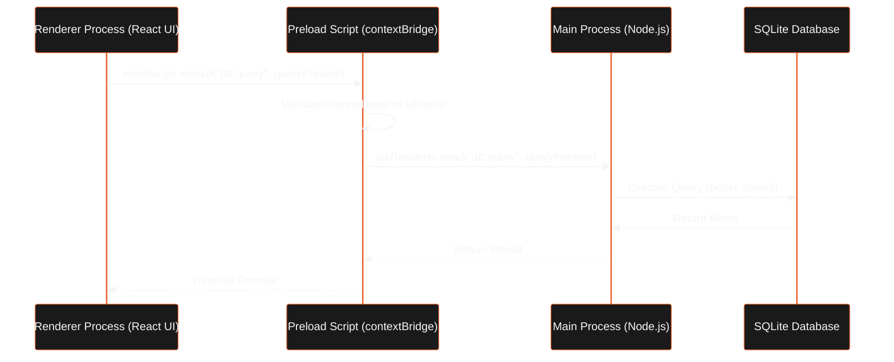

The LeadForge OS desktop application (`apps/desktop`) compiles into a native installer, providing local-first user interfaces, scrapers, and local database storage.

## Folder Structure

The desktop application conforms to the following layout:

```text
apps/desktop/
├── src/
│   ├── main/                  # Electron Main Process (Node.js runtime)
│   │   ├── database/          # SQLite connections, models, and migrations
│   │   ├── ipc/               # IPC handlers (observability, database, jobs)
│   │   ├── lib/               # Event bus, AppLogger, telemetry
│   │   ├── services/          # JobScheduler, SyncEngine, UpdateManager
│   │   └── workers/           # worker-host and scraper/outreach plugins
│   ├── preload/               # Electron Preload Script (contextBridge)
│   └── renderer/              # React UI Renderer (Chromium runtime)
│       ├── src/
│       │   ├── components/    # Reusable shadcn/ui React components
│       │   ├── hooks/         # React Query hooks calling window.ipc
│       │   ├── pages/         # Dashboard, CRM lists, Cockpit, Settings
│       │   └── App.tsx        # React Router routes and provider context
└── package.json               # Desktop scripts, dependencies, build targets
```

## IPC contextBridge Security

To comply with Electron security guidelines, the Renderer process has no direct access to Node.js APIs (such as `fs`, `child_process`, or raw SQLite packages). It communicates exclusively through the preload script context bridge.

The diagram below details the sequence of a secured database query initiated from the UI:



### Bridge API

The preload script exposes the `window.ipc` interface containing three methods:

- `window.ipc.invoke(channel, payload)`: Sends a request to the Main process and returns a Promise.
- `window.ipc.on(channel, callback)`: Listens for events sent from the Main process.
- `window.ipc.removeAllListeners(channel)`: Cleans up listeners when components unmount.

All channel strings are validated against a whitelist in `preload/index.ts` to prevent unauthorized execution.

## Local SQLite Database Connections

The desktop application manages local CRM records using SQLite through the `better-sqlite3` driver.

### WAL Mode & Connection Pools

- Database connections are initialized in WAL (Write-Ahead Logging) mode using `connection.ts` to support high-concurrency writes during crawler runs.
- `PRAGMA synchronous = NORMAL` is enabled to improve write performance while preserving database durability.
- Workspaces are physically isolated. Each workspace has its own database file named `leadforge_${workspaceId}.db` located in the OS appData directory.
- On boot, the migration runner applies schema statements sequentially, validating tables (`companies`, `contacts`, `jobs`, `sync_queue`, `automation_locks`).

## Constraints and Trade-offs

- **Process Memory Overhead**: Running Chromium (Renderer), Node.js (Main), and spawned Node workers consumes significant system memory.
- **Strict IPC Mapping**: Any data needed by the UI must be serialized across the IPC boundary, requiring schemas for all transaction payloads.

## Related

- [System Architecture](../architecture/system-overview.mdx)
- [Setup & Installation](../getting-started/installation.mdx)
