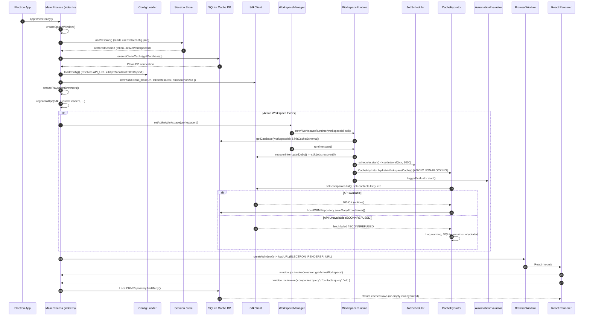

# Phase 1 Forensic Document 02 — Runtime Startup Trace

**Document Type:** Forensic Startup Trace  
**Audited Against:** Live Entrypoints (`apps/desktop/src/main/index.ts`, `apps/desktop/src/main/lib/workspace-runtime.ts`)  
**Date:** September 2026  
**Status:** Authoritative Baseline  

---

## 1. Startup Sequence Flowchart

---

## 2. Step-by-Step Execution Trace

### Step 1: Process Entry & Environment Loading
- **File:** [`apps/desktop/src/main/index.ts:21-37`](file:///c:/Users/91637/Desktop/Business%20Project/leadforge-os/apps/desktop/src/main/index.ts#L21-L37)
- **Action:** Synchronously attempts to load root `.env` if present.
- **Crash Reporter:** `LocalCrashReporter.initialize()` sets uncaught exception and unhandled rejection handlers.

### Step 2: Electron Ready Handshake
- **File:** [`apps/desktop/src/main/index.ts:168-176`](file:///c:/Users/91637/Desktop/Business%20Project/leadforge-os/apps/desktop/src/main/index.ts#L168-L176)
- **Action:** Native splash screen window created immediately via `createSplashWindow()`. `app.setAppUserModelId('com.leadforge.desktop')` sets Windows identity.

### Step 3: Session & Workspace Restoration
- **File:** [`apps/desktop/src/main/index.ts:178-195`](file:///c:/Users/91637/Desktop/Business%20Project/leadforge-os/apps/desktop/src/main/index.ts#L178-L195)
- **Action:** Calls `loadSession()` to retrieve stored authentication tokens and active workspace ID from `%APPDATA%/leadforge/config.json`.
- **Timing:** ~5-15 ms.
- **Fallback:** If session is null or corrupted, proceeds without active token.

### Step 4: Cache Schema Initialization
- **File:** [`apps/desktop/src/main/index.ts:197-201`](file:///c:/Users/91637/Desktop/Business%20Project/leadforge-os/apps/desktop/src/main/index.ts#L197-L201)
- **Action:** Calls `ensureCleanCache(getDatabase())` to verify SQLite cache integrity, execute WAL pragmas, and create cache tables if missing.

### Step 5: SdkClient Construction
- **File:** [`apps/desktop/src/main/index.ts:204-220`](file:///c:/Users/91637/Desktop/Business%20Project/leadforge-os/apps/desktop/src/main/index.ts#L204-L220)
- **Action:** Resolves `apiUrl` from `loadConfig()`:
  - Dev: `http://localhost:3001/api/v1`
  - Prod: `https://api.leadforge.kapiljangid.pro/api/v1`
  - Instantiates `SdkClient` with token resolver pointing to `activeToken`.

### Step 6: Playwright Engine Check
- **File:** [`apps/desktop/src/main/index.ts:222-234`](file:///c:/Users/91637/Desktop/Business%20Project/leadforge-os/apps/desktop/src/main/index.ts#L222-L234)
- **Action:** `ensurePlaywrightBrowsers()` checks if Chromium is installed. If installed, takes <10ms; on first launch, downloads Chromium binaries into user data.

### Step 7: IPC Handler Registration
- **File:** [`apps/desktop/src/main/index.ts:236-244`](file:///c:/Users/91637/Desktop/Business%20Project/leadforge-os/apps/desktop/src/main/index.ts#L236-L244)
- **Action:** `registerAllIpc()` registers 18 IPC modules and sets `WorkspaceManager.setSdk(sdk)`.

### Step 8: Workspace Runtime Activation
- **File:** [`apps/desktop/src/main/index.ts:247-258`](file:///c:/Users/91637/Desktop/Business%20Project/leadforge-os/apps/desktop/src/main/index.ts#L247-L258)
- **Action:** Calls `WorkspaceManager.setActiveWorkspace(wsId)`.
- **Runtime Startup Sequence:**
  1. `initCacheSchema(this.sqliteDb)` sets up 17 SQLite tables.
  2. `recoverInterruptedJobs()` calls `this.sdk.jobs.recover(0)`.
  3. `this.scheduler.start()` launches 3-second polling interval calling `POST /api/v1/jobs/claim`.
  4. `CacheHydrator.hydrateWorkspaceCache(this.workspaceId, this.sdk)` is launched asynchronously without `await`.
  5. `this.eventBridge.start()` binds local event bus to renderer IPC forwarder.
  6. `this.triggerEvaluator.start()` starts listening for CRM events to evaluate automation sequence triggers.

### Step 9: Renderer Window Creation
- **File:** [`apps/desktop/src/main/index.ts:298`](file:///c:/Users/91637/Desktop/Business%20Project/leadforge-os/apps/desktop/src/main/index.ts#L298)
- **Action:** `createWindow()` instantiates `BrowserWindow`, loads `ELECTRON_RENDERER_URL` (in dev) or `renderer/index.html` (in prod).
- **Renderer Boot:** React mounts, TanStack Query executes initial queries (`companies:list`, `contacts:list`, `discovery:run:list`, `scheduler:jobs:list`).

---

## 3. Failure & Fallback Behavior Analysis

| Stage | Failure Trigger | Observed Behavior | System Impact |
| :--- | :--- | :--- | :--- |
| **API Client Init** | API down (Port 3001 closed) | SdkClient initialized normally (no connection check at constructor). | App proceeds to start. |
| **Workspace Activation** | API down | `recoverInterruptedJobs()` catches network error with a warning. `scheduler.start()` begins 3s polling loop that catches network errors. | Workspace runtime is marked active and healthy despite API being unreachable. |
| **Cache Hydration** | API down | `CacheHydrator.hydrateWorkspaceCache()` fails on all 10 datasets (`fetch failed`). Errors are logged as warnings. | SQLite cache remains completely empty (0 companies, 0 contacts, 0 campaigns). |
| **Renderer Queries** | SQLite Cache Empty | IPC handlers (`companies:query`, `contacts:query`) execute SQL `SELECT * FROM companies` against empty SQLite table. | UI renders empty tables without displaying an "API Disconnected" banner. |
