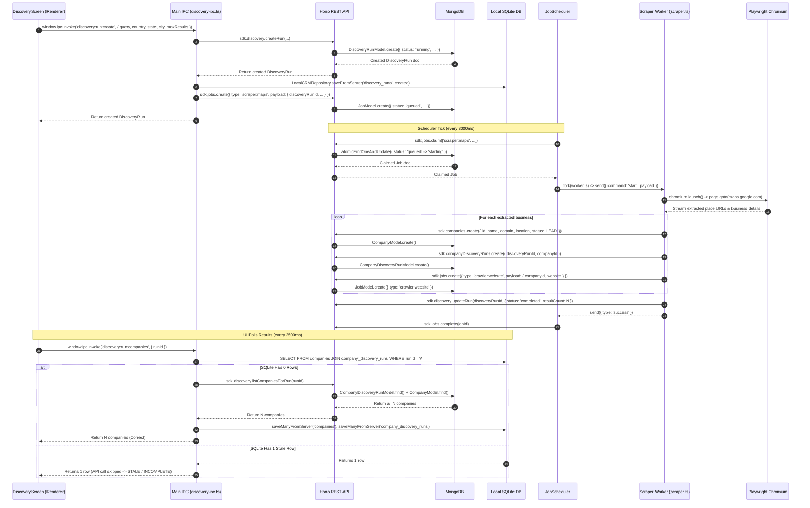

# Phase 1 Forensic Document 09 — Discovery Runtime Trace

**Document Type:** Forensic Subsystem Runtime Trace  
**Audited Against:** `DiscoveryScreen.tsx`, `discovery-ipc.ts`, `scraper.ts`, `business.ts`, `JobScheduler`  
**Date:** September 2026  
**Status:** Authoritative Baseline  

---

## 1. End-to-End Discovery Pipeline Sequence

---

## 2. Forensic Trace Breakdown

### 1. Run Creation
- **Trigger:** User fills form on `DiscoveryScreen.tsx` and clicks "New Discovery Run".
- **Handler:** [`apps/desktop/src/main/ipc/discovery-ipc.ts:7-58`](file:///c:/Users/91637/Desktop/Business%20Project/leadforge-os/apps/desktop/src/main/ipc/discovery-ipc.ts#L7-L58).
- **API Persistence:** Creates `DiscoveryRunModel` in MongoDB (`status: 'running'`).
- **Cache Persistence:** Calls `LocalCRMRepository.saveFromServer('discovery_runs', created)` in SQLite.
- **Job Creation:** Enqueues `scraper:maps` job via `sdk.jobs.create()`.

### 2. Job Scheduling & Worker Execution
- **Polling:** `JobScheduler` claims the job via `POST /api/v1/jobs/claim`.
- **Worker Fork:** Spawns `worker.js` with `type: 'scraper:maps'`.
- **Plugin:** [`apps/desktop/src/main/workers/plugins/scraper.ts`](file:///c:/Users/91637/Desktop/Business%20Project/leadforge-os/apps/desktop/src/main/workers/plugins/scraper.ts).
- **Extraction:** Playwright navigates to Google Maps, scrolls result feed, extracts details (name, domain, phone, address).

### 3. Business Lead Persistence
- **Company Save:** Calls `sdk.companies.create()` (persisted in MongoDB `companies` collection).
- **Run Junction Save:** Calls `sdk.companyDiscoveryRuns.create()` (persisted in MongoDB `company_discovery_runs` collection).
- **Crawler Chaining:** If website/domain present, enqueues `crawler:website` job in MongoDB.
- **Status Finalization:** Calls `sdk.discovery.updateRun(runId, { status: 'completed', resultCount: storedCount })`.

### 4. UI Query & Count Discrepancy Cause
- **Query Channel:** `discovery:run:companies` in [`discovery-ipc.ts:83-122`](file:///c:/Users/91637/Desktop/Business%20Project/leadforge-os/apps/desktop/src/main/ipc/discovery-ipc.ts#L83-L122).
- **Mechanism:** Executes SQLite query `SELECT DISTINCT c.* FROM companies c INNER JOIN company_discovery_runs cdr ON c.id = cdr.companyId WHERE cdr.discoveryRunId = ?`.
- **Root Cause of Count Mismatch:** If SQLite only contains 1 cached row (e.g. from an initial partial write), `rows.length` is 1, so the `if (!rows || rows.length === 0)` fallback check does NOT trigger. The IPC returns only that 1 row, hiding the remaining 4 companies stored in MongoDB.
