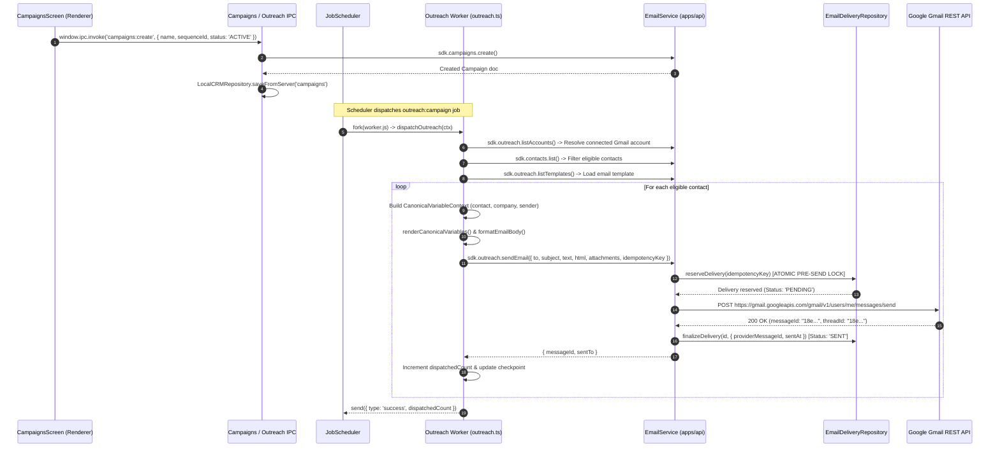

# Phase 1 Forensic Document 11 — Outreach & Campaign Runtime Trace

**Document Type:** Forensic Subsystem Runtime Trace  
**Audited Against:** `CampaignsScreen.tsx`, `campaigns-ipc.ts`, `outreach.ts` (Worker), `email.service.ts` (API), `gmail.provider.ts`  
**Date:** September 2026  
**Status:** Authoritative Baseline  

---

## 1. End-to-End Outreach Pipeline Sequence



---

## 2. Forensic Trace Findings Across Steps

### Step 1: Campaign Creation & Status Casing
- **Renderer:** `CampaignsScreen.tsx` submits campaign payload.
- **IPC Handler:** `campaigns-ipc.ts` / `crm.ts:366` normalizes status to uppercase (`DRAFT`, `ACTIVE`, `PAUSED`, `COMPLETED`).
- **API Guard:** `apps/api/src/routes/business.ts` validates status against `CampaignStatus` enum. If lowercase string `'active'` is sent, API returns 400 Validation Error.

### Step 2: Template Variable Resolution
- **Engine:** `packages/sdk/src/utils/variable-resolver.ts` (`renderCanonicalVariables`).
- **Trace in Worker:** [`apps/desktop/src/main/workers/plugins/outreach.ts:198-227`](file:///c:/Users/91637/Desktop/Business%20Project/leadforge-os/apps/desktop/src/main/workers/plugins/outreach.ts#L198-L227).
- **Forensic Defect (F-OUT-01):** The worker constructs company context using:
  ```typescript
  location: companyRow.address // BUG: company schema column is 'location', not 'address'
  ```
  Consequently, `companyRow.address` is `undefined`, causing `{{company.location}}` to always resolve to an empty string `""`.

### Step 3: Attachment Resolution & Drive Handshake
- **Local Attachment Path:** If `path` is provided, worker reads file directly into base64.
- **Drive Attachment Path:** If `attachmentId` is passed, `EmailService.send()` looks up `AttachmentModel` in MongoDB, checks connection access via `GoogleDriveProvider.verifyAccess()`, and downloads file stream via `GoogleDriveProvider.downloadFile()`.

### Step 4: Pre-Send Delivery Ledger Reservation
- **Function:** `EmailDeliveryRepository.reserveDelivery()`.
- **Atomic Guarantee:** Queries for existing `idempotencyKey`. If found and already marked `SENT`, returns existing `messageId` without calling Gmail API again, preventing duplicate sends.

### Step 5: Provider Dispatch (Gmail REST API)
- **Endpoint:** `POST https://gmail.googleapis.com/gmail/v1/users/me/messages/send`.
- **Payload:** Raw RFC 2822 base64url encoded MIME envelope created by `MimeBuilder.buildRaw()`.
- **Token Handling:** `GoogleAuthService.getValidAccessToken()` checks expiry and automatically refreshes access token using `encryptedRefreshToken`.

### Step 6: Post-Send Finalization & UI Reporting
- **Finalization:** Marks delivery document in MongoDB `status: 'SENT'`, records `sentAt` timestamp and `providerMessageId`.
- **UI Delivery Ledger Query:** When UI attempts to query deliveries (`email-deliveries:list`), the SDK `URLSearchParams` serialization bug (`?campaignId=undefined`) causes MongoDB to return an empty array.
