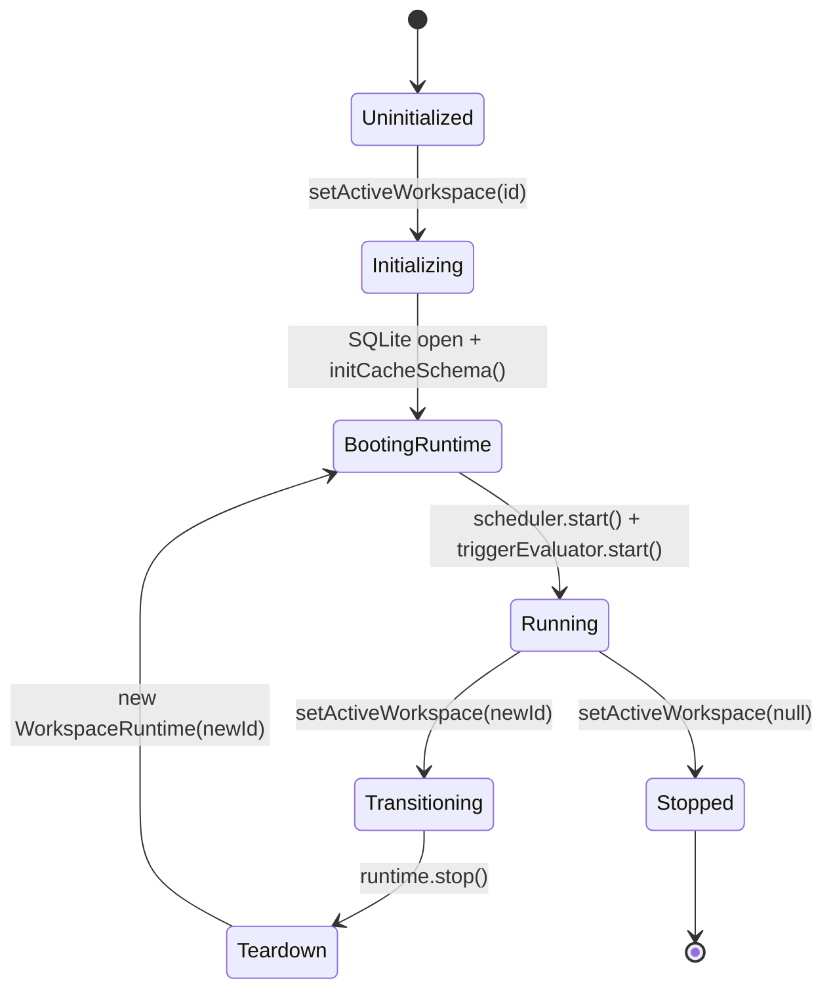

# Phase 1 Forensic Document 17 — Workspace Lifecycle Reality

**Document Type:** Forensic Lifecycle & Transition Audit  
**Audited Against:** `WorkspaceManager` (`apps/desktop/src/main/lib/workspace-manager.ts`), `WorkspaceRuntime` (`apps/desktop/src/main/lib/workspace-runtime.ts`)  
**Date:** September 2026  
**Status:** Authoritative Baseline  

---

## 1. Workspace Lifecycle State Machine

---

## 2. Transition Serialization Audit

### Evidence: [`apps/desktop/src/main/lib/workspace-manager.ts:33-109`](file:///c:/Users/91637/Desktop/Business%20Project/leadforge-os/apps/desktop/src/main/lib/workspace-manager.ts#L33-L109)

1. **Idempotency Check:** If `setActiveWorkspace(wsId)` is called for the already active workspace and no transition is pending, it returns `activeRuntime` immediately without restarting.
2. **Transition Promise Mutex:** If a transition is already in-flight, subsequent requests await `this.transitionPromise` before proceeding, preventing duplicate concurrent runtimes.
3. **Clean Teardown Protocol:**
   - Stops `JobScheduler` and terminates all running child worker processes (`worker.kill('SIGTERM')`).
   - Stops `EventBridge` to prevent event forwarding leaks to renderer.
   - Stops `AutomationTriggerEvaluator`.
   - Clears `LocalEventBus` listeners.
   - Closes SQLite connection handle via `closeDatabase(workspaceId)`.

---

## 3. Rapid Switching Test & Stale IPC Evaluation

### Test Sequence: `Workspace A` -> `Workspace B` -> `Workspace C` -> `Workspace A`

| Risk Area | Mechanism in Code | Risk Assessment |
| :--- | :--- | :--- |
| **Duplicate Schedulers** | `await this.activeRuntime.stop()` clears interval before creating new runtime. | **0% Risk (Guarded)** |
| **File Lock Collisions** | `closeDatabase(workspaceId)` closes SQLite handle prior to opening new DB. | **0% Risk (Guarded)** |
| **Worker Process Orphans** | `scheduler.stop()` sends `SIGTERM` to all active child workers. | **0% Risk (Guarded)** |
| **Stale IPC Responses** | IPC handlers accept explicit `{ workspaceId }` argument or read `activeRuntime.workspaceId`. | **Low Risk (Explicit payload scoping)** |
| **Renderer Query Invalidation**| Renderer `useWorkspace` hook changes `workspaceId` in query keys, triggering full React Query cache re-fetch. | **0% Risk (TanStack query key isolation)** |

---

## 4. Assessment

The Workspace Lifecycle implementation in `WorkspaceManager` and `WorkspaceRuntime` is **ROBUST, RACE-SAFE, AND CLEANLY ISOLATED**.
