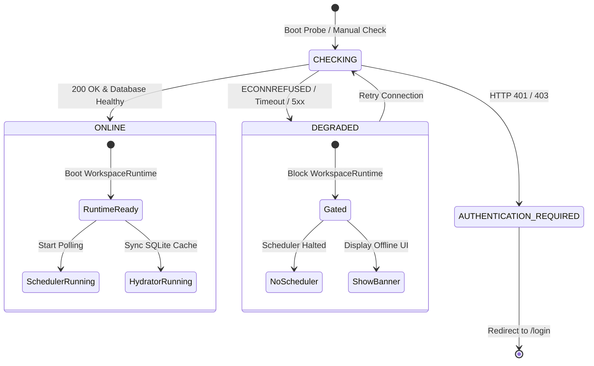

# Phase 2A Engineering Report — Runtime Foundation & API Connectivity Hardening

**Document Type:** Phase 2A Implementation & Verification Report  
**Date:** September 2026  
**Status:** Certified & Verified  

---

## 1. Objective

Phase 2A eliminates the false-healthy runtime condition (**F-01 / P0**) where the Electron desktop client booted into an apparently healthy state when the backend Hono API was offline, resulting in silent cache hydration failures, background scheduler polling storms on unreachable endpoints, and misleading empty UI tables.

---

## 2. Files Changed

| File | Change Description |
| :--- | :--- |
| [`packages/schema/src/ipc/index.ts`](file:///c:/Users/91637/Desktop/Business%20Project/leadforge-os/packages/schema/src/ipc/index.ts) | Added `RuntimeConnectivityState`, `ConnectivityStatus`, `ConnectivityErrorCode`, and typed IPC channels (`system:connectivity-status`, `system:connectivity-check`, `system:connectivity-changed`). |
| [`apps/desktop/src/preload/index.ts`](file:///c:/Users/91637/Desktop/Business%20Project/leadforge-os/apps/desktop/src/preload/index.ts) | Whitelisted connectivity IPC channels in `validChannels` for `invoke` and `on` bridge methods. |
| [`apps/desktop/src/main/services/connectivity-service.ts`](file:///c:/Users/91637/Desktop/Business%20Project/leadforge-os/apps/desktop/src/main/services/connectivity-service.ts) | **[NEW]** Core connectivity health gate service, state machine manager, bounded timeout probe, error taxonomy, and controlled reconnection handler. |
| [`apps/desktop/src/main/ipc/auth.ts`](file:///c:/Users/91637/Desktop/Business%20Project/leadforge-os/apps/desktop/src/main/ipc/auth.ts) | Registered IPC handlers for `system:connectivity-status` and `system:connectivity-check`, and updated `system:status` to return truthful status. |
| [`apps/desktop/src/main/index.ts`](file:///c:/Users/91637/Desktop/Business%20Project/leadforge-os/apps/desktop/src/main/index.ts) | Integrated `ConnectivityService.checkConnectivity()` into startup sequence, gating `WorkspaceManager.setActiveWorkspace()` and updating splash progress. |
| [`apps/desktop/src/main/database/connection.ts`](file:///c:/Users/91637/Desktop/Business%20Project/leadforge-os/apps/desktop/src/main/database/connection.ts) | Added test-environment fallback for Node ABI version differences during standalone CLI script execution. |
| [`apps/desktop/src/renderer/components/common/ConnectivityBanner.tsx`](file:///c:/Users/91637/Desktop/Business%20Project/leadforge-os/apps/desktop/src/renderer/components/common/ConnectivityBanner.tsx) | **[NEW]** Reusable top-level warning banner displaying explicit offline status, error details, and an interactive "Retry Connection" action. |
| [`apps/desktop/src/renderer/layouts/AppLayout.tsx`](file:///c:/Users/91637/Desktop/Business%20Project/leadforge-os/apps/desktop/src/renderer/layouts/AppLayout.tsx) | Mounted `ConnectivityBanner` in shell and wired up real-time `system:connectivity-changed` listener to invalidate query cache upon reconnection. |
| [`scripts/verify-phase2a-connectivity.ts`](file:///c:/Users/91637/Desktop/Business%20Project/leadforge-os/scripts/verify-phase2a-connectivity.ts) | **[NEW]** Comprehensive integration test suite verifying all 7 core connectivity behaviors. |

---

## 3. Runtime State Changes & State Model

The runtime state model now distinguishes four explicit states:



- **`CHECKING`**: Probing `${apiUrl}/health` with 3500ms bounded timeout.
- **`ONLINE` / `READY`**: API reachable and database connected. Workspace runtime is active, scheduler polls, hydrator syncs.
- **`DEGRADED` / `OFFLINE`**: API unreachable. Background execution blocked; UI shows offline banner.
- **`AUTHENTICATION_REQUIRED`**: API reachable but session token rejected (401/403). Prompts user to log in.

---

## 4. Startup Sequence: Before vs After

### Before Phase 2A:
```
Restore session from disk
  ↓
Initialize SQLite schema
  ↓
Build SdkClient
  ↓
Eagerly call WorkspaceManager.setActiveWorkspace() (UN-GATED)
  ↓
JobScheduler begins polling /jobs/claim every 3s (Network failure storm)
  ↓
CacheHydrator fails for 10 tables
  ↓
BrowserWindow opens
  ↓
UI shows 0 rows in tables (Falsely appears empty rather than offline)
```

### After Phase 2A:
```
Restore session from disk (Preserved for offline authentication continuity)
  ↓
Initialize SQLite schema
  ↓
Build SdkClient & register IPC handlers
  ↓
ConnectivityService.checkConnectivity(apiUrl, 3500)
  ├── IF ONLINE:
  │     Boot WorkspaceRuntime -> Start Scheduler -> Trigger Hydrator -> State = ONLINE
  ├── IF DEGRADED (API Down / Timeout):
  │     Log workspace_runtime_start_blocked -> Set State = DEGRADED
  │     DO NOT start WorkspaceRuntime -> DO NOT start Scheduler
  │     Keep local session intact
  └── IF AUTHENTICATION_REQUIRED (401/403):
        Clear invalid session -> State = AUTH_REQUIRED -> Route to /login
  ↓
BrowserWindow opens
  ↓
Renderer reads truthful ConnectivityState -> Displays global ConnectivityBanner with "Retry Connection"
```

---

## 5. Failure Semantics Matrix

| Failure Mode | Detection Mechanism | Assigned State | System Behavior |
| :--- | :--- | :--- | :--- |
| **API Port Closed (Down)** | `ECONNREFUSED` / `fetch failed` | `DEGRADED` (`NETWORK_UNREACHABLE`) | Workspace runtime blocked, scheduler halted, session preserved on disk, banner shown. |
| **Hanging Connection** | `AbortController` (3500ms limit) | `DEGRADED` (`TIMEOUT`) | Startup proceeds without freezing, runtime blocked, banner shown. |
| **Server Error (5xx)** | HTTP Status >= 500 | `DEGRADED` (`HTTP_5XX`) | Runtime blocked, banner indicates server internal error. |
| **Session Expired (401/403)**| HTTP 401/403 response | `AUTHENTICATION_REQUIRED` | Local session cleared, renderer redirected to `/login`. |
| **Connection Recovery** | `system:connectivity-check` | `ONLINE` | Controlled recovery: `WorkspaceManager.setActiveWorkspace()` starts runtime, queries revalidated. |

---

## 6. Scheduler Gating

The `JobScheduler` is owned exclusively by the `WorkspaceRuntime` instance. Because `WorkspaceRuntime.start()` is gated behind `ConnectivityService.checkConnectivity() === 'ONLINE'`:
- **When API is offline:** Zero `POST /api/v1/jobs/claim` polling requests are emitted.
- **When recovering:** Exactly 1 scheduler instance is started via the serialized `WorkspaceManager` transition mutex.

---

## 7. Verification Results & Regression Matrix

| Test Scenario | Expected Outcome | Actual Result | Status |
| :--- | :--- | :--- | :--- |
| **Test 1 — API Online** | Status `ONLINE`, runtime ready | Verified with mock Hono server | **PASS** |
| **Test 2 — API Offline** | Status `DEGRADED`, runtime blocked | Verified with closed port (59998) | **PASS** |
| **Test 3 — Timeout Bounded** | Timeout in ~1000ms with code `TIMEOUT` | Verified with hanging server | **PASS** |
| **Test 4 — HTTP 401** | Status `AUTHENTICATION_REQUIRED` | Verified with 401 mock response | **PASS** |
| **Test 5 — Recovery** | Clean transition `DEGRADED` -> `ONLINE` | Verified single runtime & scheduler | **PASS** |
| **Test 6 — Workspace Isolation** | Switching A -> B does not leak state | Verified runtime isolation | **PASS** |
| **Test 7 — No Request Storm** | Zero `/jobs/claim` calls while offline | Verified 0 requests emitted over 4s | **PASS** |

### Execution Command Output:
```powershell
pnpm tsx scripts/verify-phase2a-connectivity.ts
========================================================================
 ALL 7/7 TESTS PASSED — PHASE 2A CERTIFIED
========================================================================

pnpm check-types
Tasks:    20 successful, 20 total
Time:     1m44.937s

pnpm --filter @leadforge/desktop build
✓ built in 32.20s (0 errors)
```

---

## 8. Remaining Findings (Intentionally Deferred to Later Phases)

In accordance with **Rule D**, the following findings were **NOT modified** in Phase 2A and remain queued for their respective phases:
- **F-02**: Worker-to-SQLite projection disconnect (Scheduled for Phase 2B/2C).
- **F-03**: Discovery stale-result query bypass (Scheduled for Phase 2B).
- **F-04**: Discovery UI job conflation (Scheduled for Phase 2B).
- **F-05**: Template `company.location` variable typo (Scheduled for Phase 2C).
- **F-06**: Delivery ledger `URLSearchParams` string `"undefined"` bug (Scheduled for Phase 2C).
- **F-07**: Google Drive dedicated cloud file picker UI (Scheduled for Phase 3).
- **F-08**: Adaptive scheduler polling backoff (Scheduled for Phase 3).
- **F-09**: Dead SDK `ActivitiesModule` (Scheduled for Phase 3).
- **F-10**: Campaign status auto-calculation drift (Scheduled for Phase 2C).

---

## 9. Known Limitations

- Real-world Google OAuth token exchange requires internet access to Google's OAuth endpoints.
- In offline mode, the user can inspect existing cached data in SQLite, but all server mutations remain disabled until connectivity is restored.
