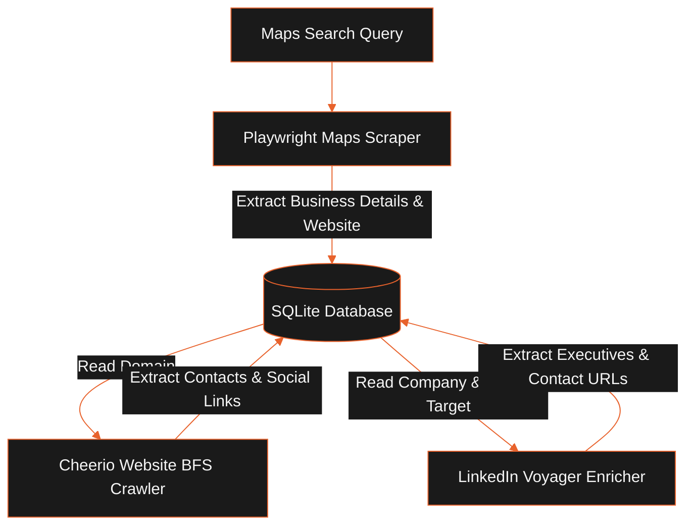

LeadForge OS integrates with Playwright scraping engines, Cheerio scrapers, DuckDuckGo searches, and standard SMTP/IMAP protocol clients to automate business discovery, lead enrichment, and outreach tracking.

## Scraping & Enrichment Pipeline

The flowchart below maps the data flow and task orchestration steps from an initial Maps query to a fully enriched CRM contact:

## Scraper Engines & Workers

### Google Maps Scraper (`scraper:maps`)

- **Runtime**: Headless Playwright (Chromium) browser environment.
- **Mechanism**:
  1. Spawns Chromium and executes search queries (e.g., "SaaS companies in Austin").
  2. Side-scrolls search panels to trigger infinite scroll load.
  3. Extracts business names, websites, ratings, physical addresses, and phone numbers.
  4. Follows website redirects to capture canonical root domains.
  5. Stores company rows in SQLite and schedules domain-crawling events.

### Website Crawler (`crawler:website`)

- **Runtime**: Node Fetch and Cheerio HTML parser.
- **Mechanism**:
  1. Executes BFS (Breadth-First Search) crawlers up to a maximum depth of 3 levels.
  2. Queries and conforms to rules in `robots.txt` using `robots-parser`.
  3. Scrapes DOM trees for `mailto:` contacts, phone strings, and social URLs.
  4. Ignores tracking pixels and hex-obfuscated spam email strings.
  5. Title-cases contact names and normalizes phone numbers.

### LinkedIn Voyager Enricher (`enrich:linkedin`)

- **Runtime**: Node HTTP request simulator using active session cookies.
- **Mechanism**:
  1. Reads session cookies (`li_at`) from encrypted secrets.
  2. Simulates headers to validate active login and retrieves CSRF tokens.
  3. Queries LinkedIn's internal Voyager API to locate executive profiles (CEOs, Founders, Owners, VPs).
  4. **DuckDuckGo Search Fallback**: If the session cookie is invalid or expired, the enricher queries DuckDuckGo searches to find LinkedIn profile URLs.

## Outreach Protocols

### SMTP Outreach (`outreach:campaign`)

- **Runtime**: Nodemailer client.
- **Mechanism**:
  - Decrypts workspace SMTP settings.
  - Generates email text from sequence templates, replacing contact tags (e.g., `{{contact.firstName}}`).
  - Dispatches emails using configured rate limits to preserve sending IP reputation.

### IMAP Polling (`outreach:imap-poll`)

- **Runtime**: ImapFlow client.
- **Mechanism**:
  - Connects to IMAP servers using decrypted credentials.
  - Queries incoming emails from the inbox.
  - Correlates incoming emails with sent outreach logs using `In-Reply-To` and `References` headers.
  - If a reply matches, updates contact status to `REPLIED` and pauses outreach sequence steps for that lead.

## Constraints and Trade-Offs

- **Session Expirations**: LinkedIn Voyager API enrichment requires active session cookies (`li_at`). If cookies expire, enrichment falls back to less accurate DuckDuckGo search queries.
- **Rate Limiting**: Headless browser automation must throttled to avoid IP blacklisting or CAPTCHAs.

## Related

- [System Architecture](../architecture/system-overview.mdx)
- [Workflow Engine](../workflows/workflow-engine.mdx)
- [Setup & Installation](../getting-started/installation.mdx)
