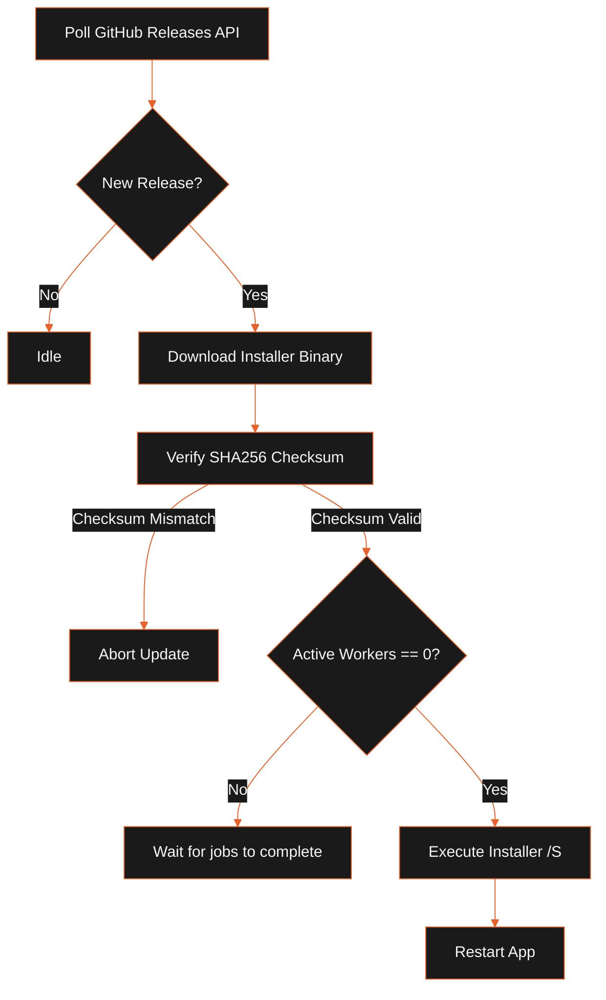

This guide outlines our release process, versioning strategies, packaging, and auto-updater roadmaps.

## Versioning Strategy

We use Changesets to coordinate version increments and generate changelogs across our packages and applications:

### Adding a Changeset

Whenever you make a user-facing change that requires a version increment, run:

```bash
npx changeset
```

1. Select the packages that have changed (e.g. `@leadforge/desktop`).
2. Select the version bump type: `major`, `minor`, or `patch`.
3. Provide a summary of the changes. This will be automatically added to `CHANGELOG.md` files upon release.

### Versioning in CI

On release integration runs:

```bash
npx changeset version
```

This bumps version fields in `package.json` files and compiles changelogs.

## Packaging and Compiling

We package the desktop application using `electron-vite` for bundling and `electron-builder` for installer packaging.

### Windows Installer

To build the setup installer for Windows:

```bash
pnpm package
```

This runs `electron-builder --win` under the hood. The resulting installer will be located under `apps/desktop/dist/leadforge-setup-<version>.exe`.

## Code Signing Roadmap

Currently, our beta releases are unsigned to minimize operational overhead. In production releases, we enforce code signing:

### Windows SmartScreen Code Signing

- **Target**: Evade SmartScreen warnings on installation.
- **Roadmap**: Integrate EV (Extended Validation) Code Signing Certificates into CI/CD pipelines via cloud HSM (Hardware Security Module) signing (e.g. SignPath).

### macOS Gatekeeper Code Signing

- **Target**: Prevent macOS Gatekeeper warnings.
- **Roadmap**: Register an Apple Developer account and sign/notarize macOS `.dmg` files using Apple's `notarytool` API integrated inside Turborepo release tasks.

## Auto-Updater System

Our update manager (`updater.ts`) coordinates downloads and verifies executable integrity before installation.

The flowchart below maps the update verification and installation loop:



1. **Polling**: The desktop application periodically queries the GitHub Releases API for new releases matching target tags.
2. **Download & Verify**: Downloads the installer binary along with its signature metadata. The updater verifies the download's SHA256 checksum against release records.
3. **Execution Safety**: The update manager checks that no background crawler tasks or email sender workers are running (`activeWorkers.size === 0`) before running the installer.
4. **Silent Update**: On Windows, it spawns the installer with the `/S` flag to perform a silent, zero-click update.

## Support Bundles & Diagnostics

In case of user issues, we collect local logs without violating privacy:

1. The user exports a **Support Bundle** from the Diagnostics cockpit.
2. The application compresses the daily log files (`leadforge.log`) and configuration states into a single ZIP file.
3. All sensitive parameters (`openRouterKey`, `smtpPassword`, `imapPassword`) are replaced with `[MASKED]` during collection.
4. The user attaches the ZIP file to a GitHub issue.

## Related

- [Setup & Installation](../getting-started/installation.mdx)
- [System Architecture](../architecture/system-overview.mdx)
- [Developer Guides](../development/developer-guides.mdx)
