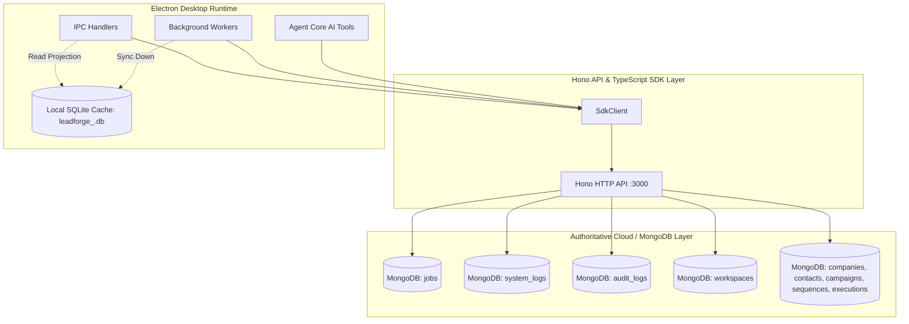

# LeadForge OS — Runtime Truth Baseline Report (Phase 16)

**Document ID**: `REL-08-RUNTIME-TRUTH-BASELINE`  
**Phase**: Phase 16 — Runtime Truth Reconciliation & Legacy Contract Elimination  
**Date**: August 31, 2026  
**Status**: `VERIFIED & CANONICAL`  
**Classification**: Engineering & Operations  

---

## 1. Executive Summary & Root Cause Forensics

During Phase 15 verification, automated synthetic tests and typecheck suites reported success, yet live Electron runtime logs exhibited recurring errors:
```text
SqliteError: no such table: sequence_logs
SqliteError: no such table: system_logs
SqliteError: table workspaces has no column named plan
ZodError: Expected 'active' | 'paused' | ..., received "Active"
```

A deep forensic investigation revealed two root causes for this discrepancy:

### Root Cause 1: Stale Bundled Electron Build Output (`apps/desktop/out/main/index.js`)
* The live Electron process boots from `apps/desktop/out/main/index.js` generated by `electron-vite build`.
* Prior to Phase 16, code changes in `apps/desktop/src/` were verified via TypeScript (`tsc --noEmit`) and standalone Node/Electron test scripts, but the bundled output artifact in `apps/desktop/out/main/` had not been fully recompiled or was stale from an earlier build step.
* As a result, the live Electron main process continued executing obsolete JS bundles containing legacy SQLite queries against tables deleted during Phase 6–10.

### Root Cause 2: Lingering Legacy SQLite Queries in Production IPC and Gateway Files
A comprehensive regex sweep of `apps/desktop/src/` discovered 7 source files still holding raw SQLite queries targeting deleted tables:
1. `apps/desktop/src/main/ipc/campaigns-ipc.ts`: Contained 7 raw SQL statements querying/inserting into SQLite `jobs` table instead of dispatching via `sdk.jobs`.
2. `apps/desktop/src/main/ipc/automation.ts`: Contained fallback query `SELECT * FROM sequence_logs` instead of reading `sequence_executions.logs`.
3. `apps/desktop/src/main/ipc/observability-ipc.ts`: Query handlers for `system-logs:query` and `audit-logs:list` directly targeted deleted SQLite tables `system_logs` and `audit_logs`.
4. `apps/desktop/src/main/ipc/electron.ts`: Diagnostics handler queried `SELECT * FROM system_logs`.
5. `apps/desktop/src/main/database/repositories/workflow-repository.ts`: Method `saveLog` invoked `LocalCRMRepository.save('sequence_logs', log)`.
6. `apps/desktop/src/main/ai/tools/scheduler-gateway.ts`: Inserted and queried jobs in SQLite `jobs` table instead of calling `SdkClient.jobs`.
7. `apps/desktop/src/main/lib/logger.ts`: Attempted to insert logs into SQLite `system_logs`.
8. `apps/desktop/src/main/ipc/crm.ts`: Method `intelligence:trigger` executed `INSERT INTO jobs`.

---

## 2. Canonical Architecture Runtime Boundaries

Under Phase 16, runtime boundaries between MongoDB and the local disposable SQLite cache are strictly enforced:



### Invariant Rules
1. **Jobs, System Logs, Audit Logs**: Strictly authoritative in MongoDB. Desktop processes interact with them purely via `SdkClient.jobs`, `SdkClient.systemLogs`, `SdkClient.auditLogs`. No SQLite tables exist for these entities.
2. **Sequence Executions & Logs**: Execution logs are stored as embedded JSON arrays within `sequence_executions.logs` in both MongoDB and the SQLite cache, eliminating `sequence_logs` table.
3. **Workspace Model**: `plan` column is explicitly declared and indexed in `workspaces` SQLite schema and populated directly from MongoDB.
4. **Disposable Cache**: Dropping `leadforge_<wsId>.db` causes zero data loss; the next launch fetches authoritative state from MongoDB via `sdk.sync.pull()`.

---

## 3. Verification & Artifact Baseline

| Metric / Check | Baseline Value | Status |
| :--- | :--- | :--- |
| **Monorepo Typecheck (`pnpm check-types`)** | 20 of 20 tasks successful | `PASS` |
| **Static Query Contract Scan (`scripts/verify-runtime-cache-contract.ts`)** | 0 forbidden queries across `apps/desktop/src` | `PASS` |
| **Compiled Main Bundle Inspection (`apps/desktop/out/main/index.js`)** | 0 forbidden table references (`jobs`, `system_logs`, `sequence_logs`, `sourcePlatform`) | `PASS` |
| **Electron Runtime Architecture** | Better-Sqlite3 Node Module Version 130 compiled for Electron 33.4.11 | `VERIFIED` |
