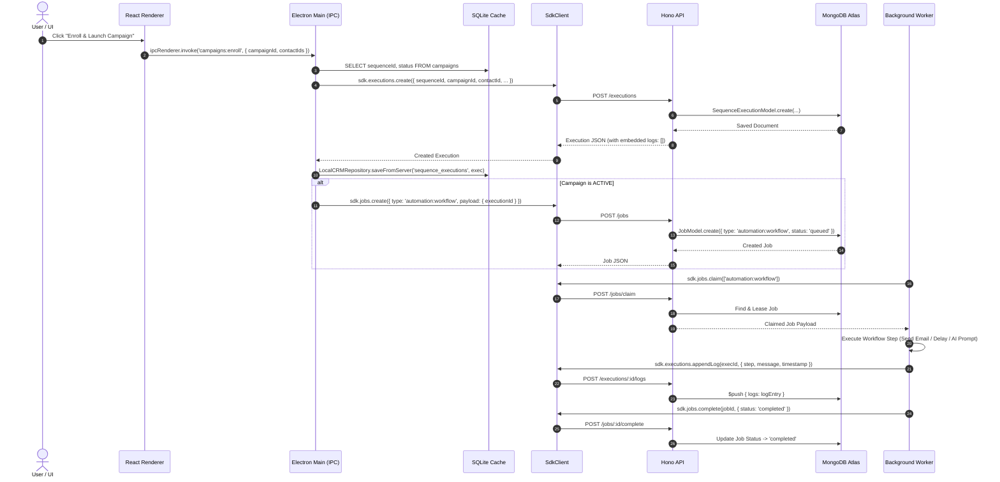

# LeadForge OS — Outreach & Campaign Runtime Trace (Phase 16)

**Document ID**: `REL-09-OUTREACH-RUNTIME-TRACE`  
**Phase**: Phase 16 — Runtime Truth Reconciliation & Legacy Contract Elimination  
**Date**: August 31, 2026  
**Status**: `VERIFIED & OPERATIONAL`  

---

## 1. Overview & Flow Architecture

This document maps the complete end-to-end execution path of the Outreach and Campaign automation engine, showing exact contracts across Renderer UI, Electron IPC, SDK, Hono API, MongoDB, and Worker Dispatchers.



---

## 2. Key IPC Channels & Implementation Details

### 1. `campaigns:enroll` (`apps/desktop/src/main/ipc/campaigns-ipc.ts`)
* Validates `campaignId` and non-empty `contactIds`.
* Queries target campaign from SQLite cache to extract `sequenceId` and `status`.
* Enrolls contacts idempotently via `sdk.executions.create`.
* Saves created executions into local cache `sequence_executions`.
* If campaign is `ACTIVE`, spawns workflow jobs directly in MongoDB via `sdk.jobs.create`.

### 2. `campaigns:enrollments:list`
* Performs an enriched read projection joining SQLite cache tables:
  ```sql
  SELECT 
    se.*, c.firstName, c.lastName, c.email, c.title as contactTitle,
    comp.name as companyName, comp.domain as companyDomain, s.name as sequenceName
  FROM sequence_executions se
  LEFT JOIN contacts c ON se.contactId = c.id
  LEFT JOIN companies comp ON c.companyId = comp.id
  LEFT JOIN sequences s ON se.sequenceId = s.id
  WHERE se.campaignId = ? AND se.deletedAt IS NULL
  ORDER BY se.createdAt DESC
  ```
* Deserializes embedded JSON `logs` array for instant UI rendering without hitting secondary log tables.

### 3. `campaigns:bulk-pause-enrollments`
* Updates local SQLite cache status to `PAUSED`.
* Fetches active workflow jobs from MongoDB via `sdk.jobs.list({ limit: 100 })` and cancels them via `sdk.jobs.cancel(jobId)`.

### 4. `campaigns:bulk-resume-enrollments`
* Transitions paused sequence executions back to `RUNNING` or `WAITING` depending on `nextExecutionAt`.
* Immediately schedules pending workflow jobs in MongoDB via `sdk.jobs.create`.

### 5. `campaigns:runtime:overview`
* Aggregates real-time active workflow jobs from MongoDB (`sdk.jobs.list`) correlated with SQLite cache `sequence_executions` waiting for future timers.

---

## 3. Data Integrity & Verification

1. **Embedded Log Integrity**: Execution logs never invoke raw `sequence_logs` SQL. All logs reside in `SequenceExecution.logs: []`.
2. **Deterministic Enums**: All status strings (`ACTIVE`, `PAUSED`, `COMPLETED`, `RUNNING`, `WAITING`) are normalized to prevent case-sensitivity or casing mismatches between renderer and backend.
3. **Safe Idempotency**: Campaign enrollments check for existing active executions prior to inserting, avoiding duplicate outreach blasts.
