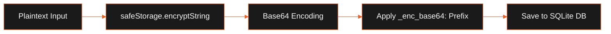

LeadForge OS enforces strict security and privacy standards, keeping outpatient prospecting data isolated, encrypted on disk, and isolated from external networks.

## Security Principles

The desktop application complies with the following security guidelines:

- **Sandbox Isolation**: Headless browsers (Playwright) and crawlers (Cheerio) run in sandboxed child processes with restricted environment variables and standard IO pipes.
- **Context Isolation**: React UI layers cannot access Node.js modules or write to the file system directly. All actions pass through a whitelisted IPC context bridge.
- **OS Keychain Integration**: Credentials must be encrypted using OS-native encryption managers (Windows Data Protection API or macOS Keychain).

## Secrets Handling & API Key Storage

We use Electron's `safeStorage` API to encrypt sensitive keys and passwords before saving them to disk.

The diagram below details the sequence of credential encryption:



### Database Prefixing

All encrypted settings in SQLite are stored with the prefix `_enc_base64:`.

```text
_enc_base64:AAAAAAAAAAAABBBBBBBBE/Cl+sBAAAA...
```

### Decryption Limits and Fallbacks

Because child workers and test scripts (e.g. `smoke-test.ts`) run outside the Electron main context, `safeStorage` is unavailable in those processes.

- **Main Process Decryption**: The Main process decrypts the credentials and passes them to the child worker's startup environment.
- **Fallback Policy**: In testing environments, if `safeStorage.isEncryptionAvailable()` returns `false`, the system prints a warning and falls back to plain text to support headless CI pipelines.

## Credential Masking in Logs

To prevent accidental credentials leaks in logs and support requests:

- Structured logs and error logs are scanned for common credentials keys (`openRouterKey`, `smtpPassword`, `imapPassword`, `sessionCookie`).
- Matched values are replaced with `[MASKED]`.
- This masking rule is applied to the **Support Bundle Export** ZIP to ensure no plain text secrets leave the client machine.

## Local Telemetry & Privacy

- **Local-Only Metrics**: System latency, crawls counts, and scheduler heartbeats are written to local logs. No data is automatically uploaded to remote telemetry hosts.
- **Opt-in Diagnostics**: Technical logs are shared only when you manually generate and attach a Support Bundle to a bug report.
- **No Code Execution**: We do not download or run unverified remote code in preload context or IPC handlers.

## Responsible Disclosure

If you discover a security vulnerability in LeadForge OS, please report it:

1. **Contact**: Do not open a public GitHub issue. Send details to `security@leadforge.dev`.
2. **Include**: A proof of concept (PoC) or step-by-step instructions to reproduce the issue.
3. **Timeline**: We aim to resolve and coordinate a patch within 30 days of disclosure.

## Related

- [System Architecture](../architecture/system-overview.mdx)
- [Setup & Installation](../getting-started/installation.mdx)
- [Electron Desktop App](../desktop/electron-desktop.mdx)
