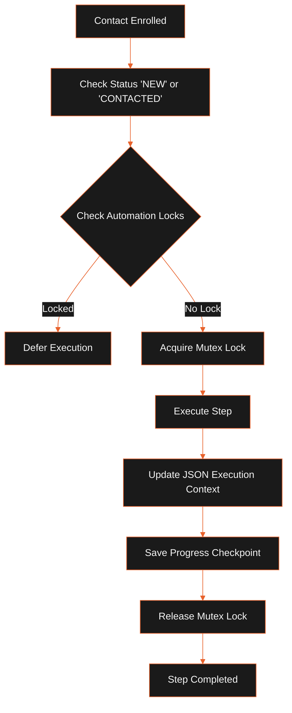

The workflow engine executes sequential marketing and outreach flows for contacts enrolled in campaigns. Long-running sequence steps are routed to the sandboxed worker plugin `automation:workflow` (`automation.ts`).

## Workflow Execution Model

The diagram below maps the execution lifecycle and lock acquisition flow of an active workflow session:



## Sequence Steps Reference

A sequence is defined as an array of step objects. The runner resolves and executes each step sequentially:

| Step Type | Parameter Schema | Description |
| :--- | :--- | :--- |
| `WAIT` | `{ "durationSeconds": number }` | Pauses execution for a specified duration before checking the next step. |
| `SEND_EMAIL` | `{ "templateId": string, "fromEmail": string }` | Renders tokens (`{{contact.firstName}}`), dispatches the email via the SMTP worker, and logs the activity. |
| `IF` | `{ "condition": string }` | Evaluates a conditional expression in a sandboxed context and branches the execution path. |
| `GOTO` | `{ "targetStepIndex": number }` | Jumps to a specific step index. The engine caps GOTO loops to a maximum of 100 jumps per run to prevent infinite loops. |
| `HTTP_REQUEST` | `{ "url": string, "method": string, "headers": object, "body": object }` | Triggers external webhooks. Authorization and session headers are redacted from debug logs to prevent secret leakage. |

## Worked Sequence Example

The following JSON schema represents a typical two-step follow-up sequence with a conditional branch:

```json
[
  {
    "type": "SEND_EMAIL",
    "params": {
      "templateId": "tmpl_welcome",
      "fromEmail": "sales@company.com"
    }
  },
  {
    "type": "WAIT",
    "params": {
      "durationSeconds": 86400
    }
  },
  {
    "type": "IF",
    "params": {
      "condition": "contact.opportunityScore > 75"
    }
  }
]
```

## Concurrency & Step Locks

To prevent race conditions where multiple campaign triggers execute the same sequence for the same contact at the same time:

- The engine creates a mutex record in the `automation_locks` table.
- A lock is keyed by the combination of `sequenceId` and `entityId` (contact ID).
- Locks expire automatically after 5 minutes to prevent permanent stalls if a worker process crashes unexpectedly.

## Execution Context & Checkpoints

- **Execution Context**: The engine tracks variables, contact states, and execution histories inside a JSON object stored in the database (`executionContext`).
- **Checkpoint Data**: When a sequence is paused, the worker saves the current step index and variables to `checkpointData` in SQLite before exiting. When restarted, the scheduler passes this data back to resume execution from the exact checkpoint.

## Related

- [System Architecture](../architecture/system-overview.mdx)
- [Setup & Installation](../getting-started/installation.mdx)
