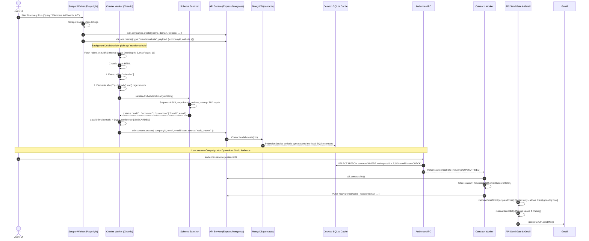

# LeadForge OS — Phase 1: Forensic Audit of Email Discovery & Correctness

**Date**: September 4, 2026  
**Auditor**: LeadForge OS Reliability & Quality Engineering  
**Scope**: End-to-End Email Discovery Lifecycle (`scraper.ts`, `crawler.ts`, `email-sanitizer.ts`, `Contact` Schema, API Persistence, SQLite Projection, Audiences, Campaign Outreach Dispatch)  
**Status**: Completed Forensic Audit & Target Architecture Specification (Design Only)  

---

## 1. Executive Findings

A line-by-line forensic investigation of the LeadForge OS discovery, extraction, sanitization, and outreach pipelines revealed the root causes behind previously observed email corruption, as well as critical architectural blind spots in the current codebase:

1. **Root Cause of Production String Corruption**:
   - The five observed production corruptions (`princetonaz.comcareerscareers@...`, `bidsestimating@...serviceservice`, `requestswarranty@...rfps`, `informationinfo@...warranty`, `filler@godaddy.combookingsmy`) were caused by Cheerio's `$('body').text()` concatenating adjacent DOM text nodes across navigation menus, headers, footers, and anchor elements without whitespace separators.
   - The recent mitigation (`$('p, div, ...').after(' ')`) is tag-name-whitelist-based and incomplete: unlisted semantic elements (`<address>`, `<nav>`, `<aside>`, `<label>`, `<button>`, `<mark>`, `<time>`, `<figure>`, `<figcaption>`) and inline sibling text nodes continue to concatenate without spaces.

2. **Severe False-Positive TLD Invalidation in `email-sanitizer.ts`**:
   - In [email-sanitizer.ts](file:///c:/Users/91637/Desktop/Business%20Project/leadforge-os/packages/schema/src/utils/email-sanitizer.ts), `isValidTld()` checks if an unrecognized TLD begins with any entry in `COMMON_TLDS` via `lower.startsWith(known)`.
   - Because `COMMON_TLDS` contains 2-letter country code TLDs (`co`, `pl`, `ca`, `de`, `fi`, `me`, `sh`), **all legitimate gTLDs starting with those prefixes are falsely rejected as corrupted strings**:
     - `.plumbing` (local service businesses) is rejected because `'plumbing'.startsWith('pl')` (Poland).
     - `.company` and `.community` are rejected because they start with `'co'` (Colombia).
     - `.catering`, `.care`, and `.camera` are rejected because they start with `'ca'` (Canada).
     - `.dental`, `.dentist`, and `.delivery` are rejected because they start with `'de'` (Germany).
     - `.fitness` and `.financial` are rejected because they start with `'fi'` (Finland).
     - `.menu` is rejected because it starts with `'me'` (Montenegro).

3. **Compound Public Suffixes Are Dead Code in Domain Validation**:
   - `COMMON_TLDS` defines compound TLDs (`'co.uk'`, `'com.au'`, `'co.in'`), but `isValidDomain(domain)` executes `domain.split('.')` and evaluates **only the last array element** (`labels[labels.length - 1]`).
   - Consequently, for `example.co.uk`, `isValidTld` receives only `'uk'`. The compound entries in `COMMON_TLDS` never match during standard domain validation.

4. **Silent Destruction of International / Accented Characters**:
   - Line 214 of `email-sanitizer.ts` executes `raw.trim().replace(/[^\x20-\x7E]/g, '')`.
   - This regex unconditionally strips all characters outside standard 7-bit ASCII, silently corrupting international names and addresses (e.g. `josé@domain.com` is permanently mutated to `jos@domain.com`, `müller@domain.de` to `mller@domain.de`).

5. **Lack of Domain Affiliation Matching (External Credit Hijacking)**:
   - `crawler.ts` crawls a company's website and extracts all regex-matching email addresses.
   - It performs **zero validation** that the extracted email's domain matches the target company's domain.
   - Discovered vendor credits ("Website by `contact@webagency.com`", "SEO by `agency@seofirm.com`", "Powered by `help@shopifypartner.com`") are assigned directly to the crawled company as employee contacts.

6. **Total Absence of Campaign Safety Boundary in Outreach & Audiences**:
   - While `ContactEmailStatus.QUARANTINED` was introduced to flag corrupted records, neither [audiences-ipc.ts](file:///c:/Users/91637/Desktop/Business%20Project/leadforge-os/apps/desktop/src/main/ipc/audiences-ipc.ts) nor [outreach.ts](file:///c:/Users/91637/Desktop/Business%20Project/leadforge-os/apps/desktop/src/main/workers/plugins/outreach.ts) filters contacts by `emailStatus`.
   - `audiences-ipc.ts` executes `SELECT id FROM contacts WHERE workspaceId = ? AND deletedAt IS NULL`, and `outreach.ts` filters only against `unsubscribed`, `bounced`, and `do_not_contact`.
   - Quarantined contacts are actively loaded into campaigns and dispatched to the sending queue.

7. **Zero Provenance and Discarded Classification**:
   - In `crawler.ts`, `classifyEmail(email)` calculates `{ type, confidence }` (e.g. `personal`, `role_based`, confidence `0.95`, `0.65`), but these values are **immediately discarded** because the `Contact` schema has no fields to store them.
   - Contacts retain no record of their discovery URL, raw candidate string, extraction method (`mailto` vs regex text), or whether heuristic repair was applied.

---

## 2. Current End-to-End Data Flow

The following diagram traces the exact runtime lifecycle from discovery initiation to email dispatch in the current codebase:



---

## 3. Corruption Forensics: The Five Production Examples

Every known production corruption pattern was traced to its exact source and transformation stages:

| # | Raw Scraped Input | Extraction Result (`crawler.ts`) | Sanitizer Result (`email-sanitizer.ts`) | Persisted Result | Exact Failure Mechanism |
| :- | :--- | :--- | :--- | :--- | :--- |
| **1** | `<div class="logo">princetonaz.com</div><a href="/careers">careers</a><a href="mailto:careers@princetonaz.com">careers@princetonaz.com</a>` | `princetonaz.comcareerscareers@princetonaz.com` | `{ status: 'recovered', email: 'careers@princetonaz.com' }` | `email: "careers@princetonaz.com"`, `emailStatus: UNVERIFIED` | **Adjacent DOM Concatenation**: `$('body').text()` concatenated logo text, anchor text, and email. Sanitizer recognized host prefix (`princetonaz.com`) and reduplicative local token (`careerscareers` $\rightarrow$ `careers`). |
| **2** | `<a href="mailto:bidsestimating@princetonaz.com">bidsestimating@princetonaz.com</a><a href="/services">service</a><a href="/services">service</a>` | `bidsestimating@princetonaz.comserviceservice` | `{ status: 'recovered', email: 'bidsestimating@princetonaz.com' }` | `email: "bidsestimating@princetonaz.com"`, `emailStatus: UNVERIFIED` | **Greedy Regex & Suffix Concatenation**: Unspaced footer links appended `serviceservice`. Regex matched `\.comserviceservice` as a valid TLD. Sanitizer stripped `.com` suffix via `attemptDomainRepair`. |
| **3** | `<span>requests</span><a href="mailto:warranty@princetonaz.com">warranty@princetonaz.com</a><span>rfps</span>` | `requestswarranty@princetonaz.comrfps` | `{ status: 'recovered', email: 'requestswarranty@princetonaz.com' }` | `email: "requestswarranty@princetonaz.com"`, `emailStatus: UNVERIFIED` | **Double Sibling Concatenation**: Preceding span `requests` merged with local part, trailing span `rfps` merged with domain. Sanitizer stripped `.com` suffix to recover domain, but local part remained mangled (`requestswarranty`). |
| **4** | `<nav>Information</nav><a href="mailto:info@princetonaz.com">info@princetonaz.com</a><section>Warranty</section>` | `informationinfo@princetonaz.comwarranty` | `{ status: 'recovered', email: 'info@princetonaz.com' }` | `email: "info@princetonaz.com"`, `emailStatus: UNVERIFIED` | **Navigation Word Merging**: Nav label `Information` concatenated with `info@`. Sanitizer executed hardcoded special case (`startsWith('information') && endsWith('info')` $\rightarrow$ `info`) and repaired domain. |
| **5** | `<div class="parked-holder">filler@godaddy.com</div><div class="menu">bookings</div><div>my</div>` | `filler@godaddy.combookingsmy` | `{ status: 'quarantine', reason: 'Ambiguous filler/placeholder address...' }` | `email: "filler@godaddy.combookingsmy"`, `emailStatus: QUARANTINE` | **Parked Registrar Template**: Scraped website was an unconfigured GoDaddy parked landing page. Sanitizer caught `godaddy.com` in `PARKING_OR_REGISTRAR_DOMAINS` and quarantined the address. |

---

## 4. Scraper Findings: DOM Traversal & Extraction Deficiencies

An audit of [crawler.ts](file:///c:/Users/91637/Desktop/Business%20Project/leadforge-os/apps/desktop/src/main/workers/plugins/crawler.ts) revealed four structural flaws in HTML extraction:

### 4.1. Whitelist-Based Space Injection Is Incomplete
In `crawler.ts` line 401:
```typescript
$('p, div, h1, h2, h3, h4, h5, h6, li, td, th, span, a, section, article, header, footer, br, hr').after(' ');
const bodyText = $('body').text() || '';
```
- **The Defect**: This targets only 18 specific tag names. Modern web applications utilize numerous other block, inline-block, and semantic HTML elements:
  `<address>`, `<nav>`, `<aside>`, `<main>`, `<label>`, `<button>`, `<small>`, `<strong>`, `<em>`, `<b>`, `<i>`, `<mark>`, `<time>`, `<figure>`, `<figcaption>`, `<summary>`, `<details>`, `<dd>`, `<dt>`, `<blockquote>`.
- **The Consequence**: Text inside `<address>info@company.com</address><nav>Home About</nav>` or `<label>Email:</label><span>sales@company.com</span>` concatenates without spaces.
- **Sibling Ordering Asymmetry**: Calling `.after(' ')` on an element places a space *after* that element's closing tag, not before its opening tag. If an inline text node precedes an element (e.g. `Contact: <span>info@company.com</span>`), no space is inserted between `Contact:` and `info@`.

### 4.2. Failure to Prioritize Structured & Explicit Sources
- Websites contain high-confidence explicit contact declarations:
  1. `<a href="mailto:...">` (RFC 6068 URI, explicit author intent).
  2. JSON-LD / Schema.org structured metadata (`<script type="application/ld+json">` with `LocalBusiness`, `Organization`, `ContactPoint`).
  3. Microdata / OpenGraph tags (`og:email`, `itemprop="email"`).
- In the current implementation:
  - JSON-LD and OpenGraph metadata are completely ignored.
  - While `mailto:` links are extracted, they are placed into the exact same `pageEmails` set as body text matches, with no tag indicating their superior evidentiary weight.

### 4.3. Unrestricted Domain Attribution (Third-Party Contamination)
- `crawler.ts` extracts any email matching regex from any crawled page.
- If an agency credit ("Designed by `support@pixelperfect.design`"), payment provider, or external widget appears on `acmeplumbing.com`, the agency's email is persisted as an employee contact of Acme Plumbing.
- The crawler has access to `ctx.payload.website` and `companyId`, but never evaluates `candidateEmail.split('@')[1] === companyDomain`.

### 4.4. Name Inference Hallucination
- Lines 144–165 of `crawler.ts` attempt to derive `firstName` and `lastName` by splitting the email local part on `[._-]`.
- For `careers@princetonaz.com` or `info@princetonaz.com`, line 462 sets:
  ```typescript
  firstName: firstName || 'Discovered'
  ```
- This results in hundreds of contacts named **"Discovered"** in CRM and outreach campaigns, causing templates to render: `"Hello Discovered, I saw your work..."`.

---

## 5. Sanitizer Findings: Line-by-Line Review

An audit of [email-sanitizer.ts](file:///c:/Users/91637/Desktop/Business%20Project/leadforge-os/packages/schema/src/utils/email-sanitizer.ts) revealed technical flaws in TLD validation, domain repair, character handling, and heuristic local repair:

### 5.1. The Prefix-Matching TLD Defect
Lines 45–48 of `email-sanitizer.ts`:
```typescript
function isValidTld(tld: string): boolean {
  const lower = tld.toLowerCase();
  if (COMMON_TLDS.has(lower)) return true;
  // If TLD starts with a known TLD (e.g. "comserviceservice" starts with "com"), it is corrupted
  for (const known of COMMON_TLDS) {
    if (lower.startsWith(known)) return false;
  }
  return /^[a-z]{2,12}$/.test(lower) || /^[a-z]{2,6}\.[a-z]{2,6}$/.test(lower);
}
```
- **Flaw**: The assumption that "if a TLD starts with a known TLD, it is corrupted" is technically invalid. Many valid IANA-delegated top-level domains share prefixes with 2-letter ccTLDs.
- **Proof of False-Positive Rejections**:
  - `plumbing` starts with `pl` (Poland ccTLD) $\rightarrow$ **REJECTED**
  - `catering` starts with `ca` (Canada ccTLD) $\rightarrow$ **REJECTED**
  - `camera` starts with `ca` $\rightarrow$ **REJECTED**
  - `care` starts with `ca` $\rightarrow$ **REJECTED**
  - `company` starts with `co` (Colombia ccTLD) $\rightarrow$ **REJECTED**
  - `community` starts with `co` $\rightarrow$ **REJECTED**
  - `dental` starts with `de` (Germany ccTLD) $\rightarrow$ **REJECTED**
  - `delivery` starts with `de` $\rightarrow$ **REJECTED**
  - `fitness` starts with `fi` (Finland ccTLD) $\rightarrow$ **REJECTED**
  - `menu` starts with `me` (Montenegro ccTLD) $\rightarrow$ **REJECTED**
  - `shoes` starts with `sh` (Saint Helena ccTLD) $\rightarrow$ **REJECTED**
  - `properties` starts with `pro` (in `COMMON_TLDS`) $\rightarrow$ **REJECTED**
  - `productions` starts with `pro` $\rightarrow$ **REJECTED**

### 5.2. ASCII Stripping Destroys International Mailboxes
Line 214:
```typescript
const trimmed = raw.trim().replace(/[^\x20-\x7E]/g, '').toLowerCase();
```
- RFC 6530 / 6531 / 6532 (Internationalized Email) and RFC 3492 (Punycode) allow UTF-8 local parts and IDN domains.
- Stripping non-ASCII characters corrupts valid European, Latin American, and Asian addresses without warning or audit trail.

### 5.3. Fragile Local-Part Repair Heuristics
Lines 167–172:
```typescript
if (cleaned.length >= 6 && cleaned.length % 2 === 0) {
  const half = cleaned.slice(0, cleaned.length / 2);
  if (half.toLowerCase() + half.toLowerCase() === cleaned.toLowerCase()) {
    cleaned = half;
  }
}
```
- **Risk**: Any local part consisting of reduplicative words (e.g. `tomtom@...`, `couscous@...`, `pawpaw@...`, `chacha@...`) is mutated (`tomtom` $\rightarrow$ `tom`).
- While this rule is currently gated behind `localLower.startsWith(prefix)` where `prefix` is derived from the domain, line 181 contains an ungated global rule:
  ```typescript
  if (localLower.startsWith('information') && localLower.endsWith('info') && localLower.length > 'information'.length) {
    return 'info';
  }
  ```
  This arbitrarily truncates any legitimate address such as `information-info@domain.com` or `information.info@domain.com` to `info@domain.com`.

### 5.4. Registrar / Parking Detection Is Incomplete
- Lines 68–76 maintain a hardcoded set of 7 parking domains (`godaddy.com`, `secureserver.net`, `dan.com`, `sedo.com`, etc.).
- There are over 50 major parking services (e.g. `bodis.com`, `parklogic.com`, `namecheaphosting.com`, `parkingcrew.net`).
- More importantly, checking whether the *email domain* is `godaddy.com` only catches instances where the template itself exposed an `@godaddy.com` address. If a parked domain `acmeplumbing.com` exposes `contact@acmeplumbing.com` on a parking lander, domain string matching cannot detect that the business does not exist.

---

## 6. Verification Model: Separating Extraction from Deliverability

A foundational requirement of this audit is that **syntactic validity does not equal deliverability**. Each validation tier provides distinct evidence:

| Verification Layer | Check Performed | What It PROVES | What It DOES NOT Prove |
| :--- | :--- | :--- | :--- |
| **Syntax Validation** | RFC 5321 length, characters, label structure. | The string conforms to internet email structural standards. | Does not prove domain exists, MX exists, or mailbox exists. |
| **Domain DNS (A/AAAA)** | Resolves domain via DNS query. | The domain name is registered and has an active hosting IP. | Does not prove the domain receives email or has an active mail server. |
| **Mail Exchange (MX)** | Resolves MX DNS resource records. | The domain administrator configured mail servers to accept incoming SMTP connections. | Does not prove the specific mailbox or user exists on that server. |
| **Public Suffix & Disposable** | Validates TLD against Public Suffix List (PSL) and disposable email lists. | The domain is a valid public registration and not a temporary burner inbox. | Does not prove mailbox authenticity. |
| **SMTP Mailbox Check (RCPT TO)** | Handshake to MX server up to `RCPT TO` (without `DATA`). | The recipient mail server explicitly signaled `250 OK` for that mailbox. | Catch-all domains accept all addresses; aggressive firewalls block SMTP probes. |
| **Provider API Check** | ZeroBounce, NeverBounce, Kickbox API query. | Multi-signal validation score (DNS, catch-all detection, SMTP ping, spam trap analysis). | Third-party cost; transient network/server delays. |
| **Historical Engagement** | Previous dispatch, bounce, and reply history in LeadForge ledger. | The mailbox previously accepted delivery and engaged with outreach. | Employees leave companies; mailboxes get decommissioned over time. |

---

## 7. Recommended Confidence Model

Discovered emails must be classified into strict, unambiguous evidentiary tiers rather than binary "valid / invalid":

```text
                                 [ DISCOVERY ]
                                       │
                    ┌──────────────────┴──────────────────┐
                    ▼                                     ▼
             [ Explicit mailto: ]                  [ Body Text Regex ]
                    │                                     │
                    ▼                                     ▼
          [ Matches Company Domain? ]           [ Matches Company Domain? ]
             ┌──────┴──────┐                       ┌──────┴──────┐
            YES            NO                     YES            NO
             │             │                       │             │
             ▼             ▼                       ▼             ▼
       TIER 1: SOURCE  TIER 5: THIRD-PARTY   TIER 2: TEXT   TIER 5: THIRD-PARTY
             │                                     │
             └─────────────┬───────────────────────┘
                           ▼
                 [ Is Role Account? ]
                    ┌──────┴──────┐
                   YES            NO
                    │             │
                    ▼             ▼
             TIER 4: ROLE   (Personal Address)
```

### 7.1. The 7 Confidence Tiers

1. **`SOURCE_EXACT` (Tier 1 — Highest Confidence)**:
   - *Evidence*: Found via explicit `<a href="mailto:...">` link or JSON-LD structured contact metadata.
   - *Domain*: Matches target company domain.
   - *Syntax*: Clean RFC 5321 syntax; zero heuristic repairs needed.
   - *Campaign Eligibility*: **Auto-Eligible**.

2. **`TEXT_EXTRACTED_EXACT` (Tier 2 — High Confidence)**:
   - *Evidence*: Discovered via visible DOM text matching.
   - *Domain*: Matches target company domain.
   - *Syntax*: Clean syntax; zero heuristic repairs needed.
   - *Campaign Eligibility*: **Auto-Eligible**.

3. **`RECOVERED_HIGH_CONFIDENCE` (Tier 3 — Moderate Confidence)**:
   - *Evidence*: Address had unambiguous path suffix appended (`.comserviceservice` $\rightarrow$ `.com`) or company domain prefix prepended (`company.comjohn` $\rightarrow$ `john`).
   - *Domain*: Matches target company domain.
   - *Provenance*: Stores original raw string and applied repair rule.
   - *Campaign Eligibility*: **Eligible with Audit Flag**.

4. **`ROLE_BASED` (Tier 4 — Functional Mailbox)**:
   - *Evidence*: Valid syntax and company domain match, but local part is functional (`info@`, `sales@`, `contact@`, `admin@`, `office@`).
   - *Characteristics*: Very high deliverability, but reaches an inbox rather than a specific individual decision-maker.
   - *Campaign Eligibility*: **Eligible for Company Outreach; Excluded from Personalized 1-to-1 Sequences**.

5. **`THIRD_PARTY_EXTERNAL` (Tier 5 — Affiliation Mismatch)**:
   - *Evidence*: Discovered on company website, but email domain belongs to an external third party (e.g. `designer@webagency.com` found on `plumbingaz.com`).
   - *Campaign Eligibility*: **Excluded from Company Campaign; Saved as Associated Vendor Reference Only**.

6. **`QUARANTINED` (Tier 6 — Corrupted or Ambiguous)**:
   - *Evidence*: Multiple `@` symbols, unresolvable concatenation, filler/placeholder local parts (`filler@`, `test@`, `yourname@`), or known domain parking hosts.
   - *Campaign Eligibility*: **Strictly Excluded from All Outreach**.

7. **`INVALID` (Tier 7 — Garbage / Non-Email)**:
   - *Evidence*: Fails RFC 5321 syntax, invalid TLD, non-ASCII binary artifacts.
   - *Action*: Discarded immediately; never persisted.

---

## 8. Provenance Model: What Source Information Must Be Retained

Currently, LeadForge cannot answer: *"Why does the system believe this is this person's email?"*

To establish complete auditability, the following provenance metadata must be preserved for every discovered email:

| Field Name | Type | Description / Purpose |
| :--- | :--- | :--- |
| `emailRaw` | `string` | The exact, unmodified string extracted from the HTML/DOM before any cleaning or repair. |
| `email` | `string` | The normalized, sanitized canonical address. |
| `sourceUrl` | `string` | The exact URL of the webpage where the candidate was found (e.g. `https://example.com/about-us`). |
| `sourceType` | `enum` | Extraction mechanism: `mailto_link`, `json_ld`, `dom_text`, `opengraph`, `manual_entry`. |
| `confidenceTier` | `enum` | Evidentiary rating: `SOURCE_EXACT`, `TEXT_EXACT`, `RECOVERED`, `ROLE_BASED`, `THIRD_PARTY`, `QUARANTINED`. |
| `domainMatched` | `boolean` | Whether the email's domain matches the target company's registered domain. |
| `isRoleAccount` | `boolean` | Whether the local part represents a functional inbox (`info`, `sales`, etc.). |
| `repaired` | `boolean` | `true` if any string transformation was applied to recover the address. |
| `repairRule` | `string?` | Identifier of rule applied (e.g. `SUFFIX_STRIP_COM`, `PREFIX_STRIP_DOMAIN`). |
| `discoveredAt` | `date` | Timestamp when the crawler identified the candidate. |

---

## 9. Data Model Assessment & Minimal Schema Evolution

The current `Contact` schema in [contact.ts](file:///c:/Users/91637/Desktop/Business%20Project/leadforge-os/packages/schema/src/entities/contact.ts) contains:
`id`, `workspaceId`, `companyId`, `firstName`, `lastName`, `email`, `phone`, `title`, `linkedin`, `linkedinUrl`, `source`, `status`, `emailStatus`, `notes`, `lastContactedAt`, `createdAt`, `updatedAt`.

### Proposed Minimal Schema Evolution
To support provenance and confidence gating without over-engineering, extend `Contact` with a nested `emailMeta` object:

```typescript
export interface ContactEmailMeta {
  raw?: string;
  sourceUrl?: string;
  sourceType?: 'mailto' | 'dom_text' | 'json_ld' | 'manual';
  confidenceTier?: 'source_exact' | 'text_exact' | 'recovered' | 'role_based' | 'third_party' | 'quarantined';
  domainMatched?: boolean;
  repaired?: boolean;
  repairRule?: string;
}
```

- **Backward Compatibility**: Fully backward compatible. Legacy contacts without `emailMeta` default to `sourceType: 'dom_text'`, `confidenceTier: 'unverified'`.
- **Database Storage**: Stored as an embedded subdocument in MongoDB `contacts` collection and as JSON text in SQLite `contacts.emailMeta` column.

---

## 10. Campaign Safety Boundary Specification

### The Flaw Today
Today, a contact discovered with `emailStatus === 'quarantine'` is indexed by [audiences-ipc.ts](file:///c:/Users/91637/Desktop/Business%20Project/leadforge-os/apps/desktop/src/main/ipc/audiences-ipc.ts) and queued by [outreach.ts](file:///c:/Users/91637/Desktop/Business%20Project/leadforge-os/apps/desktop/src/main/workers/plugins/outreach.ts). Only the final API send gate rejects it if it fails `validateEmailStrict()`. If it is syntactically valid (like `filler@godaddy.com`), it passes through to Gmail!

### The Required Safety Boundary
The following invariant must be enforced across all campaign and automation layers:

> **Campaign Eligibility Invariant**:
> No contact shall be included in an audience query, campaign recipient list, or automation execution unless:
> 1. `emailStatus === 'valid'`
> 2. `confidenceTier` is one of `['source_exact', 'text_exact', 'recovered', 'role_based']`
> 3. `status` is not in `['unsubscribed', 'bounced', 'do_not_contact', 'archived']`
> 4. `domainMatched === true` (unless explicitly overridden by user)

#### Specific Code Gates Required:
1. **`audiences-ipc.ts` (Dynamic Filter)**:
   ```sql
   AND email IS NOT NULL AND email != ''
   AND emailStatus = 'valid'
   ```
2. **`outreach.ts` (Campaign Dispatch Loop)**:
   ```typescript
   if (contact.emailStatus !== ContactEmailStatus.VALID) {
     skippedCount++;
     ctx.emitLog(`Skipping contact ${contact.id}: emailStatus is "${contact.emailStatus}".`, 'info');
     continue;
   }
   ```
3. **`automation.ts` (Workflow Email Step)**:
   Check `contact.emailStatus === 'valid'` before dispatching `email:send`.

---

## 11. Proposed Deterministic Test Corpus

The future discovery and validation pipeline must be validated against the following test matrix:

| Category | Input String / Context | Expected Status | Expected Clean Email | Expected Tier | Rationale |
| :--- | :--- | :--- | :--- | :--- | :--- |
| **Clearly Valid** | `john@example.com` | `valid` | `john@example.com` | `TEXT_EXACT` | Standard RFC 5321 syntax. |
| **Compound TLD** | `sarah.smith@company.co.uk` | `valid` | `sarah.smith@company.co.uk` | `TEXT_EXACT` | Valid multi-level public suffix. |
| **Subdomain** | `sales@emea.enterprise.com` | `valid` | `sales@emea.enterprise.com` | `ROLE_BASED` | Valid subdomained business routing. |
| **Modern gTLD** | `contact@city.plumbing` | `valid` | `contact@city.plumbing` | `ROLE_BASED` | Valid IANA gTLD (must NOT be rejected by `.pl` check). |
| **Modern gTLD** | `info@green.catering` | `valid` | `info@green.catering` | `ROLE_BASED` | Valid IANA gTLD (must NOT be rejected by `.ca` check). |
| **Modern gTLD** | `dr.jones@metro.dental` | `valid` | `dr.jones@metro.dental` | `TEXT_EXACT` | Valid IANA gTLD (must NOT be rejected by `.de` check). |
| **Clearly Invalid** | `hello@` | `invalid` | `null` | `INVALID` | Missing domain part. |
| **Clearly Invalid** | `@example.com` | `invalid` | `null` | `INVALID` | Missing local part. |
| **Clearly Invalid** | `foo@bar` | `invalid` | `null` | `INVALID` | TLD has no public suffix delegation. |
| **Production Case 1** | `princetonaz.comcareerscareers@princetonaz.com` | `recovered` | `careers@princetonaz.com` | `RECOVERED` | Stripped host prefix and duplicate word. |
| **Production Case 2** | `bidsestimating@princetonaz.comserviceservice` | `recovered` | `bidsestimating@princetonaz.com` | `RECOVERED` | Stripped concatenated path suffix from TLD. |
| **Production Case 3** | `requestswarranty@princetonaz.comrfps` | `quarantine` | `null` | `QUARANTINED` | Ambiguous local part (`requestswarranty`); cannot safely guess intended local part. |
| **Production Case 4** | `informationinfo@princetonaz.comwarranty` | `quarantine` | `null` | `QUARANTINED` | Ambiguous concatenation; local part should not be silently guessed as `info`. |
| **Production Case 5** | `filler@godaddy.combookingsmy` | `quarantine` | `null` | `QUARANTINED` | Parking registrar template filler. |
| **Explicit Mailto** | `<a href="mailto:ceo@firm.com?subject=Hi">` | `valid` | `ceo@firm.com` | `SOURCE_EXACT` | Extracted directly from author link attribute. |
| **Third Party** | `webmaster@externaldesigner.com` on `firm.com` | `valid` | `webmaster@externaldesigner.com` | `THIRD_PARTY` | Discovered, but flagged as external domain. |
| **International** | `müller@müller-transport.de` | `valid` | `müller@müller-transport.de` | `TEXT_EXACT` | RFC 6531 internationalized email (preserve UTF-8). |

---

## 12. Proposed Target Architecture

The recommended discovery architecture replaces naive regex extraction with a staged, evidence-driven pipeline:

```text
┌────────────────────────────────────────────────────────────────────────┐
│                        RAW WEBPAGE (HTML)                              │
└───────────────────────────────────┬────────────────────────────────────┘
                                    │
                                    ▼
┌────────────────────────────────────────────────────────────────────────┐
│ STAGE 1: STRUCTURED SOURCE EXTRACTION                                  │
│ • Parse JSON-LD Schema.org ContactPoint & Organization metadata        │
│ • Extract <a href="mailto:..."> URIs (strip query parameters)          │
│ • Parse Microdata & OpenGraph email tags                               │
│ • Tag each extracted candidate with SOURCE_EXACT provenance           │
└───────────────────────────────────┬────────────────────────────────────┘
                                    │
                                    ▼
┌────────────────────────────────────────────────────────────────────────┐
│ STAGE 2: DOM TREE RECURSIVE TEXT TRAVERSAL                             │
│ • Walk Cheerio DOM tree depth-first                                    │
│ • Insert whitespace at all block and inline element boundaries         │
│ • Ignore hidden nodes (display:none, aria-hidden="true")               │
│ • Extract text candidates with element context (parent tag, text node) │
└───────────────────────────────────┬────────────────────────────────────┘
                                    │
                                    ▼
┌────────────────────────────────────────────────────────────────────────┐
│ STAGE 3: SYNTAX & PUBLIC SUFFIX VALIDATION                             │
│ • Validate local-part and domain boundaries per RFC 5321               │
│ • Validate TLD against authoritative Public Suffix List (PSL)          │
│ • Eliminate prefix-matching false positives (.plumbing, .catering)     │
│ • Preserve international UTF-8 characters without ASCII stripping      │
└───────────────────────────────────┬────────────────────────────────────┘
                                    │
                                    ▼
┌────────────────────────────────────────────────────────────────────────┐
│ STAGE 4: DOMAIN AFFILIATION & CONTEXT SCORING                          │
│ • Compare email domain against crawled website origin / company domain │
│ • Exact Match / Subdomain Match → High Affiliation                     │
│ • Mismatched Domain → Flagged as THIRD_PARTY_EXTERNAL                  │
└───────────────────────────────────┬────────────────────────────────────┘
                                    │
                                    ▼
┌────────────────────────────────────────────────────────────────────────┐
│ STAGE 5: CONSERVATIVE REPAIR (ONLY WHEN UNAMBIGUOUS)                   │
│ • Strip clean TLD suffix collisions ONLY when TLD boundary is exact    │
│ • Strip domain prefix from local part ONLY if identical to host label   │
│ • Ambiguous local parts (e.g. multiple words) → QUARANTINE, do not guess│
└───────────────────────────────────┬────────────────────────────────────┘
                                    │
                                    ▼
┌────────────────────────────────────────────────────────────────────────┐
│ STAGE 6: CONFIDENCE CLASSIFICATION & PROVENANCE ATTACHMENT             │
│ • Assign Confidence Tier (SOURCE_EXACT, TEXT_EXACT, RECOVERED, etc.)  │
│ • Attach raw candidate, source URL, and repair audit to Contact        │
└───────────────────────────────────┬────────────────────────────────────┘
                                    │
                                    ▼
┌────────────────────────────────────────────────────────────────────────┐
│ STAGE 7: CAMPAIGN SAFETY GATE                                          │
│ • Only VALID + AFFILIATED + HIGH_CONFIDENCE contacts enter campaigns   │
│ • Quarantined, external, and ambiguous contacts require human review   │
└────────────────────────────────────────────────────────────────────────┘
```

---

## 13. Migration & Existing Data Considerations

1. **Existing Quarantined Contacts**:
   - The migration executed in Phase 0 audited 140 live contacts and quarantined 11 corrupted records.
   - These records already have `emailStatus = 'quarantine'`.
   - Once the Campaign Safety Boundary is introduced in `audiences-ipc.ts` and `outreach.ts`, these 11 contacts will be automatically suppressed from future dispatches without deleting customer data.
2. **Legacy Contacts Without Provenance**:
   - Contacts created prior to this redesign have `emailStatus: 'valid'` or `'unverified'`, but lack `emailMeta`.
   - A non-destructive backfill migration can populate `emailMeta: { sourceType: 'legacy', confidenceTier: 'unverified' }` without disrupting operational workflows.

---

## 14. Risk Assessment

| Risk | Consequence | Mitigation Strategy |
| :--- | :--- | :--- |
| **Over-Aggressive Sanitization** | Dropping real leads on novel gTLDs (e.g. `.plumbing`, `.dental`). | Replace prefix-matching heuristics with authoritative Public Suffix List parsing. |
| **Under-Aggressive Sanitization** | Sending to mangled addresses, damaging Gmail sender reputation. | Enforce strict Campaign Safety Boundary: only `VALID` and `CONFIDENT` contacts may be sent to. |
| **External Vendor False Attribution** | Pitching a web designer or SEO agency thinking they are the client. | Mandate domain affiliation matching (`email.domain === company.domain`). |
| **SMTP Handshake Blocking** | Network firewalls blocking port 25 / anti-spam traps banning IP. | Do NOT perform synchronous SMTP probes from the local desktop app. Restrict desktop validation to syntax, PSL, and MX resolution. |
| **Breaking UI Filtering** | Existing CRM views hiding unverified contacts. | Preserve `ContactStatus` for CRM display; use `emailStatus` exclusively for outreach gating. |

---

## 15. Implementation Plan Recommendation (For Future Phases)

The implementation of the target architecture should be executed across distinct, independently verifiable milestones:

- **Stage 1.1: Sanitizer & TLD Hardening (`@leadforge/schema`)**:
  - Replace the faulty prefix-matching `isValidTld` with a clean parser supporting multi-level TLDs and modern gTLDs (`.plumbing`, `.catering`, `.company`).
  - Fix the ASCII-stripping bug to preserve international characters.
  - Make local-part repair conservative (quarantine ambiguous concatenations instead of guessing).
- **Stage 1.2: Contact Provenance & Schema (`@leadforge/schema`, `apps/api`)**:
  - Add `emailMeta` schema to `Contact` entity (preserving `raw`, `sourceUrl`, `sourceType`, `confidenceTier`, `domainMatched`).
  - Update API `createContactDto` to accept and persist provenance metadata.
- **Stage 1.3: Crawler DOM Tree Traversal (`apps/desktop`)**:
  - Upgrade `crawler.ts` from string-based `.text()` to structured DOM traversal.
  - Parse JSON-LD metadata and prioritize explicit `mailto:` links.
- **Stage 1.4: Domain Affiliation Engine (`apps/desktop`)**:
  - Implement domain affiliation matching in `crawler.ts` to tag third-party credits as external.
- **Stage 1.5: Campaign Safety Boundary (`apps/desktop`)**:
  - Update `audiences-ipc.ts`, `outreach.ts`, and `automation.ts` to strictly enforce `emailStatus === 'valid'` and require approved confidence tiers.
- **Stage 1.6: Deterministic Verification Suite (`packages/schema`, `apps/desktop`)**:
  - Implement unit and integration tests executing the 17-case test corpus defined in Section 11.
