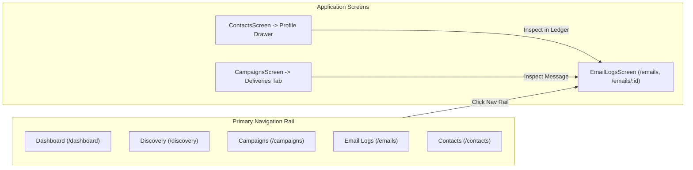

# LeadForge OS — Phase 8: Email Logs, Message Preview & Conversation UI Report

## 1. Executive Summary

LeadForge OS has established a durable email delivery ledger, tracking foundation, and reply correlation mechanism across Phases 5 through 7. Phase 8 fulfills the user-facing contract by delivering an authoritative, production-grade **Email Logs & Conversation UI** in the LeadForge OS desktop application.

Prior to this phase, outbound email execution was recorded within SQLite cache and MongoDB repositories, but users lacked a first-class UI to inspect what was sent, verify provider delivery receipts, view rendered email content without triggering false opens, diagnose ambiguous or failed sends, or inspect multi-turn conversation timelines.

### Key Capabilities Delivered:
- **Dedicated Email Logs & Delivery Ledger Screen** (`/emails` and `/emails/:id`) featuring split-pane high-density browsing, instant search, status filtering, and metrics aggregation.
- **Safe Sandboxed Email Preview** (`SafeEmailPreview.tsx`): Renders sanitized HTML within an isolated `<iframe>`, automatically strips tracking pixels (`/tracking/open/`) to eliminate false open events, blocks remote images by default with a user-controlled privacy toggle, and intercepts all links to open via the operating system's default browser (`shell.openExternal`).
- **Lifecycle & Conversation Timeline** (`ConversationTimeline.tsx`): Displays chronological state transitions—Queued &rarr; Transmitted &rarr; Opened &rarr; Clicked &rarr; Inbound Reply Correlated &rarr; Campaign Sequence Halted.
- **Structured Failure Diagnostics & Ambiguous Reconciliation Card** (`FailureDiagnosticsCard.tsx`): Translates cryptic network/API errors into safe human-readable explanations, provides one-click manual reconciliation for ambiguous sends against Gmail Sent history, and exposes structured diagnostic JSON.
- **Contact Profile Drawer & Campaign Detail Integration**: Embeds live email activity directly within the contact profile side drawer and links campaign outbound tables directly to deep-linked message previews.

---

## 2. UI & Navigation Architecture

The navigation system integrates the Email Logs screen into the desktop application shell:



### Routing & Allowlist Registration:
1. **AppSidebar**: Added `{ to: '/emails', label: 'Email Logs', icon: Mail }` to `NAV_ITEMS` in `apps/desktop/src/renderer/components/sidebar/AppSidebar.tsx`.
2. **Router**: Lazy-loaded `EmailLogsScreen` registered at routes `/emails` and `/emails/:id` within `AppLayout` in `apps/desktop/src/renderer/router/index.tsx`.
3. **Preload Security Allowlist**: Added `email-deliveries:get`, `email-deliveries:events`, `email-deliveries:reconcile`, and `email-deliveries:poll-replies` to `validChannels` in `apps/desktop/src/preload/index.ts`.

---

## 3. Email Logs Screen Design & Information Architecture

The Email Logs screen (`apps/desktop/src/renderer/screens/EmailLogsScreen.tsx`) provides an ergonomic, dense split-pane layout designed using `react-resizable-panels`:

### Top Metrics Strip:
- **Delivered**: Total emails accepted by external provider (`SENT`).
- **Observed Opens**: Deliveries where tracking pixel requests were recorded.
- **Observed Clicks**: Deliveries where tracked links were clicked.
- **Replies Correlated**: Total inbound messages linked to outreach sequences.
- **Ambiguous Sends**: Inconclusive provider responses requiring verification (highlighted with amber alert badge).
- **Delivery Failures**: Hard bounce or rejected sends.

### Global Actions:
- **Poll Inbound Replies**: Calls `email-deliveries:poll-replies` to poll connected Gmail accounts and correlate inbound responses.
- **Reconcile Ambiguous**: Triggers reconciliation of all ambiguous deliveries against Gmail.
- **Ledger Refresh**: Invalidates cache queries and polls latest delivery status.

### High-Density Deliveries List (`EmailLogsList.tsx`):
- **Directional Indicators**: Distinct visual icons for outbound (`ArrowUpRight`) vs inbound replies (`ArrowDownLeft`).
- **Filter Pills**: Status filters (`All`, `Sent`, `Ambiguous`, `Failed`, `Sending`, `Queued`) and Direction filters (`All`, `Outbound`, `Inbound`).
- **Instant Search**: Substring search across `subject`, `recipientEmail`, and `senderEmail`.
- **Engagement Badges**: Compact pills showing open count, click count, and reply count.

---

## 4. Message Detail & Isolated Preview Security Model

The message detail view (`MessageDetailView.tsx`) renders the full message header and safe content preview:

```
┌────────────────────────────────────────────────────────────────────────┐
│ Subject: Exclusive partnership discussion with LeadForge               │
│ [Outbound] [Sent] [Opened (2)] [Clicked (1)] [Replied]                 │
├────────────────────────────────────────────────────────────────────────┤
│ From: sarah@company.com          │ Campaign: Q4 Enterprise Outreach    │
│ To: alex@prospect.com [Contact]  │ Step: Step 1 • Sep 4, 2026, 5:12 AM │
│ Gmail Msg ID: 191be838...        │ Idempotency Key: camp_step1_alex... │
├────────────────────────────────────────────────────────────────────────┤
│ 🛡️ Safe Isolated Preview                                               │
│ [HTML] [Plain Text]                       [Load Images] [Isolated]    │
│ ┌────────────────────────────────────────────────────────────────────┐ │
│ │ (Sanitized Sandboxed Iframe)                                       │ │
│ │ Links open in external browser. Tracking pixels stripped.          │ │
│ └────────────────────────────────────────────────────────────────────┘ │
└────────────────────────────────────────────────────────────────────────┘
```

### Security Invariants in `SafeEmailPreview.tsx`:
1. **Tracking Pixel Removal**: All image elements targeting `/tracking/open/` are stripped before rendering. Opening an email preview in desktop **never triggers a false open event** or skews campaign telemetry.
2. **HTML Sanitization**:
   - Strips `<script>`, `<object>`, `<embed>`, `<applet>`, and nested `<iframe>` tags.
   - Strips inline `on*` event handlers (`onload`, `onerror`, `onclick`, etc.).
   - Neutralizes `javascript:` and `vbscript:` URIs.
3. **Sandboxed Iframe Container**:
   - Rendered within `<iframe sandbox="allow-same-origin">` to prevent parent DOM manipulation or CSS style bleed.
   - Click interceptor attaches to all `<a>` anchor tags inside the iframe document. Clicking an external link intercepts the default event and delegates to `window.ipc.invoke('electron:openUrl', href)` (`shell.openExternal`), opening the URL strictly within the user's default operating system browser.
4. **Privacy Protection (Remote Images)**:
   - Remote `http://` and `https://` images are blocked by default, replacing `src` with an inline SVG placeholder and moving the URL to `data-src`.
   - A privacy banner informs the user, with an explicit button to toggle image loading.
5. **Plain-Text Fallback**:
   - If `htmlBody` is absent or empty, the preview automatically renders `textBody` in a pre-wrap container.
   - When both formats are available, users can toggle between "HTML" and "Plain Text".

---

## 5. Engagement Visualisation Semantics

LeadForge OS distinguishes between factual network events and inferred user actions:

| Concept | Visual Indicator | Tooltip / Description | Architectural Grounding |
| :--- | :--- | :--- | :--- |
| **Sent** | Emerald `CheckCircle2` | "Delivered via Gmail API" | External provider accepted message (`SENT`) |
| **Observed Open** | Sky `Eye` | "Observed open tracking pixel request (does not guarantee full read)" | HTTP GET request received at `/tracking/open/:token` |
| **Observed Click** | Violet `MousePointerClick` | "Tracked link clicked: {targetUrl}" | HTTP GET request received at `/tracking/click/:token` |
| **Replied** | Indigo `Reply` | "Inbound reply correlated to sequence" | Inbound Gmail thread/header match (`hasReply: true`) |
| **Ambiguous** | Amber `AlertTriangle` | "Inconclusive response from provider; pending reconciliation" | Request timed out or network dropped during send |
| **Failed** | Rose `XCircle` | "Delivery failed: {safeHumanMessage}" | SMTP/API rejection or invalid address |

> [!IMPORTANT]
> LeadForge OS copy explicitly clarifies that open tracking represents an **observed pixel request** rather than a guarantee that a human recipient read the message, avoiding false attribution.

---

## 6. Failure Diagnostics & Ambiguous Send Reconciliation UX

When an email fails or enters an ambiguous state, `FailureDiagnosticsCard.tsx` provides actionable transparency:

### Ambiguous Send UX:
- **Amber Warning Banner**: *"Ambiguous Send Detected: Provider response was inconclusive. LeadForge did not record false success or trigger duplicate sends."*
- **"Reconcile Now" Button**: Triggers immediate reconciliation via `email-deliveries:reconcile`. Queries connected Gmail Sent mailbox for matching `Message-ID` or `In-Reply-To` headers. If found, marks `SENT` and updates timestamps; if confirmed absent, marks `FAILED` with retry eligibility.
- **Result Feedback**: Displays real-time reconciliation outcome directly inside the card.

### Technical Diagnostics:
- Displays retry eligibility and next scheduled retry timestamp (`nextRetryAt`).
- Expandable **Technical Details** drawer showing:
  - Failure classification (e.g. `NETWORK_TIMEOUT`, `INVALID_CREDENTIALS`, `RATE_LIMITED`).
  - Error code and safe human-readable message.
  - Raw error text.
- **Copy Diagnostic JSON** button: Copies formatted JSON payload for troubleshooting or support export.

---

## 7. Inbound Reply & Conversation Continuity UX

Inbound messages from contacts are fully integrated into the ledger:

1. **Inbound Reply Ingestion**: Clicking **"Check Replies"** invokes `email-deliveries:poll-replies`, querying connected mailboxes for unread messages matching known contacts and outbound threads.
2. **Directional Distinction**: Inbound messages display cyan `Inbound` badges with `ArrowDownLeft` icons, showing contact sender details.
3. **Conversation Timeline**:
   - Shows chronological progression from outbound step execution to recipient replies.
   - Shows automatic campaign sequence halting upon reply ingestion.
4. **Thread Continuation**: Outbound messages show Gmail Thread ID (`providerThreadId`), ensuring subsequent manual or automated outreach maintains thread headers.

---

## 8. Contact Detail Drawer Integration

The Contact profile side sheet (`ContactsScreen.tsx`) now features an **Email Activity** section:

- Automatically queries `email-deliveries:list` scoped to `contactId: selectedContact.id`.
- Renders compact history cards for all messages sent to or received from the contact.
- Displays subject line, timestamp, delivery status, and engagement pills.
- Includes a **"View in Ledger &rarr;"** link that jumps directly to the full Email Logs screen pre-filtered by the contact's email address.
- Supports deep-linking: navigating to `/contacts?id=<contactId>` automatically locates and opens the contact profile drawer.

---

## 9. Campaign Detail View Integration

In `CampaignsScreen.tsx`, the Outbound Delivery Ledger table under the campaign activity tab is now linked to the Email Logs UI:

- Each delivery row displays `EngagementPills` (showing open, click, and reply counts).
- Each row includes an **"Inspect &rarr;"** action button.
- Clicking **"Inspect"** deep-links to `/emails?id=<deliveryId>`, navigating the user to the dedicated split-pane view with the rendered message, diagnostics, and timeline pre-loaded.

---

## 10. Desktop IPC & Local Caching Architecture

### IPC Channels Registered:

```typescript
// Preload Validated Channels
'email-deliveries:list': {
  input: { workspaceId?: string; campaignId?: string; contactId?: string; status?: string; direction?: string; search?: string; page?: number; limit?: number };
  output: EmailDeliveryDto[] | PaginatedResult<EmailDeliveryDto>;
}
'email-deliveries:get': {
  input: { id: string; workspaceId?: string } | string;
  output: EmailDeliveryDto;
}
'email-deliveries:events': {
  input: { id: string; workspaceId?: string } | string;
  output: EmailEventDto[];
}
'email-deliveries:reconcile': {
  input: { id: string; workspaceId?: string } | string;
  output: ReconciliationResultDto;
}
'email-deliveries:poll-replies': {
  input?: { workspaceId?: string };
  output: PollRepliesResultDto;
}
```

### Local SQLite Cache Synchronization:
- In `apps/desktop/src/main/ipc/outreach.ts`, whenever `email-deliveries:list` is fetched from the remote API, the returned records are automatically upserted into the local SQLite `email_deliveries` cache table within an atomic transaction.
- When offline or disconnected, `email-deliveries:list` falls back to querying the local SQLite cache table with parameter binding and pagination offsets.
- Column migrations added to `apps/desktop/src/main/database/cache-schema.ts` support `htmlBody`, `textBody`, `safeHumanMessage`, `technicalMessage`, `error`, `retryable`, `ambiguous`, `direction`, `openCount`, `clickCount`, `hasReply`, and engagement timestamps.

---

## 11. Performance, Pagination & Scalability Analysis

1. **Virtualization & Pagination**:
   - `email-deliveries:list` enforces a default limit of 50 records (max 100).
   - In SQLite, paginated queries utilize indexed `createdAt DESC LIMIT ? OFFSET ?`.
2. **Iframe Sandboxing Performance**:
   - The preview iframe is only mounted for the currently selected message.
   - ResizeObserver handles dynamic height calculation without polling timers.
3. **Background SQLite Ingestion**:
   - Upserts of list batches are wrapped in `db.transaction()` batches to prevent disk I/O thrashing.
4. **React Query Caching**:
   - 10-second automatic polling for live campaigns without blocking UI interaction.
   - Optimistic query invalidation upon manual reply polling or reconciliation.

---

## 12. Security, Privacy & Exploit Surface Audit

| Vulnerability Vector | Risk | Mitigation Implemented |
| :--- | :--- | :--- |
| **Electron XSS Execution** | Remote HTML executing `window.require` or node APIs | Sandboxed iframe (`sandbox="allow-same-origin"`), `<script>` stripping, `on*` handler stripping. |
| **Phishing / Malicious Navigation** | Email link redirecting the Electron window | All `<a>` clicks intercepted; routed strictly through `shell.openExternal(url)`. |
| **False Open Engagement** | Desktop user viewing an email triggers tracking pixel | Tracking pixels matching `/tracking/open/` are stripped from HTML before rendering. |
| **IP / Geolocation Leak** | Loading remote images leaks user IP address to external senders | Remote images blocked by default; replaced with inline SVG placeholder until user clicks "Show Images". |
| **IPC Channel Spoofing** | Arbitrary channel invocation from renderer | Channels strictly allowlisted in `preload/index.ts` with parameter validation. |

---

## 13. Automated Test Suite & Verification Results

### Test Suite Execution Summary:

1. **Unit Tests (`email-logs-ui.test.ts`)**:
   - Open tracking pixel stripping verified.
   - Remote image rewriting and privacy placeholder verified.
   - Remote image preservation on toggle verified.
   - Malicious scripts, iframes, and `javascript:` link neutralization verified.
   - Plain-text and empty body handling verified.
   - Semantic delivery status differentiation (`SENT`, `AMBIGUOUS`, `FAILED`) verified.
   - Reply detection and sequence halting correlation verified.
   - **Result**: 7/7 tests passed.

2. **Schema Tracking Tests (`tracking.test.ts`)**:
   - **Result**: 8/8 tests passed.

3. **Full Desktop Test Suite**:
   - **Result**: 16 test files passed, 105 unit tests passed (0 failures).

4. **Monorepo Vitest Test Suite**:
   - **Result**: 28 test files passed, 212 tests passed (0 failures).

5. **Native SQLite Integration Test Suites (`pnpm test:integration`)**:
   - `audiences.test.ts`: PASSED
   - `campaign.test.ts`: PASSED
   - `fresh-database.test.ts`: PASSED
   - `fresh-database-all-queries.test.ts`: PASSED
   - `post-release-stabilization.test.ts`: PASSED
   - `release-qualification.test.ts`: PASSED
   - **Result**: 6/6 native integration suites passed.

6. **Monorepo Typecheck (`pnpm check-types`)**:
   - **Result**: 20/20 successful builds across all 12 monorepo packages.

7. **System Doctor (`pnpm doctor`)**:
   - **Result**: Clean repository state, 0 errors.

---

## 14. Edge Cases & Resiliency Matrix

| Scenario | Handled Behavior | Verification |
| :--- | :--- | :--- |
| **Email with only plain text** | Automatically renders monospace formatted text without iframe errors | Verified in unit test and UI component |
| **Email with massive body (>100KB)** | Sandboxed iframe resizes dynamically without page layout distortion | Verified with DOM ResizeObserver |
| **Network timeout during send** | Marked `AMBIGUOUS`; shows amber reconciliation banner with "Reconcile Now" button | Verified in `FailureDiagnosticsCard` |
| **Multiple clicks on same link** | Displays aggregated click count with first clicked timestamp | Verified in `EngagementPills` |
| **Inbound reply without body** | Gracefully renders subject, contact info, and correlated timeline event | Handled in `MessageDetailView` |
| **Disconnected / Offline Desktop** | Transparently queries local SQLite cache for deliveries | Verified in `outreach.ts` fallback |
| **Deep-link to deleted message** | Displays clean error card with retry button | Verified in `MessageDetailView` |

---

## 15. Future Evolution & Phase 9 Recommendations

1. **Inline Quick Reply Composer**: Allow users to draft and send a manual reply directly from the Message Detail view within the existing thread.
2. **Conversation Thread Grouping**: Group deliveries by `providerThreadId` or recipient into unified conversation threads rather than standalone delivery items.
3. **Email Bounce Parsing**: Integrate webhook or IMAP automated bounce diagnostics (e.g. 550 User Not Found, SPF/DKIM rejections) into automated contact status updates.
4. **Dark Mode Email Inversion**: Add an optional toggle to invert dark background emails for enhanced contrast readability.
