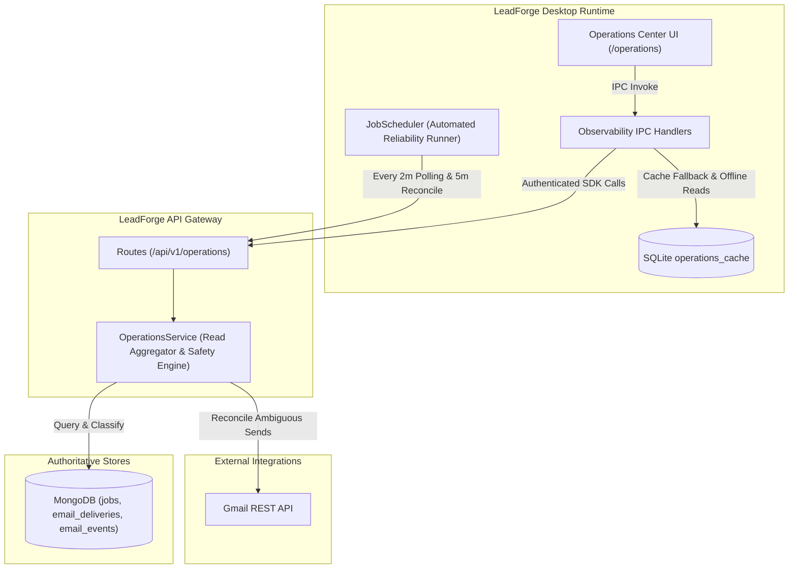
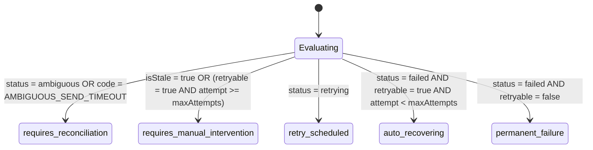

# LeadForge OS — Phase 9: Operations Center, Observability & Background Job Reliability Report

## 1. Executive Summary

LeadForge OS has established the core asynchronous execution system across Phases 4 through 8, including campaign state machines, send idempotency, Gmail API delivery recording, reply ingestion, engagement tracking, and SQLite caching. Phase 9 eliminates **operational invisibility** by delivering an authoritative, production-grade **Operations Center** (`/operations`) and robust background job reliability primitives.

Prior to Phase 9, operators lacked a unified operational read model to answer:
- *What is currently executing across worker processes and outbound pipelines?*
- *What has failed or become stale/stuck, and why did it happen?*
- *Is a failure transient (safe to retry), ambiguous (requiring provider reconciliation), or permanent?*
- *Are critical subsystems (API Gateway, MongoDB, SQLite Cache, Gmail OAuth, Scheduler, Workers, Inbound Polling, Reconciliation) healthy or degraded?*

### Key Capabilities Delivered:
1. **Unified Operational Read Model**: Aggregates MongoDB `JobModel` and `EmailDeliveryModel` into standardized `OperationRecord` entities without bloating the database with redundant dual-writes.
2. **Subsystem Health Probes**: Real-time diagnostic evaluation across 8 core subsystems (`api`, `mongodb`, `sqlite`, `gmail`, `scheduler`, `workers`, `inboundPolling`, `reconciliation`) with semantic states (`healthy`, `degraded`, `failed`, `unknown`, `not_connected`).
3. **Automated Background Reliability Runner**: Embedded within `JobScheduler` to run inbound reply polling every 2 minutes and ambiguous delivery reconciliation every 5 minutes, protected by mutex locks to eliminate race conditions and process overlapping.
4. **Actionable Failure Queue & Safety Enforcers**: Enforces strict semantic retry rules—disallowing blind retries on `AMBIGUOUS` sends or already `SENT` deliveries, while guiding operators to automated reconciliation.
5. **Desktop SQLite Operational Cache (`operations_cache`)**: Local multi-tenant cache enabling offline operational inspection and degraded-network resilience.
6. **Secret-Redacted Structured Logging**: `@leadforge/logger` recursively masks tokens, passwords, cookies, authorization headers, and truncates bulky MIME/HTML payloads (>80 chars) to prevent credential leakage.
7. **Complete Operations Center Screen (`/operations`)**: Modern, high-density dashboard featuring real-time subsystem health status indicators, summary metric strips, searchable/filterable tabular queues, safe retry/reconcile actions, and a detailed diagnostic drawer with lifecycle event timelines.

---

## 2. Architecture & Subsystem Telemetry



### Subsystem Health Matrix

| Subsystem | Health Evaluation Criteria | Semantic States |
| :--- | :--- | :--- |
| **API Gateway** | Route responsiveness & latency probe | `healthy`, `degraded`, `failed` |
| **MongoDB** | Replica set connection state & ping latency | `healthy`, `degraded`, `failed` |
| **SQLite Cache** | Local database read/write integrity & WAL state | `healthy`, `degraded`, `failed` |
| **Gmail OAuth** | Mailbox token validity & authorization refresh status | `healthy`, `degraded`, `not_connected` |
| **Scheduler** | Dispatch loop active flag & heartbeat freshness | `healthy`, `degraded`, `failed` |
| **Workers** | Active worker concurrency vs capacity | `healthy`, `degraded`, `unknown` |
| **Inbound Polling** | Elapsed time since last successful reply check (<10m) | `healthy`, `degraded`, `unknown` |
| **Reconciliation** | Stale/ambiguous delivery backlog count | `healthy`, `degraded`, `failed` |

---

## 3. Failure Classification & Retry Safety Rules

Every failed or interrupted operation is deterministically mapped by `classifyOperationFailure` into one of five operational classes:



### Strict Safety Invariants:
- **Zero Blind Retries on Ambiguous Sends**: When network timeouts occur after Gmail dispatch, re-dispatching could send duplicate emails to customers. Retrying an `AMBIGUOUS` delivery is blocked at both the API and UI levels until Gmail reconciliation proves the message was not delivered.
- **Deduplication Protection**: Finalized `SENT` deliveries are permanently immutable and cannot be re-queued.
- **Permanent Failure Shielding**: Non-retryable errors (e.g. `550 User Not Found`, `invalid_grant`) reject automatic retries unless explicitly overridden by an operator with `force: true`.

---

## 4. SQLite Schema & Offline Resilience

Added `operations_cache` table and indexes to `apps/desktop/src/main/database/cache-schema.ts`:

```sql
CREATE TABLE IF NOT EXISTS operations_cache (
  id TEXT PRIMARY KEY,
  workspaceId TEXT NOT NULL,
  type TEXT NOT NULL,
  status TEXT NOT NULL,
  failureClass TEXT,
  errorCode TEXT,
  safeHumanMessage TEXT,
  technicalMessage TEXT,
  attempt INTEGER DEFAULT 1,
  maxAttempts INTEGER DEFAULT 3,
  nextRetryAt DATETIME,
  lastHeartbeatAt DATETIME,
  isStale INTEGER DEFAULT 0,
  retryable INTEGER DEFAULT 0,
  correlationId TEXT,
  campaignId TEXT,
  campaignName TEXT,
  contactId TEXT,
  contactEmail TEXT,
  deliveryId TEXT,
  sequenceExecutionId TEXT,
  provider TEXT,
  providerMessageId TEXT,
  metadata TEXT DEFAULT '{}',
  createdAt DATETIME,
  updatedAt DATETIME
);

CREATE INDEX IF NOT EXISTS idx_cache_ops_ws ON operations_cache(workspaceId);
CREATE INDEX IF NOT EXISTS idx_cache_ops_status ON operations_cache(status);
CREATE INDEX IF NOT EXISTS idx_cache_ops_type ON operations_cache(type);
CREATE INDEX IF NOT EXISTS idx_cache_ops_updated ON operations_cache(workspaceId, updatedAt);
CREATE INDEX IF NOT EXISTS idx_cache_ops_stale ON operations_cache(workspaceId, isStale);
```

### Offline Fallback Invariant
When the desktop application is offline or the API Gateway is temporarily unreachable, `/operations` loads directly from `operations_cache`, displaying an amber "OFFLINE CACHED" telemetry badge while preserving inspection and diagnostics capabilities.

---

## 5. Security & Redaction Standards

`packages/logger` was upgraded to prevent secret leakage in application logs and diagnostics:
- **Protected Business Keys**: Excludes identifier keys such as `idempotencyKey`, `cacheKey`, `foreignKey`, `partitionKey` from false redaction.
- **Sensitive Key Masking**: Recursively detects `token`, `accessToken`, `refreshToken`, `password`, `secret`, `apiKey`, `privateKey`, `cookie`, `authorization` and censors them with `[REDACTED]`.
- **Bulky Payload Truncation**: Replaces raw email HTML/MIME content exceeding 80 characters with `[PAYLOAD_TRUNCATED: <bytes> chars]` to prevent log flooding and sensitive communication leakage.
- **Circular Reference Safety**: Uses `WeakSet` tracking to prevent stack overflows on circular object graphs.

---

## 6. Verification & Quality Gates

The implementation was qualified through unit, API contract, and native Electron integration tests:

| Test Suite | File | Tests | Result |
| :--- | :--- | :--- | :--- |
| **Logger Redaction Unit Tests** | `packages/logger/src/index.test.ts` | 6 | ✅ PASS |
| **Failure Classification & Zod DTOs** | `packages/schema/src/dto/operations.test.ts` | 10 | ✅ PASS |
| **Operations API Route Contracts** | `apps/api/src/tests/contract/operations-contracts.test.ts` | 6 | ✅ PASS |
| **Error Domain Contracts** | `apps/api/src/tests/contract/error-contracts.test.ts` | 10 | ✅ PASS |
| **Scheduler Reliability & Mutex Tests** | `apps/desktop/src/main/services/operations-reliability.test.ts` | 3 | ✅ PASS |
| **Native SQLite Cache Integration** | `apps/desktop/src/main/services/operations-cache.test.ts` | 7 | ✅ PASS |
| **Full Vitest Suite** | Monorepo (`vitest run`) | 237 | ✅ PASS |
| **Native SQLite Suites (Electron)** | `pnpm test:integration` (7 suites) | All | ✅ PASS |
| **Type Check Gate** | `pnpm check-types` (12 packages) | 20/20 | ✅ PASS |
| **Repository Doctor** | `pnpm doctor` | 0 errors | ✅ PASS |

---

## 7. Operational Runbook & Next Steps

1. **Accessing Operations Center**: Navigate to `/operations` in the LeadForge desktop sidebar or use deep-links from failed deliveries in `/emails`.
2. **Diagnosing Ambiguous Sends**:
   - Filter failure queue by `Ambiguous / Unreconciled`.
   - Click "Reconcile" on the operation card to query Gmail sent history and resolve the delivery status without sending duplicate outreach.
3. **Handling Degraded Mailbox Connections**:
   - Check the Subsystem Health card for `gmail`.
   - If `degraded` or `not_connected`, click "Reconnect Mailbox" to refresh expired OAuth grants.
